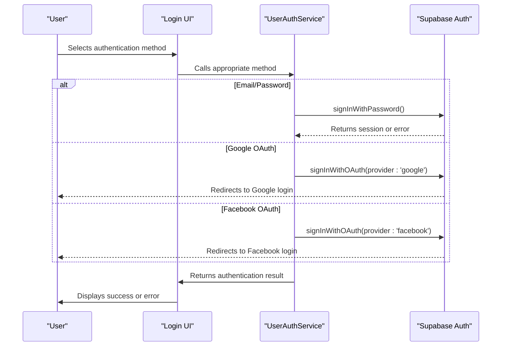
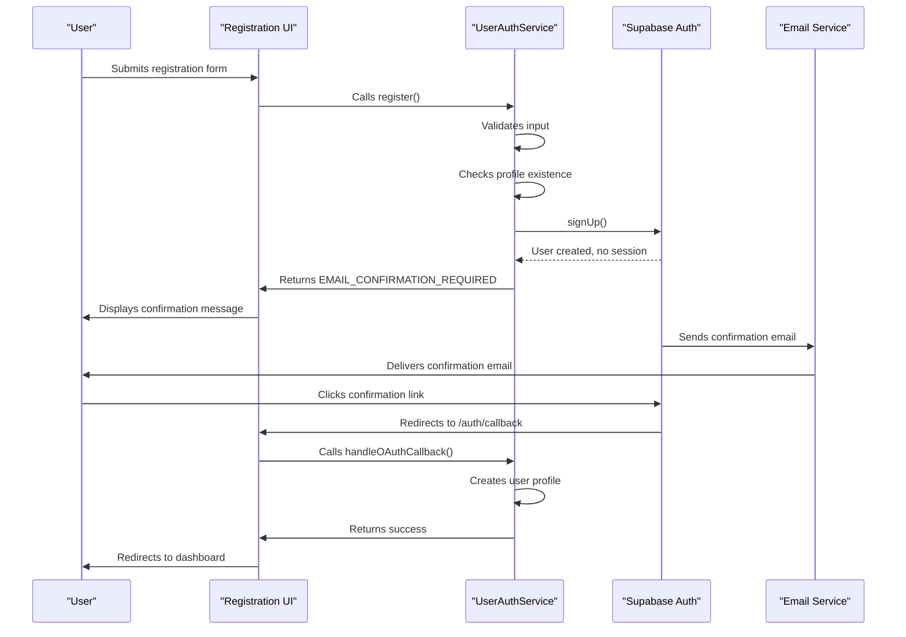
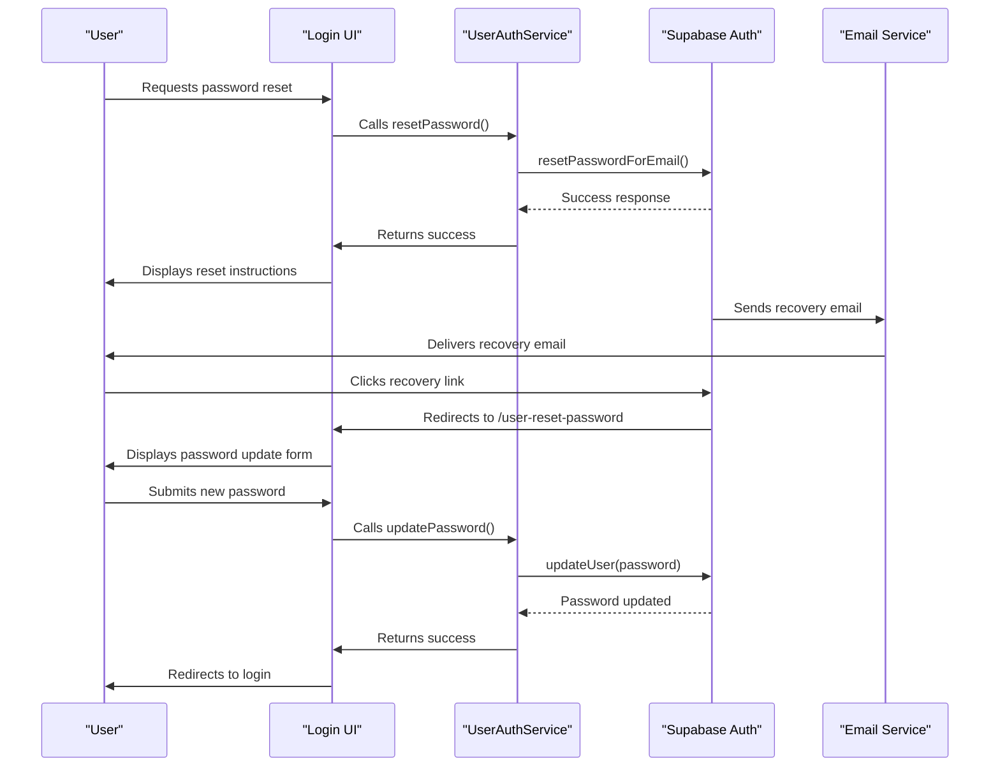
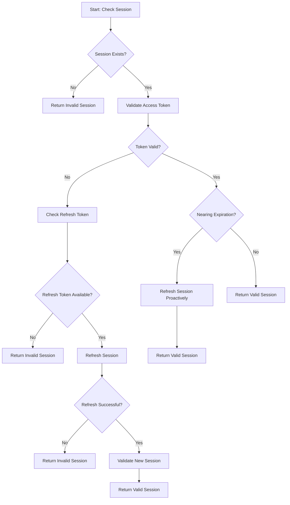
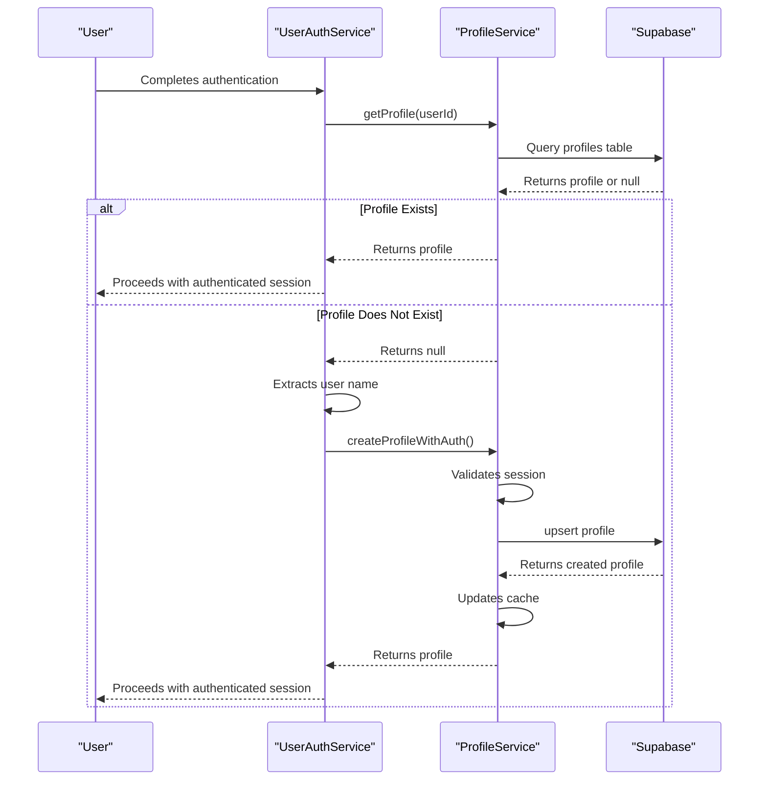
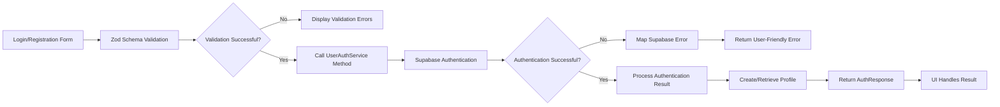
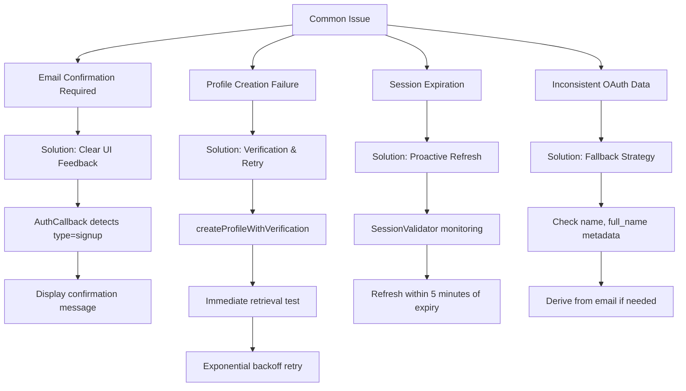
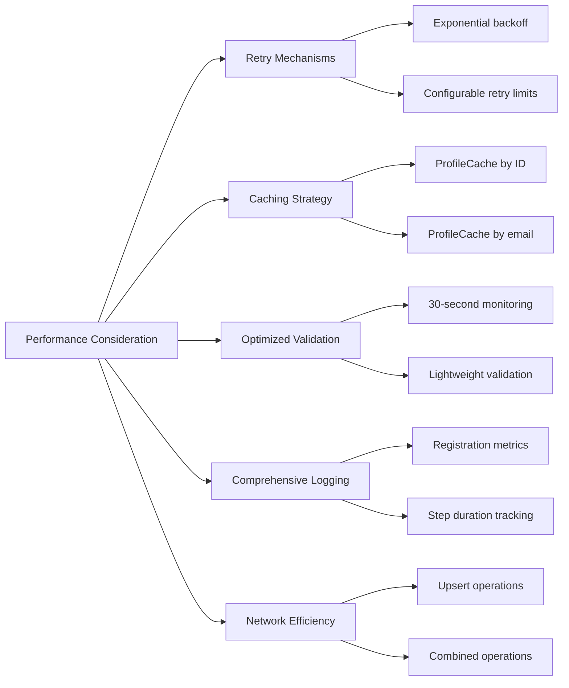

# Authentication System

<cite>
**Referenced Files in This Document**   
- [user-auth-service.ts](file://src/lib/user-auth-service.ts)
- [profile-service.ts](file://src/lib/profile-service.ts)
- [session-validation.ts](file://src/lib/session-validation.ts)
- [user-auth-schemas.ts](file://src/lib/user-auth-schemas.ts)
- [AuthCallback.tsx](file://src/pages/AuthCallback.tsx)
</cite>

## Table of Contents
1. [Multi-Method Authentication Approach](#multi-method-authentication-approach)
2. [Email Confirmation Workflow](#email-confirmation-workflow)
3. [Password Reset Process](#password-reset-process)
4. [Session Management with Supabase Auth](#session-management-with-supabase-auth)
5. [Profile Creation Flow](#profile-creation-flow)
6. [Data Flow from Login Forms to Supabase](#data-flow-from-login-forms-to-supabase)
7. [Common Issues and Solutions](#common-issues-and-solutions)
8. [Performance Considerations](#performance-considerations)

## Multi-Method Authentication Approach

The lovable-rise application implements a multi-method authentication system through the `UserAuthService` class, supporting three distinct authentication methods: email/password, Google OAuth, and Facebook OAuth. This approach provides users with flexible login options while maintaining a consistent authentication flow.

For email/password authentication, the system uses Supabase's built-in authentication mechanism through the `login` method in `UserAuthService`. This method validates user credentials against the Supabase authentication system and returns appropriate session data upon successful authentication.

The OAuth integration is implemented through dedicated methods: `signInWithGoogle` and `signInWithFacebook`. These methods leverage Supabase's OAuth capabilities to initiate the respective authentication flows. When a user selects either OAuth option, the application redirects to the provider's authentication page with the appropriate configuration, including the redirect URL set to `/auth/callback`.

The authentication system is designed with role-based access control, where user roles are stored in the profiles table. After successful authentication, the system checks the user's role and redirects accordingly - regular users to the user dashboard and administrators to the admin interface.

**Diagram sources**
- [user-auth-service.ts](file://src/lib/user-auth-service.ts#L173-L986)

**Section sources**
- [user-auth-service.ts](file://src/lib/user-auth-service.ts#L173-L986)

## Email Confirmation Workflow

The email confirmation workflow in the lovable-rise application follows Supabase's standard email confirmation process, implemented in the `register` method of the `UserAuthService` class. This workflow ensures that users verify their email addresses before gaining full access to the application.

When a new user registers, the system first checks if a profile with the provided email already exists by calling `ProfileService.getProfileByEmail`. If no existing profile is found, the system proceeds with Supabase authentication signup using `supabase.auth.signUp`. This creates a user record in the authentication system but does not immediately grant access.

The key aspect of this workflow is that no session or access token is returned until the user confirms their email address. The registration response explicitly handles this state by returning `UserAuthError.EMAIL_CONFIRMATION_REQUIRED` when the user needs to confirm their email. During registration, the system sends a confirmation email with a link that redirects to `/auth/callback`, where the `handleOAuthCallback` method processes the confirmation.

The `AuthCallback.tsx` component handles the callback from the email confirmation link. It checks for the presence of `type=signup` in the URL parameters to identify email confirmation callbacks. Upon successful confirmation, users receive appropriate feedback through toast notifications, and the system guides them through the next steps.

**Diagram sources**
- [user-auth-service.ts](file://src/lib/user-auth-service.ts#L173-L986)
- [AuthCallback.tsx](file://src/pages/AuthCallback.tsx#L1-L102)

**Section sources**
- [user-auth-service.ts](file://src/lib/user-auth-service.ts#L173-L986)
- [AuthCallback.tsx](file://src/pages/AuthCallback.tsx#L1-L102)

## Password Reset Process

The password reset process in the lovable-rise application is implemented through two complementary methods in the `UserAuthService` class: `resetPassword` and `updatePassword`. This two-step process ensures secure password recovery while preventing unauthorized access.

The first step, initiating the password reset, is handled by the `resetPassword` method. This method calls Supabase's `resetPasswordForEmail` function with the user's email address and a redirect URL pointing to `/user-reset-password`. When a user requests a password reset, Supabase sends a recovery email containing a time-limited token. The email redirect URL includes this token as a parameter, allowing the application to validate the reset request.

The second step, updating the password, is managed by the `updatePassword` method. This method is called when the user submits a new password through the reset interface. It uses Supabase's `updateUser` function to change the password, automatically validating the reset token in the process. The method includes error handling for common issues such as invalid tokens or network errors.

The `AuthCallback.tsx` component plays a crucial role in this process by detecting password reset callbacks through the `type=recovery` parameter in the URL. When detected, it redirects the user to the password reset page, ensuring a seamless transition from the email link to the password update interface.

**Diagram sources**
- [user-auth-service.ts](file://src/lib/user-auth-service.ts#L173-L986)
- [AuthCallback.tsx](file://src/pages/AuthCallback.tsx#L1-L102)

**Section sources**
- [user-auth-service.ts](file://src/lib/user-auth-service.ts#L173-L986)
- [AuthCallback.tsx](file://src/pages/AuthCallback.tsx#L1-L102)

## Session Management with Supabase Auth

Session management in the lovable-rise application is implemented through a combination of Supabase authentication and custom validation utilities, primarily in the `SessionValidator` class. This system ensures secure and reliable session handling with proper access token validation.

The `SessionValidator` class provides comprehensive session validation through its `validateSession` method, which checks the current authentication state and returns detailed information about session validity, expiration, and token status. The validation process examines the access token, refresh token, and session expiration time to determine if the session is valid and whether it needs refreshing.

For critical operations requiring valid authentication context, the system uses the `ensureValidSession` method, which automatically attempts to refresh expired sessions using the refresh token when available. This proactive approach helps maintain continuous user sessions without requiring frequent re-authentication.

The application also implements session monitoring through the `startSessionMonitoring` method, which runs in the background and periodically checks session health. When a session is nearing expiration (within 5 minutes), the monitor automatically attempts to refresh it, ensuring uninterrupted access for active users.

Access token validation is particularly important for Row Level Security (RLS) policies in Supabase. The `validateRLSContext` method tests whether the current session provides proper `auth.uid()` context for database queries by attempting a simple profile lookup. This ensures that database operations have the correct user context for RLS enforcement.

**Diagram sources**
- [session-validation.ts](file://src/lib/session-validation.ts#L42-L343)

**Section sources**
- [session-validation.ts](file://src/lib/session-validation.ts#L42-L343)

## Profile Creation Flow

The profile creation flow in the lovable-rise application is tightly integrated with the authentication process and is primarily managed by the `ProfileService` class. This flow ensures that user profiles are created at the appropriate time with proper authentication context.

Profile creation occurs at different points depending on the authentication method and confirmation status. For email/password registration, profiles are created after email confirmation, either during the callback process or when the user first logs in after confirmation. The `handleOAuthCallback` method handles profile creation for OAuth users and users who have confirmed their email.

The `createProfileWithAuth` method in `ProfileService` is the primary mechanism for creating user profiles. This method includes comprehensive validation to ensure the session is valid before attempting profile creation. It uses Supabase's upsert functionality to handle cases where a profile might already exist, preventing duplicate records.

To address potential timing issues between authentication and profile creation, the system implements retry mechanisms with exponential backoff. The `createProfileWithVerification` method includes a verification step that confirms the profile was successfully created by immediately attempting to retrieve it. This ensures data consistency and handles cases where database triggers might have delays.

Name extraction for profiles follows a fallback strategy: first checking `user_metadata.name`, then `user_metadata.full_name`, then deriving from the email address, with "User" as the final fallback. This ensures that all profiles have a valid name even if the authentication provider doesn't supply one.

**Diagram sources**
- [profile-service.ts](file://src/lib/profile-service.ts#L59-L814)
- [user-auth-service.ts](file://src/lib/user-auth-service.ts#L173-L986)

**Section sources**
- [profile-service.ts](file://src/lib/profile-service.ts#L59-L814)
- [user-auth-service.ts](file://src/lib/user-auth-service.ts#L173-L986)

## Data Flow from Login Forms to Supabase

The data flow from login forms to Supabase authentication follows a structured process that ensures data validation, secure transmission, and proper error handling. This flow begins with form input in the user interface and concludes with authentication results from Supabase.

The process starts with form validation using Zod schemas defined in `user-auth-schemas.ts`. The `loginSchema` validates email format and ensures a password is provided, while the `registrationSchema` includes additional validation for name length, password strength, and terms acceptance. These schemas provide client-side validation before any data is sent to the authentication service.

When valid form data is submitted, the UI components call the appropriate methods in `UserAuthService`. For login, this is the `login` method; for registration, it's the `register` method. These methods serve as the interface between the application and Supabase authentication.

The authentication service methods then call the corresponding Supabase auth functions (`signInWithPassword` for login, `signUp` for registration). These calls include proper configuration such as redirect URLs and user metadata. The Supabase client handles secure transmission of credentials using HTTPS.

Upon receiving a response from Supabase, the authentication service processes the result, mapping Supabase error codes to user-friendly messages using the `mapSupabaseError` method. This ensures consistent error handling across the application. Successful authentication results in session data and user profile information being returned to the UI.

**Diagram sources**
- [user-auth-schemas.ts](file://src/lib/user-auth-schemas.ts#L1-L127)
- [user-auth-service.ts](file://src/lib/user-auth-service.ts#L173-L986)

**Section sources**
- [user-auth-schemas.ts](file://src/lib/user-auth-schemas.ts#L1-L127)
- [user-auth-service.ts](file://src/lib/user-auth-service.ts#L173-L986)

## Common Issues and Solutions

The lovable-rise authentication system addresses several common issues through specific implementation patterns and error handling strategies.

One common issue is the email confirmation requirement. When users attempt to log in before confirming their email, the system returns `UserAuthError.EMAIL_CONFIRMATION_REQUIRED`. The solution implemented in `AuthCallback.tsx` provides clear feedback to users, displaying appropriate messages and guiding them through the confirmation process. The component distinguishes between different callback types, ensuring users understand their account status.

Another common issue is profile creation failures due to timing issues between authentication and database operations. The system addresses this through the `createProfileWithVerification` method, which includes a verification step that confirms the profile was successfully created. Additionally, the retry mechanism with exponential backoff in `createProfileWithAuthRetry` helps overcome temporary authorization issues.

Session-related issues are mitigated through comprehensive validation and refresh mechanisms. The `SessionValidator` class proactively monitors session health and refreshes sessions before they expire. This prevents the common issue of users being unexpectedly logged out during active sessions.

For OAuth authentication, a potential issue is inconsistent user metadata across providers. The system solves this through a fallback strategy in name extraction, checking multiple metadata fields and deriving a name from the email address if necessary. This ensures consistent profile data regardless of the authentication method.

**Diagram sources**
- [user-auth-service.ts](file://src/lib/user-auth-service.ts#L173-L986)
- [profile-service.ts](file://src/lib/profile-service.ts#L59-L814)
- [session-validation.ts](file://src/lib/session-validation.ts#L42-L343)
- [AuthCallback.tsx](file://src/pages/AuthCallback.tsx#L1-L102)

**Section sources**
- [user-auth-service.ts](file://src/lib/user-auth-service.ts#L173-L986)
- [profile-service.ts](file://src/lib/profile-service.ts#L59-L814)
- [session-validation.ts](file://src/lib/session-validation.ts#L42-L343)
- [AuthCallback.tsx](file://src/pages/AuthCallback.tsx#L1-L102)

## Performance Considerations

The authentication system in lovable-rise incorporates several performance considerations to ensure responsive user experiences and efficient resource utilization.

Error handling is implemented with retry mechanisms that follow exponential backoff patterns. The `createProfileWithSessionRetry` method in `UserAuthService` and the `createProfileWithAuthRetry` method in `ProfileService` both implement progressive delays between retry attempts, reducing load on the authentication system during temporary issues.

The system uses caching extensively to minimize database queries. The `ProfileCache` in `ProfileService` stores profile data by both user ID and email, reducing the need for repeated database lookups. This is particularly important during authentication flows where profile data may be accessed multiple times.

Session validation is optimized to balance security and performance. The `SessionValidator` class includes a monitoring mechanism that runs at 30-second intervals, preventing excessive validation calls while still maintaining session security. The validation process is designed to be lightweight, checking only essential session properties.

For registration and login operations, the system implements comprehensive logging through the `RegistrationLogger` class. This provides detailed performance metrics for each step of the authentication flow, including start and end times, duration, and success status. These metrics can be used to identify performance bottlenecks and optimize critical paths.

Network efficiency is improved by minimizing the number of authentication-related API calls. The system combines operations where possible, such as using upsert operations for profile creation rather than separate insert and update calls. This reduces round-trip time and improves overall responsiveness.

**Diagram sources**
- [user-auth-service.ts](file://src/lib/user-auth-service.ts#L173-L986)
- [profile-service.ts](file://src/lib/profile-service.ts#L59-L814)
- [session-validation.ts](file://src/lib/session-validation.ts#L42-L343)

**Section sources**
- [user-auth-service.ts](file://src/lib/user-auth-service.ts#L173-L986)
- [profile-service.ts](file://src/lib/profile-service.ts#L59-L814)
- [session-validation.ts](file://src/lib/session-validation.ts#L42-L343)