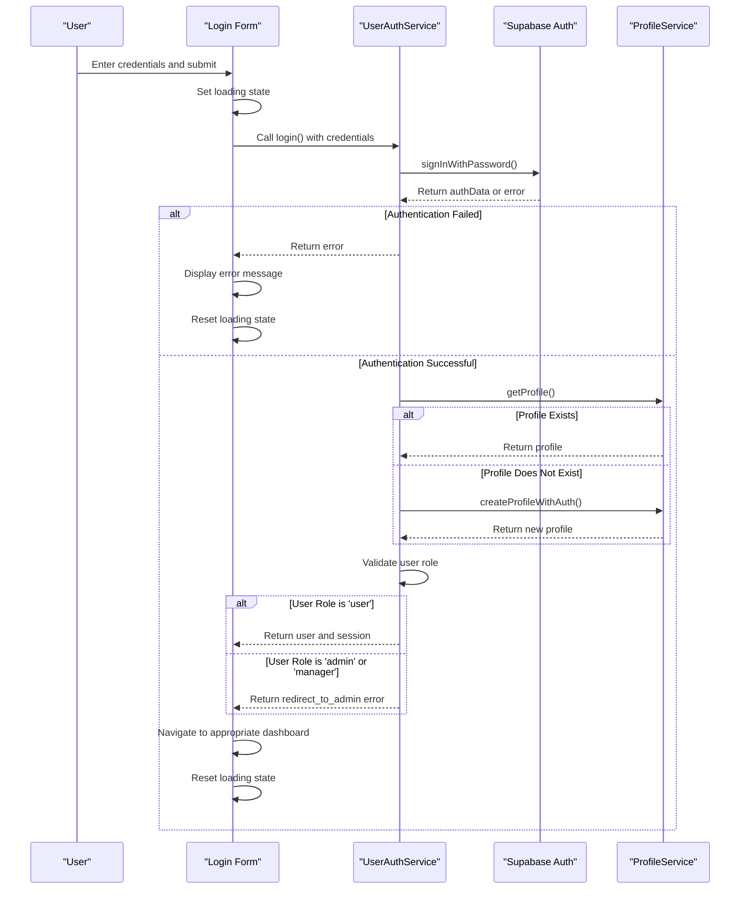

# Login Flow

<cite>
**Referenced Files in This Document**   
- [user-auth-service.ts](file://src/lib/user-auth-service.ts)
- [AdminAuth.tsx](file://src/pages/AdminAuth.tsx)
- [UserAuth.tsx](file://src/pages/UserAuth.tsx)
- [profile-service.ts](file://src/lib/profile-service.ts)
- [user-auth-schemas.ts](file://src/lib/user-auth-schemas.ts)
</cite>

## Table of Contents
1. [Login Flow](#login-flow)
2. [UserAuthService.login Implementation](#userauthservicelogin-implementation)
3. [Post-Login Workflow](#post-login-workflow)
4. [Role Validation and Redirection](#role-validation-and-redirection)
5. [Login Form Integration](#login-form-integration)
6. [Error Handling and User Feedback](#error-handling-and-user-feedback)
7. [Performance Considerations](#performance-considerations)

## UserAuthService.login Implementation

The `UserAuthService.login` method handles the authentication process for users signing in with email and password through Supabase authentication. The implementation follows a structured flow to ensure secure and reliable authentication.

The login process begins with a call to `supabase.auth.signInWithPassword`, which authenticates the user credentials against the Supabase authentication system. If the credentials are invalid, the method returns an `INVALID_CREDENTIALS` error. Upon successful authentication, the method receives both user data and session information from Supabase.

The method is designed to handle various authentication scenarios, including cases where email confirmation is required before login is permitted. It properly maps Supabase error codes to user-friendly error messages through the `mapSupabaseError` utility method, ensuring consistent error handling across the application.

**Section sources**
- [user-auth-service.ts](file://src/lib/user-auth-service.ts#L473-L547)

## Post-Login Workflow

After successful authentication, the system implements a comprehensive post-login workflow that ensures user data integrity and enhances the user experience through intelligent profile management.

The workflow begins with checking for the existence of a user profile in the application database. If no profile exists, the system creates one automatically using the user's authentication data. This process includes enhanced name extraction from user metadata with multiple fallback options:

1. Primary name from `user_metadata.name`
2. Alternative name from `user_metadata.full_name`
3. Username extracted from email address (before @ symbol)
4. Default fallback name "User"

The profile creation process uses the `ProfileService.createProfileWithAuth` method, which ensures proper authentication context during profile creation. This method includes robust error handling and validation to prevent data inconsistencies. If profile creation fails, the login process is terminated with a `PROFILE_CREATION_FAILED` error to maintain data integrity.

The system also implements caching mechanisms through `ProfileCache` to optimize subsequent profile access and reduce database queries, improving overall performance.

**Section sources**
- [user-auth-service.ts](file://src/lib/user-auth-service.ts#L495-L518)
- [profile-service.ts](file://src/lib/profile-service.ts#L667-L768)

## Role Validation and Redirection

The login flow includes a critical role validation step that ensures users are directed to the appropriate interface based on their assigned role. This security measure prevents unauthorized access to administrative functionality.

After profile verification or creation, the system checks the user's role field in their profile. Users with the 'user' role are granted access to the standard user dashboard, while users with 'admin' or 'manager' roles are redirected to the administrative interface.

The role validation occurs in the `UserAuthService.login` method, which returns a special 'redirect_to_admin' error when a non-user role is detected. This approach maintains separation of concerns by handling the redirection logic in the authentication service rather than the UI components.

Administrative users are redirected to `/admin/dashboard` after successful login, where they have access to enhanced functionality including user management, system settings, and analytics. The system also validates subscription status for user accounts to ensure they have active subscriptions before granting full access.

**Section sources**
- [user-auth-service.ts](file://src/lib/user-auth-service.ts#L520-L530)
- [UserProtected.tsx](file://src/pages/UserProtected.tsx#L41-L77)

## Login Form Integration

The login form in `AdminAuth.tsx` provides a seamless integration with the authentication service, implementing proper state management for loading and error states to enhance user experience.

The form component uses React hooks to manage state variables including email, password, loading status, and error messages. When the user submits the form, the `handleLogin` function prevents the default form submission behavior and initiates the authentication process.

During authentication, the loading state is activated to provide visual feedback to the user. If an error occurs, it is displayed prominently below the form inputs. The form also includes internationalization support, allowing users to switch between Ukrainian and English languages.

The integration with Supabase authentication is direct in the admin interface, while the user interface routes through the `UserAuthService` for additional processing. This difference reflects the distinct requirements of administrative versus user authentication flows.

**Diagram sources**
- [AdminAuth.tsx](file://src/pages/AdminAuth.tsx#L19-L56)
- [user-auth-service.ts](file://src/lib/user-auth-service.ts#L473-L547)
- [profile-service.ts](file://src/lib/profile-service.ts#L667-L768)

**Section sources**
- [AdminAuth.tsx](file://src/pages/AdminAuth.tsx#L11-L107)
- [UserAuth.tsx](file://src/pages/UserAuth.tsx#L35-L72)

## Error Handling and User Feedback

The login flow implements comprehensive error handling with user-friendly feedback through toast notifications. Different error types receive specific handling to guide users toward resolution.

For invalid credentials, the system displays a clear error message and maintains the form state for correction. When email confirmation is required, the system provides detailed instructions about checking the inbox and what to do after confirmation.

Network errors trigger messages suggesting connection checks, while rate limiting errors advise users to wait before retrying. The system also handles profile creation failures gracefully, ensuring that authentication issues don't compromise user data.

Toast notifications are implemented using the `sonner` library, providing non-intrusive feedback that doesn't disrupt the user experience. Error messages are translated based on the user's language preference, supporting both Ukrainian and English interfaces.

The error handling strategy follows a progressive disclosure approach, providing immediate feedback for common issues while logging detailed error information for debugging purposes.

**Section sources**
- [UserAuth.tsx](file://src/pages/UserAuth.tsx#L35-L72)
- [user-auth-service.ts](file://src/lib/user-auth-service.ts#L540-L547)

## Performance Considerations

The login implementation incorporates several performance optimizations and reliability features to ensure a smooth user experience.

Caching is implemented at multiple levels, with `ProfileCache` storing frequently accessed profile data to reduce database queries. The system also implements exponential backoff retry mechanisms for profile creation operations, helping to resolve temporary authentication issues.

Session validation is performed efficiently using `SessionValidator`, which ensures authentication context is valid before sensitive operations. The system minimizes redundant API calls by checking local state when possible and only making network requests when necessary.

Error boundaries and fallback mechanisms prevent the login process from failing completely due to transient issues. For example, if avatar update fails during login, the system continues the authentication flow rather than blocking access.

The implementation also considers security performance by using Supabase's built-in authentication mechanisms rather than custom solutions, leveraging optimized and tested infrastructure for credential handling.

**Section sources**
- [profile-service.ts](file://src/lib/profile-service.ts#L667-L768)
- [user-auth-service.ts](file://src/lib/user-auth-service.ts#L473-L547)