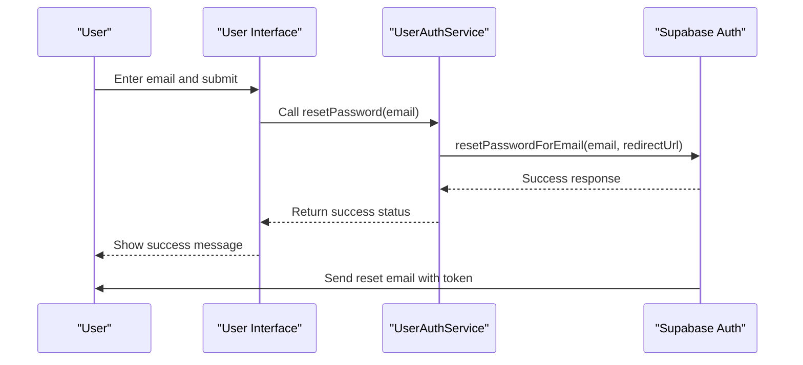
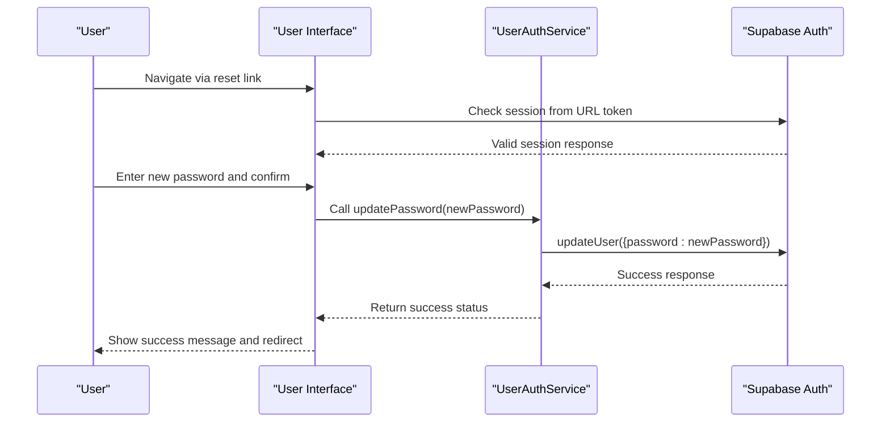
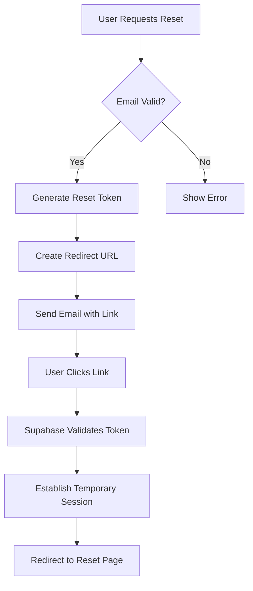

# Password Reset

<cite>
**Referenced Files in This Document**   
- [user-auth-service.ts](file://src/lib/user-auth-service.ts)
- [UserForgotPassword.tsx](file://src/pages/UserForgotPassword.tsx)
- [UserResetPassword.tsx](file://src/pages/UserResetPassword.tsx)
- [user-auth-schemas.ts](file://src/lib/user-auth-schemas.ts)
- [client.ts](file://src/integrations/supabase/client.ts)
</cite>

## Table of Contents
1. [Introduction](#introduction)
2. [Password Reset Workflow](#password-reset-workflow)
3. [Initiating Password Reset](#initiating-password-reset)
4. [Updating Password with Reset Token](#updating-password-with-reset-token)
5. [Email and Redirect Configuration](#email-and-redirect-configuration)
6. [Supabase Authentication Flow](#supabase-authentication-flow)
7. [Form Integration and Validation](#form-integration-and-validation)
8. [Error Handling](#error-handling)
9. [Common Issues and Solutions](#common-issues-and-solutions)
10. [Performance and Security Considerations](#performance-and-security-considerations)

## Introduction
The password reset functionality in the lovable-rise application provides a secure two-step process for users to recover access to their accounts. This document details the implementation of the password reset feature, focusing on the UserAuthService methods, email delivery, token validation, and user experience aspects. The system leverages Supabase authentication for secure password recovery while maintaining a seamless user interface.

## Password Reset Workflow
The password reset process follows a standard two-step security pattern:
1. User initiates reset by providing their email address
2. System sends a reset email with a time-limited token
3. User clicks the link and is redirected to the password reset page
4. User enters and confirms a new password
5. System validates the token and updates the password

This workflow ensures that only the legitimate account owner can reset their password, as access to the registered email address is required.

**Section sources**
- [user-auth-service.ts](file://src/lib/user-auth-service.ts#L527-L585)
- [UserForgotPassword.tsx](file://src/pages/UserForgotPassword.tsx#L17-L207)

## Initiating Password Reset
The password reset process begins with the `UserAuthService.resetPassword` method, which triggers the email delivery process. This method accepts a `ResetPasswordData` object containing the user's email address and communicates with Supabase to initiate the reset flow.

When a user submits their email on the forgot password page, the application calls this method and handles the response accordingly. Upon successful initiation, the user receives feedback that an email has been sent to their registered address.



**Diagram sources**
- [user-auth-service.ts](file://src/lib/user-auth-service.ts#L527-L555)
- [UserForgotPassword.tsx](file://src/pages/UserForgotPassword.tsx#L17-L207)

**Section sources**
- [user-auth-service.ts](file://src/lib/user-auth-service.ts#L527-L555)
- [UserForgotPassword.tsx](file://src/pages/UserForgotPassword.tsx#L17-L207)

## Updating Password with Reset Token
After clicking the reset link in the email, users are redirected to the password reset page where they can update their password using the `UserAuthService.updatePassword` method. This method accepts the new password and uses the token from the URL to authenticate the request.

The implementation validates that a valid session exists before allowing the password update, ensuring that the reset token has been properly processed by Supabase. Upon successful password update, users receive confirmation and are redirected to the login page.



**Diagram sources**
- [user-auth-service.ts](file://src/lib/user-auth-service.ts#L557-L585)
- [UserResetPassword.tsx](file://src/pages/UserResetPassword.tsx#L18-L282)

**Section sources**
- [user-auth-service.ts](file://src/lib/user-auth-service.ts#L557-L585)
- [UserResetPassword.tsx](file://src/pages/UserResetPassword.tsx#L18-L282)

## Email and Redirect Configuration
The password reset email is configured to include a redirect URL that points to the `/user-reset-password` page. This URL contains the reset token as a parameter, which Supabase uses to validate the request and establish a temporary session.

The redirect URL is constructed using `window.location.origin` to ensure it matches the current deployment environment. This approach allows the application to work correctly in different environments (development, staging, production) without requiring configuration changes.



**Diagram sources**
- [user-auth-service.ts](file://src/lib/user-auth-service.ts#L531-L535)

## Supabase Authentication Flow
The password reset functionality leverages Supabase's built-in authentication system for secure token management. When `resetPasswordForEmail` is called, Supabase generates a cryptographically secure token and sends it to the user's email address.

The token is time-limited and can only be used once, preventing replay attacks. When the user accesses the reset link, Supabase validates the token and creates a temporary session that allows the password update operation. This session-based approach eliminates the need to pass the token through the frontend application, enhancing security.

**Section sources**
- [user-auth-service.ts](file://src/lib/user-auth-service.ts#L527-L585)
- [client.ts](file://src/integrations/supabase/client.ts#L10-L30)

## Form Integration and Validation
The password reset forms are integrated with the authentication service using React Hook Form and Zod for validation. The `UserForgotPassword.tsx` component handles the initial reset request, while `UserResetPassword.tsx` manages the password update process.

Both forms implement client-side validation to provide immediate feedback to users. The forgot password form validates email format, while the reset form ensures password strength and confirmation match. Server responses are communicated through toast notifications, providing a seamless user experience.

```mermaid
classDiagram
class UserForgotPassword {
+loading : boolean
+resetSuccess : boolean
+handlePasswordReset(data) : Promise~void~
-resetForm : HookForm
-resetErrors : FormErrors
}
class UserResetPassword {
+loading : boolean
+resetSuccess : boolean
+sessionValid : boolean | null
+handlePasswordUpdate(data) : Promise~void~
-passwordForm : HookForm
-passwordErrors : FormErrors
}
class UserAuthService {
+resetPassword(data) : Promise~{success, error}~
+updatePassword(password) : Promise~{success, error}~
}
UserForgotPassword --> UserAuthService : "uses"
UserResetPassword --> UserAuthService : "uses"
UserForgotPassword --> "Zod" : "validation"
UserResetPassword --> "Zod" : "validation"
```

**Diagram sources**
- [UserForgotPassword.tsx](file://src/pages/UserForgotPassword.tsx#L17-L207)
- [UserResetPassword.tsx](file://src/pages/UserResetPassword.tsx#L18-L282)
- [user-auth-schemas.ts](file://src/lib/user-auth-schemas.ts#L23-L34)

**Section sources**
- [UserForgotPassword.tsx](file://src/pages/UserForgotPassword.tsx#L17-L207)
- [UserResetPassword.tsx](file://src/pages/UserResetPassword.tsx#L18-L282)
- [user-auth-schemas.ts](file://src/lib/user-auth-schemas.ts#L23-L40)

## Error Handling
The password reset functionality includes comprehensive error handling for various scenarios. The `UserAuthService` maps Supabase errors to user-friendly messages, which are then displayed through toast notifications.

Common errors include invalid email addresses, network connectivity issues, and expired reset tokens. The system provides specific feedback for each error type, helping users understand what went wrong and how to resolve it. For example, if a token has expired, users are directed to request a new reset link.

**Section sources**
- [user-auth-service.ts](file://src/lib/user-auth-service.ts#L837-L875)
- [UserForgotPassword.tsx](file://src/pages/UserForgotPassword.tsx#L17-L207)
- [UserResetPassword.tsx](file://src/pages/UserResetPassword.tsx#L18-L282)

## Common Issues and Solutions
Several common issues may occur during the password reset process, each with specific solutions:

**Users not receiving reset emails**: This may be caused by email delivery delays, spam filters, or incorrect email addresses. The solution is to verify the email address and check spam folders. Users can request a new reset link after a short waiting period.

**Expired reset tokens**: Reset tokens have a limited lifespan for security reasons. If a token expires, users receive an error message and are redirected to request a new reset link.

**Network errors during password update**: These may occur due to connectivity issues. The application displays a network error message and allows users to retry the operation once connectivity is restored.

**Invalid tokens**: Tokens may become invalid if they have already been used or if there are issues with the authentication session. The system validates the session before allowing password updates and redirects users to request a new reset if validation fails.

**Section sources**
- [user-auth-service.ts](file://src/lib/user-auth-service.ts#L527-L585)
- [UserResetPassword.tsx](file://src/pages/UserResetPassword.tsx#L18-L282)

## Performance and Security Considerations
The password reset implementation prioritizes both security and user experience. Password reset tokens are cryptographically secure and time-limited, preventing unauthorized access. The system uses Supabase's built-in security features, including rate limiting to prevent abuse.

From a user experience perspective, the process is streamlined with clear feedback at each step. Success states are communicated with positive confirmation messages, while errors provide actionable guidance. Password strength is enforced through validation rules requiring a minimum of 8 characters.

The implementation also considers performance by minimizing server requests and providing immediate client-side validation. Loading states are displayed during asynchronous operations to keep users informed of the application's status.

**Section sources**
- [user-auth-service.ts](file://src/lib/user-auth-service.ts#L527-L585)
- [user-auth-schemas.ts](file://src/lib/user-auth-schemas.ts#L23-L34)
- [UserResetPassword.tsx](file://src/pages/UserResetPassword.tsx#L18-L282)