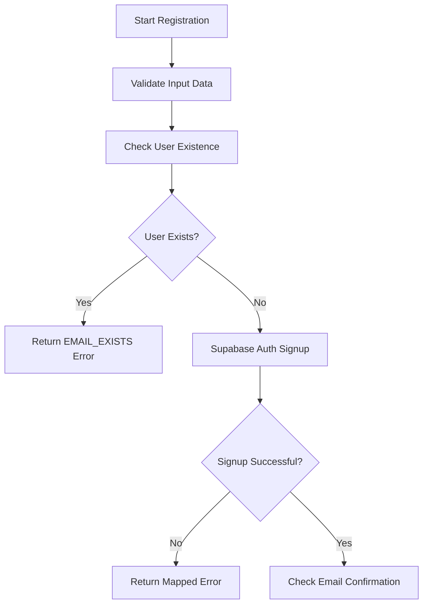
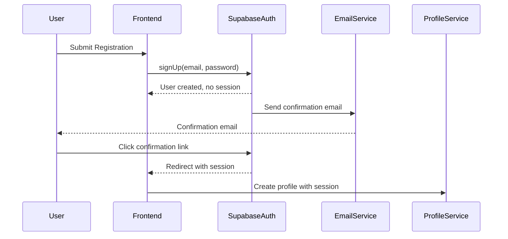
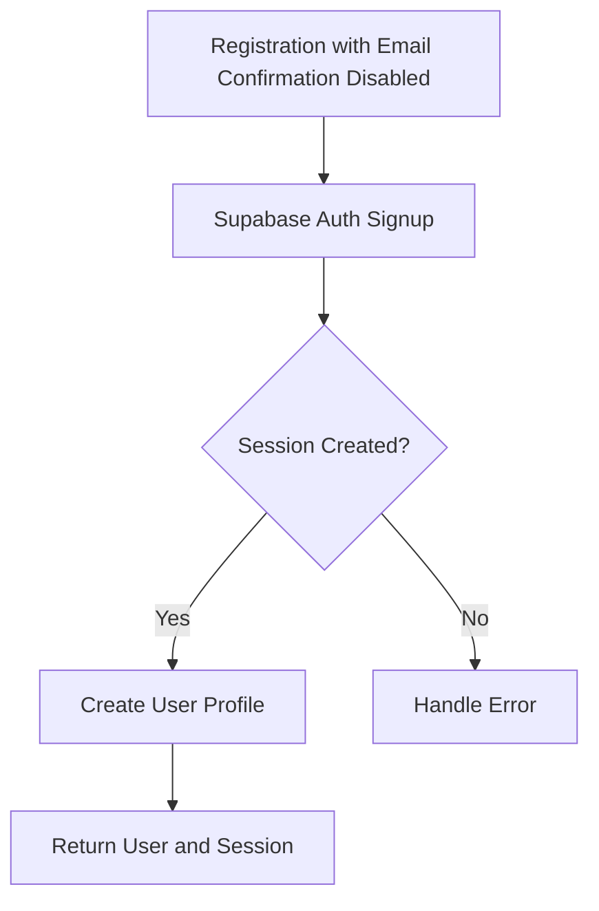
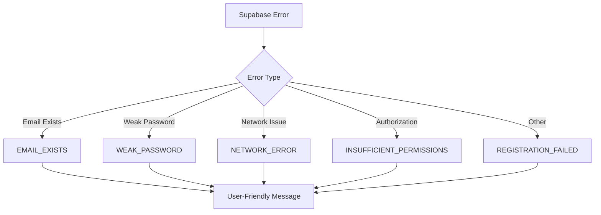
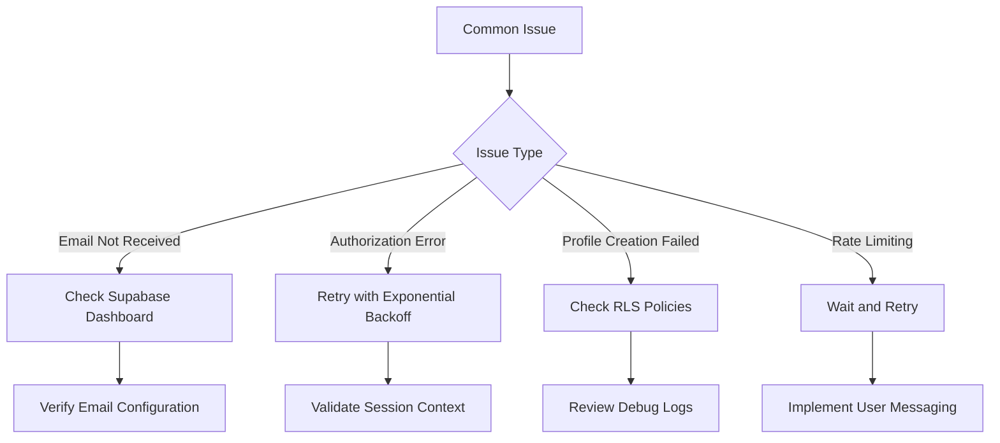

# Registration Process

<cite>
**Referenced Files in This Document**   
- [user-auth-service.ts](file://src/lib/user-auth-service.ts)
- [user-auth-schemas.ts](file://src/lib/user-auth-schemas.ts)
- [profile-service.ts](file://src/lib/profile-service.ts)
- [user-existence-service.ts](file://src/lib/user-existence-service.ts)
- [session-validation.ts](file://src/lib/session-validation.ts)
- [UserRegister.tsx](file://src/pages/UserRegister.tsx)
</cite>

## Table of Contents
1. [Introduction](#introduction)
2. [Registration Workflow](#registration-workflow)
3. [Email Confirmation Flow](#email-confirmation-flow)
4. [Immediate Profile Creation](#immediate-profile-creation)
5. [Error Handling Strategy](#error-handling-strategy)
6. [Performance Considerations](#performance-considerations)
7. [Common Issues and Solutions](#common-issues-and-solutions)

## Introduction
The registration process in the lovable-rise application is a critical component that handles user onboarding through a secure and reliable workflow. This document provides a comprehensive analysis of the UserAuthService.register method implementation, detailing the three-step registration workflow, email confirmation flow, error handling strategies, and performance optimizations. The system leverages Supabase authentication with Row Level Security (RLS) policies to ensure data integrity and security throughout the registration process.

**Section sources**
- [user-auth-service.ts](file://src/lib/user-auth-service.ts#L173-L986)

## Registration Workflow
The UserAuthService.register method implements a three-step registration workflow that ensures data consistency and security. The process begins with validation of registration data, followed by existence checking, and concludes with Supabase authentication signup.

The first step involves checking user existence through the ProfileService.getProfileByEmail method, which queries the profiles table to determine if a user with the provided email already exists. This approach is more reliable than checking the authentication system directly, as it ensures profile-level uniqueness.



**Diagram sources**
- [user-auth-service.ts](file://src/lib/user-auth-service.ts#L197-L231)
- [profile-service.ts](file://src/lib/profile-service.ts#L59-L81)

**Section sources**
- [user-auth-service.ts](file://src/lib/user-auth-service.ts#L173-L231)
- [profile-service.ts](file://src/lib/profile-service.ts#L59-L81)

## Email Confirmation Flow
The email confirmation flow follows Supabase's standard workflow where user registration creates an account but does not issue a session or access token until email confirmation is completed. When a user registers, the system creates their authentication record in Supabase Auth, but the session property in the response will be null, and the email_confirmed_at field will be null.

The implementation specifically checks for these conditions:
```typescript
if (!authData.session && !authData.user.email_confirmed_at) {
  return {
    user: null,
    session: null,
    error: UserAuthError.EMAIL_CONFIRMATION_REQUIRED
  };
}
```

This design ensures that users cannot access protected resources until they verify their email address, enhancing security and preventing unauthorized access. The user receives a confirmation email with a link that redirects to the application's callback URL, where the handleOAuthCallback method processes the confirmation and creates the user profile.



**Diagram sources**
- [user-auth-service.ts](file://src/lib/user-auth-service.ts#L231-L273)
- [profile-service.ts](file://src/lib/profile-service.ts#L59-L81)

**Section sources**
- [user-auth-service.ts](file://src/lib/user-auth-service.ts#L231-L273)
- [profile-service.ts](file://src/lib/profile-service.ts#L59-L81)

## Immediate Profile Creation
When email confirmation is disabled in Supabase settings, the registration process immediately creates a user profile and returns a valid session. In this scenario, the authData.session property will contain a valid session object, allowing the system to proceed with profile creation.

The implementation handles this case by calling ProfileService.createProfileWithAuth with the user's ID, email, and name extracted from the registration data:
```typescript
if (authData.session) {
  const profile = await ProfileService.createProfileWithAuth({
    id: authData.user.id,
    email: data.email,
    name: data.name
  }, authData.session.access_token);
}
```

This immediate profile creation ensures that users can access the application immediately after registration without requiring email confirmation. The profile creation process includes enhanced name extraction with fallbacks, using the name from user metadata, full_name as a backup, or deriving a name from the email address if necessary.



**Diagram sources**
- [user-auth-service.ts](file://src/lib/user-auth-service.ts#L273-L311)
- [profile-service.ts](file://src/lib/profile-service.ts#L59-L81)

**Section sources**
- [user-auth-service.ts](file://src/lib/user-auth-service.ts#L273-L311)
- [profile-service.ts](file://src/lib/profile-service.ts#L59-L81)

## Error Handling Strategy
The registration process implements a comprehensive error handling strategy that maps Supabase errors to user-friendly messages and handles various error scenarios appropriately. The UserAuthService.mapSupabaseError method converts technical error messages into meaningful feedback for users.

Key error types and their handling include:
- **Email already exists**: Returns UserAuthError.EMAIL_EXISTS when the email is already registered
- **Weak passwords**: Returns UserAuthError.WEAK_PASSWORD when password strength requirements are not met
- **Network errors**: Returns UserAuthError.NETWORK_ERROR for connection issues
- **Authorization errors**: Returns UserAuthError.INSUFFICIENT_PERMISSIONS for permission-related issues

The error mapping process examines the error message, code, and status to determine the appropriate user-facing error:
```typescript
private static mapSupabaseError(error: any): string {
  const message = error.message?.toLowerCase() || '';
  
  if (message.includes('user already registered') || message.includes('email already registered')) {
    return UserAuthError.EMAIL_EXISTS;
  }
  
  if (message.includes('password') && (message.includes('weak') || message.includes('short'))) {
    return UserAuthError.WEAK_PASSWORD;
  }
  
  if (message.includes('network') || message.includes('connection')) {
    return UserAuthError.NETWORK_ERROR;
  }
  
  // Additional error mappings...
}
```



**Diagram sources**
- [user-auth-service.ts](file://src/lib/user-auth-service.ts#L900-L950)
- [user-auth-schemas.ts](file://src/lib/user-auth-schemas.ts#L63-L81)

**Section sources**
- [user-auth-service.ts](file://src/lib/user-auth-service.ts#L900-L950)
- [user-auth-schemas.ts](file://src/lib/user-auth-schemas.ts#L63-L81)

## Performance Considerations
The registration process incorporates several performance optimizations to ensure reliability and responsiveness. The system implements a retry mechanism with exponential backoff for profile creation operations, which helps mitigate transient failures and authorization issues.

The retry mechanism is configured through the DEFAULT_REGISTRATION_OPTIONS:
```typescript
const DEFAULT_REGISTRATION_OPTIONS: RegistrationOptions = {
  maxRetries: 3,
  sessionTimeout: 10000,
  profileCreationDelay: 1000,
  retryDelay: 500
};
```

When creating a profile, the system uses exponential backoff between retry attempts:
```typescript
const delay = config.retryDelay * Math.pow(2, attempt - 2);
```

The session validation process ensures that authentication sessions are properly established before attempting profile creation. The SessionValidator.waitForValidSession method polls for a valid session with a configurable timeout, preventing race conditions between authentication and profile creation.

Additionally, the system implements caching through the ProfileCache class to reduce database queries for existence checks and profile lookups. The cache has a TTL of 5 minutes for profile data and 2 minutes for existence checks, balancing performance with data freshness.

```mermaid
flowchart TD
A[Profile Creation] --> B{Success?}
B --> |No| C[Wait with Exponential Backoff]
C --> D[Calculate Delay: retryDelay * 2^(attempt-2)]
D --> E[Check Session Validity]
E --> F{Session Valid?}
F --> |No| G[Refresh Session]
F --> |Yes| H[Retry Profile Creation]
H --> B
B --> |Yes| I[Success]
```

**Diagram sources**
- [user-auth-service.ts](file://src/lib/user-auth-service.ts#L750-L850)
- [session-validation.ts](file://src/lib/session-validation.ts#L42-L343)
- [error-handler.ts](file://src/lib/error-handler.ts#L300-L400)

**Section sources**
- [user-auth-service.ts](file://src/lib/user-auth-service.ts#L750-L850)
- [session-validation.ts](file://src/lib/session-validation.ts#L42-L343)
- [error-handler.ts](file://src/lib/error-handler.ts#L300-L400)

## Common Issues and Solutions
Several common issues may arise during the registration process, and the system provides specific solutions for each scenario.

**Users not receiving confirmation emails**: This issue can occur due to email delivery problems or incorrect email addresses. The system logs detailed information about the registration process through the RegistrationLogger, which helps diagnose such issues. Administrators can check the Supabase dashboard to verify that confirmation emails are being sent.

**Authorization errors during registration**: These errors typically occur when there are timing issues between authentication and profile creation. The system addresses this through the createProfileWithSessionRetry method, which implements exponential backoff and session validation before each retry attempt. The AuthorizationErrorHandler analyzes the specific error type and determines whether a retry is appropriate.

**Profile creation failures**: When profile creation fails after multiple attempts, the system returns a UserAuthError.PROFILE_CREATION_FAILED error. This could indicate deeper issues with database permissions or Row Level Security policies. The system includes comprehensive logging through SessionValidator.logSessionDebugInfo to help diagnose RLS-related issues.

**Rate limiting**: The system may encounter rate limiting from Supabase when there are too many registration attempts. The error handling maps these to a rate_limit_exceeded error, and the frontend displays appropriate messaging to users, suggesting they wait before trying again.



**Diagram sources**
- [user-auth-service.ts](file://src/lib/user-auth-service.ts#L850-L900)
- [error-handler.ts](file://src/lib/error-handler.ts#L200-L300)
- [session-validation.ts](file://src/lib/session-validation.ts#L42-L343)

**Section sources**
- [user-auth-service.ts](file://src/lib/user-auth-service.ts#L850-L900)
- [error-handler.ts](file://src/lib/error-handler.ts#L200-L300)
- [session-validation.ts](file://src/lib/session-validation.ts#L42-L343)