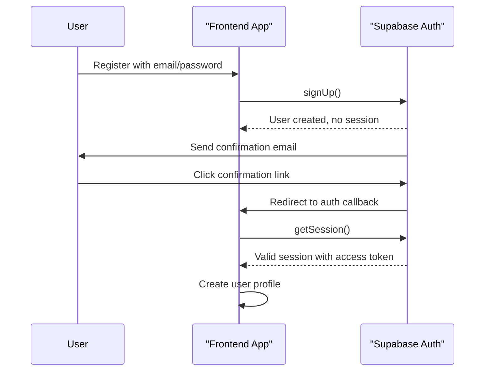
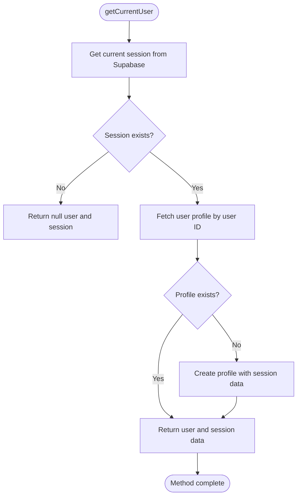
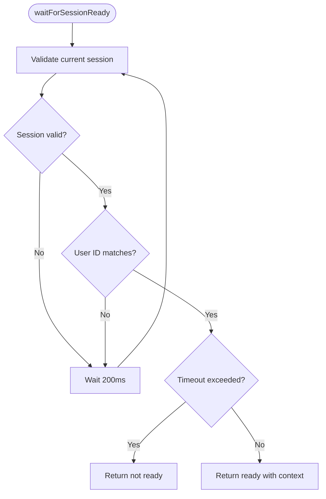
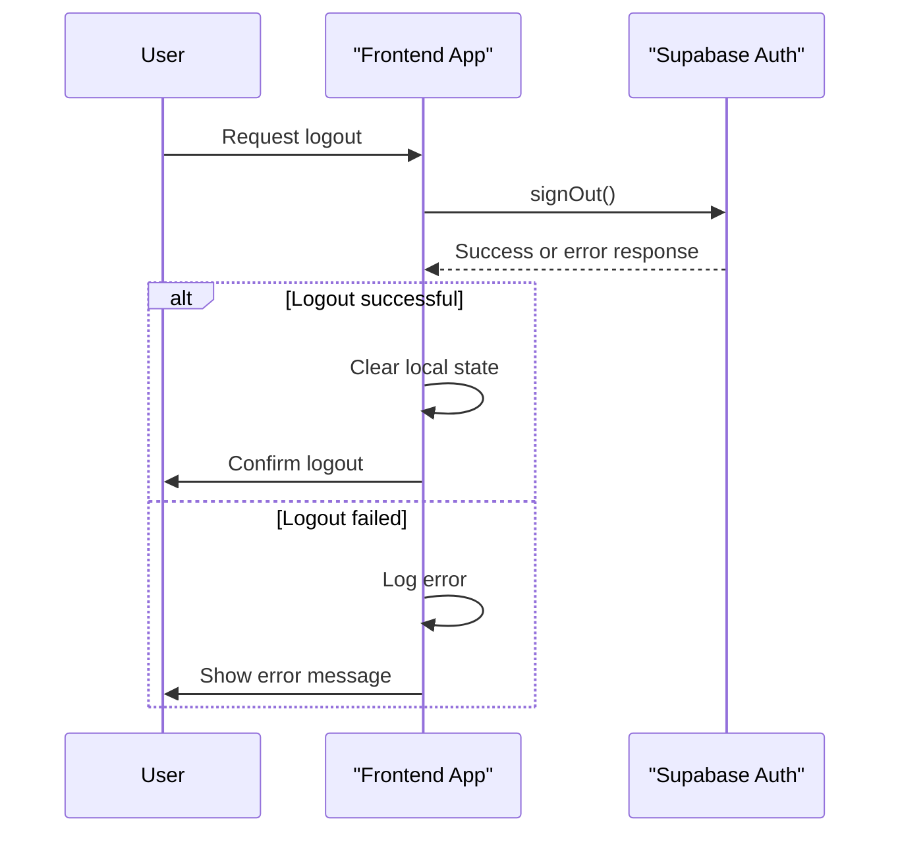
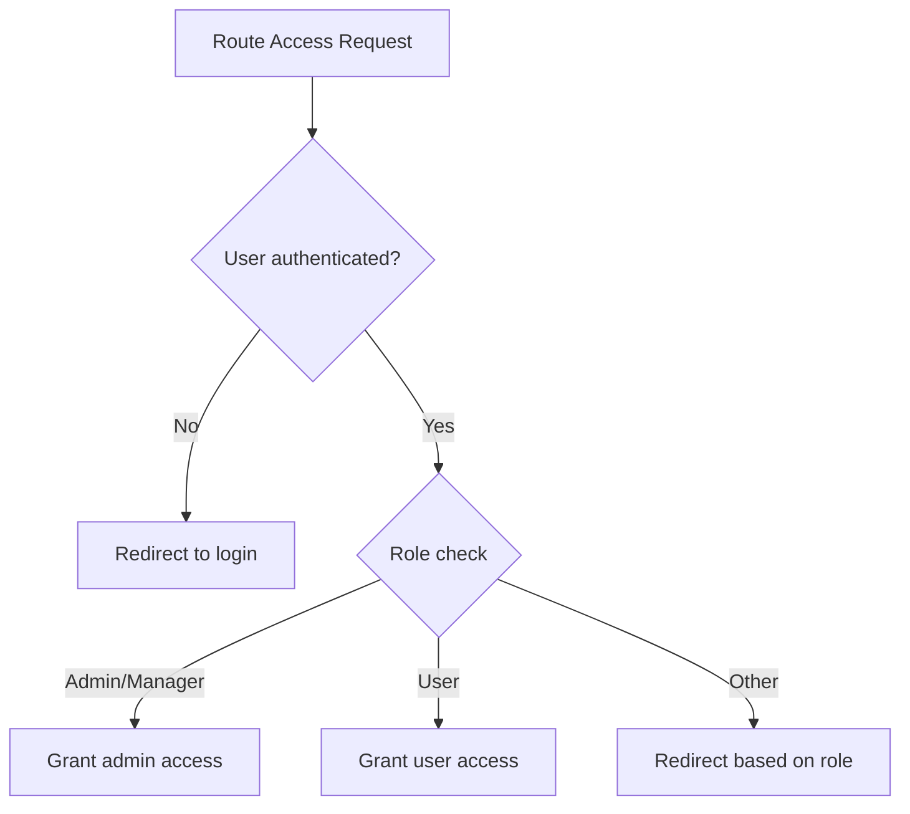
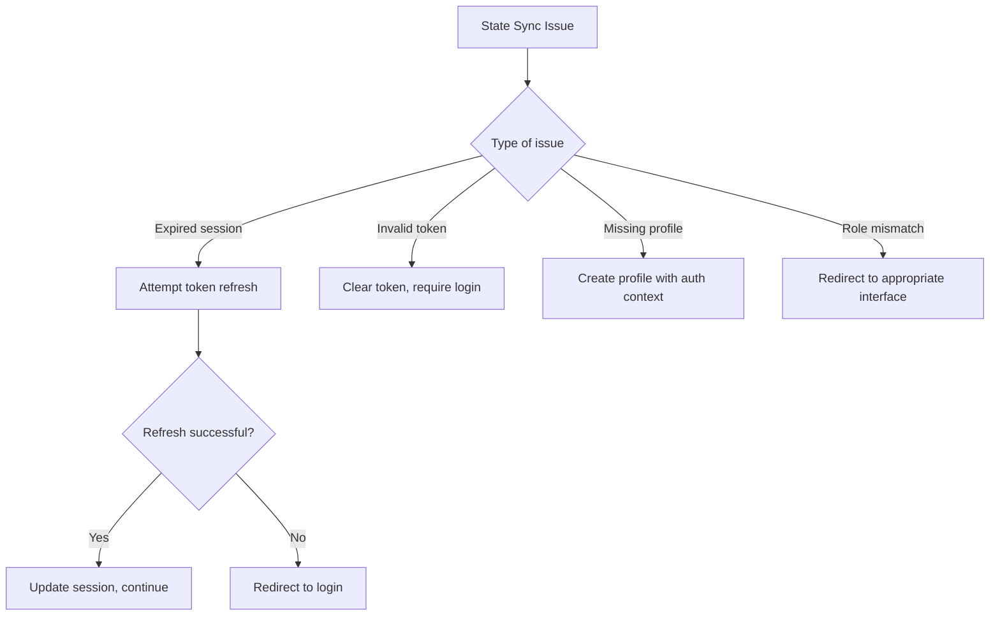
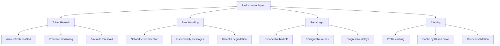

# Session Management

<cite>
**Referenced Files in This Document**   
- [user-auth-service.ts](file://src/lib/user-auth-service.ts)
- [session-validation.ts](file://src/lib/session-validation.ts)
- [ProtectedRoutes.tsx](file://src/components/ProtectedRoutes.tsx)
- [AuthCallback.tsx](file://src/pages/AuthCallback.tsx)
- [client.ts](file://src/integrations/supabase/client.ts)
- [profile-service.ts](file://src/lib/profile-service.ts)
</cite>

## Table of Contents
1. [Introduction](#introduction)
2. [Session Handling with Supabase Auth](#session-handling-with-supabase-auth)
3. [UserAuthService Implementation](#userauthservice-implementation)
4. [Session Validation Process](#session-validation-process)
5. [Logout Implementation](#logout-implementation)
6. [Protected Routes and Access Control](#protected-routes-and-access-control)
7. [Common Issues and Solutions](#common-issues-and-solutions)
8. [Performance Considerations](#performance-considerations)
9. [Conclusion](#conclusion)

## Introduction
The session management system in the lovable-rise application is built on Supabase Auth, providing secure authentication and authorization for both user and admin interfaces. This document details the implementation of session handling, including access tokens, refresh tokens, session validation, and user state management. The system ensures proper authentication context through comprehensive validation mechanisms and handles edge cases such as expired sessions and synchronization issues between client-side state and Supabase authentication state.

## Session Handling with Supabase Auth
The application implements a robust session management system using Supabase Auth, which handles user authentication through access tokens and refresh tokens. The system follows Supabase's email confirmation workflow, where user registration creates a user record but does not provide a session or token until the email is confirmed. This approach enhances security by verifying user ownership of the email address before granting access to protected resources.

The session configuration in the Supabase client includes several important settings:
- **Storage**: Uses localStorage for persistent session storage
- **Session persistence**: Enabled to maintain user sessions across browser restarts
- **Auto-refresh token**: Enabled to automatically refresh expired access tokens
- **Detect session in URL**: Enabled to handle OAuth callbacks and password reset flows
- **Storage key**: Custom key for session storage to avoid conflicts

**Diagram sources**
- [client.ts](file://src/integrations/supabase/client.ts#L1-L31)
- [user-auth-service.ts](file://src/lib/user-auth-service.ts#L173-L242)

**Section sources**
- [client.ts](file://src/integrations/supabase/client.ts#L1-L31)
- [user-auth-service.ts](file://src/lib/user-auth-service.ts#L173-L242)

## UserAuthService Implementation
The UserAuthService class provides a comprehensive interface for authentication operations, including registration, login, logout, and session management. The getCurrentUser method is a key component that retrieves the current session and associated profile information.

The getCurrentUser method follows a two-step process:
1. Retrieves the current session from Supabase Auth using getSession()
2. Fetches the user profile from the database using the ProfileService

**Diagram sources**
- [user-auth-service.ts](file://src/lib/user-auth-service.ts#L745-L763)
- [profile-service.ts](file://src/lib/profile-service.ts#L105-L127)

**Section sources**
- [user-auth-service.ts](file://src/lib/user-auth-service.ts#L745-L763)
- [profile-service.ts](file://src/lib/profile-service.ts#L105-L127)

## Session Validation Process
The session validation process ensures that the session is ready with proper authentication context before allowing access to protected resources. The waitForSessionReady method implements a timeout-based approach to wait for a valid session.

The validation process includes:
- Checking for a valid session with non-expired access token
- Verifying the user ID matches the expected user
- Ensuring the session has proper authentication context for Row Level Security (RLS)
- Implementing a configurable timeout to prevent indefinite waiting

The SessionValidator class provides comprehensive validation utilities that check session validity, refresh tokens when needed, and validate RLS context by testing database queries that depend on auth.uid().

**Diagram sources**
- [user-auth-service.ts](file://src/lib/user-auth-service.ts#L825-L847)
- [session-validation.ts](file://src/lib/session-validation.ts#L132-L173)

**Section sources**
- [user-auth-service.ts](file://src/lib/user-auth-service.ts#L825-L847)
- [session-validation.ts](file://src/lib/session-validation.ts#L132-L173)

## Logout Implementation
The logout implementation signs out the user from Supabase Auth and handles errors gracefully. The logout method calls Supabase's signOut function and returns a success status with any error information.

The logout process includes:
- Calling Supabase auth.signOut() to invalidate the session
- Handling network errors that might occur during the logout request
- Returning a consistent response format with success status and error message
- Gracefully handling cases where the logout request fails

**Diagram sources**
- [user-auth-service.ts](file://src/lib/user-auth-service.ts#L725-L743)
- [ProtectedRoutes.tsx](file://src/components/ProtectedRoutes.tsx#L1-L45)

**Section sources**
- [user-auth-service.ts](file://src/lib/user-auth-service.ts#L725-L743)

## Protected Routes and Access Control
The application implements protected routes using React Router and custom route components that enforce role-based access control. The AdminRoute and UserRoute components check the user's role and redirect accordingly.

For admin interfaces:
- Users with 'admin' or 'manager' roles are granted access
- Other users are redirected to the user dashboard
- Loading state is displayed while role information is being fetched

For user interfaces:
- Users with 'user' role are granted access
- Admins and managers are redirected to the admin dashboard
- Loading state is displayed during role verification

**Diagram sources**
- [ProtectedRoutes.tsx](file://src/components/ProtectedRoutes.tsx#L1-L45)
- [user-auth-service.ts](file://src/lib/user-auth-service.ts#L585-L615)

**Section sources**
- [ProtectedRoutes.tsx](file://src/components/ProtectedRoutes.tsx#L1-L45)

## Common Issues and Solutions
The session management system addresses several common issues that can occur in authentication flows:

### Expired Sessions
When sessions expire, the system automatically attempts to refresh the token using the refresh token. If refresh fails, the user is redirected to the login page. The session monitoring system proactively checks session health and refreshes tokens before they expire.

### Invalid Access Tokens
Invalid access tokens are detected during session validation. The system attempts to refresh the session and, if unsuccessful, clears the invalid token and requires re-authentication. Detailed logging helps diagnose token issues.

### Client-Server State Synchronization
Synchronization issues between client-side state and Supabase authentication state are resolved through:
- Using Supabase's built-in session persistence
- Implementing session change listeners
- Validating session state before critical operations
- Using the auth state change event to update client state

**Section sources**
- [session-validation.ts](file://src/lib/session-validation.ts#L42-L173)
- [user-auth-service.ts](file://src/lib/user-auth-service.ts#L173-L986)

## Performance Considerations
The session management system incorporates several performance optimizations:

### Token Refresh Mechanisms
The system uses Supabase's auto-refresh feature with a proactive monitoring system that refreshes tokens before they expire. The refresh threshold is set to 5 minutes before expiration to ensure seamless user experience.

### Error Handling for Network Issues
Network-related errors are handled with retry logic and user-friendly error messages. The system distinguishes between different types of errors (network, authentication, validation) and provides appropriate feedback.

### Retry Logic with Exponential Backoff
For session-related operations that may fail due to timing issues (such as profile creation after registration), the system implements exponential backoff retry logic. The retry delay increases with each attempt, starting from 500ms and doubling each time.

### Caching Strategies
The ProfileService implements caching to reduce database queries:
- Profiles are cached by user ID and email
- Cache entries have appropriate TTL (time-to-live)
- Cache is invalidated when profiles are updated
- Cache fallback ensures availability during network issues

**Section sources**
- [session-validation.ts](file://src/lib/session-validation.ts#L42-L343)
- [user-auth-service.ts](file://src/lib/user-auth-service.ts#L850-L986)
- [profile-service.ts](file://src/lib/profile-service.ts#L25-L45)

## Conclusion
The session management system in the lovable-rise application provides a secure and reliable authentication solution using Supabase Auth. The implementation addresses key requirements including proper session handling, robust validation, graceful error handling, and performance optimization. By following Supabase best practices and implementing additional safeguards, the system ensures a seamless user experience while maintaining security and data integrity. The modular design allows for easy maintenance and extension, making it adaptable to future requirements.