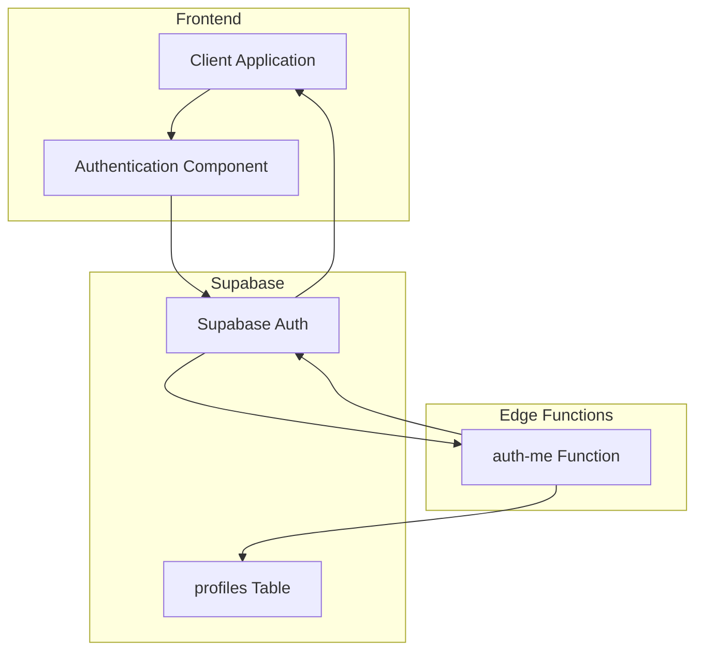
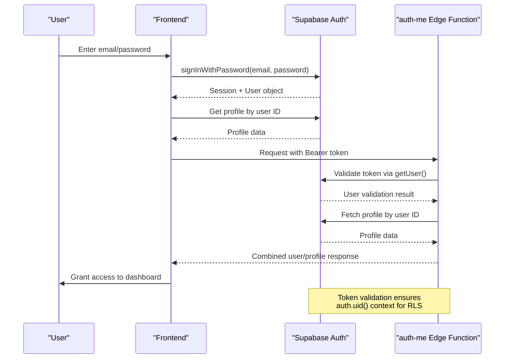
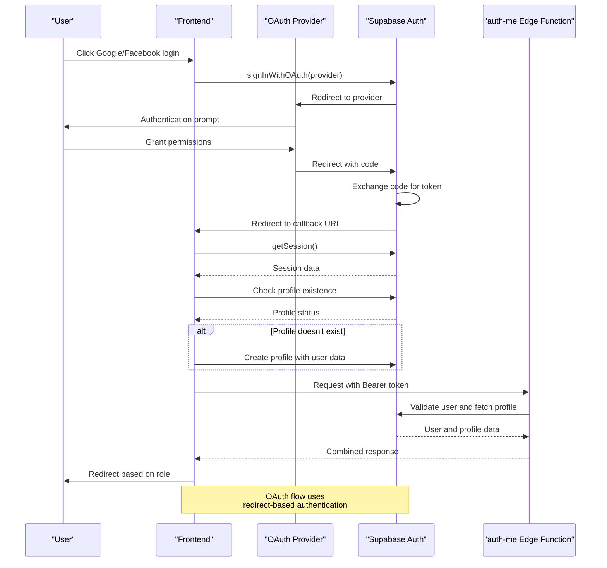
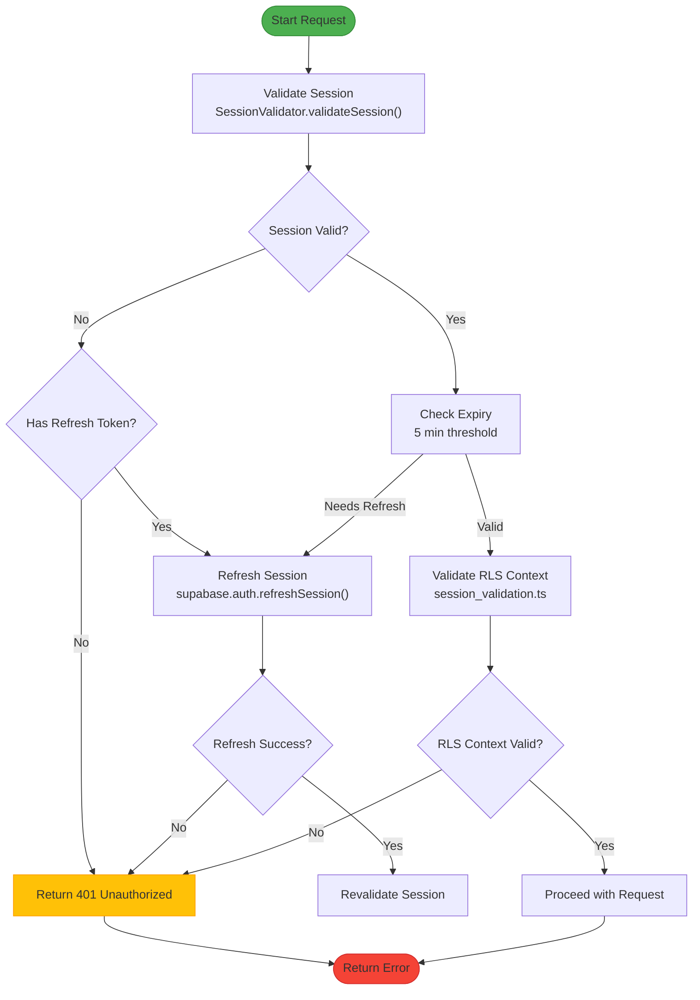
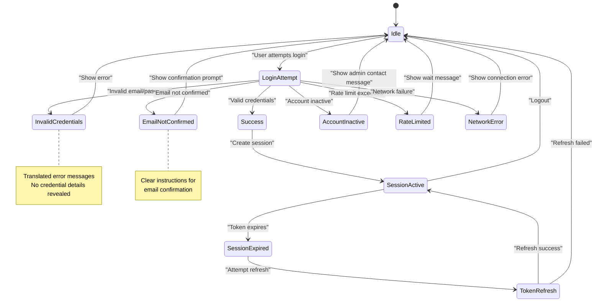

# Authentication Flow

<cite>
**Referenced Files in This Document**   
- [user-auth-service.ts](file://src/lib/user-auth-service.ts)
- [auth-me/index.ts](file://supabase/functions/auth-me/index.ts)
- [session-validation.ts](file://src/lib/session-validation.ts)
- [UserAuth.tsx](file://src/pages/UserAuth.tsx)
- [client.ts](file://src/integrations/supabase/client.ts)
</cite>

## Table of Contents
1. [Introduction](#introduction)
2. [Authentication Architecture](#authentication-architecture)
3. [Email/Password Authentication Flow](#emailpassword-authentication-flow)
4. [OAuth Integration Flow](#oauth-integration-flow)
5. [Session Validation and Token Handling](#session-validation-and-token-handling)
6. [Error Handling and Security Considerations](#error-handling-and-security-considerations)
7. [Security Implementation Details](#security-implementation-details)
8. [Conclusion](#conclusion)

## Introduction
The authentication system in lovable-rise implements a robust, multi-layered security architecture using Supabase Auth as the foundation, enhanced with custom Edge Functions and client-side validation. The system supports email/password authentication, OAuth integration with Google and Facebook, and implements comprehensive session management with JWT token validation. This document details the end-to-end authentication flow, from user login through token validation and session establishment, with a focus on security, error handling, and integration between frontend components and backend services.

## Authentication Architecture

The authentication architecture follows a layered approach with clear separation of concerns between client, Edge Function, and Supabase Auth services. The system implements JWT-based authentication with Bearer token scheme, Row Level Security (RLS) enforcement, and session persistence across application restarts.

**Diagram sources**
- [user-auth-service.ts](file://src/lib/user-auth-service.ts#L1-L100)
- [auth-me/index.ts](file://supabase/functions/auth-me/index.ts#L1-L20)

**Section sources**
- [user-auth-service.ts](file://src/lib/user-auth-service.ts#L1-L50)
- [auth-me/index.ts](file://supabase/functions/auth-me/index.ts#L1-L30)

## Email/Password Authentication Flow

The email/password authentication flow follows a secure, multi-step process that includes user validation, session establishment, and profile creation. The system implements email confirmation workflow as a security measure, requiring users to verify their email address before gaining full access.

**Diagram sources**
- [user-auth-service.ts](file://src/lib/user-auth-service.ts#L200-L300)
- [auth-me/index.ts](file://supabase/functions/auth-me/index.ts#L30-L60)

**Section sources**
- [user-auth-service.ts](file://src/lib/user-auth-service.ts#L150-L400)
- [UserAuth.tsx](file://src/pages/UserAuth.tsx#L50-L150)

## OAuth Integration Flow

The OAuth integration flow supports Google and Facebook authentication, following Supabase's OAuth implementation with custom callback handling. The system ensures proper role assignment and profile creation for OAuth users, with redirection logic based on user role.

**Diagram sources**
- [user-auth-service.ts](file://src/lib/user-auth-service.ts#L300-L350)
- [auth-me/index.ts](file://supabase/functions/auth-me/index.ts#L30-L60)

**Section sources**
- [user-auth-service.ts](file://src/lib/user-auth-service.ts#L300-L400)
- [UserAuth.tsx](file://src/pages/UserAuth.tsx#L200-L250)

## Session Validation and Token Handling

The session validation system implements comprehensive token management with automatic refresh, expiration monitoring, and RLS context validation. The system ensures that database operations have proper auth.uid() context by validating token integrity and session state.

**Diagram sources**
- [session-validation.ts](file://src/lib/session-validation.ts#L50-L200)
- [client.ts](file://src/integrations/supabase/client.ts#L20-L30)

**Section sources**
- [session-validation.ts](file://src/lib/session-validation.ts#L1-L300)
- [client.ts](file://src/integrations/supabase/client.ts#L1-L30)

## Error Handling and Security Considerations

The authentication system implements comprehensive error handling for various failure scenarios, including invalid credentials, expired sessions, and unauthorized access attempts. Error messages are translated and user-friendly, while maintaining security by not revealing sensitive information.

**Diagram sources**
- [user-auth-service.ts](file://src/lib/user-auth-service.ts#L400-L500)
- [UserAuth.tsx](file://src/pages/UserAuth.tsx#L150-L200)

**Section sources**
- [user-auth-service.ts](file://src/lib/user-auth-service.ts#L400-L600)
- [UserAuth.tsx](file://src/pages/UserAuth.tsx#L150-L300)

## Security Implementation Details

The security implementation follows best practices for web authentication, including proper token storage, CSRF protection, and brute force attack mitigation. The system uses Supabase's built-in security features enhanced with custom validation and monitoring.

### JWT Token Handling
The system implements JWT token handling with Bearer authentication scheme, ensuring tokens are properly validated and used in the Authorization header. The auth-me Edge Function validates tokens by calling supabaseClient.auth.getUser() to ensure the token is valid and corresponds to an existing user.

### Session Persistence
Session persistence is handled by Supabase's client library with localStorage as the storage mechanism. The system configures session persistence with auto-refresh enabled to maintain active sessions across page reloads and application restarts.

### Brute Force Attack Mitigation
The system relies on Supabase Auth's built-in rate limiting to mitigate brute force attacks. Additional client-side throttling is implemented through user feedback and navigation delays to discourage rapid authentication attempts.

### CSRF Protection
CSRF protection is implemented through Supabase's built-in mechanisms, including secure token handling and origin validation. The system does not use cookies for authentication, relying instead on Bearer tokens in the Authorization header, which are not automatically sent by browsers and are therefore not vulnerable to CSRF attacks.

**Section sources**
- [auth-me/index.ts](file://supabase/functions/auth-me/index.ts#L1-L130)
- [session-validation.ts](file://src/lib/session-validation.ts#L1-L399)
- [client.ts](file://src/integrations/supabase/client.ts#L1-L30)

## Conclusion
The authentication flow in lovable-rise implements a secure, user-friendly system that balances robust security with smooth user experience. By leveraging Supabase Auth as the foundation and enhancing it with custom Edge Functions and client-side validation, the system provides comprehensive protection against common security threats while supporting multiple authentication methods. The architecture ensures proper session management, token validation, and error handling, with a focus on maintaining Row Level Security context for database operations. Future enhancements could include additional OAuth providers, multi-factor authentication, and improved rate limiting strategies.