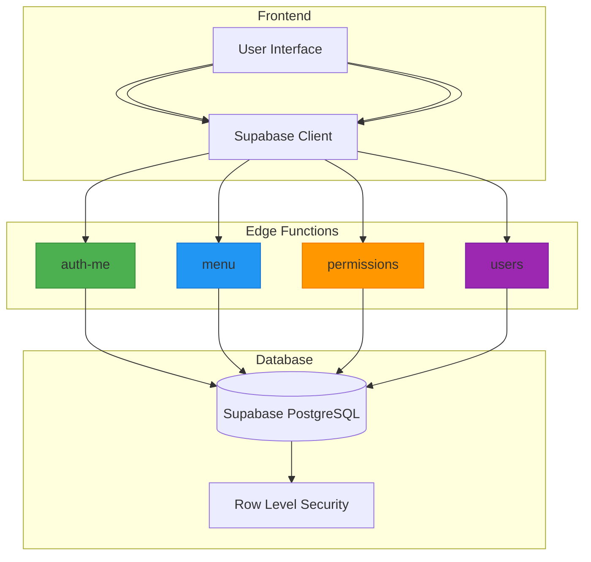
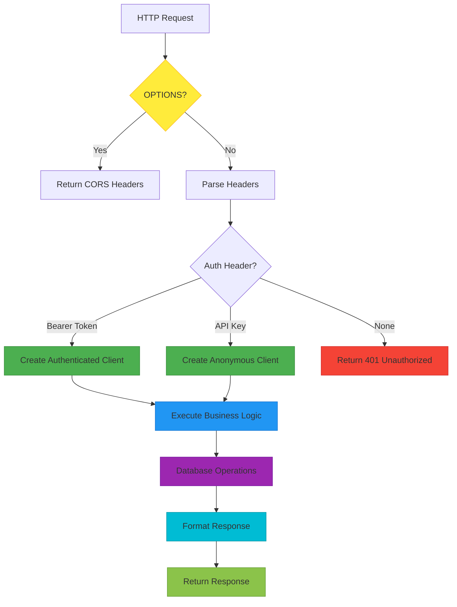
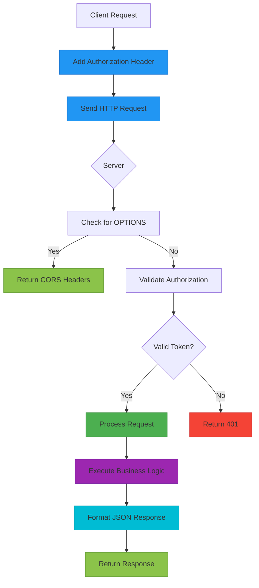
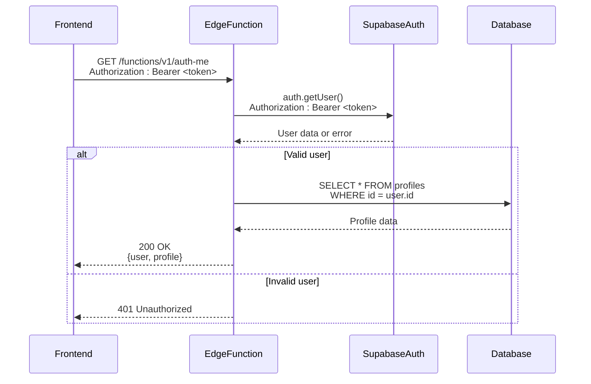
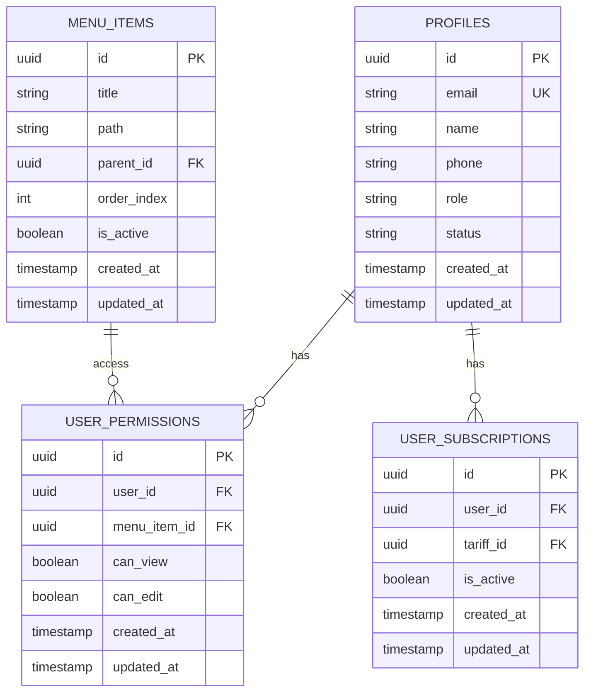
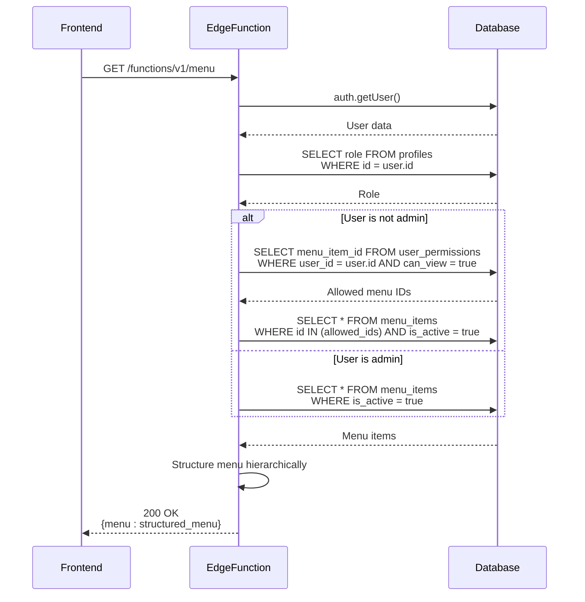
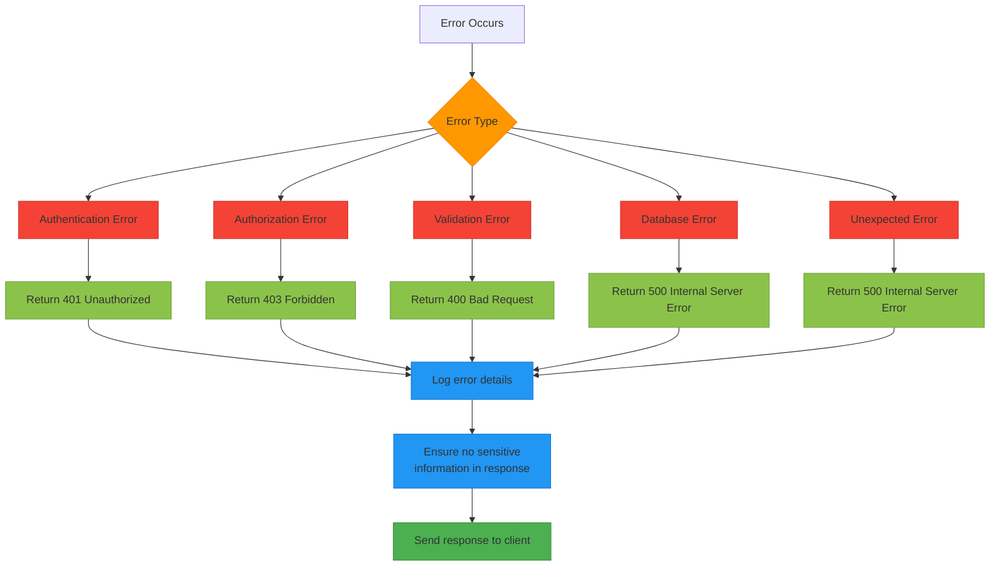
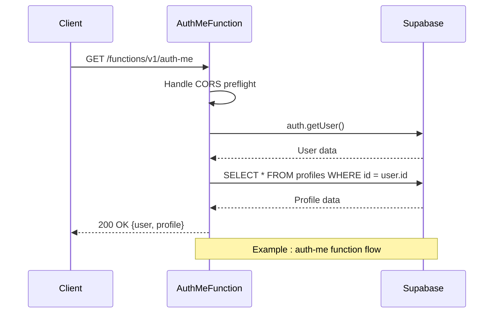

# Backend Architecture

<cite>
**Referenced Files in This Document**   
- [auth-me/index.ts](file://supabase/functions/auth-me/index.ts)
- [menu/index.ts](file://supabase/functions/menu/index.ts)
- [permissions/index.ts](file://supabase/functions/permissions/index.ts)
- [users/index.ts](file://supabase/functions/users/index.ts)
- [config.toml](file://supabase/config.toml)
- [user-service.ts](file://src/lib/user-service.ts)
- [session-validation.ts](file://src/lib/session-validation.ts)
- [rls-monitor.ts](file://src/lib/rls-monitor.ts)
</cite>

## Table of Contents
1. [Introduction](#introduction)
2. [System Context](#system-context)
3. [Edge Functions Architecture](#edge-functions-architecture)
4. [API Design Patterns](#api-design-patterns)
5. [Authentication and Authorization](#authentication-and-authorization)
6. [Database Integration](#database-integration)
7. [Data Flow Analysis](#data-flow-analysis)
8. [Security Considerations](#security-considerations)
9. [Error Handling](#error-handling)
10. [Code Examples](#code-examples)
11. [Conclusion](#conclusion)

## Introduction

The lovable-rise application implements a serverless backend architecture using Supabase Edge Functions with Deno runtime. This architecture provides a scalable, secure, and maintainable solution for handling authentication, user management, menu operations, and permission control. The system leverages Supabase's PostgreSQL database with Row Level Security (RLS) policies to ensure data isolation and security at the database level.

The backend consists of multiple Edge Functions that serve as API endpoints for various operations. These functions are designed to handle CORS, authentication via Bearer tokens, and proper error handling. The architecture follows a microservices-like pattern where each function handles a specific domain of functionality, promoting separation of concerns and easier maintenance.

This document provides a comprehensive overview of the backend architecture, detailing the design patterns, security mechanisms, and integration points between the frontend, Edge Functions, and database.

## System Context

The lovable-rise application follows a three-tier architecture consisting of frontend, Edge Functions, and database components. The frontend communicates with serverless Edge Functions via HTTP requests, which in turn interact with the Supabase PostgreSQL database. This architecture enables a clean separation of concerns, where the frontend handles user interface and presentation logic, Edge Functions manage business logic and API operations, and the database ensures data persistence and security.

**Diagram sources**
- [auth-me/index.ts](file://supabase/functions/auth-me/index.ts)
- [menu/index.ts](file://supabase/functions/menu/index.ts)
- [permissions/index.ts](file://supabase/functions/permissions/index.ts)
- [users/index.ts](file://supabase/functions/users/index.ts)

**Section sources**
- [auth-me/index.ts](file://supabase/functions/auth-me/index.ts)
- [menu/index.ts](file://supabase/functions/menu/index.ts)
- [permissions/index.ts](file://supabase/functions/permissions/index.ts)
- [users/index.ts](file://supabase/functions/users/index.ts)

## Edge Functions Architecture

The lovable-rise application utilizes Supabase Edge Functions to implement serverless API endpoints for various operations. These functions are written in TypeScript and run in the Deno runtime environment, providing a modern, secure, and efficient execution environment. The Edge Functions are organized by domain, with separate functions for authentication, menu management, permissions, and user operations.

Each Edge Function follows a consistent pattern for handling HTTP requests, including CORS preflight checks, authentication validation, and proper error handling. The functions are configured in the `supabase/config.toml` file to verify JWT tokens, ensuring that only authenticated requests can access protected endpoints.

The Edge Functions architecture promotes separation of concerns by isolating different domains of functionality into independent functions. This approach enables independent development, testing, and deployment of each function, reducing coupling and improving maintainability. The functions communicate with the Supabase PostgreSQL database using the Supabase client library, leveraging Row Level Security policies for data access control.

**Diagram sources**
- [auth-me/index.ts](file://supabase/functions/auth-me/index.ts)
- [menu/index.ts](file://supabase/functions/menu/index.ts)
- [permissions/index.ts](file://supabase/functions/permissions/index.ts)
- [users/index.ts](file://supabase/functions/users/index.ts)

**Section sources**
- [auth-me/index.ts](file://supabase/functions/auth-me/index.ts)
- [menu/index.ts](file://supabase/functions/menu/index.ts)
- [permissions/index.ts](file://supabase/functions/permissions/index.ts)
- [users/index.ts](file://supabase/functions/users/index.ts)

## API Design Patterns

The lovable-rise application implements consistent API design patterns across all Edge Functions to ensure predictability and ease of use. These patterns include standardized error handling, response formatting, and authentication mechanisms. The API endpoints follow RESTful principles where appropriate, using HTTP methods to indicate the type of operation being performed.

All Edge Functions handle CORS (Cross-Origin Resource Sharing) by including appropriate headers in responses and handling OPTIONS preflight requests. The `corsHeaders` object is consistently defined across functions to ensure uniform CORS configuration. This enables the frontend to make requests from different origins without encountering browser security restrictions.

Authentication is implemented using Bearer tokens, with the Authorization header containing the JWT token obtained during user login. The functions validate these tokens and use them to establish the user's identity for database operations. For administrative operations, additional role-based authorization is enforced to ensure that only users with the appropriate permissions can perform sensitive actions.

**Diagram sources**
- [auth-me/index.ts](file://supabase/functions/auth-me/index.ts)
- [menu/index.ts](file://supabase/functions/menu/index.ts)
- [permissions/index.ts](file://supabase/functions/permissions/index.ts)
- [users/index.ts](file://supabase/functions/users/index.ts)

**Section sources**
- [auth-me/index.ts](file://supabase/functions/auth-me/index.ts)
- [menu/index.ts](file://supabase/functions/menu/index.ts)
- [permissions/index.ts](file://supabase/functions/permissions/index.ts)
- [users/index.ts](file://supabase/functions/users/index.ts)

## Authentication and Authorization

The lovable-rise application implements a robust authentication and authorization system using Supabase's built-in authentication features and custom Edge Functions. Authentication is handled through JWT (JSON Web Tokens) that are included in the Authorization header as Bearer tokens. The `auth-me` Edge Function serves as the primary endpoint for retrieving authenticated user information, validating the provided token and returning the user's profile data.

Authorization is implemented through a combination of JWT validation and role-based access control. Each user has a role (admin, manager, or user) stored in their profile, which determines their permissions within the application. Administrative operations, such as creating or updating users, require the user to have the admin role. This is enforced in the Edge Functions by checking the user's role after authenticating their token.

The system also includes comprehensive session validation utilities in the `session-validation.ts` file, which ensure that access tokens are properly handled and that Row Level Security (RLS) policies function correctly. These utilities validate session expiration, handle token refresh, and provide debugging information for authentication-related issues.

**Diagram sources**
- [auth-me/index.ts](file://supabase/functions/auth-me/index.ts)
- [session-validation.ts](file://src/lib/session-validation.ts)

**Section sources**
- [auth-me/index.ts](file://supabase/functions/auth-me/index.ts)
- [session-validation.ts](file://src/lib/session-validation.ts)

## Database Integration

The lovable-rise application integrates with Supabase PostgreSQL database using Row Level Security (RLS) policies to enforce data access controls at the database level. This approach ensures that users can only access data they are authorized to see, even if the application logic is bypassed. The Edge Functions use the Supabase client library to interact with the database, leveraging the authenticated user's context for RLS policy evaluation.

The database schema includes tables for user profiles, menu items, user permissions, and subscriptions. RLS policies are defined on these tables to restrict access based on the user's role and permissions. For example, the `menu_items` table has policies that allow users to view only the menu items they have permission to access, while administrators can view all menu items.

The integration also includes optimized queries for performance, such as using a single query to fetch user data with their subscription information rather than making multiple queries. This reduces database load and improves response times. The Edge Functions handle database errors gracefully, providing meaningful error messages to the frontend while logging detailed information for debugging.

**Diagram sources**
- [users/index.ts](file://supabase/functions/users/index.ts)
- [menu/index.ts](file://supabase/functions/menu/index.ts)
- [permissions/index.ts](file://supabase/functions/permissions/index.ts)

**Section sources**
- [users/index.ts](file://supabase/functions/users/index.ts)
- [menu/index.ts](file://supabase/functions/menu/index.ts)
- [permissions/index.ts](file://supabase/functions/permissions/index.ts)

## Data Flow Analysis

The data flow in the lovable-rise application follows a consistent pattern from frontend API calls through Edge Functions to database operations. When a user interacts with the frontend, the application makes HTTP requests to the appropriate Edge Function endpoints. These requests include authentication information in the form of Bearer tokens, which are used to identify and authorize the user.

Upon receiving a request, the Edge Function first handles CORS preflight checks and then validates the authentication token. Once authenticated, the function executes the requested business logic, which typically involves one or more database operations. The results are then formatted into a JSON response and returned to the frontend.

For example, when retrieving a user's menu, the `menu` Edge Function first authenticates the user, then checks their role. If the user is not an administrator, the function queries the `user_permissions` table to determine which menu items the user can access. It then retrieves the appropriate menu items from the `menu_items` table, structures them hierarchically, and returns the result. This flow ensures that users only see menu items they are authorized to access.

**Diagram sources**
- [menu/index.ts](file://supabase/functions/menu/index.ts)
- [permissions/index.ts](file://supabase/functions/permissions/index.ts)

**Section sources**
- [menu/index.ts](file://supabase/functions/menu/index.ts)
- [permissions/index.ts](file://supabase/functions/permissions/index.ts)

## Security Considerations

The lovable-rise application implements multiple security layers to protect user data and prevent unauthorized access. The primary security mechanism is Row Level Security (RLS) in the Supabase PostgreSQL database, which ensures that users can only access data they are authorized to see. This security is enforced at the database level, providing protection even if the application logic is compromised.

Authentication is implemented using JWT tokens passed in the Authorization header as Bearer tokens. The Edge Functions validate these tokens and use them to establish the user's identity for database operations. The system avoids using API keys for authenticated operations, preventing potential security issues that could arise from mixing authentication methods.

Role-based access control is implemented to restrict sensitive operations to authorized users. For example, only users with the admin role can create or delete users, update menu items, or modify permissions. This is enforced in the Edge Functions by checking the user's role after authentication.

The application also includes comprehensive error handling that provides meaningful error messages to users while avoiding the disclosure of sensitive information. Detailed error logging is implemented for debugging purposes, but sensitive information is not included in logs.

```mermaid
graph TD
A[Security Layers] --> B[CORS Configuration]
A --> C[Authentication]
A --> D[Authorization]
A --> E[Row Level Security]
A --> F[Input Validation]
A --> G[Error Handling]
B --> H[Allow specific headers<br/>authorization, apikey, content-type]
B --> I[Allow all origins<br/>Access-Control-Allow-Origin: *]
C --> J[Bearer Token Authentication]
C --> K[JWT Validation]
C --> L[Token Expiry Check]
D --> M[Role-Based Access Control]
D --> N[Admin Role Required<br/>for sensitive operations]
E --> O[Database-Level Security]
E --> P[Users access only<br/>their own data]
E --> Q[Permissions-based<br/>menu access]
F --> R[Validate input data<br/>required fields, formats]
F --> S[Sanitize database queries]
G --> T[Meaningful error messages]
G --> U[No sensitive information<br/>in error responses]
G --> V[Detailed logging<br/>for debugging]
style A fill:#FF9800,stroke:#F57C00
style B fill:#2196F3,stroke:#1976D2
style C fill:#2196F3,stroke:#1976D2
style D fill:#2196F3,stroke:#1976D2
style E fill:#2196F3,stroke:#1976D2
style F fill:#2196F3,stroke:#1976D2
style G fill:#2196F3,stroke:#1976D2
```

**Diagram sources**
- [auth-me/index.ts](file://supabase/functions/auth-me/index.ts)
- [menu/index.ts](file://supabase/functions/menu/index.ts)
- [permissions/index.ts](file://supabase/functions/permissions/index.ts)
- [users/index.ts](file://supabase/functions/users/index.ts)
- [session-validation.ts](file://src/lib/session-validation.ts)

**Section sources**
- [auth-me/index.ts](file://supabase/functions/auth-me/index.ts)
- [menu/index.ts](file://supabase/functions/menu/index.ts)
- [permissions/index.ts](file://supabase/functions/permissions/index.ts)
- [users/index.ts](file://supabase/functions/users/index.ts)
- [session-validation.ts](file://src/lib/session-validation.ts)

## Error Handling

The lovable-rise application implements comprehensive error handling across all Edge Functions to ensure robust operation and meaningful feedback to users. Each function includes try-catch blocks to handle unexpected errors, with detailed logging for debugging purposes. The error responses follow a consistent format, including an error message and appropriate HTTP status codes.

For authentication-related errors, the functions return 401 Unauthorized status codes when authentication is missing or invalid. Authorization errors, such as when a user attempts to perform an operation they don't have permission for, result in 403 Forbidden responses. Input validation errors are handled with 400 Bad Request responses, providing specific information about what validation failed.

The application also includes specialized error handling for database operations, translating database error messages into user-friendly responses while logging the full details for debugging. For example, when creating a user with an email that already exists, the function returns a 409 Conflict response with a clear message, rather than exposing the underlying database error.

**Diagram sources**
- [auth-me/index.ts](file://supabase/functions/auth-me/index.ts)
- [menu/index.ts](file://supabase/functions/menu/index.ts)
- [permissions/index.ts](file://supabase/functions/permissions/index.ts)
- [users/index.ts](file://supabase/functions/users/index.ts)

**Section sources**
- [auth-me/index.ts](file://supabase/functions/auth-me/index.ts)
- [menu/index.ts](file://supabase/functions/menu/index.ts)
- [permissions/index.ts](file://supabase/functions/permissions/index.ts)
- [users/index.ts](file://supabase/functions/users/index.ts)

## Code Examples

The lovable-rise application includes several practical examples of Edge Function implementations that demonstrate the architecture and design patterns. One key example is the `auth-me` function, which handles authentication and returns user profile information. This function illustrates the standard pattern of handling CORS, validating authentication, and querying the database.

Another example is the `users` function, which implements CRUD operations for user management. This function demonstrates role-based authorization, where only users with the admin role can create, update, or delete users. It also shows how to handle complex operations like creating a user, which involves both authentication and profile creation.

The `menu` function provides an example of data structuring, where flat menu items from the database are organized into a hierarchical structure with parent-child relationships. This function also demonstrates permission-based data access, where non-admin users only see menu items they have permission to access.

**Diagram sources**
- [auth-me/index.ts](file://supabase/functions/auth-me/index.ts)

**Section sources**
- [auth-me/index.ts](file://supabase/functions/auth-me/index.ts)
- [users/index.ts](file://supabase/functions/users/index.ts)
- [menu/index.ts](file://supabase/functions/menu/index.ts)

## Conclusion

The lovable-rise application implements a robust and secure backend architecture using Supabase Edge Functions with Deno runtime. This serverless architecture provides scalability, maintainability, and security through the use of isolated functions for different domains of functionality. The integration with Supabase PostgreSQL database leverages Row Level Security policies to enforce data access controls at the database level, ensuring that users can only access data they are authorized to see.

The API design follows consistent patterns for authentication, error handling, and response formatting, making it predictable and easy to use. Authentication is implemented using Bearer tokens, with role-based authorization restricting sensitive operations to authorized users. The system includes comprehensive error handling that provides meaningful feedback to users while protecting sensitive information.

The architecture demonstrates best practices for serverless applications, including separation of concerns, proper security measures, and efficient data access patterns. The use of Edge Functions allows for independent development and deployment of different components, while the consistent design patterns ensure a cohesive and maintainable codebase.