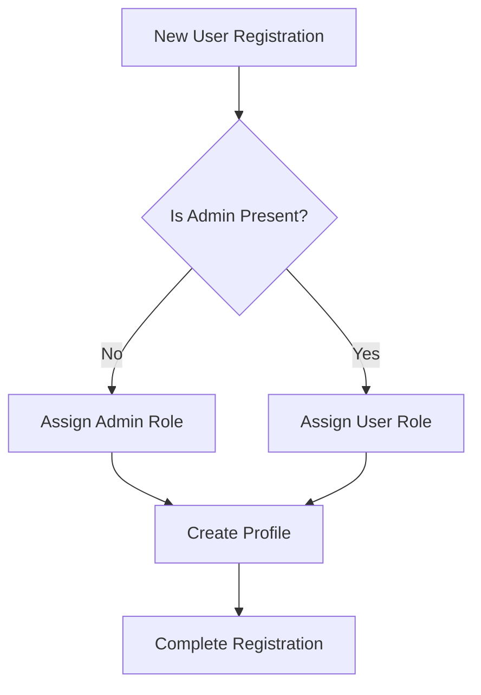
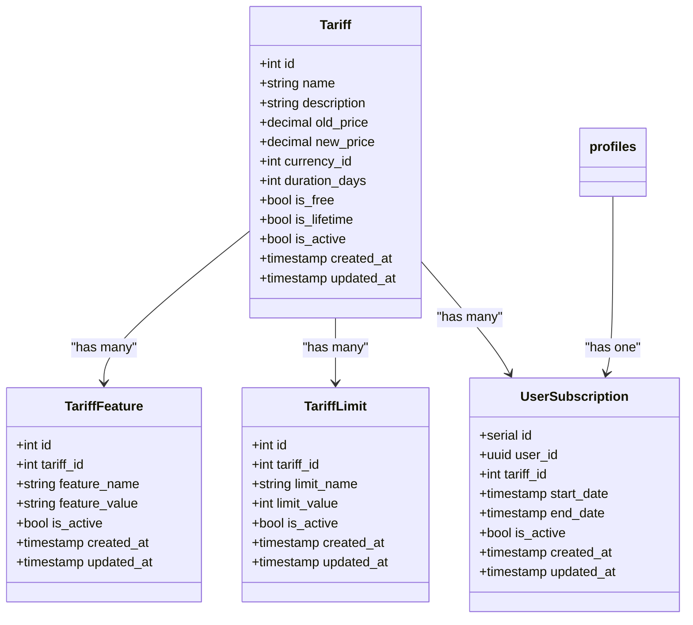
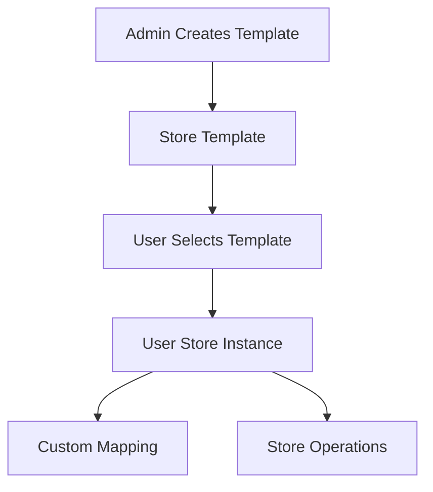

# Database Schema

<cite>
**Referenced Files in This Document**   
- [20250117000000_create_store_templates_tables.sql](file://supabase/migrations/20250117000000_create_store_templates_tables.sql)
- [20250121000000_create_user_subscriptions.sql](file://supabase/migrations/20250121000000_create_user_subscriptions.sql)
- [20250902092743_a3f4b8e8-7daa-4d54-afb0-9f5e846ac558.sql](file://supabase/migrations/20250902092743_a3f4b8e8-7daa-4d54-afb0-9f5e846ac558.sql)
- [20250902092802_6a5ebe13-e194-4e9a-8704-744c7848dba0.sql](file://supabase/migrations/20250902092802_6a5ebe13-e194-4e9a-8704-744c7848dba0.sql)
- [20250902093000_final_role_assignment_fix.sql](file://supabase/migrations/20250902093000_final_role_assignment_fix.sql)
- [tariff-service.ts](file://src/lib/tariff-service.ts)
- [admin-service.ts](file://src/lib/admin-service.ts)
</cite>

## Table of Contents
1. [Introduction](#introduction)
2. [Core Entity Relationships](#core-entity-relationships)
3. [User Management Schema](#user-management-schema)
4. [Tariff and Subscription Model](#tariff-and-subscription-model)
5. [Store Templates and Shops](#store-templates-and-shops)
6. [Row Level Security Implementation](#row-level-security-implementation)
7. [Critical Business Rules](#critical-business-rules)
8. [Indexing and Performance Optimization](#indexing-and-performance-optimization)
9. [Data Lifecycle Management](#data-lifecycle-management)
10. [Sample Queries](#sample-queries)
11. [Conclusion](#conclusion)

## Introduction

The Supabase PostgreSQL database schema for lovable-rise implements a multi-tenant SaaS architecture with robust role-based access control, subscription management, and tenant isolation. The schema centers around users, roles, tariffs, subscriptions, shops, and suppliers, with comprehensive Row Level Security (RLS) policies ensuring data isolation between tenants. This documentation details the entity relationships, field definitions, constraints, and security mechanisms that form the foundation of the application's data model.

## Core Entity Relationships

```mermaid
erDiagram
users ||--o{ profiles : "1:1"
profiles ||--o{ user_subscriptions : "1:N"
profiles ||--o{ user_stores : "1:N"
tariffs ||--o{ user_subscriptions : "1:N"
store_templates ||--o{ user_stores : "1:N"
tariffs ||--o{ tariff_features : "1:N"
tariffs ||--o{ tariff_limits : "1:N"
users {
uuid id PK
text email
jsonb raw_user_meta_data
timestamptz created_at
}
profiles {
uuid id PK FK
text email UK
text name
user_role role
user_status status
timestamptz created_at
timestamptz updated_at
}
user_subscriptions {
serial id PK
uuid user_id FK
int tariff_id FK
timestamp start_date
timestamp end_date
bool is_active
timestamp created_at
timestamp updated_at
}
tariffs {
int id PK
text name
text description
numeric old_price
numeric new_price
int currency_id
int duration_days
bool is_free
bool is_lifetime
bool is_active
timestamp created_at
timestamp updated_at
}
tariff_features {
int id PK
int tariff_id FK
text feature_name
text feature_value
bool is_active
timestamp created_at
timestamp updated_at
}
tariff_limits {
int id PK
int tariff_id FK
text limit_name
int limit_value
bool is_active
timestamp created_at
timestamp updated_at
}
store_templates {
uuid id PK
text name
text description
text marketplace
jsonb xml_structure
jsonb mapping_rules
bool is_active
timestamptz created_at
timestamptz updated_at
}
user_stores {
uuid id PK
uuid user_id FK
uuid template_id FK
text store_name
jsonb custom_mapping
bool is_active
timestamptz created_at
timestamptz updated_at
}
```

**Diagram sources**
- [20250117000000_create_store_templates_tables.sql](file://supabase/migrations/20250117000000_create_store_templates_tables.sql)
- [20250121000000_create_user_subscriptions.sql](file://supabase/migrations/20250121000000_create_user_subscriptions.sql)
- [20250902092743_a3f4b8e8-7daa-4d54-afb0-9f5e846ac558.sql](file://supabase/migrations/20250902092743_a3f4b8e8-7daa-4d54-afb0-9f5e846ac558.sql)

**Section sources**
- [20250117000000_create_store_templates_tables.sql](file://supabase/migrations/20250117000000_create_store_templates_tables.sql)
- [20250121000000_create_user_subscriptions.sql](file://supabase/migrations/20250121000000_create_user_subscriptions.sql)
- [20250902092743_a3f4b8e8-7daa-4d54-afb0-9f5e846ac558.sql](file://supabase/migrations/20250902092743_a3f4b8e8-7daa-4d54-afb0-9f5e846ac558.sql)

## User Management Schema

The user management system implements a robust role-based access control model with automatic profile creation and role assignment. The schema uses PostgreSQL enums to enforce valid role and status values, ensuring data integrity at the database level.

### Profiles Table Structure

The `profiles` table extends Supabase authentication with application-specific user data:

- **id**: UUID primary key, references `auth.users(id)` with cascade delete
- **email**: Unique text field for user identification
- **name**: User's display name
- **role**: `user_role` enum with values 'admin', 'manager', 'user'
- **status**: `user_status` enum with values 'active', 'inactive'
- **created_at**: Timestamp of profile creation
- **updated_at**: Timestamp automatically updated on record modification

### Role Assignment Logic

The system implements a sophisticated role assignment mechanism through the `handle_new_user()` trigger function:

1. The first registered user automatically receives the 'admin' role
2. All subsequent users are assigned the 'user' role by default
3. Role assignment is enforced at the database level through trigger logic
4. The migration history shows multiple fixes to ensure correct role assignment



**Diagram sources**
- [20250902092743_a3f4b8e8-7daa-4d54-afb0-9f5e846ac558.sql](file://supabase/migrations/20250902092743_a3f4b8e8-7daa-4d54-afb0-9f5e846ac558.sql)
- [20250902093000_final_role_assignment_fix.sql](file://supabase/migrations/20250902093000_final_role_assignment_fix.sql)

**Section sources**
- [20250902092743_a3f4b8e8-7daa-4d54-afb0-9f5e846ac558.sql](file://supabase/migrations/20250902092743_a3f4b8e8-7daa-4d54-afb0-9f5e846ac558.sql)
- [20250902092802_6a5ebe13-e194-4e9a-8704-744c7848dba0.sql](file://supabase/migrations/20250902092802_6a5ebe13-e194-4e9a-8704-744c7848dba0.sql)
- [20250902093000_final_role_assignment_fix.sql](file://supabase/migrations/20250902093000_final_role_assignment_fix.sql)

## Tariff and Subscription Model

The tariff and subscription system enables flexible pricing plans with feature-based differentiation and subscription tracking.

### Tariffs Table

The `tariffs` table defines available pricing plans:

- **id**: Integer primary key
- **name**: Plan name (e.g., "Basic", "Pro")
- **description**: Plan description
- **old_price/new_price**: Pricing information
- **currency_id**: Reference to currency table
- **duration_days**: Plan duration in days
- **is_free**: Boolean indicating free plan
- **is_lifetime**: Boolean for lifetime plans
- **is_active**: Plan availability status
- **created_at/updated_at**: Timestamps for audit

### Tariff Features and Limits

Tariffs can have associated features and limits stored in separate tables:

- **tariff_features**: Key-value pairs defining plan features
- **tariff_limits**: Numerical limits for plan capabilities
- Both tables include `is_active` flags for soft deletion
- Foreign key constraints ensure referential integrity

### User Subscriptions

The `user_subscriptions` table tracks user plan assignments:

- **user_id**: References user profile
- **tariff_id**: References subscribed plan
- **start_date/end_date**: Subscription period
- **is_active**: Current subscription status
- **created_at/updated_at**: Management timestamps



**Diagram sources**
- [20250121000000_create_user_subscriptions.sql](file://supabase/migrations/20250121000000_create_user_subscriptions.sql)
- [tariff-service.ts](file://src/lib/tariff-service.ts)

**Section sources**
- [20250121000000_create_user_subscriptions.sql](file://supabase/migrations/20250121000000_create_user_subscriptions.sql)
- [tariff-service.ts](file://src/lib/tariff-service.ts)
- [admin-service.ts](file://src/lib/admin-service.ts)

## Store Templates and Shops

The store template system enables users to create and manage e-commerce stores based on predefined templates.

### Store Templates

The `store_templates` table contains admin-defined templates:

- **id**: UUID primary key
- **name/description**: Template metadata
- **marketplace**: Target marketplace (e.g., Amazon, eBay)
- **xml_structure**: JSONB structure defining XML format
- **mapping_rules**: JSONB rules for data mapping
- **is_active**: Template availability
- **created_at/updated_at**: Management timestamps

### User Stores

The `user_stores` table tracks user instances of templates:

- **id**: UUID primary key
- **user_id**: Owner reference
- **template_id**: Source template reference
- **store_name**: User-defined store name
- **custom_mapping**: User-specific mapping overrides
- **is_active**: Store status
- **created_at/updated_at**: Management timestamps

Both tables include RLS policies for tenant isolation and automatic timestamp updates through triggers.



**Diagram sources**
- [20250117000000_create_store_templates_tables.sql](file://supabase/migrations/20250117000000_create_store_templates_tables.sql)

**Section sources**
- [20250117000000_create_store_templates_tables.sql](file://supabase/migrations/20250117000000_create_store_templates_tables.sql)

## Row Level Security Implementation

The database implements comprehensive Row Level Security (RLS) policies to ensure tenant isolation and role-based access control.

### Authentication Integration

All RLS policies integrate with Supabase authentication using `auth.uid()` to identify the current user, ensuring that data access is always contextual to the authenticated session.

### Profiles Table Policies

- **Users can view their own profile**: Policy using `auth.uid() = id`
- **Admins can view all profiles**: Policy using role check
- **Users can update their own profile**: Policy using `auth.uid() = id`
- **Admins can update all profiles**: Policy using role check

### User Subscriptions Policies

- **Users can view their own subscriptions**: Policy using `user_id = auth.uid()`
- **Admins can view all subscriptions**: Policy using role check
- **Admins can manage all subscriptions**: Policy using role check

### Store Templates Policies

- **Anyone can view active templates**: Policy using `is_active = true`
- **Service role can manage templates**: Policies allowing full CRUD operations

### User Stores Policies

- **Users can view their own stores**: Policy using `user_id = auth.uid()`
- **Users can manage their own stores**: Policies for insert, update, delete

All tables include appropriate GRANT statements to authenticated roles, enabling the RLS policies to function correctly.

**Section sources**
- [20250117000000_create_store_templates_tables.sql](file://supabase/migrations/20250117000000_create_store_templates_tables.sql)
- [20250121000000_create_user_subscriptions.sql](file://supabase/migrations/20250121000000_create_user_subscriptions.sql)
- [20250902092743_a3f4b8e8-7daa-4d54-afb0-9f5e846ac558.sql](file://supabase/migrations/20250902092743_a3f4b8e8-7daa-4d54-afb0-9f5e846ac558.sql)

## Critical Business Rules

The database schema enforces several critical business rules at the database level to maintain data integrity.

### User Role Validation

The system uses PostgreSQL enums (`user_role` and `user_status`) to ensure only valid role and status values are stored. The migration history shows multiple iterations to ensure the 'user' role is properly added to the enum, addressing a critical bug where new users were incorrectly assigned the 'manager' role.

### Subscription Status Constraints

The `user_subscriptions` table includes an `is_active` boolean field that works in conjunction with `start_date` and `end_date` to determine subscription status. Business logic must ensure consistency between these fields, though no explicit constraints are defined in the schema.

### Referential Integrity

Foreign key constraints enforce referential integrity:
- `user_subscriptions.user_id` references `profiles.id` with cascade delete
- `user_subscriptions.tariff_id` references `tariffs.id` with cascade delete
- `user_stores.user_id` references `profiles.id` with cascade delete
- `user_stores.template_id` references `store_templates.id` with set null

### Data Type Constraints

The schema uses appropriate data types:
- UUIDs for primary keys in application tables
- SERIAL for auto-incrementing IDs
- TIMESTAMP WITHOUT TIME ZONE for subscription dates
- TIMESTAMPTZ for creation/update timestamps
- JSONB for flexible structure storage

**Section sources**
- [20250902092743_a3f4b8e8-7daa-4d54-afb0-9f5e846ac558.sql](file://supabase/migrations/20250902092743_a3f4b8e8-7daa-4d54-afb0-9f5e846ac558.sql)
- [20250902093000_final_role_assignment_fix.sql](file://supabase/migrations/20250902093000_final_role_assignment_fix.sql)
- [20250121000000_create_user_subscriptions.sql](file://supabase/migrations/20250121000000_create_user_subscriptions.sql)

## Indexing and Performance Optimization

The schema includes strategic indexing to optimize query performance on frequently accessed fields.

### Profiles Table Indexes

- **idx_profiles_role**: Index on `role` column for role-based queries
- **idx_profiles_status**: Index on `status` column for status filtering

### User Subscriptions Indexes

- **idx_user_subscriptions_user_id**: Index on `user_id` for user-specific queries
- **idx_user_subscriptions_tariff_id**: Index on `tariff_id` for plan analytics
- **idx_user_subscriptions_is_active**: Index on `is_active` for status filtering
- **idx_user_subscriptions_end_date**: Index on `end_date` for expiration tracking

### Store Templates Indexes

- **idx_store_templates_active**: Index on `is_active` for template availability
- **idx_store_templates_marketplace**: Index on `marketplace` for marketplace filtering

### User Stores Indexes

- **idx_user_stores_user_id**: Index on `user_id` for user-specific queries
- **idx_user_stores_template_id**: Index on `template_id` for template usage analytics

These indexes support efficient querying patterns while balancing the overhead of index maintenance on write operations.

**Section sources**
- [20250117000000_create_store_templates_tables.sql](file://supabase/migrations/20250117000000_create_store_templates_tables.sql)
- [20250121000000_create_user_subscriptions.sql](file://supabase/migrations/20250121000000_create_user_subscriptions.sql)

## Data Lifecycle Management

The schema implements comprehensive data lifecycle management through timestamps, soft deletion, and automated updates.

### Creation and Update Tracking

All application tables include:
- **created_at**: Timestamp automatically set on record creation
- **updated_at**: Timestamp automatically updated on record modification

The `update_updated_at_column()` trigger function ensures `updated_at` is always current, providing audit trail capabilities.

### Soft Delete Patterns

The schema uses `is_active` boolean flags instead of physical deletion:
- `profiles.status` enum for user status
- `tariffs.is_active` for plan availability
- `tariff_features.is_active` for feature availability
- `tariff_limits.is_active` for limit availability
- `store_templates.is_active` for template availability
- `user_stores.is_active` for store status

This approach preserves data integrity and enables restoration of "deleted" records.

### Trigger Management

Database triggers handle automated operations:
- `on_auth_user_created`: Creates profile when user registers
- `update_profiles_updated_at`: Updates timestamp on profile modification
- `update_store_templates_updated_at`: Updates timestamp on template modification
- `update_user_stores_updated_at`: Updates timestamp on store modification
- `update_user_subscriptions_updated_at`: Updates timestamp on subscription modification

These triggers ensure consistent behavior without relying on application logic.

**Section sources**
- [20250117000000_create_store_templates_tables.sql](file://supabase/migrations/20250117000000_create_store_templates_tables.sql)
- [20250121000000_create_user_subscriptions.sql](file://supabase/migrations/20250121000000_create_user_subscriptions.sql)
- [20250902092743_a3f4b8e8-7daa-4d54-afb0-9f5e846ac558.sql](file://supabase/migrations/20250902092743_a3f4b8e8-7daa-4d54-afb0-9f5e846ac558.sql)

## Sample Queries

The following sample queries demonstrate common access patterns and joins between core entities.

### Get User with Subscription and Tariff Details

```sql
SELECT 
  p.id,
  p.email,
  p.name,
  p.role,
  us.start_date,
  us.end_date,
  us.is_active as subscription_active,
  t.name as tariff_name,
  t.new_price,
  t.duration_days
FROM profiles p
LEFT JOIN user_subscriptions us ON p.id = us.user_id AND us.is_active = true
LEFT JOIN tariffs t ON us.tariff_id = t.id
WHERE p.id = auth.uid();
```

### Get All Active Tariffs with Features and Limits

```sql
SELECT 
  t.id,
  t.name,
  t.description,
  t.new_price,
  t.duration_days,
  json_agg(tf.feature_name || ': ' || tf.feature_value) as features,
  json_agg(tl.limit_name || ': ' || tl.limit_value) as limits
FROM tariffs t
LEFT JOIN tariff_features tf ON t.id = tf.tariff_id AND tf.is_active = true
LEFT JOIN tariff_limits tl ON t.id = tl.tariff_id AND tl.is_active = true
WHERE t.is_active = true
GROUP BY t.id, t.name, t.description, t.new_price, t.duration_days
ORDER BY t.sort_order;
```

### Get User's Stores with Template Information

```sql
SELECT 
  us.id,
  us.store_name,
  us.is_active,
  st.name as template_name,
  st.marketplace,
  st.is_active as template_active
FROM user_stores us
JOIN store_templates st ON us.template_id = st.id
WHERE us.user_id = auth.uid()
ORDER BY us.store_name;
```

### Get Admin Dashboard Statistics

```sql
SELECT 
  (SELECT COUNT(*) FROM profiles) as total_users,
  (SELECT COUNT(*) FROM profiles WHERE role = 'admin') as admin_count,
  (SELECT COUNT(*) FROM profiles WHERE role = 'user') as user_count,
  (SELECT COUNT(*) FROM user_subscriptions WHERE is_active = true) as active_subscriptions,
  (SELECT COUNT(*) FROM user_stores) as total_stores,
  (SELECT COUNT(*) FROM store_templates WHERE is_active = true) as active_templates;
```

These queries illustrate the key relationships and access patterns in the database schema, leveraging the defined indexes and constraints for optimal performance.

**Section sources**
- [tariff-service.ts](file://src/lib/tariff-service.ts)
- [admin-service.ts](file://src/lib/admin-service.ts)

## Conclusion

The Supabase PostgreSQL database schema for lovable-rise implements a robust, secure, and scalable data model for a multi-tenant SaaS application. Key strengths include comprehensive Row Level Security for tenant isolation, well-defined entity relationships, and business rule enforcement at the database level. The schema supports flexible pricing models through the tariff and subscription system, while the store template architecture enables users to create and manage e-commerce stores. Strategic indexing and data lifecycle management ensure performance and data integrity. The migration history demonstrates a commitment to resolving issues and improving the schema over time, particularly in the critical area of user role assignment. This well-structured database provides a solid foundation for the application's functionality and future growth.