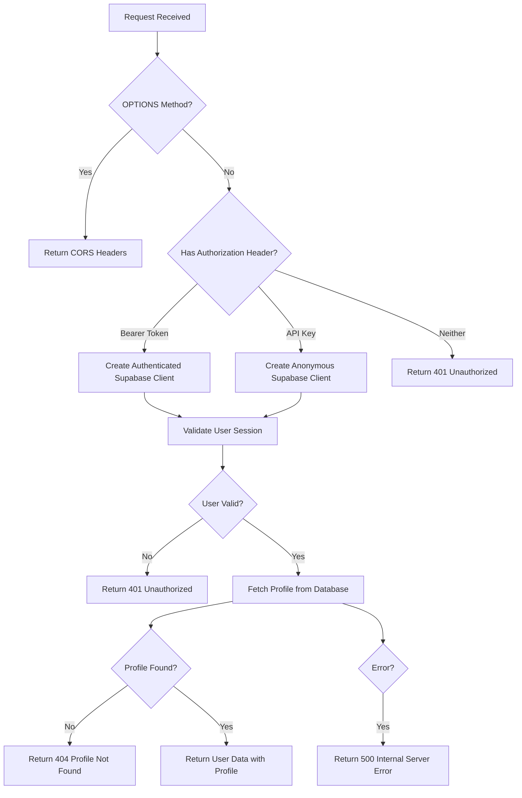
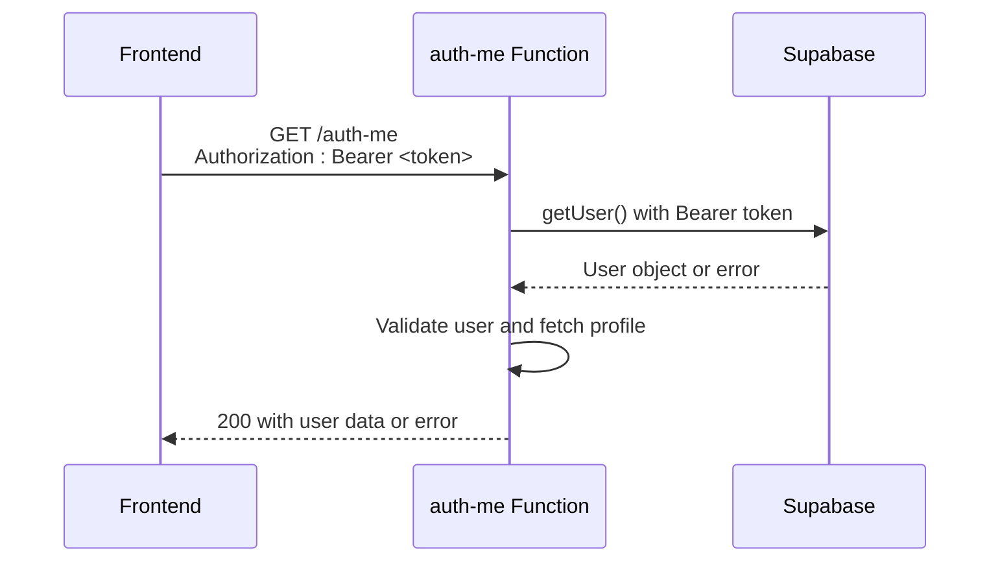
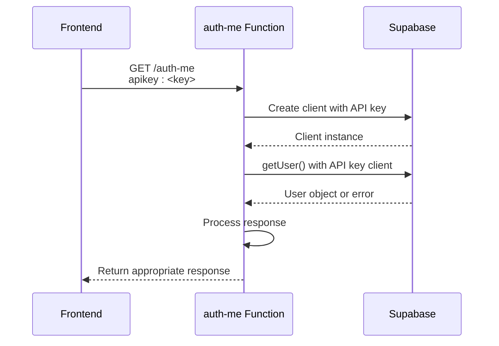
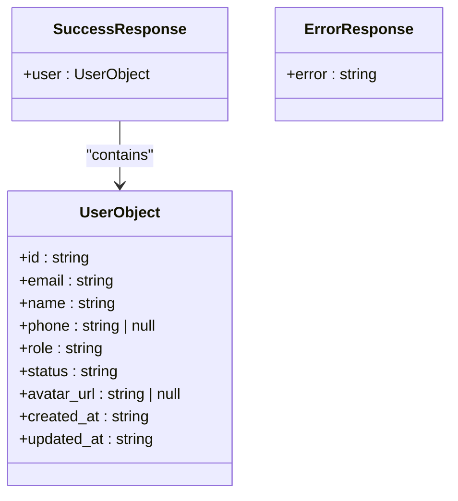
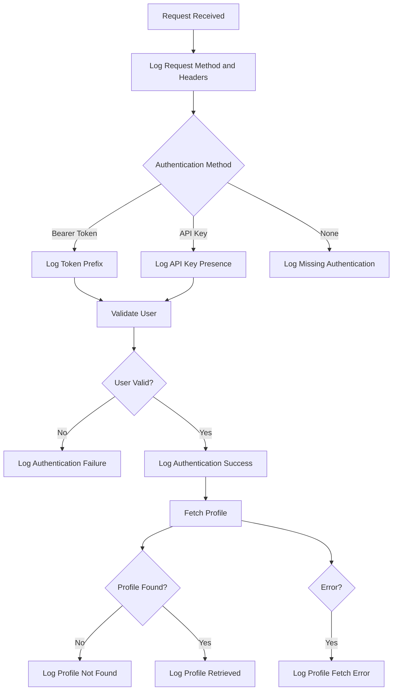

# Auth-Me Function

<cite>
**Referenced Files in This Document**   
- [index.ts](file://supabase/functions/auth-me/index.ts)
- [session-validation.ts](file://src/lib/session-validation.ts)
- [profile-service.ts](file://src/lib/profile-service.ts)
- [user-auth-service.ts](file://src/lib/user-auth-service.ts)
- [client.ts](file://src/integrations/supabase/client.ts)
</cite>

## Table of Contents
1. [Introduction](#introduction)
2. [Request Flow](#request-flow)
3. [Authentication Methods](#authentication-methods)
4. [Response Schemas](#response-schemas)
5. [Frontend Integration](#frontend-integration)
6. [Error Handling and Logging](#error-handling-and-logging)
7. [Security Considerations](#security-considerations)

## Introduction

The auth-me Edge Function in the lovable-rise application provides a secure endpoint for validating user sessions and retrieving authenticated user data with profile information. This API endpoint enables both authenticated users (via Bearer tokens) and anonymous access (via API keys) to validate authentication state and retrieve user profile data from the Supabase backend. The function handles CORS preflight requests, token extraction, Supabase authentication validation, profile retrieval from the database, and response formatting.

**Section sources**
- [index.ts](file://supabase/functions/auth-me/index.ts#L1-L130)

## Request Flow

The auth-me function processes requests through a well-defined sequence of operations that ensure proper authentication validation and data retrieval. The request flow begins with CORS preflight handling, followed by authentication method detection, user validation, profile retrieval, and response generation.



**Diagram sources**
- [index.ts](file://supabase/functions/auth-me/index.ts#L1-L130)

**Section sources**
- [index.ts](file://supabase/functions/auth-me/index.ts#L1-L130)

## Authentication Methods

The auth-me function implements a dual authentication approach that supports both authenticated users and anonymous access, following Supabase recommendations for flexible API access.

### Bearer Token Authentication

For authenticated requests, the function expects a Bearer token in the Authorization header. This method is used by logged-in users who have an active session. The token is passed directly to the Supabase client, which validates the user's authentication state and retrieves the user object.



**Diagram sources**
- [index.ts](file://supabase/functions/auth-me/index.ts#L25-L38)

### API Key Authentication

For anonymous access, the function accepts an API key in the request headers. This method allows unauthenticated clients to access the endpoint, typically for public functionality or when user authentication is not required. The API key is used to create a Supabase client with limited permissions.



**Diagram sources**
- [index.ts](file://supabase/functions/auth-me/index.ts#L39-L47)

**Section sources**
- [index.ts](file://supabase/functions/auth-me/index.ts#L25-L47)

## Response Schemas

The auth-me function returns standardized JSON responses with specific schemas for success and various error conditions. The response structure includes appropriate HTTP status codes and error messages.

### Success Response (200)

When authentication is successful and the user profile is found, the function returns a 200 OK response with the user data and profile information merged into a single object.

```json
{
  "user": {
    "id": "string",
    "email": "string",
    "name": "string",
    "phone": "string | null",
    "role": "admin | manager | user",
    "status": "active | inactive",
    "avatar_url": "string | null",
    "created_at": "string (ISO date)",
    "updated_at": "string (ISO date)"
  }
}
```

### Error Responses

The function returns specific error responses for different failure scenarios:

#### 401 Unauthorized
```json
{
  "error": "Unauthorized"
}
```

#### 404 Profile Not Found
```json
{
  "error": "Profile not found"
}
```

#### 500 Internal Server Error
```json
{
  "error": "Failed to fetch profile"
}
```

#### Missing Authentication
```json
{
  "error": "Missing authentication"
}
```



**Diagram sources**
- [index.ts](file://supabase/functions/auth-me/index.ts#L90-L120)

**Section sources**
- [index.ts](file://supabase/functions/auth-me/index.ts#L90-L120)

## Frontend Integration

Frontend components can integrate with the auth-me function using standard HTTP requests. The function's CORS configuration allows cross-origin requests from any domain, making it accessible to frontend applications.

### Request Headers

The following headers are required or recommended when calling the auth-me endpoint:

| Header | Required | Description |
|--------|----------|-------------|
| `Authorization` | Conditional | Bearer token for authenticated requests |
| `apikey` | Conditional | API key for anonymous access |
| `Content-Type` | Optional | Should be `application/json` |

### Code Example

```typescript
// Example of calling the auth-me function from a frontend component
async function getUserData() {
  try {
    const response = await fetch('/functions/v1/auth-me', {
      method: 'GET',
      headers: {
        'Authorization': `Bearer ${accessToken}`,
        'Content-Type': 'application/json'
      }
    });

    if (response.ok) {
      const data = await response.json();
      // Handle successful response
      console.log('User data:', data.user);
      return data.user;
    } else {
      // Handle error response
      const errorData = await response.json();
      console.error('Authentication error:', errorData.error);
      return null;
    }
  } catch (error) {
    console.error('Network error:', error);
    return null;
  }
}
```

**Section sources**
- [index.ts](file://supabase/functions/auth-me/index.ts#L3-L7)
- [client.ts](file://src/integrations/supabase/client.ts#L1-L31)

## Error Handling and Logging

The auth-me function implements comprehensive error handling and logging to facilitate debugging and monitoring of authentication issues.

### Error Handling Strategy

The function uses a try-catch block to handle unexpected errors and returns appropriate HTTP status codes for different error conditions:

- **401 Unauthorized**: When authentication fails or no authentication is provided
- **404 Profile Not Found**: When the user exists but no profile record is found
- **500 Internal Server Error**: When unexpected errors occur during profile retrieval

### Logging Strategy

The function includes detailed logging at key points in the authentication flow to help diagnose issues:

- Request receipt with authentication method detection
- User authentication success or failure
- Profile retrieval success or failure
- Unexpected errors



**Diagram sources**
- [index.ts](file://supabase/functions/auth-me/index.ts#L50-L85)

**Section sources**
- [index.ts](file://supabase/functions/auth-me/index.ts#L50-L85)

## Security Considerations

The auth-me function implements several security measures to protect user data and prevent unauthorized access.

### Token Validation

The function relies on Supabase's built-in authentication mechanisms to validate tokens. When a Bearer token is provided, Supabase verifies its validity and returns the associated user object. This ensures that only valid, non-expired tokens can be used to access user data.

### Error Message Disclosure

The function returns generic error messages to avoid disclosing sensitive information:

- "Unauthorized" instead of specific token validation failures
- "Profile not found" instead of distinguishing between user existence
- "Internal server error" for database issues

This prevents attackers from gaining insights into the authentication system's behavior.

### CORS Configuration

The function implements a permissive CORS policy that allows requests from any origin:

```typescript
const corsHeaders = {
  'Access-Control-Allow-Origin': '*',
  'Access-Control-Allow-Headers': 'authorization, x-client-info, apikey, content-type, accept',
  'Content-Type': 'application/json'
}
```

While this enables broad accessibility, it should be reviewed in production environments to ensure it aligns with security requirements.

**Section sources**
- [index.ts](file://supabase/functions/auth-me/index.ts#L3-L7)
- [index.ts](file://supabase/functions/auth-me/index.ts#L10-L15)