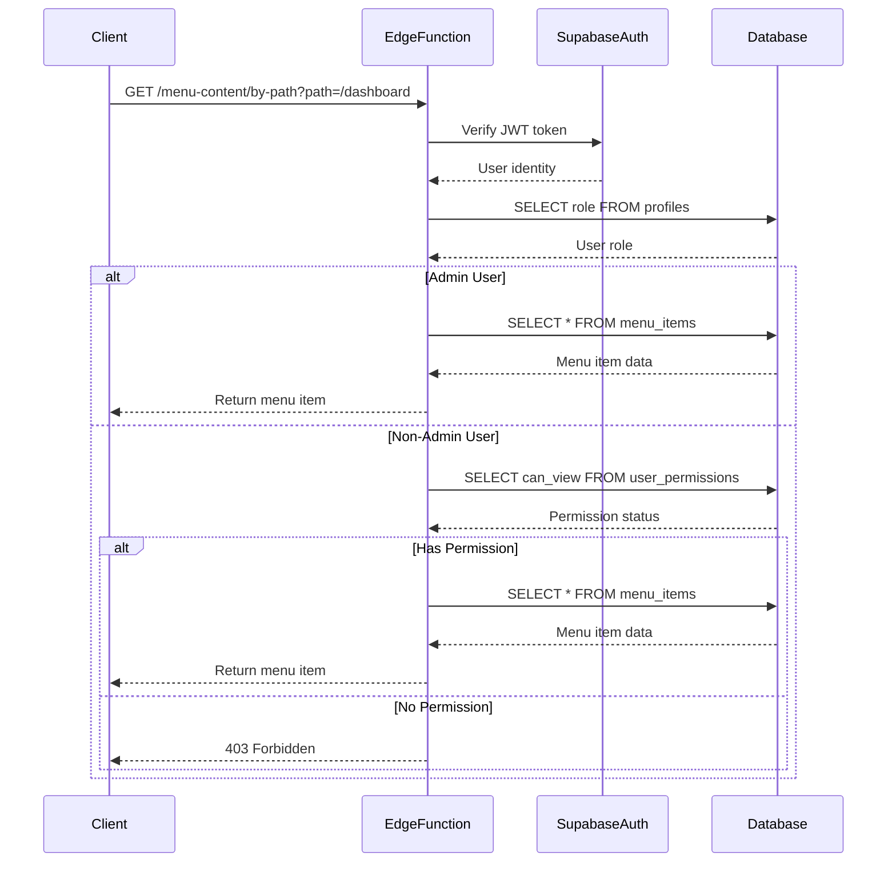
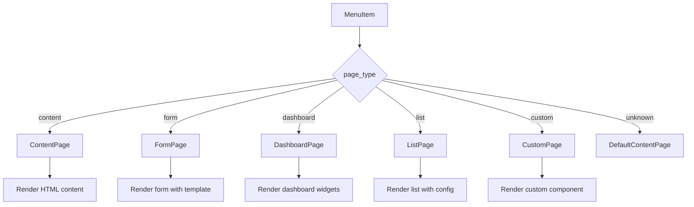

# Menu Content Function

<cite>
**Referenced Files in This Document**   
- [index.ts](file://supabase/functions/menu-content/index.ts)
- [user-menu-service.ts](file://src/lib/user-menu-service.ts)
- [ContentRenderer.tsx](file://src/pages/ContentRenderer.tsx)
- [ContentPage.tsx](file://src/pages/page-types/ContentPage.tsx)
- [FormPage.tsx](file://src/pages/page-types/FormPage.tsx)
- [DashboardPage.tsx](file://src/pages/page-types/DashboardPage.tsx)
- [database-types.ts](file://supabase/functions/_shared/database-types.ts)
</cite>

## Table of Contents
1. [Introduction](#introduction)
2. [API Endpoints](#api-endpoints)
3. [Permission System](#permission-system)
4. [Content Structure](#content-structure)
5. [Frontend Integration](#frontend-integration)
6. [Error Handling](#error-handling)

## Introduction
The menu-content Edge Function in the lovable-rise application manages dynamic page content and templates through a RESTful API. It enables retrieval of menu items by path or ID, provides available page templates, and allows administrators to create and update menu content. The function integrates with Supabase for authentication and database operations, ensuring secure access to content based on user roles.

The system supports multiple page types including content, form, dashboard, list, and custom pages, each rendered with appropriate templates and data configurations. The frontend ContentRenderer component uses the retrieved data to dynamically render pages based on their type and configuration.

**Section sources**
- [index.ts](file://supabase/functions/menu-content/index.ts#L1-L355)

## API Endpoints

### GET /menu-content/by-path
Retrieves a menu item by its path. Requires the path parameter in the query string.

**Request Parameters**
- `path` (string, required): The path of the menu item to retrieve

**Response**
Returns a menu item object wrapped in a menuItem property.

```json
{
  "menuItem": {
    "id": 1,
    "title": "Dashboard",
    "path": "dashboard",
    "page_type": "dashboard",
    "content_data": {},
    "template_name": null,
    "meta_data": {},
    "is_active": true
  }
}
```

**Section sources**
- [index.ts](file://supabase/functions/menu-content/index.ts#L89-L138)

### GET /menu-content/item/:id
Retrieves a specific menu item by its ID.

**Path Parameters**
- `id` (number, required): The ID of the menu item to retrieve

**Response**
Returns a menu item object wrapped in a menuItem property.

```json
{
  "menuItem": {
    "id": 1,
    "title": "Dashboard",
    "path": "dashboard",
    "page_type": "dashboard",
    "content_data": {},
    "template_name": null,
    "meta_data": {},
    "is_active": true
  }
}
```

**Section sources**
- [index.ts](file://supabase/functions/menu-content/index.ts#L140-L194)

### GET /menu-content/templates
Retrieves available page templates grouped by page type.

**Response**
Returns an object containing template arrays for each page type.

```json
{
  "templates": {
    "content": ["default", "article", "landing"],
    "form": ["contact", "survey", "registration", "custom"],
    "dashboard": ["analytics", "overview", "reports"],
    "list": ["table", "cards", "timeline"],
    "custom": ["custom-component"]
  }
}
```

**Section sources**
- [index.ts](file://supabase/functions/menu-content/index.ts#L283-L354)

### PUT /menu-content/item/:id
Updates a menu item's content. Admin access required.

**Path Parameters**
- `id` (number, required): The ID of the menu item to update

**Request Body**
All fields are optional and only updated if provided.

```json
{
  "title": "Updated Title",
  "path": "updated-path",
  "page_type": "content",
  "content_data": {},
  "template_name": "default",
  "meta_data": {},
  "parent_id": null,
  "order_index": 0,
  "is_active": true
}
```

**Response**
Returns the updated menu item object.

```json
{
  "menuItem": {
    "id": 1,
    "title": "Updated Title",
    "path": "updated-path",
    "page_type": "content",
    "content_data": {},
    "template_name": "default",
    "meta_data": {},
    "is_active": true
  }
}
```

**Section sources**
- [index.ts](file://supabase/functions/menu-content/index.ts#L188-L231)

### POST /menu-content/item
Creates a new menu item. Admin access required.

**Request Body**
- `title` (string, required): The title of the menu item
- `path` (string, required): The path of the menu item
- `page_type` (string, optional): Type of page (default: "content")
- `content_data` (object, optional): Content configuration data (default: {})
- `template_name` (string, optional): Template name
- `meta_data` (object, optional): Metadata (default: {})
- `parent_id` (number, optional): Parent menu item ID
- `order_index` (number, optional): Order index (default: 0)

```json
{
  "title": "New Page",
  "path": "new-page",
  "page_type": "content",
  "content_data": {},
  "template_name": "default",
  "meta_data": {},
  "parent_id": null,
  "order_index": 0
}
```

**Response**
Returns the created menu item object with status 201 Created.

```json
{
  "menuItem": {
    "id": 2,
    "title": "New Page",
    "path": "new-page",
    "page_type": "content",
    "content_data": {},
    "template_name": "default",
    "meta_data": {},
    "is_active": true
  }
}
```

**Section sources**
- [index.ts](file://supabase/functions/menu-content/index.ts#L233-L281)

## Permission System
The menu-content function implements a role-based permission system that checks user access rights before returning menu content. Users are authenticated through Supabase's authentication system, and their role is verified from the profiles table.

For non-admin users accessing menu items by path, the function checks the user_permissions table to verify if they have view access to the requested menu item. The permission check is performed only when retrieving items via the by-path endpoint, as other endpoints either return public template information or require admin access.

Admin users (role: 'admin') have unrestricted access to all menu content operations, including creating and updating menu items. Non-admin users can only retrieve menu items for which they have explicit view permissions.



**Diagram sources**
- [index.ts](file://supabase/functions/menu-content/index.ts#L1-L355)

**Section sources**
- [index.ts](file://supabase/functions/menu-content/index.ts#L89-L138)
- [index.ts](file://supabase/functions/menu-content/index.ts#L140-L194)

## Content Structure
The menu-content function uses three key fields to manage dynamic page rendering: content_data, template_name, and meta_data.

### content_data
Contains the primary content and configuration for the page, with structure varying by page_type:
- **content**: HTML content in html_content property
- **form**: Form configuration in form_config property
- **dashboard**: Widget configuration in widgets array
- **list**: Table or list configuration in table_config property
- **custom**: Custom data structure based on requirements

### template_name
Specifies the template to use for rendering the page. The available templates are defined by page type and can be retrieved via the GET /menu-content/templates endpoint.

### meta_data
Stores additional metadata about the page that doesn't affect rendering but may be used for analytics, SEO, or other purposes.

The MenuItem interface defines the complete structure of a menu item:

```typescript
interface MenuItem {
  id: number;
  title: string;
  path: string;
  parent_id?: number | null;
  order_index: number;
  is_active: boolean;
  page_type: 'content' | 'form' | 'dashboard' | 'list' | 'custom';
  content_data?: Record<string, any>;
  template_name?: string;
  meta_data?: Record<string, any>;
  icon_name?: string;
  created_at: string;
  updated_at: string;
}
```

**Section sources**
- [database-types.ts](file://supabase/functions/_shared/database-types.ts#L168-L168)
- [index.ts](file://supabase/functions/menu-content/index.ts#L89-L138)

## Frontend Integration
The frontend ContentRenderer component uses the menu item data to dynamically render different page types based on the page_type field.



**Diagram sources**
- [ContentRenderer.tsx](file://src/pages/ContentRenderer.tsx#L41-L103)

The ContentRenderer processes the menu item according to its type:

### Content Pages
Rendered with ContentPage component that displays HTML content from content_data.html_content. If no content is provided, a default welcome message is shown.

### Form Pages
Rendered with FormPage component that uses the template_name to determine the form layout and content_data.form_config to define form fields and behavior.

### Dashboard Pages
Rendered with DashboardPage component that displays widgets defined in content_data.widgets array, with each widget having its own type and data configuration.

### List Pages
Rendered with ListPage component that uses content_data.table_config to define the list structure and data source.

### Custom Pages
Rendered with CustomPage component that uses template_name as a component identifier and content_data for component-specific configuration.

**Section sources**
- [ContentRenderer.tsx](file://src/pages/ContentRenderer.tsx#L41-L103)
- [ContentPage.tsx](file://src/pages/page-types/ContentPage.tsx#L8-L22)
- [FormPage.tsx](file://src/pages/page-types/FormPage.tsx#L8-L154)
- [DashboardPage.tsx](file://src/pages/page-types/DashboardPage.tsx#L8-L186)

## Error Handling
The menu-content function implements comprehensive error handling with appropriate HTTP status codes:

- **400 Bad Request**: Missing required parameters
- **401 Unauthorized**: Missing or invalid authentication
- **403 Forbidden**: Insufficient permissions
- **404 Not Found**: Resource not found
- **500 Internal Server Error**: Unexpected server errors

Errors are returned as JSON objects with an error property containing a descriptive message. The function logs detailed error information to assist with debugging while returning generic error messages to clients for security.

**Section sources**
- [index.ts](file://supabase/functions/menu-content/index.ts#L1-L355)