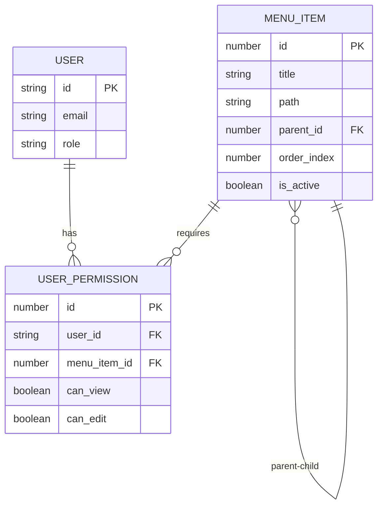
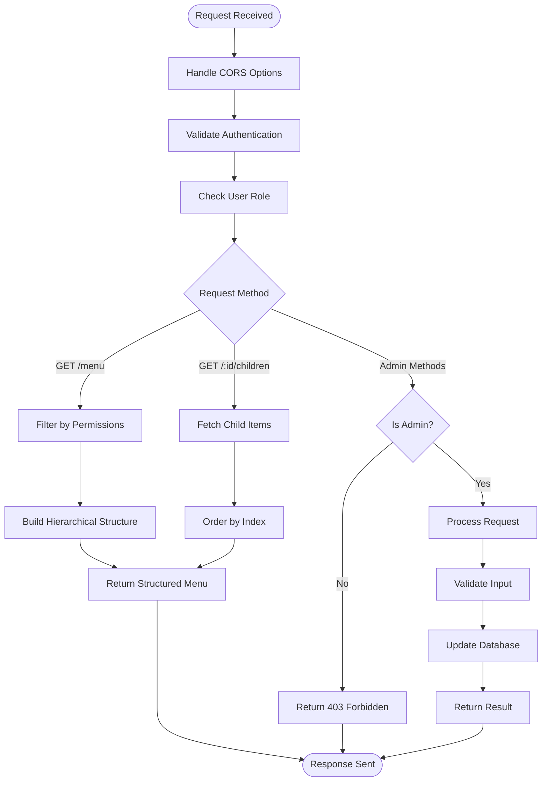

# Menu Function

<cite>
**Referenced Files in This Document**   
- [index.ts](file://supabase/functions/menu/index.ts)
- [user-menu-service.ts](file://src/lib/user-menu-service.ts)
- [AddMissingMenuItems.tsx](file://src/components/admin/AddMissingMenuItems.tsx)
- [user-menu.test.tsx](file://src/__tests__/user-menu.test.tsx)
</cite>

## Table of Contents
1. [Introduction](#introduction)
2. [Core Endpoints](#core-endpoints)
3. [Admin Operations](#admin-operations)
4. [Permission System](#permission-system)
5. [Request Handling Flow](#request-handling-flow)
6. [Frontend Integration](#frontend-integration)
7. [Error Handling](#error-handling)

## Introduction
The Menu Edge Function provides a dynamic menu system for the lovable-rise application, enabling role-based access to navigation items. This API serves menu structures to users based on their permissions while providing administrative capabilities for managing the menu hierarchy. The system supports both flat and nested menu structures with proper ordering and filtering mechanisms.

**Section sources**
- [index.ts](file://supabase/functions/menu/index.ts#L1-L50)

## Core Endpoints

### GET /menu - Retrieve Top-Level Menu
Retrieves the complete menu structure for the authenticated user, filtering items based on their permissions.

**Request Parameters**
- No URL parameters required
- Requires valid authentication token in Authorization header

**Response Format**
```json
{
  "menu": [
    {
      "id": 1,
      "title": "Dashboard",
      "path": "dashboard",
      "order_index": 0,
      "is_active": true,
      "children": [
        {
          "id": 2,
          "title": "Analytics",
          "path": "dashboard/analytics",
          "order_index": 0,
          "is_active": true,
          "children": []
        }
      ]
    }
  ]
}
```

The response includes a structured hierarchy with parent items containing their children in a nested format, ordered by the order_index field.

### GET /menu/:id/children - Retrieve Submenu Items
Fetches all active child menu items for a specific parent menu item.

**Request Parameters**
- `id` (path parameter): The ID of the parent menu item

**Response Format**
```json
{
  "children": [
    {
      "id": 3,
      "title": "Reports",
      "path": "reports",
      "parent_id": 1,
      "order_index": 1,
      "is_active": true
    }
  ]
}
```

The endpoint returns a flat array of child items ordered by their order_index, allowing the frontend to build nested menu structures dynamically.

**Section sources**
- [index.ts](file://supabase/functions/menu/index.ts#L100-L180)

## Admin Operations

### POST /menu - Create Menu Item
Creates a new menu item in the system. Access restricted to admin users only.

**Request Body Schema**
```json
{
  "title": "New Feature",
  "path": "new-feature",
  "parent_id": 1,
  "order_index": 2
}
```

**Required Fields**
- `title`: Display name of the menu item
- `path`: URL path for navigation
- `parent_id` (optional): ID of parent menu item for nesting
- `order_index` (optional): Position in the menu order

**Response**
Returns the created menu item with status 201 (Created).

### PATCH /menu/:id - Update Menu Item
Modifies an existing menu item. Access restricted to admin users only.

**Request Parameters**
- `id` (path parameter): The ID of the menu item to update

**Request Body Schema**
```json
{
  "title": "Updated Title",
  "path": "updated-path",
  "parent_id": 2,
  "order_index": 1,
  "is_active": true
}
```

All fields are optional; only provided fields will be updated.

**Response**
Returns the updated menu item with all current fields.

### DELETE /menu/:id - Deactivate Menu Item
Soft deletes a menu item by setting its is_active flag to false. Access restricted to admin users only.

**Request Parameters**
- `id` (path parameter): The ID of the menu item to deactivate

**Response**
Returns the deactivated menu item with is_active set to false.

**Section sources**
- [index.ts](file://supabase/functions/menu/index.ts#L182-L280)

## Permission System
The menu system implements a role-based permission model that filters accessible menu items for non-admin users. The permission system works as follows:

1. **Admin Users**: Have unrestricted access to all active menu items regardless of permissions table entries.

2. **Non-Admin Users**: Access is determined by the user_permissions table, which contains:
   - `user_id`: Reference to the user
   - `menu_item_id`: Reference to the menu item
   - `can_view`: Boolean indicating view permission
   - `can_edit`: Boolean indicating edit permission

When a non-admin user requests the menu, the system:
1. Retrieves all active menu items
2. Fetches the user's permissions from the user_permissions table
3. Filters menu items to include only those with can_view = true
4. Returns an empty menu array if no permissions exist

The system also supports automatic icon assignment based on menu item properties, particularly for supplier, shop, and payment-related items, enhancing the user experience with appropriate visual indicators.



**Diagram sources**
- [index.ts](file://supabase/functions/menu/index.ts#L60-L90)
- [types.ts](file://src/integrations/supabase/types.ts#L281-L333)

**Section sources**
- [index.ts](file://supabase/functions/menu/index.ts#L60-L90)
- [types.ts](file://src/integrations/supabase/types.ts#L281-L333)

## Request Handling Flow
The request handling process follows a structured flow to ensure proper authentication, authorization, and data retrieval:



**Diagram sources**
- [index.ts](file://supabase/functions/menu/index.ts#L1-L303)

**Section sources**
- [index.ts](file://supabase/functions/menu/index.ts#L1-L303)

## Frontend Integration
The frontend admin interface interacts with the menu API through the UserMenuService class, which provides a comprehensive set of methods for managing menu items:

1. **Menu Retrieval**: The `getMenuHierarchy` method fetches and structures the complete menu tree for display in the sidebar navigation.

2. **Item Management**: Admin components use `createMenuItem`, `updateMenuItem`, and `deactivateMenuItem` methods to manage menu structure through form interfaces.

3. **Bulk Operations**: The `reorderMenuItems` method supports drag-and-drop reordering of menu items in the admin interface.

4. **Utility Functions**: Additional methods like `duplicateMenuItem` and `getChildMenuItems` support specialized use cases in the admin interface.

The AddMissingMenuItems component demonstrates a utility pattern where default menu items are programmatically added to user accounts, ensuring consistent navigation across the application.

**Section sources**
- [user-menu-service.ts](file://src/lib/user-menu-service.ts#L1-L666)
- [AddMissingMenuItems.tsx](file://src/components/admin/AddMissingMenuItems.tsx#L1-L105)

## Error Handling
The API implements comprehensive error handling for various scenarios:

**Authentication Errors**
- 401 Unauthorized: Missing or invalid authentication token
- 403 Forbidden: User lacks admin privileges for write operations

**Validation Errors**
- 400 Bad Request: Missing required fields in POST/PATCH requests
- 404 Not Found: Requested menu item does not exist

**Server Errors**
- 500 Internal Server Error: Database query failures or unexpected exceptions
- Proper logging is implemented for debugging purposes

All error responses follow a consistent format:
```json
{
  "error": "Descriptive error message"
}
```

The system also handles edge cases such as empty permission sets by returning an empty menu array rather than an error, providing a graceful degradation experience.

**Section sources**
- [index.ts](file://supabase/functions/menu/index.ts#L280-L303)
- [user-menu-service.ts](file://src/lib/user-menu-service.ts#L100-L200)