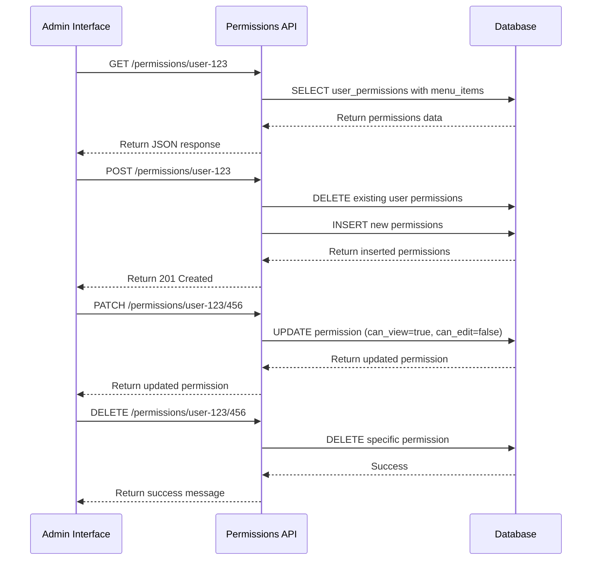
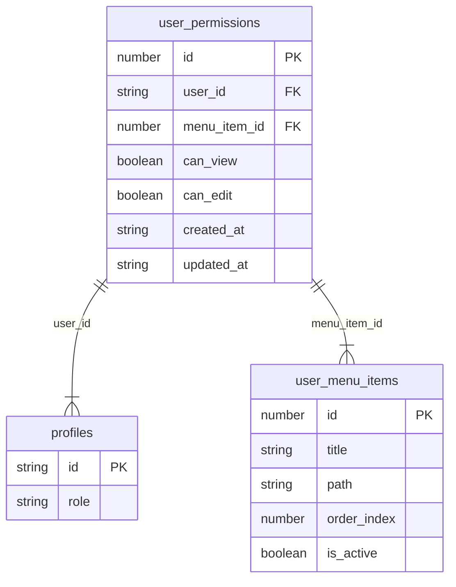
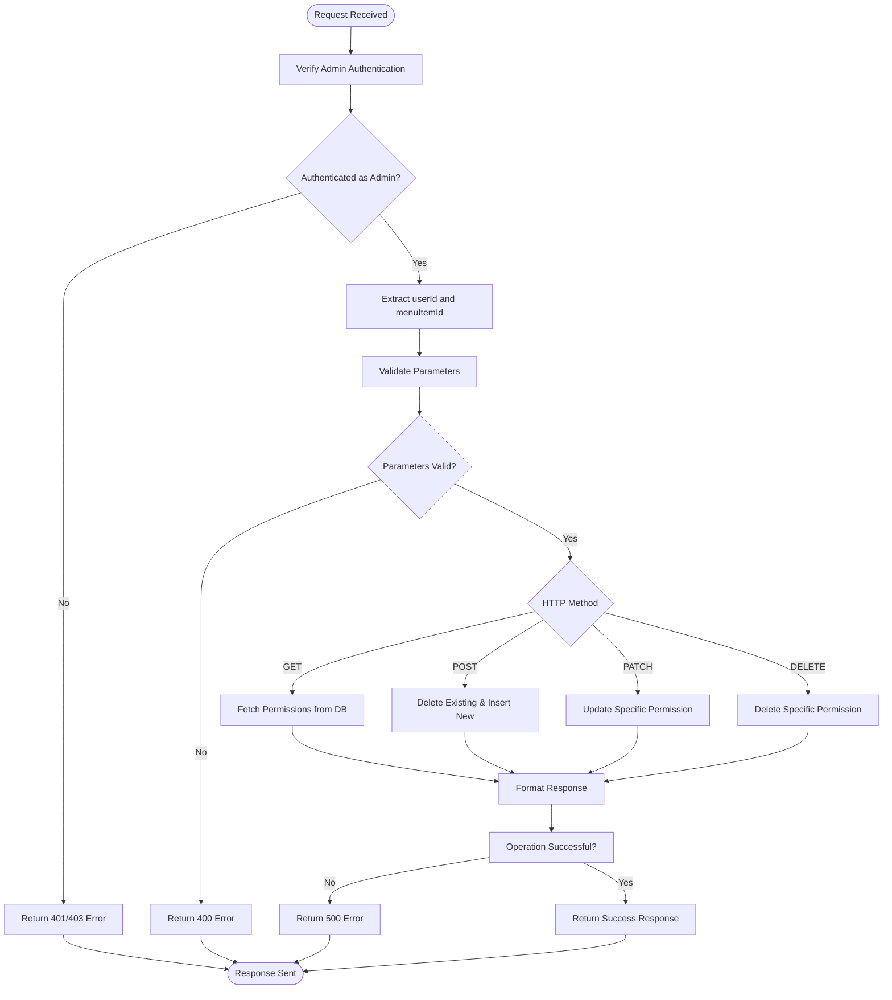
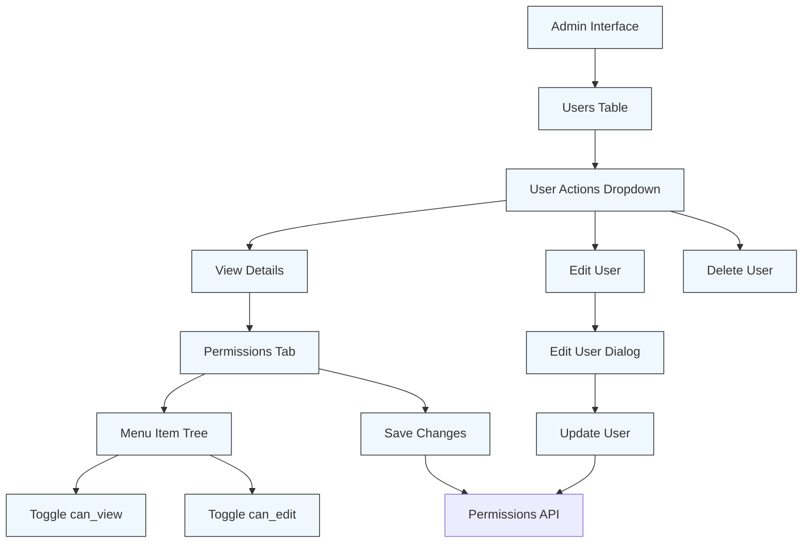

# Permissions Function

<cite>
**Referenced Files in This Document**   
- [index.ts](file://supabase/functions/permissions/index.ts)
- [database-types.ts](file://supabase/functions/_shared/database-types.ts)
- [user-menu-service.ts](file://src/lib/user-menu-service.ts)
- [EditUserDialog.tsx](file://src/components/admin/EditUserDialog.tsx)
- [UsersTable.tsx](file://src/components/admin/UsersTable.tsx)
</cite>

## Table of Contents
1. [Introduction](#introduction)
2. [API Endpoints](#api-endpoints)
3. [Database Schema](#database-schema)
4. [Request Flow and Processing](#request-flow-and-processing)
5. [Integration with Menu System](#integration-with-menu-system)
6. [Admin Interface Usage](#admin-interface-usage)
7. [Frontend Permission Enforcement](#frontend-permission-enforcement)
8. [Error Handling](#error-handling)

## Introduction
The Permissions Edge Function in the lovable-rise application provides a role-based access control system that enables administrators to manage user permissions for various application features. This API allows admins to configure what users can view and edit within the application's menu system. The function implements strict admin-only access control, ensuring that only users with the 'admin' role can modify permissions. The system is designed to work seamlessly with the application's dynamic menu structure, allowing granular control over UI visibility and feature access based on user roles and permissions.

**Section sources**
- [index.ts](file://supabase/functions/permissions/index.ts#L9-L32)
- [database-types.ts](file://supabase/functions/_shared/database-types.ts#L92-L149)

## API Endpoints
The Permissions Edge Function exposes four RESTful endpoints for managing user permissions. All endpoints require admin authentication and operate on the user_permissions table. The endpoints follow a consistent URL pattern of /permissions/:userId with optional :menuItemId parameter for specific permission operations.

### GET /permissions/:userId
Retrieves all permissions for a specific user, including associated menu item details such as title and path. The response includes the can_view and can_edit boolean flags for each permission, allowing the frontend to determine UI visibility and interaction capabilities.

### POST /permissions/:userId
Assigns multiple permissions to a user at once. This endpoint accepts an array of permission objects, each containing menu_item_id, can_view, and can_edit properties. Before inserting new permissions, the function deletes all existing permissions for the user, ensuring a clean state.

### PATCH /permissions/:userId/:menuItemId
Updates a specific permission for a user on a particular menu item. This endpoint allows granular updates to either the can_view or can_edit flags without affecting other permissions. It's used when an admin needs to modify access to a single feature.

### DELETE /permissions/:userId/:menuItemId
Removes a specific permission for a user on a particular menu item. This effectively revokes both view and edit access to that menu item. The operation is idempotent and returns a success message upon completion.

**Diagram sources**
- [index.ts](file://supabase/functions/permissions/index.ts#L98-L243)

**Section sources**
- [index.ts](file://supabase/functions/permissions/index.ts#L98-L243)

## Database Schema
The permissions system is built around the user_permissions table, which establishes a many-to-many relationship between users and menu items with granular access control. Each record in this table represents a user's access rights to a specific menu item.

### user_permissions Table Structure
The table contains the following columns:
- **id**: Primary key (integer)
- **user_id**: Foreign key to users table (string)
- **menu_item_id**: Foreign key to menu_items table (integer)
- **can_view**: Boolean flag indicating view access
- **can_edit**: Boolean flag indicating edit access
- **created_at**: Timestamp of record creation
- **updated_at**: Timestamp of last update

The can_view and can_edit columns are boolean flags that determine the level of access a user has to a specific menu item. By default, can_view is set to true and can_edit to false when creating new permissions, ensuring users can at least see menu items they have access to.

**Diagram sources**
- [database-types.ts](file://supabase/functions/_shared/database-types.ts#L92-L149)

**Section sources**
- [database-types.ts](file://supabase/functions/_shared/database-types.ts#L92-L149)

## Request Flow and Processing
The Permissions Edge Function follows a consistent processing flow for all requests, ensuring security, data integrity, and proper error handling. The flow begins with authentication verification and proceeds through request validation, database operations, and response generation.

### Authentication Verification
All requests are first validated for admin access through the checkAdminPermission function. The function supports two authentication methods: Bearer token authentication for authenticated users and API key authentication for anonymous requests. The function retrieves the user's profile from the database and verifies that their role is 'admin'.

### Transactional Operations
For the POST endpoint, the function implements a transactional pattern by first deleting all existing permissions for the user before inserting new ones. This ensures data consistency and prevents permission accumulation. The operation is designed to be atomic in nature, though it relies on Supabase's individual query execution rather than explicit database transactions.

### Request Validation
The function performs thorough validation of incoming requests:
- Validates the presence of userId in the URL path
- For POST requests, verifies that the permissions payload is an array
- For PATCH and DELETE requests, ensures menuItemId is provided
- Checks HTTP method compatibility with the requested operation

**Diagram sources**
- [index.ts](file://supabase/functions/permissions/index.ts#L34-L263)

**Section sources**
- [index.ts](file://supabase/functions/permissions/index.ts#L34-L263)

## Integration with Menu System
The permissions system is tightly integrated with the application's dynamic menu system, allowing administrators to control both UI visibility and feature access based on user permissions. The integration works through the user_menu_items table, which stores the application's menu structure and is referenced by the user_permissions table.

### Menu Item Reference
When retrieving permissions via the GET endpoint, the function performs a join with the menu_items table to include the title and path of each menu item. This allows the frontend to display meaningful information about what each permission controls without requiring additional API calls.

### Hierarchical Menu Support
The system supports hierarchical menus through the parent_id field in the user_menu_items table. While the permissions function itself doesn't directly handle hierarchy, the frontend can use the menu structure to implement cascading permissions, where access to a parent menu item might imply access to its children.

### Dynamic Menu Updates
When new menu items are added to the application, they automatically become available for permission assignment without requiring changes to the permissions system. Administrators can immediately assign view and edit permissions to the new menu items through the existing API endpoints.

**Section sources**
- [user-menu-service.ts](file://src/lib/user-menu-service.ts#L1-L665)
- [database-types.ts](file://supabase/functions/_shared/database-types.ts#L92-L149)

## Admin Interface Usage
The admin interface leverages the Permissions Edge Function to provide a user-friendly way for administrators to manage user access levels. The primary interface for this functionality is the UsersTable component, which displays all users and provides actions for managing their permissions.

### User Management Workflow
Administrators can access user permission settings through the user management interface. From the UsersTable, they can click on a user's "View Details" option to access a detailed view where permissions can be configured. The interface likely provides a visual representation of the menu structure, allowing admins to toggle can_view and can_edit permissions for each menu item.

### Bulk Permission Assignment
The POST endpoint enables the admin interface to assign multiple permissions at once, which is particularly useful when setting up new users or applying role-based templates. The interface may provide predefined permission templates (e.g., "Manager", "Editor") that correspond to common sets of permissions.

### Granular Permission Control
For fine-tuning access, the admin interface uses the PATCH and DELETE endpoints to modify specific permissions. This allows administrators to make precise adjustments to a user's access without affecting their other permissions.

**Diagram sources**
- [UsersTable.tsx](file://src/components/admin/UsersTable.tsx#L202-L259)
- [EditUserDialog.tsx](file://src/components/admin/EditUserDialog.tsx#L1-L202)

**Section sources**
- [UsersTable.tsx](file://src/components/admin/UsersTable.tsx#L202-L259)
- [EditUserDialog.tsx](file://src/components/admin/EditUserDialog.tsx#L1-L202)

## Frontend Permission Enforcement
The frontend application enforces permissions in multiple ways to ensure users can only access features they are authorized to use. This enforcement happens at both the UI rendering level and the navigation level.

### UI Visibility Control
The application uses the can_view flag to determine whether to display menu items to users. When a user logs in, their permissions are retrieved, and the menu is filtered to only show items where can_view is true. This prevents users from even seeing features they don't have access to.

### Interaction Restrictions
For menu items that users can view, the can_edit flag determines whether they can interact with the feature. The UI displays these items in a read-only mode, disabling edit controls and buttons. This provides transparency about what features are available in the user's plan or role while preventing unauthorized modifications.

### Navigation Protection
The frontend implements route guards that check permissions before allowing navigation to specific pages. Even if a user attempts to access a URL directly, the application verifies their permissions before rendering the page content, providing an additional layer of security beyond UI hiding.

**Section sources**
- [user-menu-service.ts](file://src/lib/user-menu-service.ts#L1-L665)
- [UsersTable.tsx](file://src/components/admin/UsersTable.tsx#L202-L259)

## Error Handling
The Permissions Edge Function implements comprehensive error handling to provide meaningful feedback for various failure scenarios. Errors are handled at multiple levels, from authentication to database operations.

### Authentication Errors
- **401 Unauthorized**: Returned when no authentication is provided or the token is invalid
- **403 Forbidden**: Returned when the authenticated user is not an admin
- These errors include descriptive messages to help diagnose authentication issues

### Validation Errors
- **400 Bad Request**: Returned when required parameters are missing or invalid
- For POST requests, specifically validates that the permissions payload is an array
- Ensures userId is present in the URL path

### Database Errors
- **500 Internal Server Error**: Returned for database operation failures
- Includes logged error details for debugging while returning a generic message to the client
- Handles errors for all database operations (SELECT, INSERT, UPDATE, DELETE)

### Method and Route Errors
- **405 Method Not Allowed**: Returned when an unsupported HTTP method is used
- Properly handles OPTIONS requests for CORS preflight
- Validates that URL parameters match the expected operation (e.g., menuItemId required for PATCH/DELETE)

The error handling system logs detailed error information server-side while returning user-friendly messages to the client, balancing security and debuggability.

**Section sources**
- [index.ts](file://supabase/functions/permissions/index.ts#L34-L263)