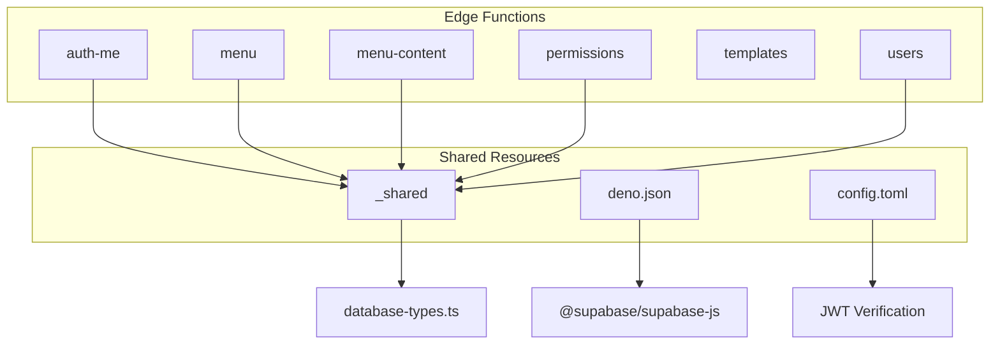
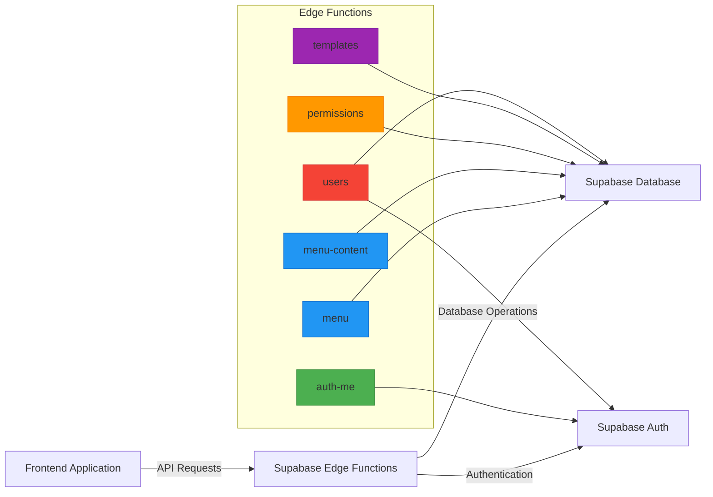
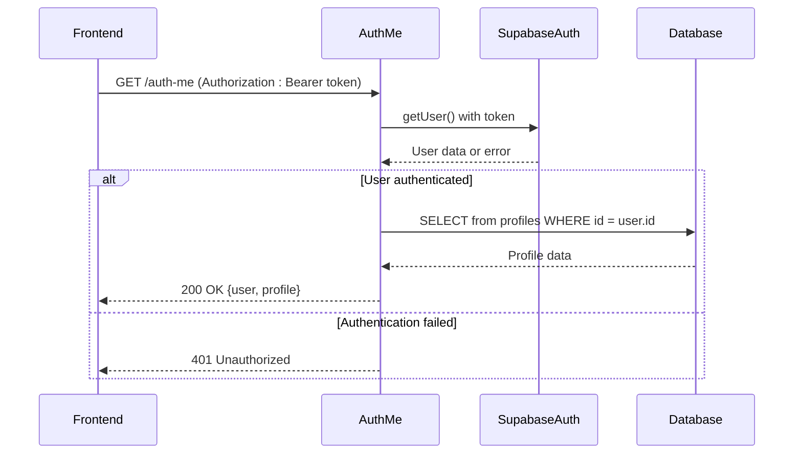
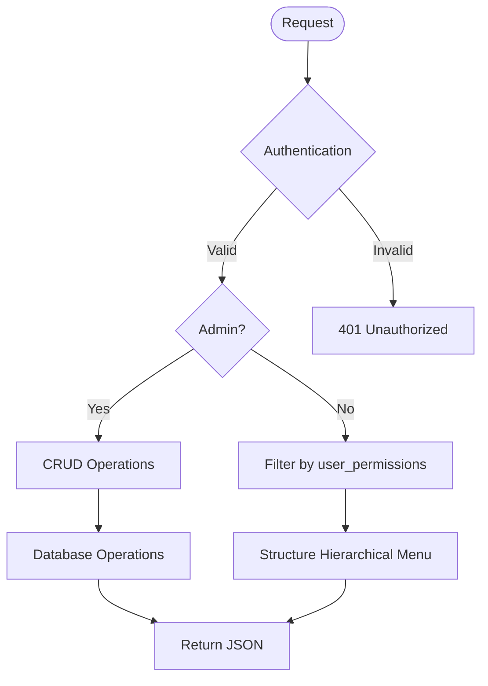
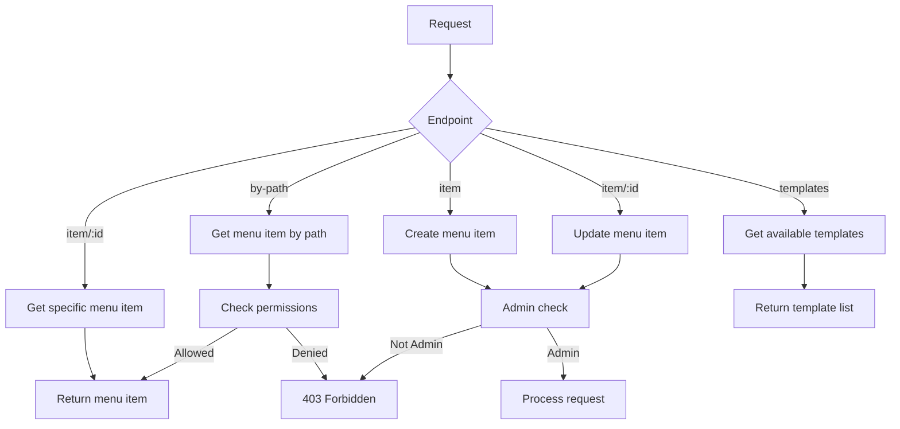
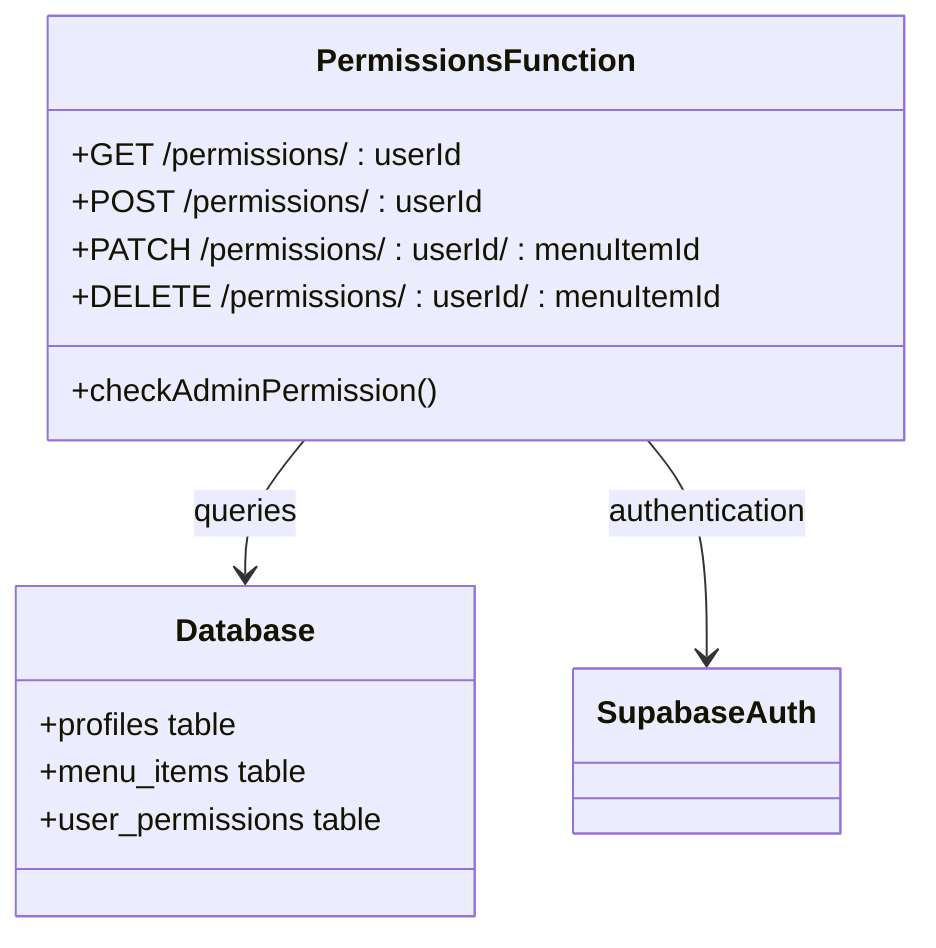
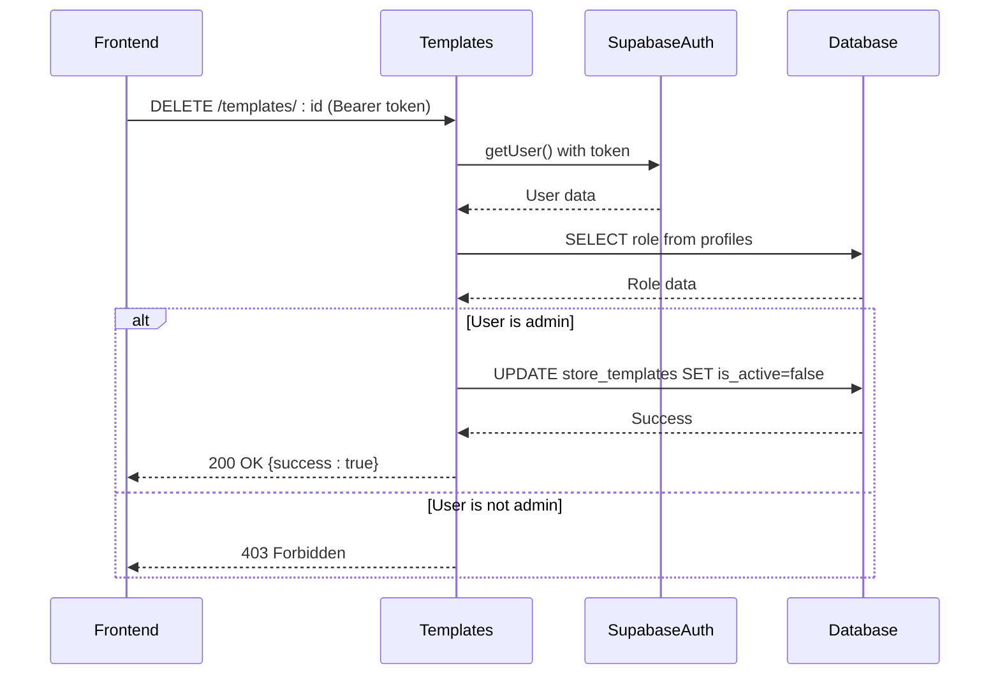
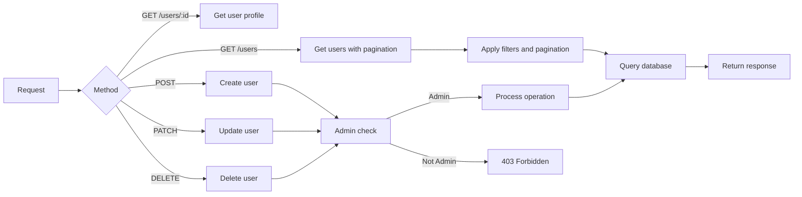
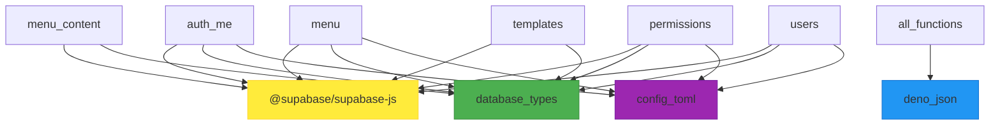

# Supabase Edge Functions

<cite>
**Referenced Files in This Document**   
- [auth-me/index.ts](file://supabase/functions/auth-me/index.ts)
- [menu/index.ts](file://supabase/functions/menu/index.ts)
- [menu-content/index.ts](file://supabase/functions/menu-content/index.ts)
- [permissions/index.ts](file://supabase/functions/permissions/index.ts)
- [templates/index.ts](file://supabase/functions/templates/index.ts)
- [users/index.ts](file://supabase/functions/users/index.ts)
- [deno.json](file://supabase/functions/deno.json)
- [config.toml](file://supabase/config.toml)
- [_shared/database-types.ts](file://supabase/functions/_shared/database-types.ts)
</cite>

## Table of Contents
1. [Introduction](#introduction)
2. [Project Structure](#project-structure)
3. [Core Components](#core-components)
4. [Architecture Overview](#architecture-overview)
5. [Detailed Component Analysis](#detailed-component-analysis)
6. [Dependency Analysis](#dependency-analysis)
7. [Performance Considerations](#performance-considerations)
8. [Troubleshooting Guide](#troubleshooting-guide)
9. [Conclusion](#conclusion)

## Introduction
This document provides comprehensive architectural documentation for the Supabase Edge Functions in the lovable-rise application. The Edge Functions are serverless Deno-based functions that handle secure backend operations including authentication, role-based access control, dynamic UI rendering, and user management. These functions serve as the primary API layer between the frontend application and the Supabase database, implementing RESTful design patterns with Bearer token authentication and CORS configuration. The documentation details each function's purpose, API design patterns, environment integration, and deployment considerations.

## Project Structure

**Diagram sources**
- [supabase/functions](file://supabase/functions)
- [supabase/functions/_shared/database-types.ts](file://supabase/functions/_shared/database-types.ts)
- [supabase/functions/deno.json](file://supabase/functions/deno.json)
- [supabase/config.toml](file://supabase/config.toml)

**Section sources**
- [supabase/functions](file://supabase/functions)
- [supabase/config.toml](file://supabase/config.toml)

## Core Components

The Supabase Edge Functions in the lovable-rise application consist of six primary functions, each serving a distinct purpose in the application architecture. These functions operate in a serverless Deno runtime environment provided by Supabase, enabling fast execution and automatic scaling. The functions are designed to handle specific domains of functionality including authentication validation, menu management, permissions, template operations, and user data management. All functions follow consistent patterns for error handling, CORS configuration, and database interaction through the Supabase client.

**Section sources**
- [supabase/functions/auth-me/index.ts](file://supabase/functions/auth-me/index.ts)
- [supabase/functions/menu/index.ts](file://supabase/functions/menu/index.ts)
- [supabase/functions/menu-content/index.ts](file://supabase/functions/menu-content/index.ts)
- [supabase/functions/permissions/index.ts](file://supabase/functions/permissions/index.ts)
- [supabase/functions/templates/index.ts](file://supabase/functions/templates/index.ts)
- [supabase/functions/users/index.ts](file://supabase/functions/users/index.ts)

## Architecture Overview

**Diagram sources**
- [supabase/functions/auth-me/index.ts](file://supabase/functions/auth-me/index.ts)
- [supabase/functions/menu/index.ts](file://supabase/functions/menu/index.ts)
- [supabase/functions/menu-content/index.ts](file://supabase/functions/menu-content/index.ts)
- [supabase/functions/permissions/index.ts](file://supabase/functions/permissions/index.ts)
- [supabase/functions/templates/index.ts](file://supabase/functions/templates/index.ts)
- [supabase/functions/users/index.ts](file://supabase/functions/users/index.ts)

## Detailed Component Analysis

### auth-me Function Analysis
The auth-me function handles session validation and returns user profile information. It accepts requests with Bearer token authentication or API key and validates the user's session through Supabase Auth. Upon successful authentication, it retrieves the user's profile from the database and returns a combined response with both authentication and profile data.

**Diagram sources**
- [supabase/functions/auth-me/index.ts](file://supabase/functions/auth-me/index.ts#L1-L130)

**Section sources**
- [supabase/functions/auth-me/index.ts](file://supabase/functions/auth-me/index.ts#L1-L130)

### menu Function Analysis
The menu function manages hierarchical menu structures for dynamic UI rendering. It supports retrieving menu items with role-based filtering, creating new menu items, updating existing items, and deactivating items. Non-admin users receive only menu items they have permission to view, while admins have full CRUD capabilities.

**Diagram sources**
- [supabase/functions/menu/index.ts](file://supabase/functions/menu/index.ts#L1-L303)

**Section sources**
- [supabase/functions/menu/index.ts](file://supabase/functions/menu/index.ts#L1-L303)

### menu-content Function Analysis
The menu-content function handles detailed menu item content and page templates. It provides endpoints for retrieving menu items by path, managing content data, and accessing available page templates. This function enables dynamic UI rendering by providing the frontend with complete information about page structure and available templates.

**Diagram sources**
- [supabase/functions/menu-content/index.ts](file://supabase/functions/menu-content/index.ts#L1-L355)

**Section sources**
- [supabase/functions/menu-content/index.ts](file://supabase/functions/menu-content/index.ts#L1-L355)

### permissions Function Analysis
The permissions function implements role-based access control by managing user permissions for menu items. Only administrators can access this function, which provides CRUD operations for user_permissions records. This function ensures that users can only access menu items they have been explicitly granted permission to view.

**Diagram sources**
- [supabase/functions/permissions/index.ts](file://supabase/functions/permissions/index.ts#L1-L264)

**Section sources**
- [supabase/functions/permissions/index.ts](file://supabase/functions/permissions/index.ts#L1-L264)

### templates Function Analysis
The templates function manages XML template operations, specifically providing functionality to delete templates. This function requires admin authentication and uses the service role key to perform soft deletes on store_templates records, setting the is_active flag to false rather than permanently removing records.

**Diagram sources**
- [supabase/functions/templates/index.ts](file://supabase/functions/templates/index.ts#L1-L127)

**Section sources**
- [supabase/functions/templates/index.ts](file://supabase/functions/templates/index.ts#L1-L127)

### users Function Analysis
The users function provides comprehensive user management capabilities. It supports listing users with pagination, retrieving individual user profiles, creating new users, updating user information, and deleting users. Admin authentication is required for all operations except retrieving the current user's profile.

**Diagram sources**
- [supabase/functions/users/index.ts](file://supabase/functions/users/index.ts#L1-L490)

**Section sources**
- [supabase/functions/users/index.ts](file://supabase/functions/users/index.ts#L1-L490)

## Dependency Analysis

**Diagram sources**
- [supabase/functions/deno.json](file://supabase/functions/deno.json)
- [supabase/config.toml](file://supabase/config.toml)
- [supabase/functions/_shared/database-types.ts](file://supabase/functions/_shared/database-types.ts)

**Section sources**
- [supabase/functions/deno.json](file://supabase/functions/deno.json)
- [supabase/config.toml](file://supabase/config.toml)
- [supabase/functions/_shared/database-types.ts](file://supabase/functions/_shared/database-types.ts)

## Performance Considerations
The Edge Functions are designed with performance in mind, leveraging Deno's V8 engine for fast startup times and efficient execution. The functions implement several optimization patterns including batch database operations, efficient query structuring, and proper indexing. The users function, for example, optimizes subscription retrieval by using a single query with the IN operator rather than multiple individual queries. All functions include comprehensive error handling and logging to facilitate monitoring and troubleshooting. Cold start implications are minimized by Supabase's edge runtime, which maintains function instances for rapid subsequent invocations. Monitoring strategies should include tracking function execution times, error rates, and database query performance.

## Troubleshooting Guide
When troubleshooting Edge Function issues, consider the following common scenarios:
- Authentication failures: Verify the Authorization header format (Bearer token) and token validity
- Permission errors: Confirm user roles and ensure admin operations are performed by users with the 'admin' role
- CORS issues: Ensure the frontend includes proper headers and the functions return correct CORS headers
- Database query errors: Check parameter validation and ensure proper filtering conditions
- Environment variable issues: Verify SUPABASE_URL, SUPABASE_ANON_KEY, and SUPABASE_SERVICE_ROLE_KEY are correctly configured
- Payload size limits: Be aware of Deno's memory and execution time limits for large requests

**Section sources**
- [supabase/functions/auth-me/index.ts](file://supabase/functions/auth-me/index.ts)
- [supabase/functions/users/index.ts](file://supabase/functions/users/index.ts)
- [supabase/config.toml](file://supabase/config.toml)

## Conclusion
The Supabase Edge Functions in the lovable-rise application provide a robust, secure, and scalable backend architecture. By leveraging Deno's serverless runtime and Supabase's integrated services, these functions efficiently handle authentication, authorization, user management, and dynamic content delivery. The consistent API design patterns, comprehensive error handling, and role-based access control create a maintainable and secure foundation for the application. The functions are well-structured with clear separation of concerns, making them easy to extend and maintain as the application evolves.