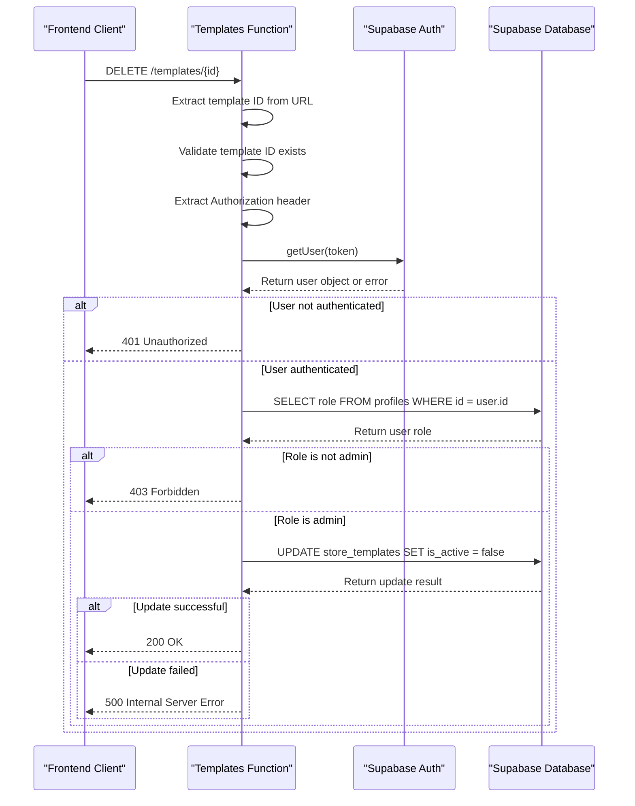
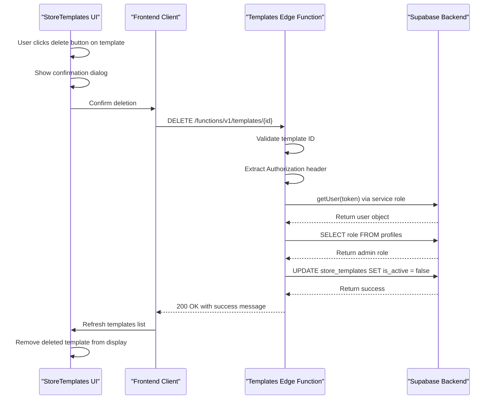

# Templates Function

<cite>
**Referenced Files in This Document**   
- [index.ts](file://supabase/functions/templates/index.ts)
- [template-service.ts](file://src/lib/template-service.ts)
- [TemplatesList.tsx](file://src/components/store-templates/TemplatesList.tsx)
- [StoreTemplates.tsx](file://src/pages/admin/StoreTemplates.tsx)
- [xml-template-service.ts](file://src/lib/xml-template-service.ts)
</cite>

## Table of Contents
1. [Introduction](#introduction)
2. [DELETE Endpoint Overview](#delete-endpoint-overview)
3. [Authentication and Authorization Flow](#authentication-and-authorization-flow)
4. [Supabase Service Role Key Usage](#supabase-service-role-key-usage)
5. [Request Validation and Error Handling](#request-validation-and-error-handling)
6. [Response Format](#response-format)
7. [Soft Deletion vs Hard Deletion](#soft-deletion-vs-hard-deletion)
8. [Frontend Integration](#frontend-integration)
9. [Data Model and UI Implications](#data-model-and-ui-implications)
10. [Sequence Diagram](#sequence-diagram)

## Introduction
This document provides comprehensive API documentation for the templates Edge Function in the lovable-rise application. The function manages XML store templates through a DELETE endpoint that performs soft deletion by setting the `is_active` field to `false` in the `store_templates` table. The function enforces strict authentication and authorization requirements, ensuring only authenticated admin users can delete templates. It leverages the Supabase service role key for elevated database permissions while maintaining a secure boundary between client and server operations.

**Section sources**
- [index.ts](file://supabase/functions/templates/index.ts#L1-L126)

## DELETE Endpoint Overview
The DELETE endpoint removes templates by ID through a soft deletion mechanism. The template ID is extracted from the URL path, and the operation sets `is_active` to `false` rather than permanently removing the record. This approach preserves template data for potential recovery while effectively removing it from active use in the application.

The endpoint follows REST conventions with proper HTTP status codes:
- 200 OK on successful deletion
- 400 Bad Request if template ID is missing
- 401 Unauthorized if authentication is missing or invalid
- 403 Forbidden if user lacks admin privileges
- 500 Internal Server Error for database or processing failures

**Section sources**
- [index.ts](file://supabase/functions/templates/index.ts#L15-L30)

## Authentication and Authorization Flow
The function implements a two-step verification process to ensure only authorized administrators can delete templates:

1. **Authentication**: The function extracts the Bearer token from the Authorization header and uses Supabase's `getUser` method to verify the token's validity and retrieve the user object.

2. **Authorization**: After successful authentication, the function queries the `profiles` table to check the user's role. Only users with the 'admin' role are permitted to perform template deletion.

This flow prevents unauthorized access while leveraging Supabase's built-in authentication system for reliable identity verification.



**Diagram sources**
- [index.ts](file://supabase/functions/templates/index.ts#L45-L90)

**Section sources**
- [index.ts](file://supabase/functions/templates/index.ts#L45-L90)

## Supabase Service Role Key Usage
The function uses the Supabase service role key to create a privileged client with elevated database permissions. This is essential because:

1. **Bypassing RLS**: The service role key bypasses Row Level Security (RLS) policies, allowing the function to update any template regardless of ownership.

2. **Admin Operations**: It enables operations that would otherwise be restricted to the application backend, such as direct database updates without client-side constraints.

3. **Security Boundary**: The key is stored in environment variables and never exposed to the client, maintaining a clear security boundary between frontend and backend operations.

The service role client is configured with `autoRefreshToken: false` and `persistSession: false` to minimize security risks and ensure stateless operation.

**Section sources**
- [index.ts](file://supabase/functions/templates/index.ts#L45-L55)

## Request Validation and Error Handling
The function implements comprehensive validation and error handling:

1. **URL Validation**: Extracts the template ID from the URL path and validates its presence. Returns 400 if missing or invalid.

2. **Header Validation**: Checks for the Authorization header and returns 401 if missing.

3. **Authentication Validation**: Verifies the token with Supabase auth and returns 401 for invalid tokens.

4. **Authorization Validation**: Confirms the user has admin role and returns 403 if not.

5. **Database Operation Handling**: Catches and logs database errors, returning appropriate 500 responses with error messages.

All errors are logged server-side for debugging while returning user-friendly messages to the client.

**Section sources**
- [index.ts](file://supabase/functions/templates/index.ts#L15-L125)

## Response Format
The function returns JSON responses with consistent structure:

Successful response (200 OK):
```json
{
  "success": true,
  "message": "Template deleted successfully"
}
```

Error responses include an error field with descriptive messages:
```json
{
  "error": "Template ID is required"
}
```

The function sets appropriate CORS headers to enable cross-origin requests from the frontend application, including:
- Access-Control-Allow-Origin: *
- Content-Type: application/json
- Other necessary CORS headers for preflight and actual requests

**Section sources**
- [index.ts](file://supabase/functions/templates/index.ts#L93-L125)

## Soft Deletion vs Hard Deletion
The function implements soft deletion by updating the `is_active` field to `false` rather than performing a hard delete. This approach has several implications:

**Advantages:**
- **Data Recovery**: Deleted templates can be restored by setting `is_active` back to `true`.
- **Referential Integrity**: Preserves relationships with other data that might reference the template.
- **Audit Trail**: Maintains a complete history of template usage and modifications.

**Implementation Details:**
- The frontend only displays templates where `is_active = true`
- The `updated_at` timestamp is updated during deletion for audit purposes
- No data is permanently lost, enabling potential future restoration

This contrasts with the `TemplateService.deleteTemplate` method in the frontend, which performs a hard delete using the client Supabase instance.

**Section sources**
- [index.ts](file://supabase/functions/templates/index.ts#L85-L90)
- [template-service.ts](file://src/lib/template-service.ts#L18-L36)

## Frontend Integration
The DELETE endpoint integrates with the frontend through the admin template management interface:

1. **StoreTemplates Component**: The main admin interface at `/admin/StoreTemplates` displays all active templates and provides delete functionality.

2. **TemplatesList Component**: Renders individual template cards with delete buttons that trigger the deletion workflow.

3. **Delete Confirmation**: Implements an AlertDialog to confirm deletion before proceeding, preventing accidental removal.

4. **Error Handling**: Uses toast notifications to inform users of success or failure states.

The frontend calls the Edge Function directly rather than using the standard Supabase client, ensuring the operation goes through the authenticated and authorized function layer.

**Section sources**
- [StoreTemplates.tsx](file://src/pages/admin/StoreTemplates.tsx#L0-L222)
- [TemplatesList.tsx](file://src/components/store-templates/TemplatesList.tsx#L0-L182)

## Data Model and UI Implications
The soft deletion approach affects both the data model and user interface:

**Data Model:**
- The `store_templates` table includes an `is_active` boolean column
- All queries for active templates must filter by `is_active = true`
- The `updated_at` field is updated on deletion for audit purposes
- Template relationships remain intact despite deletion

**User Interface:**
- Deleted templates disappear from the TemplatesList component
- The UI provides no direct way to restore deleted templates (future enhancement)
- Creation of new templates remains unaffected
- Editing functionality is disabled for deleted templates

The current implementation in `TemplatesList.tsx` shows a confirmation dialog with misleading text ("will be completely removed from the system") despite the soft deletion implementation, indicating a potential inconsistency between UI messaging and actual behavior.

**Section sources**
- [index.ts](file://supabase/functions/templates/index.ts#L85-L90)
- [TemplatesList.tsx](file://src/components/store-templates/TemplatesList.tsx#L130-L140)
- [StoreTemplates.tsx](file://src/pages/admin/StoreTemplates.tsx#L100-L110)

## Sequence Diagram
The following diagram illustrates the complete flow of the template deletion process from frontend to backend:



**Diagram sources**
- [index.ts](file://supabase/functions/templates/index.ts#L1-L126)
- [StoreTemplates.tsx](file://src/pages/admin/StoreTemplates.tsx#L0-L222)
- [TemplatesList.tsx](file://src/components/store-templates/TemplatesList.tsx#L0-L182)