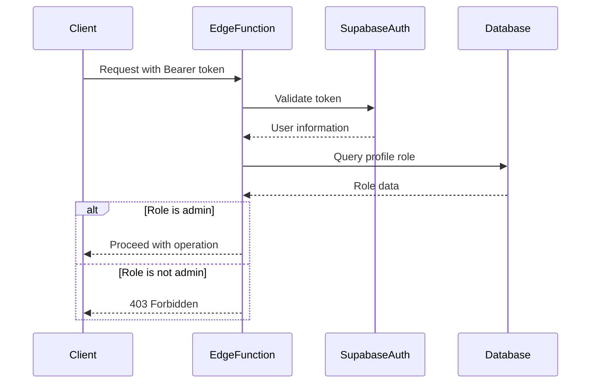
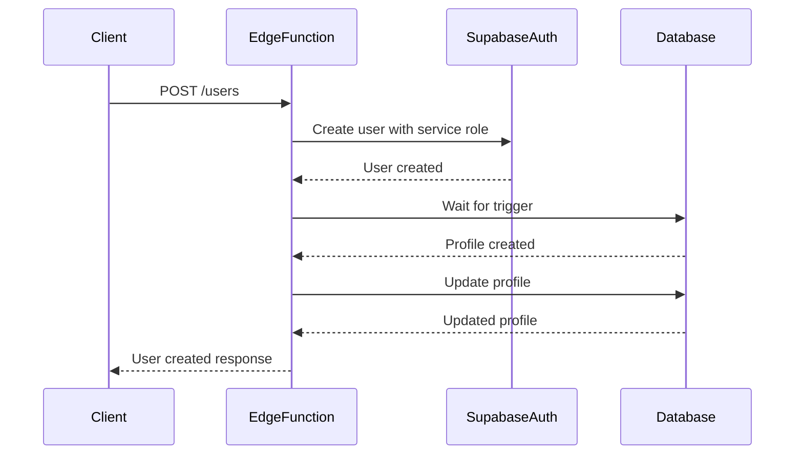
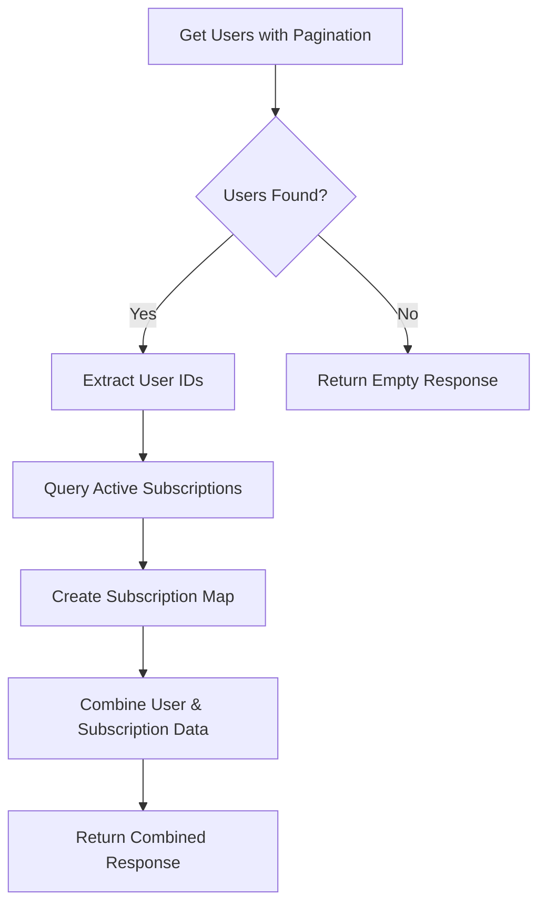
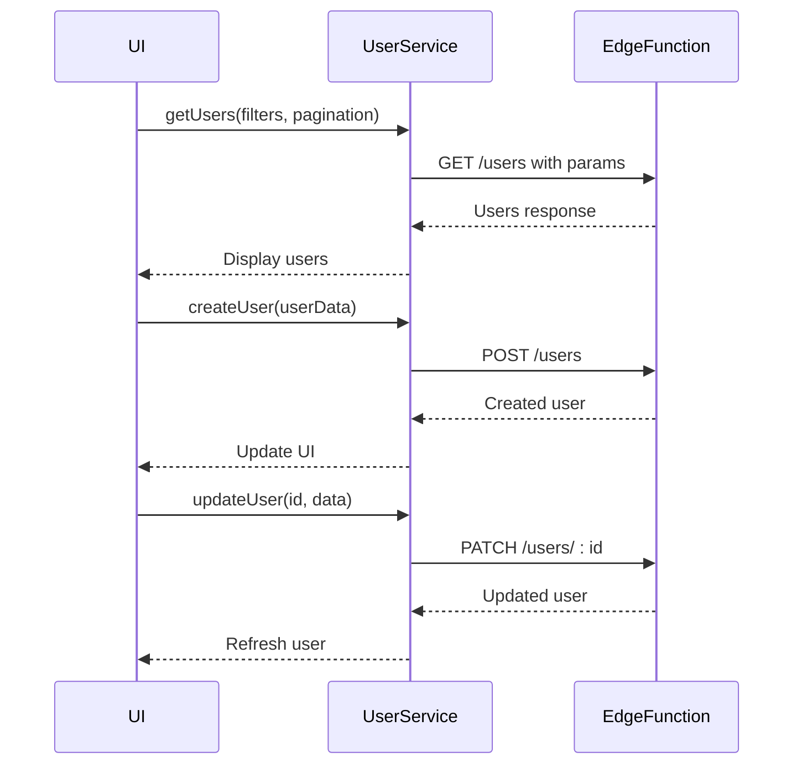

# Users Function

<cite>
**Referenced Files in This Document**   
- [users/index.ts](file://supabase/functions/users/index.ts)
- [user-service.ts](file://src/lib/user-service.ts)
- [user-auth-service.ts](file://src/lib/user-auth-service.ts)
- [admin-service.ts](file://src/lib/admin-service.ts)
- [client.ts](file://src/integrations/supabase/client.ts)
</cite>

## Table of Contents
1. [Introduction](#introduction)
2. [API Endpoints](#api-endpoints)
3. [Admin Permission System](#admin-permission-system)
4. [Supabase Auth Integration](#supabase-auth-integration)
5. [Data Fetching Strategy](#data-fetching-strategy)
6. [Request Parameters and Schemas](#request-parameters-and-schemas)
7. [Response Formats](#response-formats)
8. [Error Handling](#error-handling)
9. [Frontend Integration](#frontend-integration)
10. [Conclusion](#conclusion)

## Introduction
The Users Function in the lovable-rise application provides a comprehensive user management system through a Supabase Edge Function. This API enables administrators to perform CRUD operations on user accounts while maintaining proper security controls and integrating seamlessly with Supabase Auth. The function handles user retrieval, creation, updates, and deletion, with special attention to data consistency between Supabase Auth and the application's profiles table.

**Section sources**
- [users/index.ts](file://supabase/functions/users/index.ts#L1-L50)

## API Endpoints

### GET /users
Retrieves a paginated list of users with optional search and filtering capabilities. This endpoint supports pagination, sorting, and filtering by role and status.

### GET /users/:id
Fetches an individual user's profile information by their unique identifier.

### POST /users
Creates a new user account by integrating with Supabase Auth. This operation requires admin privileges and creates both an authentication record and a corresponding profile.

### PATCH /users/:id
Updates specific fields of an existing user's profile, including name, phone, role, and status.

### DELETE /users/:id
Removes a user account by deleting both their authentication record from Supabase Auth and their profile from the application database.

**Section sources**
- [users/index.ts](file://supabase/functions/users/index.ts#L133-L489)

## Admin Permission System
All write operations (POST, PATCH, DELETE) are protected by an admin permission system that verifies the requesting user's role. The `checkAdminPermission` function validates the Authorization header and confirms that the authenticated user has an 'admin' role in the profiles table.

The permission check follows these steps:
1. Extracts the Bearer token from the Authorization header
2. Validates the token with Supabase Auth
3. Retrieves the user's profile to check their role
4. Returns appropriate error responses for unauthorized or forbidden requests

This ensures that only users with administrative privileges can modify user accounts, preventing unauthorized access to sensitive user management functionality.



**Diagram sources**
- [users/index.ts](file://supabase/functions/users/index.ts#L25-L132)

**Section sources**
- [users/index.ts](file://supabase/functions/users/index.ts#L25-L132)

## Supabase Auth Integration
The Users Function integrates with Supabase Auth using service role keys to perform administrative operations on user accounts. This integration enables the function to create and delete users directly through Supabase's Admin API.

### User Creation Process
When creating a new user:
1. The function uses the service role key to access Supabase Auth Admin API
2. Creates the user with `createUser` method, including metadata for name and role
3. Waits briefly for the database trigger to create the profile record
4. Updates the profile with additional information like phone number

### User Deletion Process
When deleting a user:
1. The function removes the user from Supabase Auth using `deleteUser`
2. Simultaneously deletes the corresponding profile from the database
3. Returns a response indicating the success status of both operations

The integration uses separate Supabase clients: one with anonymous key for read operations and another with service role key for administrative operations, ensuring proper security separation.



**Diagram sources**
- [users/index.ts](file://supabase/functions/users/index.ts#L290-L321)
- [user-auth-service.ts](file://src/lib/user-auth-service.ts#L310-L329)

**Section sources**
- [users/index.ts](file://supabase/functions/users/index.ts#L290-L321)
- [user-auth-service.ts](file://src/lib/user-auth-service.ts#L310-L329)

## Data Fetching Strategy
The GET /users endpoint implements an optimized data fetching strategy that combines user profile information with their active subscription details in a single response. This approach eliminates the N+1 query problem and reduces the number of database calls required to display user information.

The optimization works as follows:
1. First retrieves the paginated list of users from the profiles table
2. Extracts the user IDs from the results
3. Makes a single query to fetch all active subscriptions for those users
4. Creates a Map for O(1) lookup of subscription data
5. Combines user and subscription data before returning the response

This strategy significantly improves performance, especially when displaying lists of users with their subscription information, by replacing potentially hundreds of individual queries with just two efficient database operations.



**Diagram sources**
- [users/index.ts](file://supabase/functions/users/index.ts#L156-L198)

**Section sources**
- [users/index.ts](file://supabase/functions/users/index.ts#L156-L198)

## Request Parameters and Schemas

### GET /users Parameters
- **page**: Page number (default: 1)
- **limit**: Items per page (default: 10)
- **sortBy**: Field to sort by (default: created_at)
- **sortOrder**: Sort direction (asc/desc, default: desc)
- **search**: Text to search in name and email
- **role**: Filter by user role (admin, manager, user, all)

### POST /users Request Body
```json
{
  "email": "string",
  "password": "string",
  "name": "string",
  "phone": "string",
  "role": "user"
}
```

### PATCH /users/:id Request Body
```json
{
  "name": "string",
  "phone": "string",
  "role": "string",
  "status": "active|inactive"
}
```

**Section sources**
- [users/index.ts](file://supabase/functions/users/index.ts#L133-L155)
- [users/index.ts](file://supabase/functions/users/index.ts#L322-L360)

## Response Formats

### GET /users Response
```json
{
  "users": [
    {
      "id": "string",
      "email": "string",
      "name": "string",
      "phone": "string",
      "role": "string",
      "status": "string",
      "created_at": "string",
      "updated_at": "string",
      "subscription": {
        "tariff_name": "string",
        "is_active": "boolean"
      }
    }
  ],
  "total": "number",
  "page": "number",
  "limit": "number"
}
```

### GET /users/:id Response
```json
{
  "user": {
    "id": "string",
    "email": "string",
    "name": "string",
    "phone": "string",
    "role": "string",
    "status": "string",
    "created_at": "string",
    "updated_at": "string"
  }
}
```

### POST /users Response
```json
{
  "user": {
    "id": "string",
    "email": "string",
    "name": "string",
    "phone": "string",
    "role": "string",
    "status": "string"
  }
}
```

### DELETE /users/:id Response
```json
{
  "success": "boolean",
  "deletedAuth": "boolean",
  "deletedProfile": "boolean"
}
```

**Section sources**
- [users/index.ts](file://supabase/functions/users/index.ts#L200-L250)
- [users/index.ts](file://supabase/functions/users/index.ts#L252-L260)
- [users/index.ts](file://supabase/functions/users/index.ts#L390-L410)
- [users/index.ts](file://supabase/functions/users/index.ts#L450-L470)

## Error Handling
The Users Function implements comprehensive error handling for various scenarios:

### Validation Errors (400)
- Missing required fields in user creation
- Invalid role values
- Empty or malformed request bodies
- Invalid content types

### Authentication Errors (401)
- Missing Authorization header
- Invalid or expired Bearer tokens
- Malformed authentication credentials

### Authorization Errors (403)
- Non-admin users attempting write operations
- Insufficient permissions for requested actions

### Conflict Errors (409)
- Duplicate email addresses during user creation
- Attempting to create users with existing emails

### Not Found Errors (404)
- Requested user ID does not exist
- Profile not found for authenticated user

### Server Errors (500)
- Database query failures
- Unexpected exceptions in the function
- Supabase client errors

The error responses include descriptive messages and, in some cases, debug information to aid in troubleshooting while maintaining security by not exposing sensitive system details.

**Section sources**
- [users/index.ts](file://supabase/functions/users/index.ts#L25-L132)
- [users/index.ts](file://supabase/functions/users/index.ts#L322-L360)
- [error-handler.ts](file://src/lib/error-handler.ts#L0-L72)

## Frontend Integration
The frontend admin interface utilizes the Users Function through the UserService class, which provides a clean API wrapper for all user management operations. The AdminUsersPage component demonstrates how these endpoints are used in practice.

Key integration points:
- **UsersTable**: Displays the paginated user list with subscription information
- **CreateUserDialog**: Handles new user creation through POST /users
- **EditUserDialog**: Manages user updates via PATCH /users/:id
- **DeleteUserDialog**: Confirms and executes user deletion

The UserService class handles authentication headers automatically, ensuring that admin operations include the necessary credentials while maintaining proper error handling and response parsing.



**Diagram sources**
- [user-service.ts](file://src/lib/user-service.ts#L81-L311)
- [AdminUsersPage.tsx](file://src/pages/admin/AdminUsersPage.tsx#L0-L47)

**Section sources**
- [user-service.ts](file://src/lib/user-service.ts#L81-L311)
- [AdminUsersPage.tsx](file://src/pages/admin/AdminUsersPage.tsx#L0-L47)

## Conclusion
The Users Function provides a robust and secure API for managing user accounts in the lovable-rise application. By leveraging Supabase Edge Functions and proper integration with Supabase Auth, it offers comprehensive user management capabilities while maintaining strict security controls through the admin permission system. The optimized data fetching strategy ensures efficient performance, and comprehensive error handling provides clear feedback for various scenarios. The frontend integration through the UserService class creates a seamless experience for administrators managing user accounts.