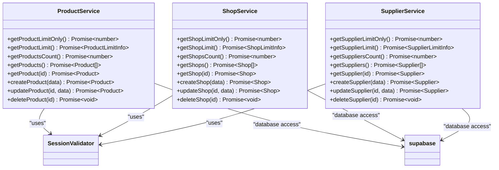
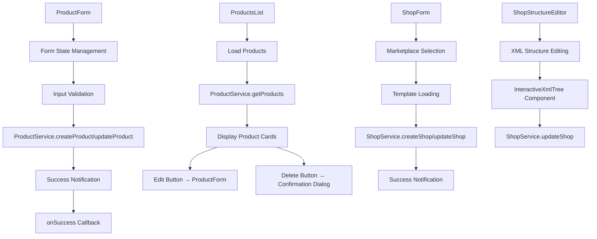
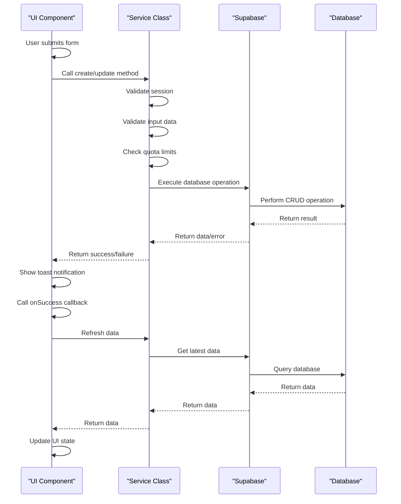

# Business Data Management

<cite>
**Referenced Files in This Document**   
- [ProductForm.tsx](file://src/components/user/products/ProductForm.tsx)
- [ProductsList.tsx](file://src/components/user/products/ProductsList.tsx)
- [ShopForm.tsx](file://src/components/user/shops/ShopForm.tsx)
- [ShopsList.tsx](file://src/components/user/shops/ShopsList.tsx)
- [ShopStructureEditor.tsx](file://src/components/user/shops/ShopStructureEditor.tsx)
- [SupplierForm.tsx](file://src/components/user/suppliers/SupplierForm.tsx)
- [SuppliersList.tsx](file://src/components/user/suppliers/SuppliersList.tsx)
- [product-service.ts](file://src/lib/product-service.ts)
- [shop-service.ts](file://src/lib/shop-service.ts)
- [supplier-service.ts](file://src/lib/supplier-service.ts)
</cite>

## Table of Contents
1. [Core Business Entities](#core-business-entities)
2. [CRUD Operations and Service Classes](#crud-operations-and-service-classes)
3. [UI Components for Data Management](#ui-components-for-data-management)
4. [Data Flow Architecture](#data-flow-architecture)
5. [Common Issues and Solutions](#common-issues-and-solutions)
6. [Performance Considerations](#performance-considerations)

## Core Business Entities

The lovable-rise application manages three core business entities: products, shops, and suppliers. Each entity represents a fundamental component of the e-commerce integration system. Products represent individual items that can be synchronized across marketplaces, shops represent the configured storefronts on various marketplaces, and suppliers represent the sources of product data through XML feeds.

These entities are managed through dedicated service classes that handle all data operations and enforce business rules. The application implements a user-specific data model where each entity is associated with a specific user account, ensuring data isolation between different users. Each entity follows a consistent pattern with creation and modification timestamps, active status flags, and UUID-based identifiers.

**Section sources**
- [product-service.ts](file://src/lib/product-service.ts#L3-L13)
- [shop-service.ts](file://src/lib/shop-service.ts#L4-L14)
- [supplier-service.ts](file://src/lib/supplier-service.ts#L3-L13)

## CRUD Operations and Service Classes

The application implements dedicated service classes for managing each business entity: ProductService, ShopService, and SupplierService. These services encapsulate all CRUD (Create, Read, Update, Delete) operations and provide a consistent interface for data management. Each service follows a static class pattern with methods that handle specific operations while enforcing business rules and validation.

For products, the ProductService currently has placeholder implementations as the user_products table is not yet created, with methods throwing "functionality temporarily unavailable" errors. For shops, the ShopService provides full CRUD operations that interact with the user_stores table in Supabase, including creation, retrieval, updating, and deletion of shop records. Similarly, the SupplierService manages supplier data through the user_suppliers table, with comprehensive validation for required fields like supplier name and XML feed URL.

All service methods implement comprehensive error handling and validation, including session validation to ensure authenticated access, input validation to prevent invalid data, and quota enforcement based on the user's subscription tier. The services also handle optimistic updates by automatically setting the updated_at timestamp when modifying records.

**Diagram sources**
- [product-service.ts](file://src/lib/product-service.ts#L36-L162)
- [shop-service.ts](file://src/lib/shop-service.ts#L36-L284)
- [supplier-service.ts](file://src/lib/supplier-service.ts#L34-L284)

**Section sources**
- [product-service.ts](file://src/lib/product-service.ts#L36-L162)
- [shop-service.ts](file://src/lib/shop-service.ts#L36-L284)
- [supplier-service.ts](file://src/lib/supplier-service.ts#L34-L284)

## UI Components for Data Management

The application provides dedicated UI components for managing each business entity, following a consistent design pattern across the system. For products, the ProductForm component provides a form interface for creating and editing products, while the ProductsList component displays all products in a card-based grid layout. Similarly, ShopForm and ShopsList handle shop management, and SupplierForm and SuppliersList manage supplier data.

The ProductForm implements a controlled component pattern with useState hooks to manage form state, including product name, description, price, and SKU. It includes client-side validation to ensure the product name is not empty before submission. The ProductsList component displays products in responsive cards that show key information like name, creation date, price, and SKU, with edit and delete actions available through icon buttons.

The ShopForm component includes additional complexity for marketplace selection, where users can choose a marketplace format that automatically loads the corresponding template configuration. The ShopStructureEditor component provides a specialized interface for editing the XML structure of a shop, implemented as a dialog that contains the InteractiveXmlTree component for visual XML editing.

**Diagram sources**
- [ProductForm.tsx](file://src/components/user/products/ProductForm.tsx#L17-L143)
- [ProductsList.tsx](file://src/components/user/products/ProductsList.tsx#L27-L184)
- [ShopForm.tsx](file://src/components/user/shops/ShopForm.tsx#L19-L205)
- [ShopStructureEditor.tsx](file://src/components/user/shops/ShopStructureEditor.tsx#L23-L99)

**Section sources**
- [ProductForm.tsx](file://src/components/user/products/ProductForm.tsx#L17-L143)
- [ProductsList.tsx](file://src/components/user/products/ProductsList.tsx#L27-L184)
- [ShopForm.tsx](file://src/components/user/shops/ShopForm.tsx#L19-L205)
- [ShopsList.tsx](file://src/components/user/shops/ShopsList.tsx#L32-L191)
- [SupplierForm.tsx](file://src/components/user/suppliers/SupplierForm.tsx#L20-L213)
- [SuppliersList.tsx](file://src/components/user/suppliers/SuppliersList.tsx#L27-L185)
- [ShopStructureEditor.tsx](file://src/components/user/shops/ShopStructureEditor.tsx#L23-L99)

## Data Flow Architecture

The data flow in the business data management system follows a consistent pattern from UI components through service classes to Supabase. When a user interacts with a form component like ProductForm or ShopForm, the component manages local state using React hooks and handles form submission through an onSubmit event handler. The form collects and validates input data before passing it to the corresponding service method.

The service classes act as intermediaries between the UI and the database, handling authentication validation, business logic, and data transformation. Each service method first validates the user's session using SessionValidator.ensureValidSession() to ensure the user is authenticated and has a valid access token. Then, the service constructs the appropriate Supabase query to perform the requested operation on the corresponding table (user_products, user_stores, or user_suppliers).

After a successful operation, the service returns data to the UI component, which typically triggers a success notification using the toast utility and calls an onSuccess callback to refresh the parent component's state. For list components, this triggers a reload of data from the service, ensuring the UI reflects the current state in the database. The system uses optimistic updates where appropriate, immediately reflecting changes in the UI while the database operation completes in the background.

**Diagram sources**
- [ProductForm.tsx](file://src/components/user/products/ProductForm.tsx#L17-L143)
- [product-service.ts](file://src/lib/product-service.ts#L36-L162)
- [ShopForm.tsx](file://src/components/user/shops/ShopForm.tsx#L19-L205)
- [shop-service.ts](file://src/lib/shop-service.ts#L36-L284)
- [SupplierForm.tsx](file://src/components/user/suppliers/SupplierForm.tsx#L20-L213)
- [supplier-service.ts](file://src/lib/supplier-service.ts#L34-L284)

**Section sources**
- [ProductForm.tsx](file://src/components/user/products/ProductForm.tsx#L17-L143)
- [product-service.ts](file://src/lib/product-service.ts#L36-L162)
- [ShopForm.tsx](file://src/components/user/shops/ShopForm.tsx#L19-L205)
- [shop-service.ts](file://src/lib/shop-service.ts#L36-L284)
- [SupplierForm.tsx](file://src/components/user/suppliers/SupplierForm.tsx#L20-L213)
- [supplier-service.ts](file://src/lib/supplier-service.ts#L34-L284)

## Common Issues and Solutions

The business data management system addresses several common issues through specific implementation patterns and solutions. One primary issue is data consistency across related entities, particularly between shops and their template configurations. The system solves this by loading the marketplace information from the store_templates table when displaying shops in the ShopsList component, ensuring users see the correct marketplace format even if templates are updated.

Another common issue is form validation and error handling. The SupplierForm implements comprehensive client-side validation with real-time error messages for required fields like supplier name and XML feed URL, including URL format validation using the URL constructor. The form also provides visual feedback by highlighting invalid fields with a red border, improving the user experience during data entry.

Quota enforcement is another critical issue addressed by the system. Each service class checks the user's subscription-based limits before allowing creation of new entities. For example, the ShopService verifies that the user hasn't reached their shop limit before creating a new shop, throwing a descriptive error message that prompts the user to upgrade their tariff plan if the limit is reached.

Session management issues are mitigated through the SessionValidator class, which ensures valid authentication tokens are available for database operations. This is particularly important for Row Level Security (RLS) in Supabase, where database queries depend on the authenticated user context. The validator automatically refreshes expired sessions when possible, reducing authentication-related errors during data operations.

**Section sources**
- [ShopsList.tsx](file://src/components/user/shops/ShopsList.tsx#L32-L191)
- [SupplierForm.tsx](file://src/components/user/suppliers/SupplierForm.tsx#L20-L213)
- [shop-service.ts](file://src/lib/shop-service.ts#L36-L284)
- [session-validation.ts](file://src/lib/session-validation.ts#L42-L343)

## Performance Considerations

The business data management system incorporates several performance considerations to ensure responsive user experiences during data operations. For data fetching, the system implements efficient querying patterns that retrieve only necessary data and use appropriate indexing in Supabase. The service methods use targeted SELECT statements and leverage Supabase's real-time capabilities where appropriate to minimize database load.

Form validation strategies prioritize client-side validation to provide immediate feedback without requiring server round-trips. The SupplierForm, for example, validates URL formats and required fields locally before attempting to save data, reducing unnecessary API calls. The system also implements loading states with visual indicators (spinners) during asynchronous operations, providing clear feedback to users during potentially slow operations.

For list components like ProductsList and ShopsList, the system handles empty states gracefully with informative messages and clear calls to action for creating new entities. The components also manage loading states with centered spinners during data retrieval, preventing layout shifts and providing a smooth user experience. The use of React's useEffect hook with dependency arrays ensures data is refreshed only when necessary, such as when a refreshTrigger prop changes.

The ShopStructureEditor component demonstrates a performance optimization by loading the XML structure editor only when the dialog is opened, rather than pre-loading all components. This lazy loading approach reduces initial page load time and memory usage, especially important for complex components like the InteractiveXmlTree that may handle large XML structures.

**Section sources**
- [ProductsList.tsx](file://src/components/user/products/ProductsList.tsx#L27-L184)
- [ShopsList.tsx](file://src/components/user/shops/ShopsList.tsx#L32-L191)
- [SupplierForm.tsx](file://src/components/user/suppliers/SupplierForm.tsx#L20-L213)
- [ShopStructureEditor.tsx](file://src/components/user/shops/ShopStructureEditor.tsx#L23-L99)