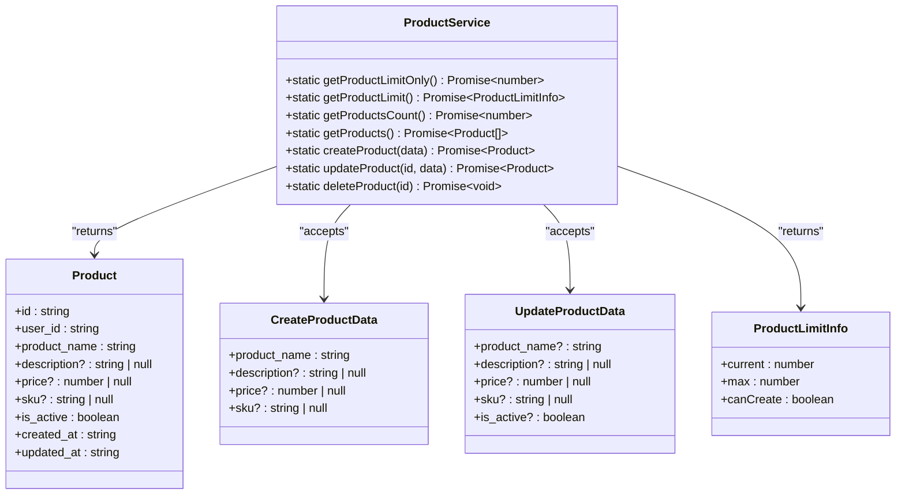
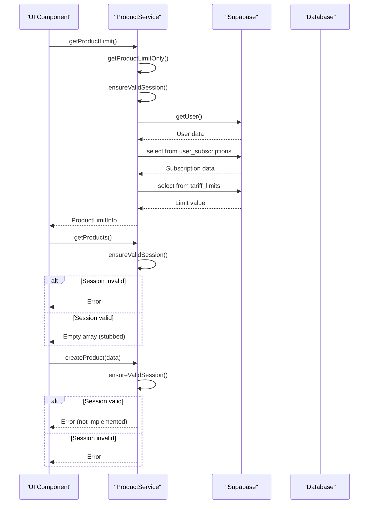
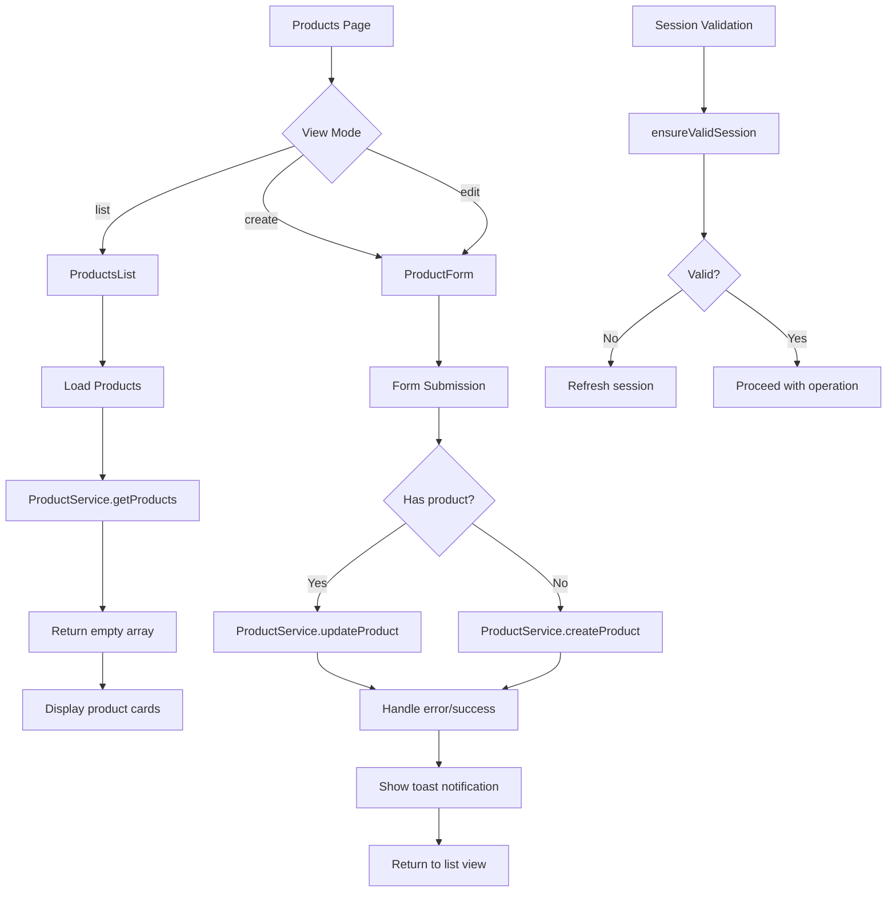
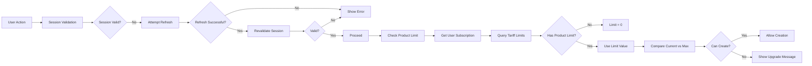
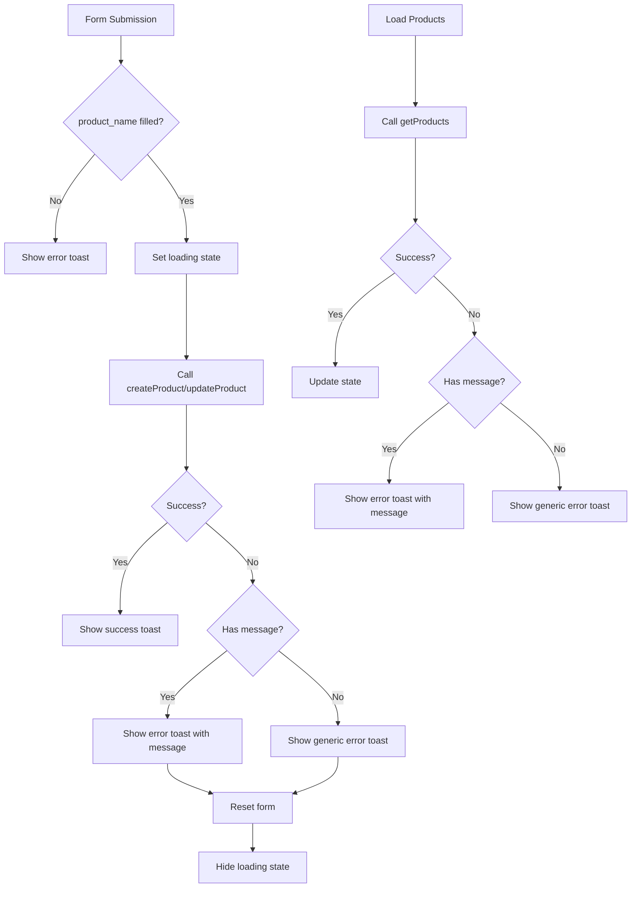

# Product Management

<cite>
**Referenced Files in This Document**   
- [product-service.ts](file://src/lib/product-service.ts)
- [ProductsList.tsx](file://src/components/user/products/ProductsList.tsx)
- [ProductForm.tsx](file://src/components/user/products/ProductForm.tsx)
- [Products.tsx](file://src/pages/user/Products.tsx)
- [session-validation.ts](file://src/lib/session-validation.ts)
</cite>

## Table of Contents
1. [Introduction](#introduction)
2. [Core Components](#core-components)
3. [CRUD Operations Implementation](#crud-operations-implementation)
4. [UI Component Integration](#ui-component-integration)
5. [Access Control and Limit Enforcement](#access-control-and-limit-enforcement)
6. [Error Handling and Validation](#error-handling-and-validation)
7. [Future Implementation Guidance](#future-implementation-guidance)

## Introduction
The Product Management feature in the lovable-rise application provides a comprehensive interface for managing product data with strict access control and subscription-based limitations. Currently, the functionality is stubbed with placeholder returns as the underlying database schema is not yet implemented. This document details the implementation of CRUD operations through the ProductService class, explains the interaction between UI components and service layer via React hooks and Supabase integration, and provides guidance for future implementation when the database schema is created.

**Section sources**
- [product-service.ts](file://src/lib/product-service.ts#L3-L162)

## Core Components

The Product Management feature consists of several core components that work together to provide a seamless user experience. The ProductService class serves as the central service layer that handles all product-related operations, while React components provide the user interface. The system implements robust session validation and tariff-based access control to ensure secure data access.

**Diagram sources**
- [product-service.ts](file://src/lib/product-service.ts#L3-L34)

**Section sources**
- [product-service.ts](file://src/lib/product-service.ts#L3-L162)

## CRUD Operations Implementation

The ProductService class implements CRUD operations for product management, with all methods currently returning placeholder values or throwing errors due to the absence of the user_products database table. The implementation follows a static method pattern, allowing direct access to functionality without instantiation.

The getProductLimitOnly method retrieves the maximum product limit for the current user by first validating the session, then fetching the user's active subscription, and finally querying the tariff_limits table for the product limit associated with the user's tariff plan. This method uses case-insensitive matching on the limit_name field to find product-related limits.

The getProductLimit method combines the maximum limit from getProductLimitOnly with the current product count (currently hardcoded to 0) to determine if the user can create additional products. This method returns a ProductLimitInfo object containing the current count, maximum allowed, and a boolean indicating creation capability.

All data retrieval methods (getProductsCount, getProducts) currently return placeholder values (0 and empty array respectively) with TODO comments indicating where the actual Supabase queries should be implemented once the user_products table is created. Similarly, all mutation methods (createProduct, updateProduct, deleteProduct) currently throw descriptive errors indicating that the functionality is temporarily unavailable.

**Diagram sources**
- [product-service.ts](file://src/lib/product-service.ts#L36-L162)

**Section sources**
- [product-service.ts](file://src/lib/product-service.ts#L36-L162)

## UI Component Integration

The UI components for product management are built using React and integrate with the service layer through React hooks and Supabase. The ProductsList component displays a grid of product cards with edit and delete functionality, while the ProductForm component provides a form interface for creating and editing products.

The Products component page orchestrates the overall product management interface, managing state for view mode (list, create, edit), selected product, and refresh triggers. It uses the useBreadcrumbs and useI18n hooks for navigation and internationalization respectively. The component renders either the ProductsList or ProductForm based on the current view mode, with appropriate callbacks for editing, creating, and deleting products.

The ProductForm component implements form validation with required field checking (product_name) and handles both creation and update scenarios. It manages form state with useState and uses useEffect to populate form fields when editing an existing product. Form submission is handled with proper loading states and error handling, with success messages displayed using the toast notification system.

**Diagram sources**
- [Products.tsx](file://src/pages/user/Products.tsx#L28-L77)
- [ProductForm.tsx](file://src/components/user/products/ProductForm.tsx#L38-L71)
- [ProductsList.tsx](file://src/components/user/products/ProductsList.tsx#L49-L49)

**Section sources**
- [Products.tsx](file://src/pages/user/Products.tsx#L28-L77)
- [ProductForm.tsx](file://src/components/user/products/ProductForm.tsx#L38-L71)
- [ProductsList.tsx](file://src/components/user/products/ProductsList.tsx#L49-L49)

## Access Control and Limit Enforcement

The system implements robust access control and limit enforcement through session validation and tariff-based subscription checks. The SessionValidator class ensures that all operations are performed with a valid authentication session, automatically refreshing expired sessions when possible.

The getProductLimitOnly method enforces tariff-based access control by querying the user's active subscription and retrieving the corresponding product limit from the tariff_limits table. The system uses the ilike operator with a pattern match on '%товар%' to find product-related limits, allowing for flexible naming conventions in the database.

The Products page component enforces creation limits by checking the canCreate flag in the ProductLimitInfo object before allowing new product creation. When the limit is reached, a toast notification informs the user that they need to upgrade their plan. The UI displays the current product count and maximum limit in the page header, providing users with clear visibility into their usage.

**Diagram sources**
- [product-service.ts](file://src/lib/product-service.ts#L36-L83)
- [session-validation.ts](file://src/lib/session-validation.ts#L120-L153)

**Section sources**
- [product-service.ts](file://src/lib/product-service.ts#L36-L83)
- [session-validation.ts](file://src/lib/session-validation.ts#L120-L153)

## Error Handling and Validation

The system implements comprehensive error handling and validation at multiple levels. The ProductService methods validate session state before proceeding with any database operations, throwing descriptive errors when sessions are invalid or expired. The SessionValidator class provides detailed error information to help diagnose authentication issues.

The ProductForm component implements client-side validation for required fields, preventing submission when the product_name field is empty. Form submission errors are caught and displayed using the toast notification system, with fallback error messages for unexpected errors. The component also handles loading states to prevent duplicate submissions.

The ProductsList component handles errors during product loading, displaying toast notifications with appropriate error messages. The delete operation includes confirmation through an AlertDialog component, preventing accidental deletions. All Supabase operations are wrapped in try-catch blocks to handle potential network or database errors gracefully.

**Diagram sources**
- [ProductForm.tsx](file://src/components/user/products/ProductForm.tsx#L38-L71)
- [ProductsList.tsx](file://src/components/user/products/ProductsList.tsx#L49-L49)

**Section sources**
- [ProductForm.tsx](file://src/components/user/products/ProductForm.tsx#L38-L71)
- [ProductsList.tsx](file://src/components/user/products/ProductsList.tsx#L49-L49)

## Future Implementation Guidance

When the user_products table is created in the database, several components will need to be updated to implement the full product management functionality. The ProductService class contains TODO comments indicating where the stubbed implementations should be replaced with actual database operations.

The getProductsCount and getProducts methods should have their commented Supabase queries uncommented and updated to use the proper table name (user_products). These methods should include proper error handling and return appropriate values based on query results. The session validation should be re-enabled to ensure only authenticated users can access product data.

The createProduct, updateProduct, deleteProduct, and getProduct methods should be updated to perform actual database operations using Supabase's from() and appropriate query methods. These methods should maintain the existing error handling patterns and include proper type safety.

The Products page component may need minor adjustments to handle the transition from stubbed to real data, particularly in how it manages the product count and refresh triggers. The existing architecture is designed to accommodate the full implementation with minimal changes to the UI components.

**Section sources**
- [product-service.ts](file://src/lib/product-service.ts#L84-L160)