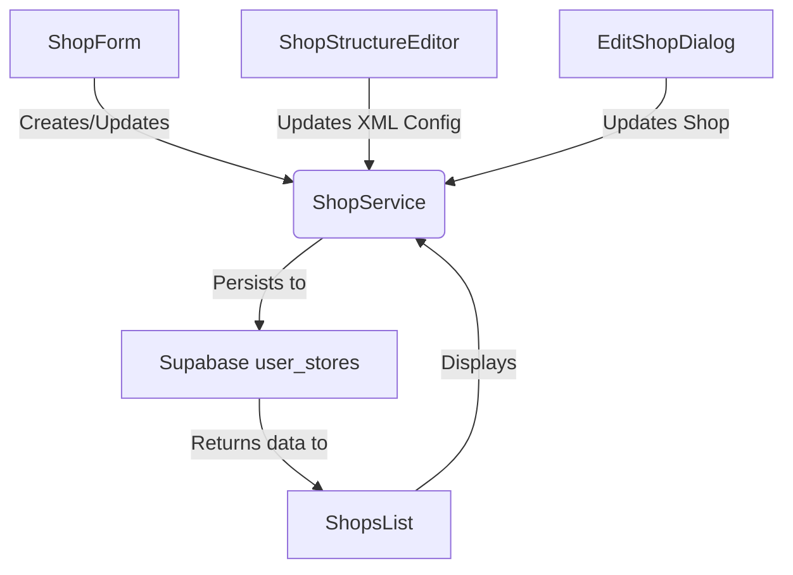
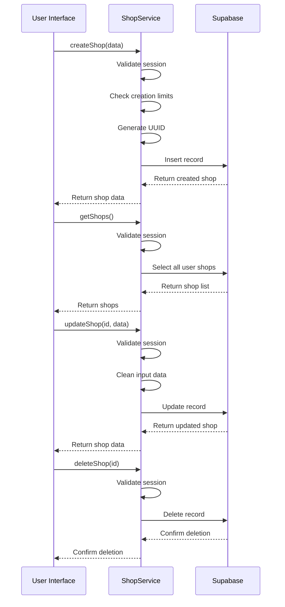
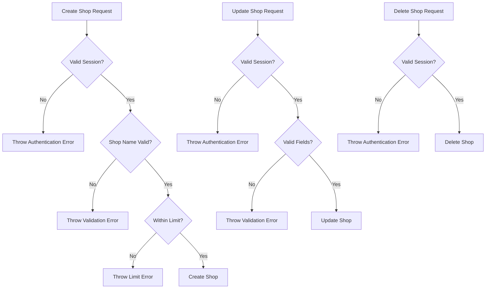
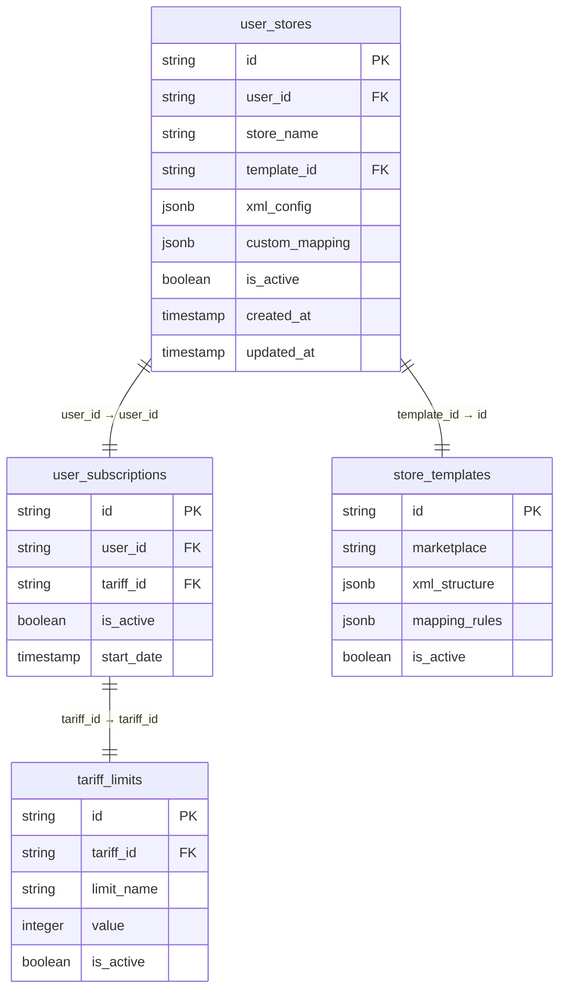

# Shop Management

<cite>
**Referenced Files in This Document**   
- [shop-service.ts](file://src/lib/shop-service.ts)
- [ShopForm.tsx](file://src/components/user/shops/ShopForm.tsx)
- [ShopsList.tsx](file://src/components/user/shops/ShopsList.tsx)
- [ShopStructureEditor.tsx](file://src/components/user/shops/ShopStructureEditor.tsx)
- [EditShopDialog.tsx](file://src/components/user/shops/EditShopDialog.tsx)
</cite>

## Table of Contents
1. [Introduction](#introduction)
2. [Core Components](#core-components)
3. [ShopService CRUD Operations](#shopservice-crud-operations)
4. [Business Rule Enforcement](#business-rule-enforcement)
5. [Data Flow and Component Integration](#data-flow-and-component-integration)
6. [Performance Considerations](#performance-considerations)
7. [Error Handling Strategies](#error-handling-strategies)
8. [Conclusion](#conclusion)

## Introduction
The Shop Management feature in the lovable-rise application enables users to create, view, edit, and delete their online stores through a comprehensive set of CRUD operations. This functionality is centered around the ShopService class, which interfaces with Supabase to manage shop data in the user_stores table. The system enforces business rules related to user ownership, shop name validation, and tariff-based creation limits, ensuring data integrity and subscription compliance. The feature integrates with multiple UI components including ShopForm, ShopsList, and ShopStructureEditor to provide a seamless user experience for managing e-commerce stores.

**Section sources**
- [shop-service.ts](file://src/lib/shop-service.ts#L1-L285)
- [ShopsList.tsx](file://src/components/user/shops/ShopsList.tsx#L1-L192)

## Core Components

The Shop Management system consists of several key components that work together to provide a complete user experience. The ShopService class serves as the central business logic layer, handling all data operations and business rule enforcement. The ShopForm component provides the interface for creating and editing shops, while ShopsList displays all available shops in a grid layout. The ShopStructureEditor allows users to modify XML configuration for their stores, and EditShopDialog provides a focused interface for updating shop details.

**Diagram sources**
- [shop-service.ts](file://src/lib/shop-service.ts#L1-L285)
- [ShopForm.tsx](file://src/components/user/shops/ShopForm.tsx#L1-L206)
- [ShopsList.tsx](file://src/components/user/shops/ShopsList.tsx#L1-L192)

**Section sources**
- [shop-service.ts](file://src/lib/shop-service.ts#L1-L285)
- [ShopForm.tsx](file://src/components/user/shops/ShopForm.tsx#L1-L206)
- [ShopsList.tsx](file://src/components/user/shops/ShopsList.tsx#L1-L192)
- [ShopStructureEditor.tsx](file://src/components/user/shops/ShopStructureEditor.tsx#L1-L100)
- [EditShopDialog.tsx](file://src/components/user/shops/EditShopDialog.tsx#L1-L209)

## ShopService CRUD Operations

The ShopService class implements full CRUD operations for managing user stores. The getShops method retrieves all shops for the authenticated user, ordered by creation date in descending order. The createShop method generates a new shop with a unique ID using crypto.randomUUID() and associates it with the current user. The updateShop method allows modification of shop properties including name, template, and configuration data. The deleteShop method removes a shop by its ID, enforcing user ownership through session validation.

**Diagram sources**
- [shop-service.ts](file://src/lib/shop-service.ts#L1-L285)

**Section sources**
- [shop-service.ts](file://src/lib/shop-service.ts#L86-L284)

## Business Rule Enforcement

The ShopService enforces several critical business rules to maintain data integrity and subscription compliance. Shop name validation requires a non-empty, trimmed name for both creation and updates. The system implements tariff-based creation limits by checking the user's active subscription and retrieving the maximum allowed shops from the tariff_limits table. User ownership is enforced through session validation on all operations, ensuring users can only access their own shops. The getShopLimit method combines current shop count with the maximum allowed to determine if a user can create additional shops.

**Diagram sources**
- [shop-service.ts](file://src/lib/shop-service.ts#L36-L284)

**Section sources**
- [shop-service.ts](file://src/lib/shop-service.ts#L36-L284)

## Data Flow and Component Integration

The data flow for shop management begins with user interaction in UI components like ShopForm and propagates through ShopService to Supabase's user_stores table. When creating a new shop, the ShopForm component collects user input and calls createShop, which generates a UUID and persists the data. The ShopsList component displays existing shops by calling getShops and enriches the data with marketplace information from store_templates. The ShopStructureEditor allows modification of XML configuration by calling updateShop with the xml_config field. All components use optimistic UI updates with loading states and toast notifications for feedback.

**Diagram sources**
- [shop-service.ts](file://src/lib/shop-service.ts#L1-L285)
- [ShopForm.tsx](file://src/components/user/shops/ShopForm.tsx#L1-L206)
- [ShopsList.tsx](file://src/components/user/shops/ShopsList.tsx#L1-L192)
- [ShopStructureEditor.tsx](file://src/components/user/shops/ShopStructureEditor.tsx#L1-L100)

**Section sources**
- [shop-service.ts](file://src/lib/shop-service.ts#L1-L285)
- [ShopForm.tsx](file://src/components/user/shops/ShopForm.tsx#L1-L206)
- [ShopsList.tsx](file://src/components/user/shops/ShopsList.tsx#L1-L192)
- [ShopStructureEditor.tsx](file://src/components/user/shops/ShopStructureEditor.tsx#L1-L100)

## Performance Considerations

The Shop Management system implements several performance optimizations to ensure responsive user experiences. The getShopsCount method uses an efficient count query with { count: 'exact', head: true } to minimize data transfer when only the count is needed. The getShopLimit method combines the maximum limit retrieval with the current count to reduce database round trips. The ShopsList component uses Promise.all to parallelize marketplace lookups for multiple shops, reducing overall load time. The system avoids unnecessary re-renders by using proper state management and dependency arrays in useEffect hooks.

**Section sources**
- [shop-service.ts](file://src/lib/shop-service.ts#L86-L124)
- [ShopsList.tsx](file://src/components/user/shops/ShopsList.tsx#L1-L192)

## Error Handling Strategies

The Shop Management system implements comprehensive error handling at both the service and component levels. The ShopService class validates inputs, checks session validity, and handles database errors with appropriate error messages. All service methods include try-catch blocks with detailed error logging and user-friendly error messages. The UI components display errors through toast notifications and form validation feedback. The system distinguishes between different error types including authentication errors, validation errors, and database errors, providing specific guidance for each case. The delete operation uses a confirmation dialog to prevent accidental data loss.

**Section sources**
- [shop-service.ts](file://src/lib/shop-service.ts#L1-L285)
- [ShopForm.tsx](file://src/components/user/shops/ShopForm.tsx#L1-L206)
- [ShopsList.tsx](file://src/components/user/shops/ShopsList.tsx#L1-L192)
- [EditShopDialog.tsx](file://src/components/user/shops/EditShopDialog.tsx#L1-L209)

## Conclusion
The Shop Management feature in lovable-rise provides a robust and user-friendly interface for managing e-commerce stores. By implementing comprehensive CRUD operations through the ShopService class, enforcing business rules related to validation and subscription limits, and integrating seamlessly with UI components, the system delivers a complete solution for store management. The architecture prioritizes data integrity, performance, and user experience, making it a reliable foundation for the application's e-commerce functionality.