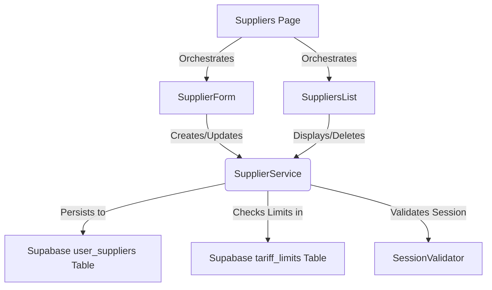
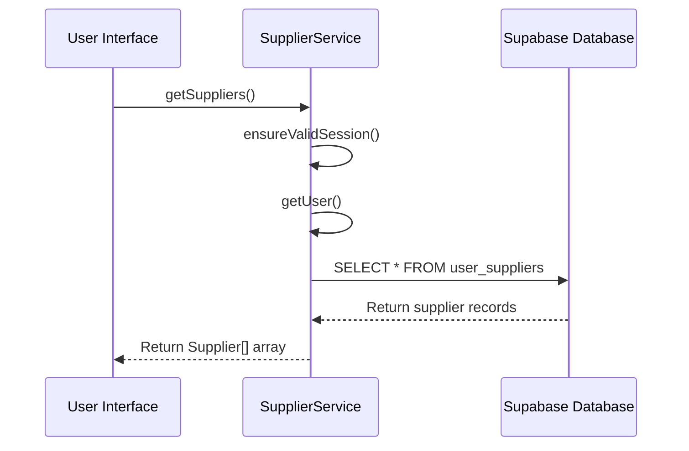
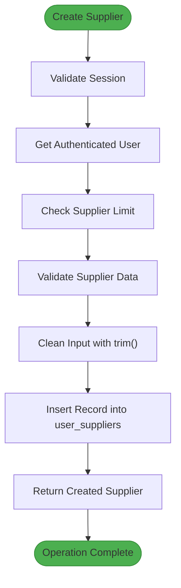
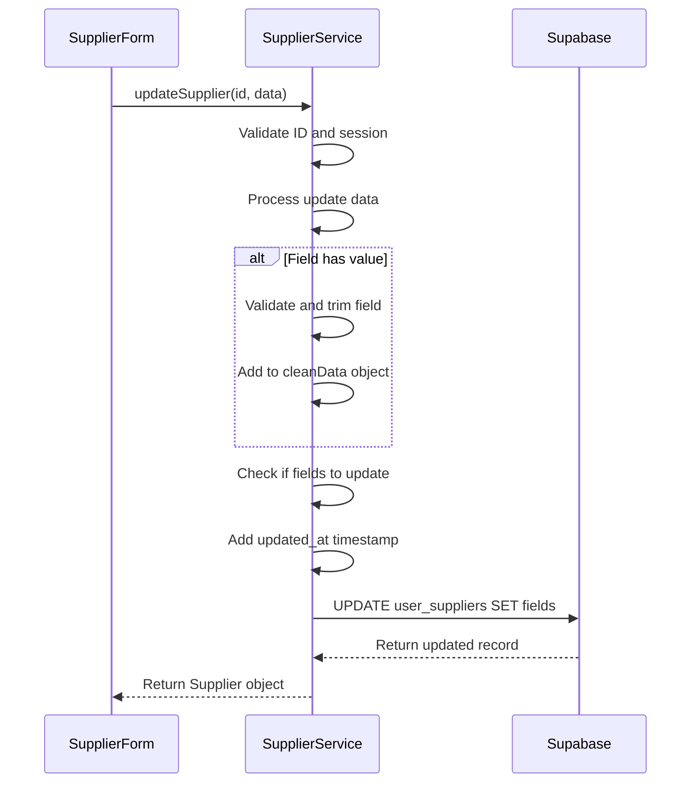
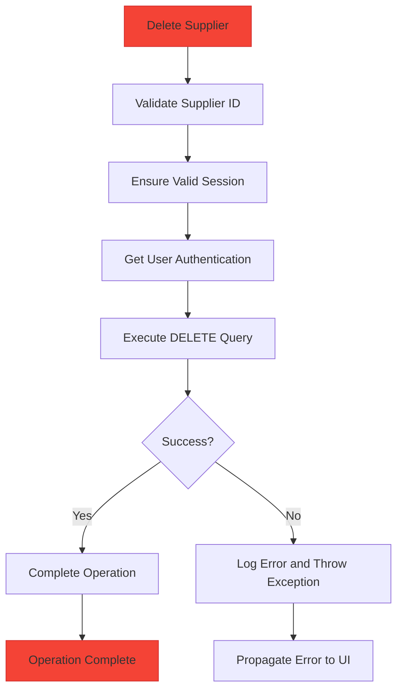
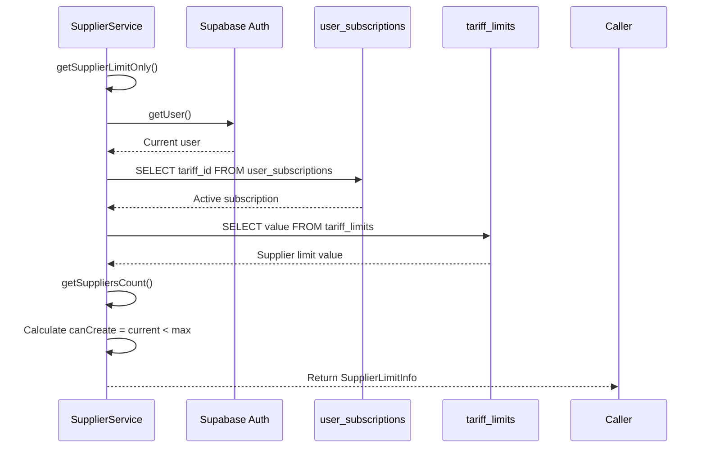
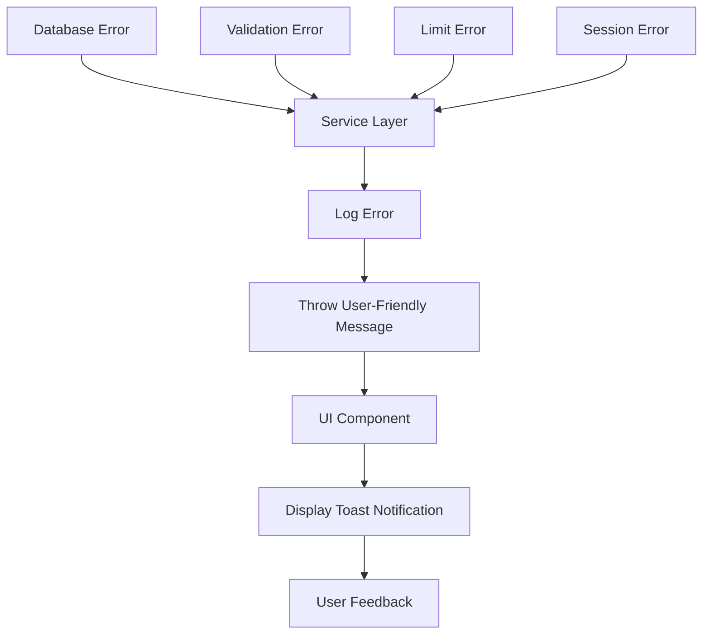

# Supplier Management

<cite>
**Referenced Files in This Document**   
- [supplier-service.ts](file://src/lib/supplier-service.ts)
- [SupplierForm.tsx](file://src/components/user/suppliers/SupplierForm.tsx)
- [SuppliersList.tsx](file://src/components/user/suppliers/SuppliersList.tsx)
- [Suppliers.tsx](file://src/pages/user/Suppliers.tsx)
</cite>

## Table of Contents
1. [Introduction](#introduction)
2. [Core Components](#core-components)
3. [CRUD Operations Implementation](#crud-operations-implementation)
4. [Data Validation and Integrity](#data-validation-and-integrity)
5. [Subscription-Based Limits Enforcement](#subscription-based-limits-enforcement)
6. [Integration with Supabase](#integration-with-supabase)
7. [Error Handling and User Feedback](#error-handling-and-user-feedback)
8. [Common Issues and Solutions](#common-issues-and-solutions)

## Introduction
The Supplier Management feature in the lovable-rise application provides a comprehensive solution for managing supplier information within the system. This documentation details the implementation of CRUD (Create, Read, Update, Delete) operations through the SupplierService, focusing on the key methods: getSupplierLimit, getSuppliers, createSupplier, updateSupplier, and deleteSupplier. The system integrates with Supabase for data persistence and implements robust validation, subscription-based limits, and error handling to ensure data integrity and a seamless user experience.

## Core Components
The Supplier Management feature consists of several interconnected components that work together to provide a complete solution for managing supplier data. The architecture follows a clear separation of concerns between the service layer, UI components, and data storage.



**Diagram sources**
- [supplier-service.ts](file://src/lib/supplier-service.ts)
- [SupplierForm.tsx](file://src/components/user/suppliers/SupplierForm.tsx)
- [SuppliersList.tsx](file://src/components/user/suppliers/SuppliersList.tsx)
- [Suppliers.tsx](file://src/pages/user/Suppliers.tsx)

**Section sources**
- [supplier-service.ts](file://src/lib/supplier-service.ts)
- [SupplierForm.tsx](file://src/components/user/suppliers/SupplierForm.tsx)
- [SuppliersList.tsx](file://src/components/user/suppliers/SuppliersList.tsx)

## CRUD Operations Implementation
The SupplierService class implements the core CRUD operations for managing supplier data. Each operation follows a consistent pattern of session validation, data processing, and database interaction.

### Read Operations
The service provides multiple methods for retrieving supplier data:

- **getSuppliers**: Retrieves all suppliers for the current user, ordered by creation date in descending order
- **getSupplier**: Retrieves a specific supplier by ID using the single() method for record retrieval
- **getSuppliersCount**: Returns the count of suppliers for the current user



**Diagram sources**
- [supplier-service.ts](file://src/lib/supplier-service.ts#L124-L170)

**Section sources**
- [supplier-service.ts](file://src/lib/supplier-service.ts#L124-L170)
- [SuppliersList.tsx](file://src/components/user/suppliers/SuppliersList.tsx#L42-L101)

### Create Operation
The createSupplier method handles the creation of new suppliers with comprehensive validation and limit checking:



**Diagram sources**
- [supplier-service.ts](file://src/lib/supplier-service.ts#L172-L211)

**Section sources**
- [supplier-service.ts](file://src/lib/supplier-service.ts#L172-L211)
- [SupplierForm.tsx](file://src/components/user/suppliers/SupplierForm.tsx#L59-L104)

### Update Operation
The updateSupplier method implements partial updates with field-specific validation:



**Diagram sources**
- [supplier-service.ts](file://src/lib/supplier-service.ts#L205-L244)

**Section sources**
- [supplier-service.ts](file://src/lib/supplier-service.ts#L205-L244)
- [SupplierForm.tsx](file://src/components/user/suppliers/SupplierForm.tsx#L59-L104)

### Delete Operation
The deleteSupplier method handles supplier deletion with proper error handling:



**Diagram sources**
- [supplier-service.ts](file://src/lib/supplier-service.ts#L242-L284)

**Section sources**
- [supplier-service.ts](file://src/lib/supplier-service.ts#L242-L284)
- [SuppliersList.tsx](file://src/components/user/suppliers/SuppliersList.tsx#L42-L101)

## Data Validation and Integrity
The Supplier Management system implements comprehensive validation at multiple levels to ensure data integrity and prevent invalid entries.

### Field Validation
Critical fields are validated both in the service layer and the UI component:

- **supplier_name**: Required field, must have content after trim()
- **xml_feed_url**: Required field, must have content after trim()
- **website_url**: Optional field, trimmed if provided
- **phone**: Optional field, trimmed if provided

```mermaid
graph TD
A[User Input] --> B{Field Type}
B --> |Required| C[Check for Empty/Whitespace]
B --> |URL Field| D[Validate URL Format]
B --> |Optional| E[Trim and Nullify Empty]
C --> F[Apply trim() Method]
D --> F
E --> F
F --> G[Store Cleaned Data]
style C fill:#FFC107,stroke:#FFA000
style D fill:#FFC107,stroke:#FFA000
style E fill:#FFC107,stroke:#FFA000
```

**Diagram sources**
- [supplier-service.ts](file://src/lib/supplier-service.ts#L172-L211)
- [SupplierForm.tsx](file://src/components/user/suppliers/SupplierForm.tsx#L41-L64)

**Section sources**
- [supplier-service.ts](file://src/lib/supplier-service.ts#L172-L211)
- [SupplierForm.tsx](file://src/components/user/suppliers/SupplierForm.tsx#L41-L64)

### Input Sanitization
The system uses the trim() method extensively to sanitize user input and prevent storage of whitespace-only values:

- All text fields are processed with trim() before validation
- Empty strings after trimming are treated as null values
- The SupplierForm component applies trim() both during validation and when preparing data for submission

## Subscription-Based Limits Enforcement
The system implements subscription-based limits to control the number of suppliers a user can create based on their tariff plan.

### Limit Calculation Process


**Diagram sources**
- [supplier-service.ts](file://src/lib/supplier-service.ts#L42-L89)

**Section sources**
- [supplier-service.ts](file://src/lib/supplier-service.ts#L34-L89)
- [Suppliers.tsx](file://src/pages/user/Suppliers.tsx#L23-L78)

### Limit Enforcement
The createSupplier method enforces limits by:

1. Retrieving the current supplier limit information
2. Comparing the current count against the maximum allowed
3. Preventing creation if the limit is reached
4. Displaying an appropriate error message suggesting plan upgrade

## Integration with Supabase
The Supplier Management feature integrates with Supabase for data persistence and authentication.

### Database Schema
The system uses the user_suppliers table in Supabase with the following structure:

| Column | Type | Description |
|-------|------|-------------|
| id | string | Unique identifier |
| user_id | string | Foreign key to users table |
| supplier_name | string | Name of the supplier (required) |
| website_url | string | Supplier website URL (optional) |
| xml_feed_url | string | XML feed URL (required) |
| phone | string | Contact phone number (optional) |
| created_at | string | Creation timestamp |
| updated_at | string | Last update timestamp |

**Section sources**
- [supplier-service.ts](file://src/lib/supplier-service.ts#L3-L18)

### Data Flow
The integration follows a consistent pattern:

1. Session validation using SessionValidator
2. User authentication via supabase.auth.getUser()
3. Database operations using Supabase client
4. Error handling and propagation to the UI

## Error Handling and User Feedback
The system implements comprehensive error handling to provide meaningful feedback to users.

### Error Propagation
Errors are handled at multiple levels:



**Section sources**
- [supplier-service.ts](file://src/lib/supplier-service.ts)
- [SupplierForm.tsx](file://src/components/user/suppliers/SupplierForm.tsx#L59-L104)
- [SuppliersList.tsx](file://src/components/user/suppliers/SuppliersList.tsx#L42-L101)

### User Feedback Mechanisms
The system uses multiple methods to communicate with users:

- **Toast notifications**: Success and error messages using the sonner library
- **Form validation**: Real-time feedback on invalid fields
- **Visual indicators**: Destructive styling for error states
- **Action disabling**: Buttons disabled during processing or when limits are reached

## Common Issues and Solutions
The Supplier Management system addresses several common issues that may arise during use.

### Invalid URLs
**Issue**: Users entering malformed XML feed URLs
**Solution**: The SupplierForm validates URL format using the URL constructor:
```typescript
try {
  new URL(formData.xml_feed_url);
} catch {
  newErrors.xml_feed_url = "Invalid URL format";
}
```

**Section sources**
- [SupplierForm.tsx](file://src/components/user/suppliers/SupplierForm.tsx#L41-L64)

### Exceeding Supplier Limits
**Issue**: Users attempting to create suppliers when their limit is reached
**Solution**: The system checks limits before creation and provides clear feedback:
```typescript
if (!limitInfo.canCreate) {
  throw new Error(`Supplier limit reached (${limitInfo.max}). Upgrade plan.`);
}
```

**Section sources**
- [supplier-service.ts](file://src/lib/supplier-service.ts#L172-L211)
- [Suppliers.tsx](file://src/pages/user/Suppliers.tsx#L23-L78)

### Session Expiration
**Issue**: Operations failing due to expired sessions
**Solution**: The SessionValidator ensures valid sessions before operations:
```typescript
const sessionValidation = await SessionValidator.ensureValidSession();
if (!sessionValidation.isValid) {
  throw new Error("Invalid session: " + sessionValidation.error);
}
```

**Section sources**
- [supplier-service.ts](file://src/lib/supplier-service.ts)