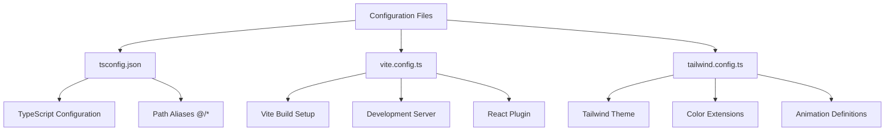

# Directory Structure

<cite>
**Referenced Files in This Document**   
- [tsconfig.json](file://tsconfig.json)
- [vite.config.ts](file://vite.config.ts)
- [tailwind.config.ts](file://tailwind.config.ts)
- [UsersTable.tsx](file://src/components/admin/UsersTable.tsx)
- [userService.ts](file://src/lib/user-service.ts)
- [Shops.tsx](file://src/pages/user/Shops.tsx)
- [useUsers.ts](file://src/hooks/useUsers.ts)
- [template-service.ts](file://src/lib/template-service.ts)
- [TemplateEditor.tsx](file://src/components/store-templates/TemplateEditor.tsx)
</cite>

## Table of Contents
1. [Frontend and Backend Separation](#frontend-and-backend-separation)
2. [Source Directory Organization](#source-directory-organization)
3. [Component Structure by Feature](#component-structure-by-feature)
4. [Configuration Files](#configuration-files)
5. [Code Import and Usage Examples](#code-import-and-usage-examples)
6. [Adding New Features](#adding-new-features)

## Frontend and Backend Separation

The lovable-rise repository follows a clear separation between frontend and backend code. The frontend code resides in the `src` directory, containing all React components, hooks, pages, and client-side logic. The backend code is located in the `supabase/functions` directory, which houses serverless functions written in TypeScript that run on the Supabase platform. This architectural pattern enables a clean separation of concerns, where the frontend handles user interface and client-side interactions while the backend manages data processing, authentication, and database operations.

The communication between frontend and backend occurs through API calls to the Supabase Edge Functions, with the frontend using authentication tokens to access protected endpoints. This separation allows for independent development and deployment of frontend and backend components while maintaining a secure and scalable architecture.

**Section sources**
- [supabase/functions](file://supabase/functions)
- [src](file://src)

## Source Directory Organization

The `src` directory serves as the main container for all frontend code and is organized into several key subdirectories that follow a feature-based structure. The `components` directory contains reusable UI components organized by feature areas such as admin, user, and store-templates. The `lib` directory houses business logic, service classes, and utility functions that interact with the backend API. The `pages` directory contains route-level components that represent different views in the application, while the `hooks` directory contains custom React hooks for state management and data fetching.

This organization promotes code reusability and maintainability by grouping related functionality together. The `integrations/supabase` subdirectory contains configuration and client setup for the Supabase integration, while the `providers` directory contains context providers for global state management such as theme and internationalization.

**Section sources**
- [src/components](file://src/components)
- [src/lib](file://src/lib)
- [src/pages](file://src/pages)
- [src/hooks](file://src/hooks)
- [src/integrations/supabase](file://src/integrations/supabase)
- [src/providers](file://src/providers)

## Component Structure by Feature

The component organization follows a feature-based approach with distinct directories for different user roles and functionality areas. The `admin` subdirectory within `components` contains components specific to administrative functionality, such as user management, tariff configuration, and system settings. These components include dialog boxes for creating and editing users, tables for displaying user data, and forms for system configuration.

The `user` subdirectory contains components related to end-user functionality, organized into further subdirectories for specific domains like products, shops, and suppliers. Each of these feature areas contains related components such as lists, forms, and editors. The `store-templates` directory contains components for managing XML templates used in store configuration, including editors, preview components, and mapping tools.

This feature-based organization allows developers to easily locate all components related to a specific functionality area and promotes consistency in component design and behavior across similar features.

**Section sources**
- [src/components/admin](file://src/components/admin)
- [src/components/user](file://src/components/user)
- [src/components/store-templates](file://src/components/store-templates)

## Configuration Files

The project includes several key configuration files that define the build process, type checking, and styling. The `tsconfig.json` file serves as the root TypeScript configuration, extending from `tsconfig.app.json` and `tsconfig.node.json` to provide separate configurations for application and Node.js environments. It includes path aliases that allow for cleaner imports using the `@/*` syntax to reference files within the `src` directory.

The `vite.config.ts` file configures the Vite build tool, setting up the development server, plugins for React, and path aliases that match the TypeScript configuration. The `tailwind.config.ts` file defines the Tailwind CSS configuration, including theme extensions for colors, spacing, and animations, with content paths that scan the `src` directory for classes to include in the final CSS bundle.

These configuration files work together to provide a consistent development experience with proper type checking, efficient builds, and consistent styling across the application.

**Diagram sources**
- [tsconfig.json](file://tsconfig.json)
- [vite.config.ts](file://vite.config.ts)
- [tailwind.config.ts](file://tailwind.config.ts)

## Code Import and Usage Examples

The codebase demonstrates consistent patterns for importing and using components across different parts of the application. Components are imported using the path alias `@/*` which maps to the `src` directory, allowing for absolute imports that are not dependent on relative paths. For example, the `UsersTable` component in the admin section imports UI components from `@/components/ui` and services from `@/lib/user-service`.

Custom hooks like `useUsers` from `@/hooks/useUsers` are used to encapsulate data fetching logic and provide a clean interface for components to interact with the backend API. These hooks use React Query for state management and automatically handle loading states, error handling, and data caching. The `Shops` page in the user section demonstrates how components are composed together, importing `ShopsList` and `ShopForm` from `@/components/user/shops` and using the `useBreadcrumbs` hook for navigation state.

This import pattern promotes code reusability and makes it easier to refactor components without breaking imports throughout the codebase.

**Section sources**
- [src/components/admin/UsersTable.tsx](file://src/components/admin/UsersTable.tsx)
- [src/lib/user-service.ts](file://src/lib/user-service.ts)
- [src/pages/user/Shops.tsx](file://src/pages/user/Shops.tsx)
- [src/hooks/useUsers.ts](file://src/hooks/useUsers.ts)

## Adding New Features

When adding new features to the application, developers should follow the existing structure and patterns. New pages should be added to the appropriate directory within `src/pages` based on the user role (admin or user), and corresponding components should be created in the relevant feature directory within `src/components`. For example, a new user feature related to orders would be added to `src/pages/user/Orders.tsx` with components in `src/components/user/orders`.

New business logic should be implemented in the `src/lib` directory as service classes that follow the pattern established by existing services like `UserService` and `TemplateService`. These services should handle API communication and data transformation, exposing clean interfaces to the components. Custom hooks in `src/hooks` should be created to encapsulate common data fetching patterns and provide a consistent interface for components to interact with the services.

New configuration should follow the existing patterns in the configuration files, with TypeScript types defined for data structures and consistent naming conventions used throughout the codebase.

**Section sources**
- [src/pages](file://src/pages)
- [src/components](file://src/components)
- [src/lib](file://src/lib)
- [src/hooks](file://src/hooks)