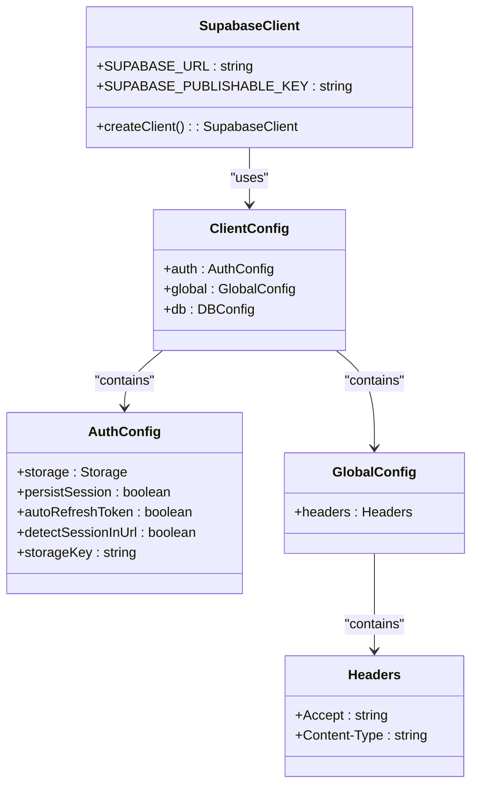
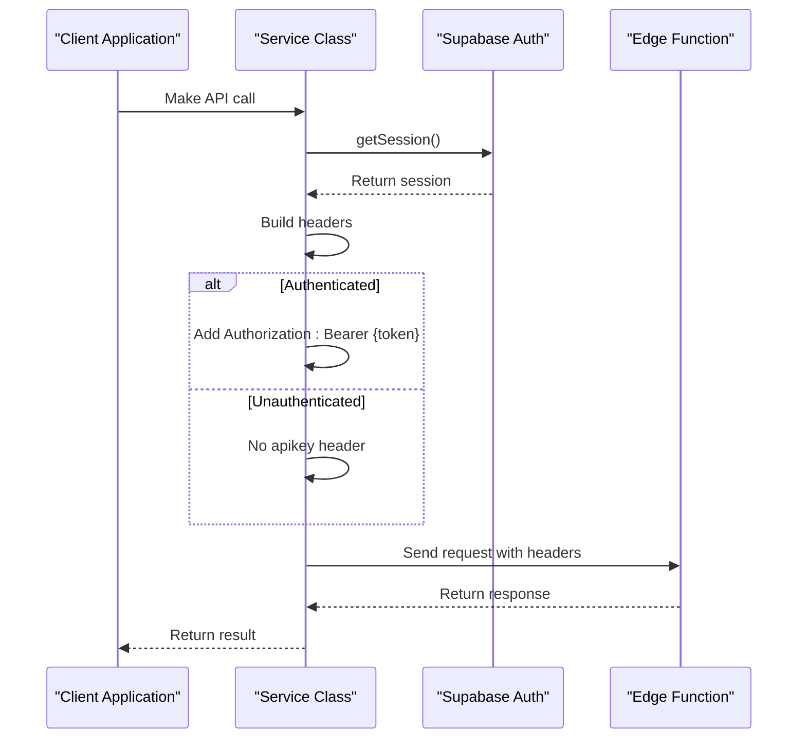
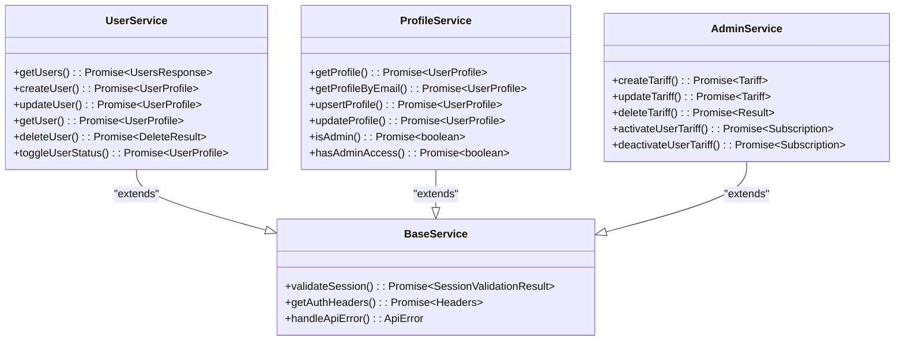
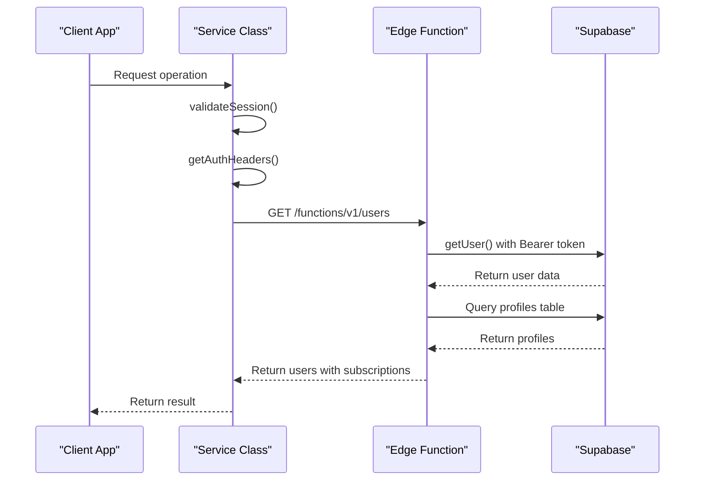
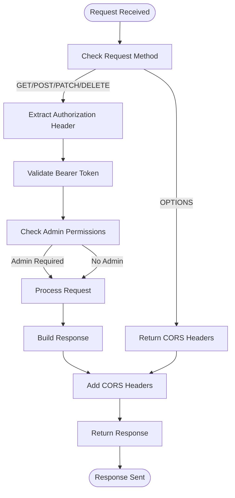
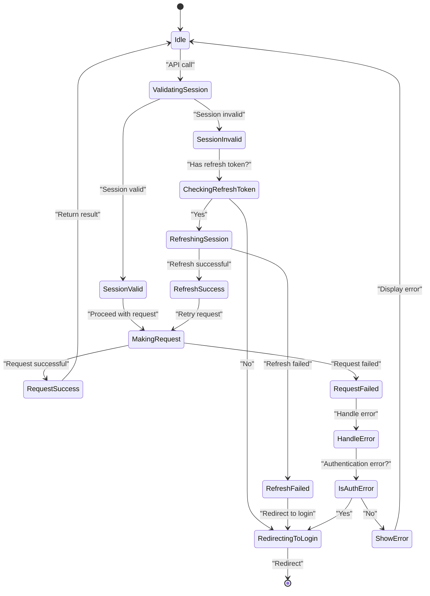

# API Clients

<cite>
**Referenced Files in This Document**   
- [user-service.ts](file://src/lib/user-service.ts)
- [session-validation.ts](file://src/lib/session-validation.ts)
- [client.ts](file://src/integrations/supabase/client.ts)
- [users/index.ts](file://supabase/functions/users/index.ts)
- [profile-service.ts](file://src/lib/profile-service.ts)
- [admin-service.ts](file://src/lib/admin-service.ts)
- [user-auth-service.ts](file://src/lib/user-auth-service.ts)
</cite>

## Table of Contents
1. [Introduction](#introduction)
2. [Supabase Client Configuration](#supabase-client-configuration)
3. [Authentication Header Strategy](#authentication-header-strategy)
4. [Service Class Pattern](#service-class-pattern)
5. [Edge Function Authentication](#edge-function-authentication)
6. [CORS Configuration](#cors-configuration)
7. [Client Implementation Guidelines](#client-implementation-guidelines)
8. [Error Handling and Session Validation](#error-handling-and-session-validation)
9. [Conclusion](#conclusion)

## Introduction
This document provides comprehensive API documentation for the API client system in the lovable-rise application. It details the implementation of Supabase client integration, authentication header strategies, and service class patterns used throughout the application. The documentation covers both client-side API calls and Edge Function interactions, with specific focus on secure authentication practices and proper header configuration.

**Section sources**
- [user-service.ts](file://src/lib/user-service.ts#L1-L335)
- [session-validation.ts](file://src/lib/session-validation.ts#L1-L398)

## Supabase Client Configuration
The Supabase client is configured through a centralized client module that establishes the connection to the Supabase backend. The configuration includes the Supabase URL and publishable key, with specific settings for authentication persistence and global headers.

The client is configured to not include authentication headers at the global level to prevent conflicts with Edge Function calls. This allows individual service classes to manage their own authentication headers based on the specific requirements of each API call.

**Diagram sources**
- [client.ts](file://src/integrations/supabase/client.ts#L1-L30)

**Section sources**
- [client.ts](file://src/integrations/supabase/client.ts#L1-L30)

## Authentication Header Strategy
The application implements a sophisticated authentication header strategy that differentiates between client-side requests and Edge Function calls. The core principle is to use Bearer tokens without apikey headers specifically for Edge Functions to prevent authentication conflicts.

The `getAuthHeaders` function in service classes retrieves the current session and constructs appropriate headers. For authenticated operations, it includes only the Authorization header with a Bearer token. For unauthenticated requests to Edge Functions, it omits the apikey header entirely, as Edge Functions expect only Bearer tokens for authenticated operations.

**Diagram sources**
- [user-service.ts](file://src/lib/user-service.ts#L9-L26)
- [session-validation.ts](file://src/lib/session-validation.ts#L375-L398)

**Section sources**
- [user-service.ts](file://src/lib/user-service.ts#L9-L26)
- [session-validation.ts](file://src/lib/session-validation.ts#L375-L398)

## Service Class Pattern
The application implements a service class pattern in the 'lib' directory that encapsulates API calls to both Supabase and Edge Functions. Each service class follows a consistent structure with static methods for different operations, proper error handling, and session validation.

Service classes such as UserService, ProfileService, and AdminService provide a clean interface for API interactions while handling authentication, error management, and data transformation internally. This pattern promotes code reuse, improves maintainability, and ensures consistent behavior across different parts of the application.

**Diagram sources**
- [user-service.ts](file://src/lib/user-service.ts#L81-L311)
- [profile-service.ts](file://src/lib/profile-service.ts#L1-L799)
- [admin-service.ts](file://src/lib/admin-service.ts#L1-L311)

**Section sources**
- [user-service.ts](file://src/lib/user-service.ts#L81-L311)
- [profile-service.ts](file://src/lib/profile-service.ts#L1-L799)
- [admin-service.ts](file://src/lib/admin-service.ts#L1-L311)

## Edge Function Authentication
Edge Function authentication is implemented with a specific pattern that ensures secure access while preventing header conflicts. The key principle is to use only Bearer tokens in the Authorization header without including the apikey header, which could cause authentication conflicts.

The `createAuthenticatedClient` utility function in session-validation.ts creates a Supabase client with explicit token authentication. It accepts an optional access token parameter or retrieves it from the current session, then creates a client with only the Authorization header containing the Bearer token.

**Diagram sources**
- [users/index.ts](file://supabase/functions/users/index.ts#L1-L489)
- [session-validation.ts](file://src/lib/session-validation.ts#L375-L398)

**Section sources**
- [users/index.ts](file://supabase/functions/users/index.ts#L1-L489)
- [session-validation.ts](file://src/lib/session-validation.ts#L375-L398)

## CORS Configuration
Edge Functions implement comprehensive CORS configuration to allow cross-origin requests while maintaining security. The CORS headers are defined at the beginning of each Edge Function and include:

- Access-Control-Allow-Origin: * (allowing requests from any origin)
- Access-Control-Allow-Headers: specifying the allowed headers including Authorization, X-Client-Info, apikey, content-type, and accept
- Access-Control-Allow-Methods: supporting GET, POST, PATCH, DELETE, and OPTIONS methods
- Content-Type: application/json for JSON responses

The functions handle OPTIONS preflight requests by returning the CORS headers with a null response. This configuration enables the frontend application to make authenticated requests to the Edge Functions from different origins while ensuring proper security controls.

**Diagram sources**
- [users/index.ts](file://supabase/functions/users/index.ts#L1-L489)

**Section sources**
- [users/index.ts](file://supabase/functions/users/index.ts#L1-L489)

## Client Implementation Guidelines
When implementing secure API calls in the lovable-rise application, follow these guidelines:

1. **Use Service Classes**: Always use the provided service classes (UserService, ProfileService, etc.) rather than making direct API calls. These classes handle authentication, error management, and session validation.

2. **Handle Authentication Scenarios**: Implement proper handling for different authentication scenarios:
   - For authenticated operations, ensure a valid session exists before making API calls
   - For public operations, ensure no conflicting headers are sent
   - Handle session expiration by redirecting to login or refreshing the session

3. **Error Handling**: Implement comprehensive error handling using the provided error handling utilities. Check for authentication errors and handle them appropriately by redirecting to login or refreshing the session.

4. **Session Validation**: Use the SessionValidator class to ensure valid sessions before making API calls that require authentication. This prevents 401 and 403 errors due to expired sessions.

5. **Header Management**: Never manually add apikey headers when calling Edge Functions. Rely on the service classes to manage headers appropriately based on the authentication context.

6. **Type Safety**: Use the provided TypeScript interfaces for request and response data to ensure type safety and proper data validation.

**Section sources**
- [user-service.ts](file://src/lib/user-service.ts#L1-L335)
- [session-validation.ts](file://src/lib/session-validation.ts#L1-L398)
- [user-auth-service.ts](file://src/lib/user-auth-service.ts#L1-L799)

## Error Handling and Session Validation
The application implements robust error handling and session validation through the SessionValidator class and associated utilities. The SessionValidator provides comprehensive session validation, ensuring that access tokens are properly used in Authorization headers and validating session expiration and auto-refresh.

Key features include:
- Comprehensive session validation with detailed result information
- Automatic session refresh when needed
- Proactive session monitoring to detect and resolve token issues
- Detailed token debugging information for troubleshooting
- RLS context validation to ensure proper user context for database queries

The error handling system distinguishes between different types of errors, including authentication errors, network errors, and specific API errors. This allows for appropriate handling of different error scenarios, such as redirecting to login for authentication errors or displaying user-friendly messages for validation errors.

**Diagram sources**
- [session-validation.ts](file://src/lib/session-validation.ts#L42-L343)

**Section sources**
- [session-validation.ts](file://src/lib/session-validation.ts#L42-L343)

## Conclusion
The API client system in the lovable-rise application demonstrates a well-structured approach to Supabase integration, authentication, and API management. By implementing service classes that encapsulate API calls, a consistent authentication header strategy, and robust session validation, the application ensures secure and reliable interactions with both Supabase and Edge Functions.

The key principles of using Bearer tokens without apikey headers for Edge Functions, proper CORS configuration, and comprehensive error handling provide a solid foundation for building secure and maintainable API clients. Developers should follow the established patterns and guidelines when implementing new API interactions to maintain consistency and security throughout the application.