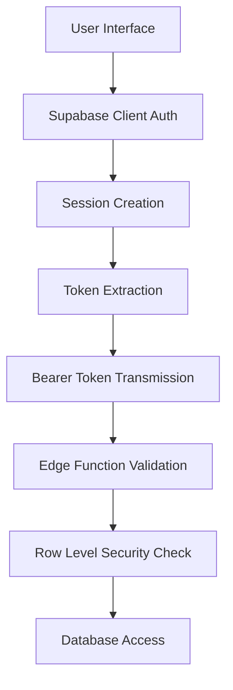
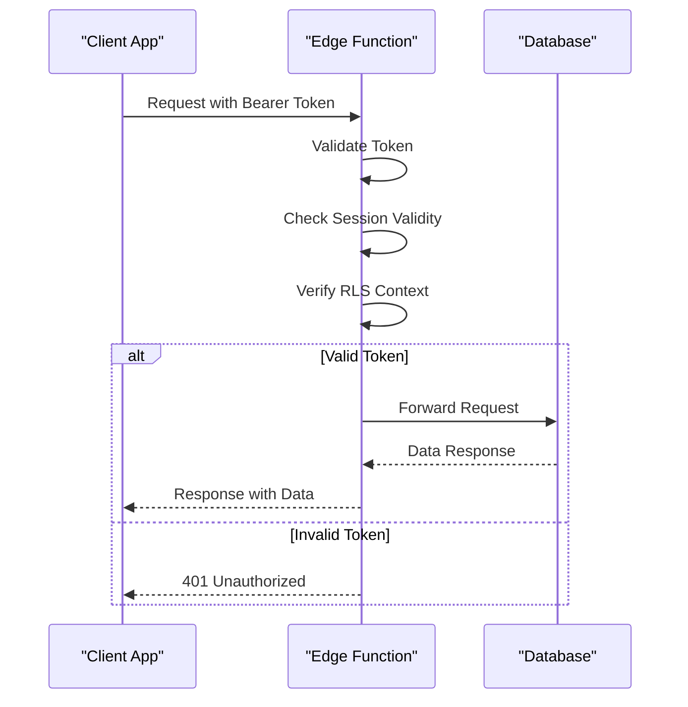
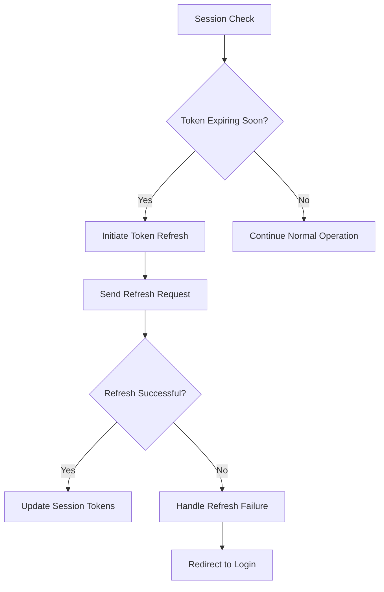

# Authentication Patterns

<cite>
**Referenced Files in This Document**   
- [user-auth-service.ts](file://src/lib/user-auth-service.ts)
- [session-validation.ts](file://src/lib/session-validation.ts)
- [user-service.ts](file://src/lib/user-service.ts)
- [UserRegister.tsx](file://src/pages/UserRegister.tsx)
- [UserAuth.tsx](file://src/pages/UserAuth.tsx)
- [AuthCallback.tsx](file://src/pages/AuthCallback.tsx)
</cite>

## Table of Contents
1. [Introduction](#introduction)
2. [Dual-Layer Authentication Architecture](#dual-layer-authentication-architecture)
3. [Client-Side Authentication Flow](#client-side-authentication-flow)
4. [Server-Side Validation with Edge Functions](#server-side-validation-with-edge-functions)
5. [Bearer Token Strategy](#bearer-token-strategy)
6. [Session Management and Token Refresh](#session-management-and-token-refresh)
7. [Security Considerations](#security-considerations)
8. [Troubleshooting Authentication Issues](#troubleshooting-authentication-issues)
9. [Conclusion](#conclusion)

## Introduction

The authentication system in lovable-rise implements a robust dual-layer approach that combines client-side authentication via Supabase with server-side validation through Edge Functions. This architecture ensures secure user authentication while maintaining a seamless user experience. The system follows industry best practices for token-based authentication, with a specific focus on using Bearer tokens exclusively for Edge Function calls to avoid header conflicts. This document details the complete authentication flow from user login to session validation, highlighting the key components and security considerations that make this system reliable and secure.

**Section sources**
- [user-auth-service.ts](file://src/lib/user-auth-service.ts#L173-L986)
- [session-validation.ts](file://src/lib/session-validation.ts#L50-L114)

## Dual-Layer Authentication Architecture

The authentication system in lovable-rise employs a dual-layer architecture that separates client-side authentication from server-side validation. This approach provides enhanced security by ensuring that all sensitive operations are validated on the server side, even when initiated from the client. The client layer handles user interface interactions and initial authentication through Supabase Auth, while the server layer validates all requests through Edge Functions to enforce Row Level Security (RLS) policies and prevent unauthorized access.

This architecture is implemented through a clear separation of concerns, with the `UserAuthService` class managing client-side operations and the `SessionValidator` class ensuring server-side validation integrity. The system is designed to prevent common security issues such as token leakage and unauthorized access by validating authentication context on every request to protected resources.

**Diagram sources**
- [user-auth-service.ts](file://src/lib/user-auth-service.ts#L173-L986)
- [session-validation.ts](file://src/lib/session-validation.ts#L50-L114)

## Client-Side Authentication Flow

The client-side authentication flow begins with user interaction through login forms and registration interfaces. When a user submits their credentials, the `UserAuthService` class handles the authentication process using Supabase Auth. For registration, the system follows Supabase's email confirmation workflow, where a user account is created but no session token is issued until the user confirms their email address through a confirmation link.

During login, the system validates user credentials and, upon successful authentication, creates a session containing both access and refresh tokens. The access token is used for immediate authentication, while the refresh token enables silent token renewal when the access token expires. The client-side flow also includes role validation, redirecting users to appropriate interfaces based on their role (user, admin, or manager).

**Section sources**
- [user-auth-service.ts](file://src/lib/user-auth-service.ts#L173-L986)
- [UserRegister.tsx](file://src/pages/UserRegister.tsx#L0-L32)
- [UserAuth.tsx](file://src/pages/UserAuth.tsx#L0-L337)

## Server-Side Validation with Edge Functions

Server-side validation is implemented through Edge Functions, which act as middleware between client requests and database operations. These functions validate the authentication context of each request by checking the validity of the provided Bearer token. The `SessionValidator` class plays a crucial role in this process, ensuring that the token is valid, not expired, and associated with the correct user identity.

The validation process includes checking token expiration, verifying user identity against the database, and ensuring that Row Level Security policies are properly enforced. This server-side validation prevents clients from bypassing authentication requirements or accessing data they shouldn't have access to, even if they possess a valid token. The system also includes proactive session monitoring that refreshes tokens before they expire, ensuring uninterrupted user sessions.

**Diagram sources**
- [session-validation.ts](file://src/lib/session-validation.ts#L50-L114)
- [user-service.ts](file://src/lib/user-service.ts#L9-L26)

## Bearer Token Strategy

The authentication system employs a strict Bearer token-only strategy for all Edge Function calls, avoiding potential conflicts with apikey headers. This approach is implemented in the `getAuthHeaders` function, which constructs request headers containing only the Authorization header with the Bearer token when a valid session exists. This strategy prevents header conflicts that could lead to authentication failures or security vulnerabilities.

The Bearer token contains the user's access token, which is used to establish the user's identity and permissions for Row Level Security policies. By excluding the apikey header from authenticated requests, the system ensures that Edge Functions receive a clean authentication context that can be properly validated. This approach also simplifies debugging by eliminating potential conflicts between different authentication mechanisms.

**Section sources**
- [user-service.ts](file://src/lib/user-service.ts#L9-L26)
- [session-validation.ts](file://src/lib/session-validation.ts#L375-L398)

## Session Management and Token Refresh

Session management in lovable-rise is handled through a combination of client-side tracking and server-side validation. The system implements automatic token refresh functionality that proactively renews access tokens before they expire, ensuring a seamless user experience without requiring re-authentication. The `SessionValidator` class includes a `waitForValidSession` method that monitors session state and initiates refresh operations when necessary.

Token refresh is triggered when the time until token expiration falls below a predefined threshold (5 minutes). The system uses the refresh token to obtain a new access token without requiring user interaction. This process is transparent to the user and maintains continuous access to protected resources. The session validation system also includes fallback mechanisms for handling edge cases, such as network interruptions during token refresh operations.

**Diagram sources**
- [session-validation.ts](file://src/lib/session-validation.ts#L120-L153)
- [user-auth-service.ts](file://src/lib/user-auth-service.ts#L850-L899)

## Security Considerations

The authentication system incorporates multiple security measures to protect user data and prevent unauthorized access. Token storage follows best practices by utilizing Supabase's secure storage mechanisms, which protect against XSS attacks by storing tokens in HTTP-only cookies when possible. The system also implements proper token expiration and refresh mechanisms to minimize the window of opportunity for token theft.

Secure transmission practices are enforced through the use of HTTPS for all authentication-related operations and the exclusive use of Bearer tokens in the Authorization header. The system validates the authenticity of all tokens on the server side, preventing clients from forging authentication credentials. Additionally, the implementation includes comprehensive error handling that provides meaningful feedback to users without exposing sensitive information about the authentication system's internal workings.

**Section sources**
- [session-validation.ts](file://src/lib/session-validation.ts#L16-L26)
- [user-auth-service.ts](file://src/lib/user-auth-service.ts#L310-L329)

## Troubleshooting Authentication Issues

Common authentication failures in the lovable-rise system typically fall into several categories: invalid credentials, expired sessions, network connectivity issues, and role-based access restrictions. The system provides detailed error handling that helps diagnose these issues through comprehensive logging and user-friendly error messages.

For debugging authentication problems, developers should first check the browser's developer console for error messages related to token validation or network requests. The `SessionValidator.logSessionDebugInfo` method can be used to output detailed information about the current session state, including token validity and RLS context. Common issues such as header conflicts can be identified by examining the request headers sent to Edge Functions and ensuring that only the Authorization header with the Bearer token is present.

**Section sources**
- [session-validation.ts](file://src/lib/session-validation.ts#L270-L366)
- [AuthCallback.tsx](file://src/pages/AuthCallback.tsx#L0-L101)

## Conclusion

The authentication patterns implemented in lovable-rise provide a secure and user-friendly authentication experience through a well-designed dual-layer architecture. By combining client-side authentication with server-side validation, the system ensures that user identity is properly verified while maintaining a seamless user experience. The exclusive use of Bearer tokens for Edge Function calls eliminates potential header conflicts and simplifies the authentication flow. With robust session management, comprehensive security measures, and clear troubleshooting guidance, this authentication system provides a solid foundation for secure application access.