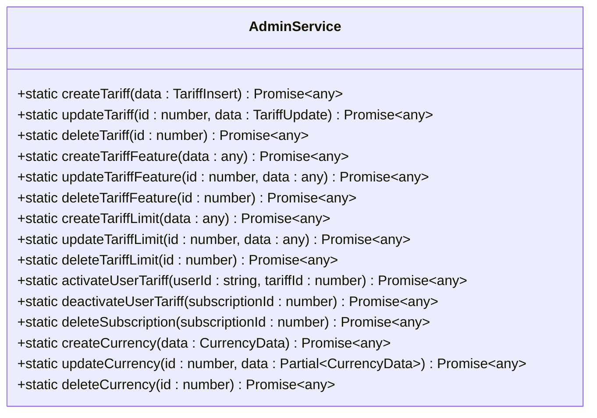
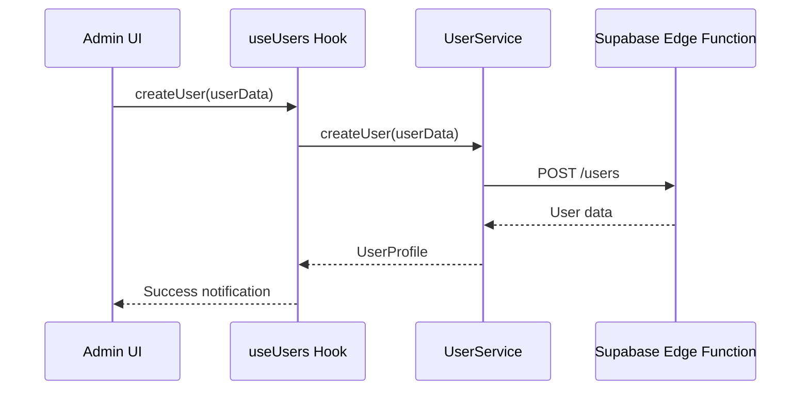
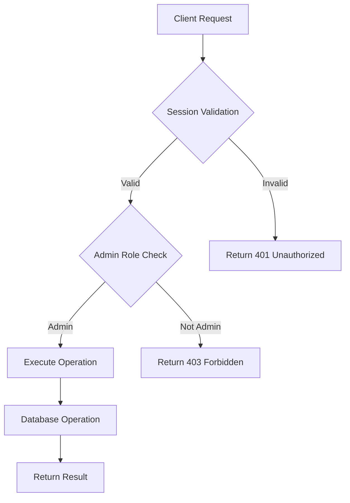
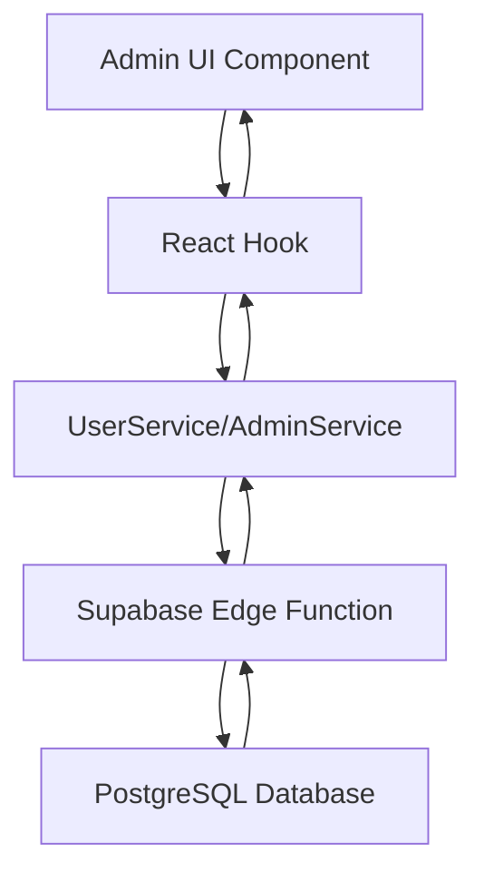

# Admin Service

<cite>
**Referenced Files in This Document**   
- [admin-service.ts](file://src/lib/admin-service.ts)
- [users/index.ts](file://supabase/functions/users/index.ts)
- [CreateUserDialog.tsx](file://src/components/admin/CreateUserDialog.tsx)
- [EditUserDialog.tsx](file://src/components/admin/EditUserDialog.tsx)
- [StatusToggle.tsx](file://src/components/admin/StatusToggle.tsx)
- [useUsers.ts](file://src/hooks/useUsers.ts)
- [user-service.ts](file://src/lib/user-service.ts)
- [session-validation.ts](file://src/lib/session-validation.ts)
</cite>

## Table of Contents
1. [Introduction](#introduction)
2. [Core Functionality](#core-functionality)
3. [User Management Operations](#user-management-operations)
4. [Integration with Admin UI Components](#integration-with-admin-ui-components)
5. [Security and Authorization](#security-and-authorization)
6. [Service Architecture and Flow](#service-architecture-and-flow)
7. [Error Handling and Validation](#error-handling-and-validation)
8. [Conclusion](#conclusion)

## Introduction
The AdminService class in the lovable-rise application provides administrative operations that extend beyond basic user management. It serves as a centralized interface for system administrators to manage tariff plans, subscription statuses, currency configurations, and other elevated operations that require administrative privileges. The service acts as a bridge between the frontend admin interface and the Supabase Edge Functions, ensuring proper authorization and secure data manipulation.

Unlike the UserService which handles general user operations, AdminService focuses specifically on administrative tasks that affect system-wide configurations and user privileges. It maintains a clear separation of concerns by providing admin-specific functionality while leveraging the same authentication and session validation mechanisms as other services in the application.

**Section sources**
- [admin-service.ts](file://src/lib/admin-service.ts#L5-L311)

## Core Functionality
The AdminService class provides a comprehensive set of static methods for administrative operations, organized into logical groups based on functionality. These operations include tariff management, subscription control, currency configuration, and system diagnostics.

The service's primary role is to enable administrators to configure and manage the application's business model through tariff plans, features, and limits. It also provides tools for managing user subscriptions, allowing administrators to activate or deactivate tariff plans for specific users, which is essential for customer support and account management.

All methods in the AdminService include session validation to ensure that only authenticated users with proper administrative privileges can execute these operations. This security measure prevents unauthorized access to sensitive administrative functions.

**Diagram sources**
- [admin-service.ts](file://src/lib/admin-service.ts#L5-L311)

**Section sources**
- [admin-service.ts](file://src/lib/admin-service.ts#L5-L311)

## User Management Operations
The AdminService facilitates advanced user management operations that go beyond basic CRUD functionality. While user creation, updating, and deletion are handled through the UserService, the AdminService provides specialized methods for managing user subscriptions and tariff assignments.

The `activateUserTariff` method allows administrators to assign a specific tariff plan to a user, which involves deactivating any existing active subscriptions, retrieving tariff details, and creating a new subscription record with the appropriate start and end dates. This operation is critical for managing user access to premium features and ensuring proper billing cycles.

Similarly, the `deactivateUserTariff` method enables administrators to disable a user's current subscription, effectively revoking their access to premium features. The service also includes a `deleteSubscription` method that allows for the complete removal of subscription records, but only for inactive subscriptions to prevent accidental deletion of active billing relationships.

These operations are designed to maintain data integrity by following a specific sequence of database operations and including validation checks to prevent inconsistent states.

**Section sources**
- [admin-service.ts](file://src/lib/admin-service.ts#L150-L215)

## Integration with Admin UI Components
The AdminService is tightly integrated with various admin interface components that provide a user-friendly way to perform administrative tasks. These components include dialog boxes for creating and editing users, status toggles for managing user activation, and table views for displaying user information.

The CreateUserDialog component allows administrators to create new user accounts by collecting essential information such as email, password, name, and phone number. When the form is submitted, it calls the UserService.createUser method, which in turn communicates with the Supabase Edge Function to create both the authentication record and profile.

The EditUserDialog component enables administrators to modify existing user information, including name, phone number, and role assignments. This component uses React Hook Form for validation and provides a clean interface for updating user details without exposing sensitive information like passwords.

The StatusToggle component provides a visual switch for activating or deactivating user accounts. When toggled, it calls the UserService.toggleUserStatus method to update the user's status in the database. The component displays the current status with appropriate styling and provides immediate visual feedback to the administrator.

**Diagram sources**
- [CreateUserDialog.tsx](file://src/components/admin/CreateUserDialog.tsx#L1-L257)
- [EditUserDialog.tsx](file://src/components/admin/EditUserDialog.tsx#L1-L202)
- [StatusToggle.tsx](file://src/components/admin/StatusToggle.tsx#L1-L40)
- [useUsers.ts](file://src/hooks/useUsers.ts#L80-L99)

**Section sources**
- [CreateUserDialog.tsx](file://src/components/admin/CreateUserDialog.tsx#L1-L257)
- [EditUserDialog.tsx](file://src/components/admin/EditUserDialog.tsx#L1-L202)
- [StatusToggle.tsx](file://src/components/admin/StatusToggle.tsx#L1-L40)
- [useUsers.ts](file://src/hooks/useUsers.ts#L80-L122)

## Security and Authorization
Security is a critical aspect of the AdminService, as it handles sensitive operations that could compromise the integrity of the entire system if accessed by unauthorized users. The service implements multiple layers of security to ensure that only authenticated administrators can perform elevated operations.

All methods in the AdminService begin with session validation using the SessionValidator.ensureValidSession() method, which checks whether the current user has a valid authentication session. This validation ensures that the user is properly authenticated before any administrative operation is executed.

On the server side, the Supabase Edge Functions implement additional authorization checks to verify that the requesting user has the 'admin' role. The checkAdminPermission function in the users Edge Function examines the user's profile to confirm their role, providing a second layer of security that cannot be bypassed by client-side manipulation.

The service also follows the principle of least privilege by using specific authentication headers that include only the Bearer token, avoiding potential conflicts with API keys. This approach ensures that requests are properly authenticated while minimizing the risk of header-related security issues.

**Diagram sources**
- [admin-service.ts](file://src/lib/admin-service.ts#L10-L15)
- [users/index.ts](file://supabase/functions/users/index.ts#L30-L100)
- [session-validation.ts](file://src/lib/session-validation.ts#L42-L343)

**Section sources**
- [admin-service.ts](file://src/lib/admin-service.ts#L10-L15)
- [users/index.ts](file://supabase/functions/users/index.ts#L30-L100)
- [session-validation.ts](file://src/lib/session-validation.ts#L42-L343)

## Service Architecture and Flow
The AdminService operates within a well-defined architecture that separates concerns between the frontend, backend, and database layers. This architecture ensures maintainability, security, and scalability of the administrative functionality.

The service follows a direct HTTP request pattern, where client-side operations make direct calls to Supabase Edge Functions rather than going through an intermediate API server. This approach reduces latency and simplifies the architecture while maintaining security through proper authentication and authorization mechanisms.

When an administrative operation is initiated, the flow begins with the UI component calling a hook function, which in turn calls the appropriate service method. The service method first validates the user's session, then constructs and sends an HTTP request to the corresponding Edge Function with the necessary data and authentication headers.

The Edge Function receives the request, performs additional authorization checks, and executes the appropriate database operations using the Supabase service role key. This key provides elevated privileges necessary for administrative operations while maintaining row-level security policies for data access.

**Diagram sources**
- [user-service.ts](file://src/lib/user-service.ts#L81-L311)
- [users/index.ts](file://supabase/functions/users/index.ts#L1-L489)

**Section sources**
- [user-service.ts](file://src/lib/user-service.ts#L81-L311)
- [users/index.ts](file://supabase/functions/users/index.ts#L1-L489)

## Error Handling and Validation
The AdminService implements comprehensive error handling and validation to ensure data integrity and provide meaningful feedback to administrators. Each operation includes client-side validation to catch common input errors before making server requests, reducing unnecessary network traffic.

On the client side, the service methods validate required parameters and check for valid session states before proceeding with operations. If validation fails, descriptive error messages are thrown to inform the administrator of the specific issue.

Server-side validation in the Edge Functions provides an additional layer of protection, checking for proper authentication, authorization, and data integrity. The functions validate input data, check for duplicate records, and ensure that operations comply with business rules.

Error responses include detailed information that can be used for debugging while avoiding the exposure of sensitive system information to end users. The client-side service methods handle these responses appropriately, either by propagating the error to the UI or by providing a more user-friendly message.

**Section sources**
- [admin-service.ts](file://src/lib/admin-service.ts#L10-L311)
- [users/index.ts](file://supabase/functions/users/index.ts#L200-L300)

## Conclusion
The AdminService in lovable-rise provides a robust and secure interface for administrative operations, enabling system administrators to manage users, subscriptions, and system configurations effectively. By maintaining a clear separation of concerns from the UserService, it ensures that administrative functionality is properly isolated and secured.

The service's integration with Supabase Edge Functions allows for direct, secure communication with the database while enforcing proper authorization through multiple layers of validation. This architecture provides both performance benefits and enhanced security, making it well-suited for managing sensitive administrative operations.

Through its well-designed API and integration with intuitive UI components, the AdminService empowers administrators to perform their duties efficiently while maintaining the integrity and security of the entire system.