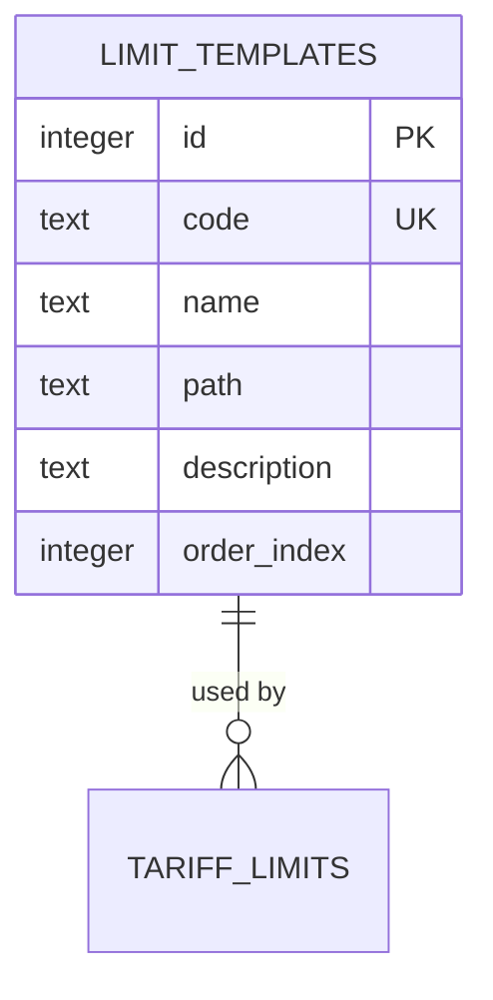
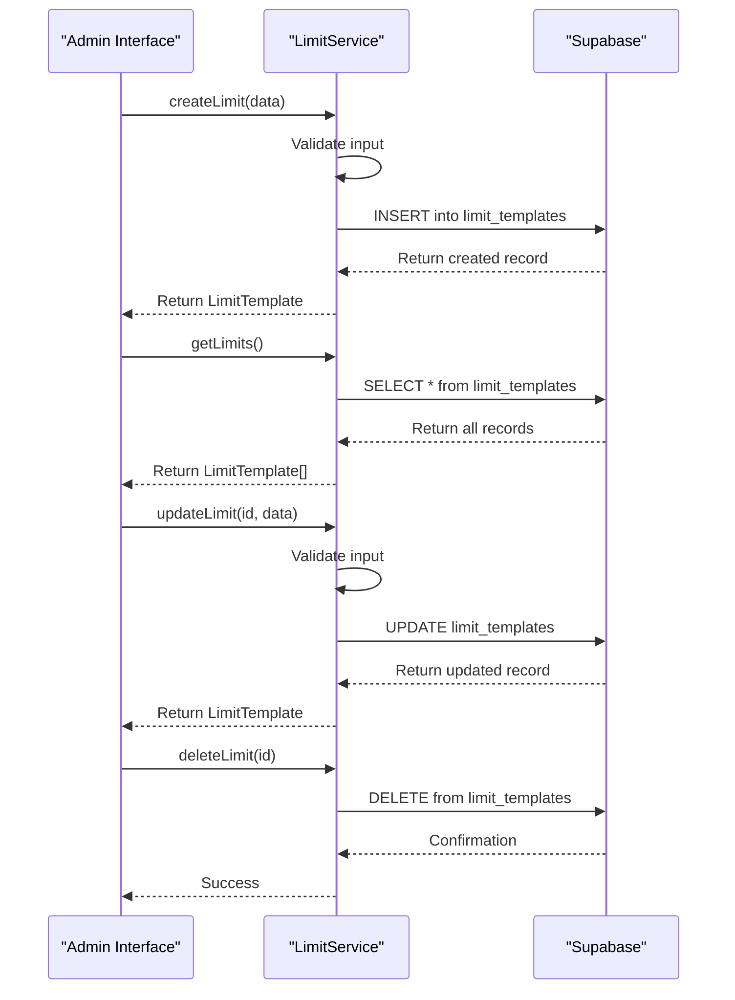
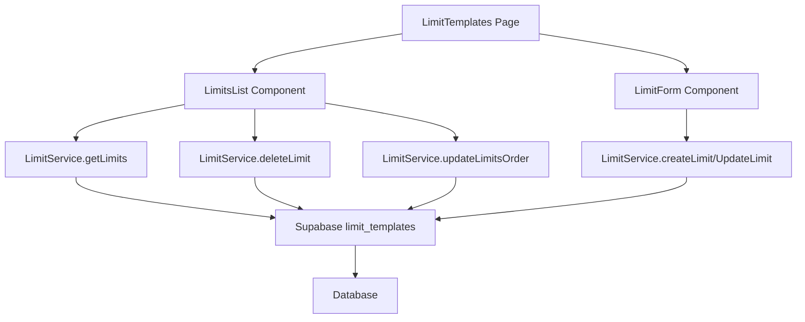

# Limit Service

<cite>
**Referenced Files in This Document**   
- [limit-service.ts](file://src/lib/limit-service.ts)
- [LimitForm.tsx](file://src/components/admin/limits/LimitForm.tsx)
- [LimitsList.tsx](file://src/components/admin/limits/LimitsList.tsx)
- [LimitTemplates.tsx](file://src/pages/admin/LimitTemplates.tsx)
- [types.ts](file://src/integrations/supabase/types.ts)
- [20250120000000_add_max_shop_limit.sql](file://supabase/migrations/20250120000000_add_max_shop_limit.sql)
</cite>

## Table of Contents
1. [Introduction](#introduction)
2. [Core Functionality](#core-functionality)
3. [Database Integration](#database-integration)
4. [CRUD Operations](#crud-operations)
5. [Validation Rules](#validation-rules)
6. [Admin Interface Integration](#admin-interface-integration)
7. [Tariff Management Integration](#tariff-management-integration)
8. [Flexible Pricing Model](#flexible-pricing-model)
9. [Error Handling](#error-handling)
10. [Conclusion](#conclusion)

## Introduction
The LimitService class in lovable-rise is a critical component for managing feature limits within tariff and subscription plans. It provides a comprehensive API for creating, retrieving, updating, and deleting limit templates that define constraints such as maximum shops or products per subscription. The service acts as an intermediary between the application's frontend components and the Supabase database, specifically interacting with the `limit_templates` table. By decoupling feature availability from tariff definitions, LimitService enables a flexible pricing model where limits can be reused across multiple tariff plans, ensuring consistency and simplifying administration.

**Section sources**
- [limit-service.ts](file://src/lib/limit-service.ts#L25-L199)

## Core Functionality
The LimitService class provides static methods for managing limit templates, which are used to define constraints within tariff plans. These templates contain metadata such as code, name, description, and path, allowing for flexible configuration of feature limits. The service enables administrators to create standardized limit definitions that can be applied across multiple tariff plans, ensuring consistency in feature availability. The `order_index` field allows for custom sorting of limits in the admin interface, providing a user-friendly way to organize limit templates.

```mermaid
classDiagram
class LimitTemplate {
+id : number
+code : string
+name : string
+path? : string
+description? : string
+order_index? : number
}
class CreateLimitData {
+code : string
+name : string
+path? : string
+description? : string
}
class UpdateLimitData {
+code? : string
+name? : string
+path? : string
+description? : string
}
class LimitService {
+getLimits() : Promise~LimitTemplate[]~
+getLimit(id : number) : Promise~LimitTemplate~
+createLimit(limitData : CreateLimitData) : Promise~LimitTemplate~
+updateLimit(id : number, limitData : UpdateLimitData) : Promise~LimitTemplate~
+deleteLimit(id : number) : Promise~void~
+updateLimitsOrder(limits : {id : number, order_index : number}[]) : Promise~void~
}
LimitService --> LimitTemplate : "manages"
LimitService --> CreateLimitData : "uses for creation"
LimitService --> UpdateLimitData : "uses for updates"
```

**Diagram sources **
- [limit-service.ts](file://src/lib/limit-service.ts#L2-L23)
- [limit-service.ts](file://src/lib/limit-service.ts#L25-L199)

**Section sources**
- [limit-service.ts](file://src/lib/limit-service.ts#L2-L23)

## Database Integration
LimitService interacts with the Supabase database through the `limit_templates` table, which stores all limit template definitions. The service uses the Supabase client to perform CRUD operations on this table, with specific queries for retrieving, creating, updating, and deleting records. The database schema includes constraints such as a unique index on the `code` field to prevent duplicate limit templates and a primary key on the `id` field for record identification. Row Level Security (RLS) policies ensure that only administrators can modify limit templates, protecting the integrity of the pricing model.



**Diagram sources **
- [types.ts](file://src/integrations/supabase/types.ts#L417-L448)
- [20250120000000_add_max_shop_limit.sql](file://supabase/migrations/20250120000000_add_max_shop_limit.sql#L1-L16)

**Section sources**
- [types.ts](file://src/integrations/supabase/types.ts#L417-L448)
- [20250120000000_add_max_shop_limit.sql](file://supabase/migrations/20250120000000_add_max_shop_limit.sql#L1-L16)

## CRUD Operations
The LimitService class implements comprehensive CRUD operations for managing limit templates. The `getLimits` method retrieves all limit templates ordered by their `order_index` and `id`, providing a consistent ordering for display in the admin interface. The `createLimit` method inserts new limit templates into the database, while `updateLimit` modifies existing templates with partial updates. The `deleteLimit` method removes templates by ID, and `updateLimitsOrder` allows for reordering multiple templates at once. These operations are designed to be atomic and include proper error handling to maintain data integrity.



**Diagram sources **
- [limit-service.ts](file://src/lib/limit-service.ts#L25-L199)

**Section sources**
- [limit-service.ts](file://src/lib/limit-service.ts#L25-L199)

## Validation Rules
LimitService implements strict validation rules to ensure data integrity and consistency. When creating or updating limit templates, the service validates that the `name` and `code` fields are not empty and that the `code` follows the snake_case format (lowercase letters, numbers, and underscores only). The service also checks for unique constraint violations when inserting new records, preventing duplicate codes. These validation rules are implemented both in the service layer and enforced at the database level through unique constraints, providing a robust mechanism for maintaining data quality.

**Section sources**
- [limit-service.ts](file://src/lib/limit-service.ts#L70-L75)
- [limit-service.ts](file://src/lib/limit-service.ts#L115-L121)

## Admin Interface Integration
The LimitService is tightly integrated with admin components such as LimitForm and LimitsList, providing a seamless user experience for managing limit templates. The LimitForm component allows administrators to create and edit limit templates, with real-time validation of input fields. The LimitsList component displays all existing templates and supports drag-and-drop reordering through the `updateLimitsOrder` method. These components use the LimitService API to perform operations and provide feedback through toast notifications, creating an intuitive interface for managing limit templates.



**Diagram sources **
- [LimitTemplates.tsx](file://src/pages/admin/LimitTemplates.tsx#L26-L46)
- [LimitsList.tsx](file://src/components/admin/limits/LimitsList.tsx#L151-L179)

**Section sources**
- [LimitTemplates.tsx](file://src/pages/admin/LimitTemplates.tsx#L26-L46)
- [LimitsList.tsx](file://src/components/admin/limits/LimitsList.tsx#L151-L179)
- [LimitForm.tsx](file://src/components/admin/limits/LimitForm.tsx#L0-L187)

## Tariff Management Integration
LimitService plays a crucial role in tariff management by providing the foundation for defining feature constraints within subscription plans. The `limit_templates` table is referenced by the `tariff_limits` table through a foreign key relationship, allowing tariff plans to reference standardized limit definitions. This decoupling enables flexible pricing models where the same limit (e.g., "max_shop") can be reused across multiple tariff plans. The AdminTariffEdit and AdminTariffNew components use the LimitService to retrieve available limit templates when configuring tariff features, ensuring consistency across the pricing structure.

**Section sources**
- [tariff-service.ts](file://src/lib/tariff-service.ts#L365-L423)
- [AdminTariffEdit.tsx](file://src/pages/admin/AdminTariffEdit.tsx#L149-L149)

## Flexible Pricing Model
By decoupling feature availability from tariff definitions, LimitService enables a flexible pricing model that supports complex subscription plans. This architecture allows for the creation of reusable limit templates that can be applied across multiple tariff plans, reducing duplication and ensuring consistency. For example, a "max_shop" limit template can be used in both basic and premium plans with different values, while maintaining the same underlying definition. This approach simplifies administration, as changes to a limit template (such as its description or validation rules) automatically propagate to all tariff plans that use it.

**Section sources**
- [limit-service.ts](file://src/lib/limit-service.ts#L25-L199)
- [20250120000000_add_max_shop_limit.sql](file://supabase/migrations/20250120000000_add_max_shop_limit.sql#L1-L16)

## Error Handling
LimitService implements comprehensive error handling to ensure robust operation and provide meaningful feedback to users. All database operations are wrapped in try-catch blocks, with specific error messages returned for different failure scenarios. The service logs errors to the console for debugging purposes and throws standardized Error objects with descriptive messages. Unique constraint violations are specifically handled to provide user-friendly feedback when attempting to create duplicate limit templates. This error handling strategy ensures that the service fails gracefully and provides administrators with the information needed to resolve issues.

**Section sources**
- [limit-service.ts](file://src/lib/limit-service.ts#L35-L40)
- [limit-service.ts](file://src/lib/limit-service.ts#L85-L90)

## Conclusion
The LimitService class is a fundamental component of the lovable-rise application, providing a robust and flexible system for managing feature limits within tariff and subscription plans. By centralizing limit template management and integrating seamlessly with both the database and admin interface, it enables a scalable pricing model that can accommodate complex subscription plans. The service's comprehensive CRUD operations, strict validation rules, and thoughtful error handling make it a reliable foundation for the application's subscription management system. Its decoupled architecture allows for maximum flexibility in pricing strategies while maintaining data consistency and integrity.