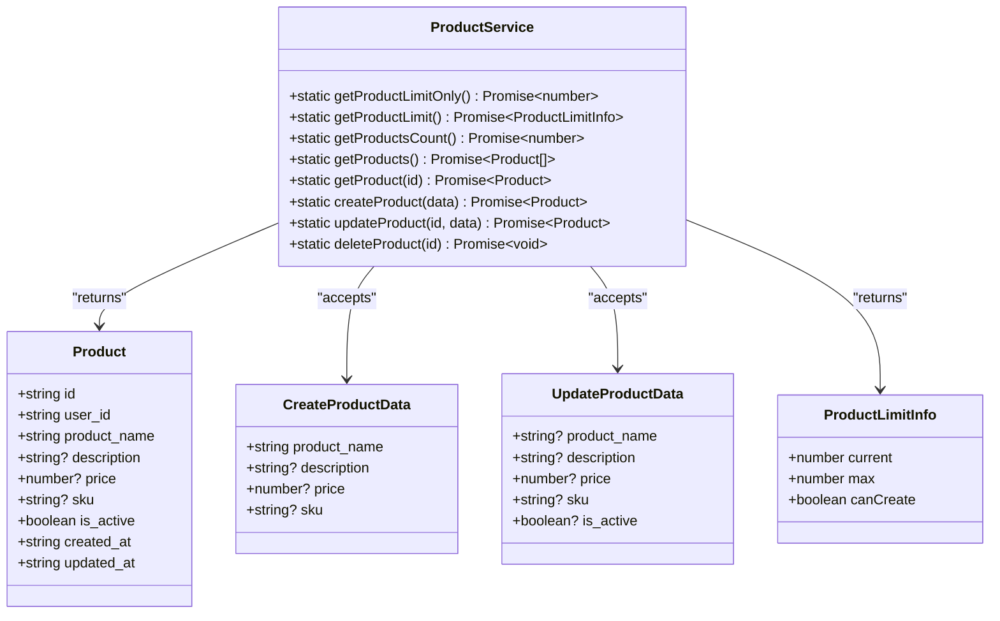
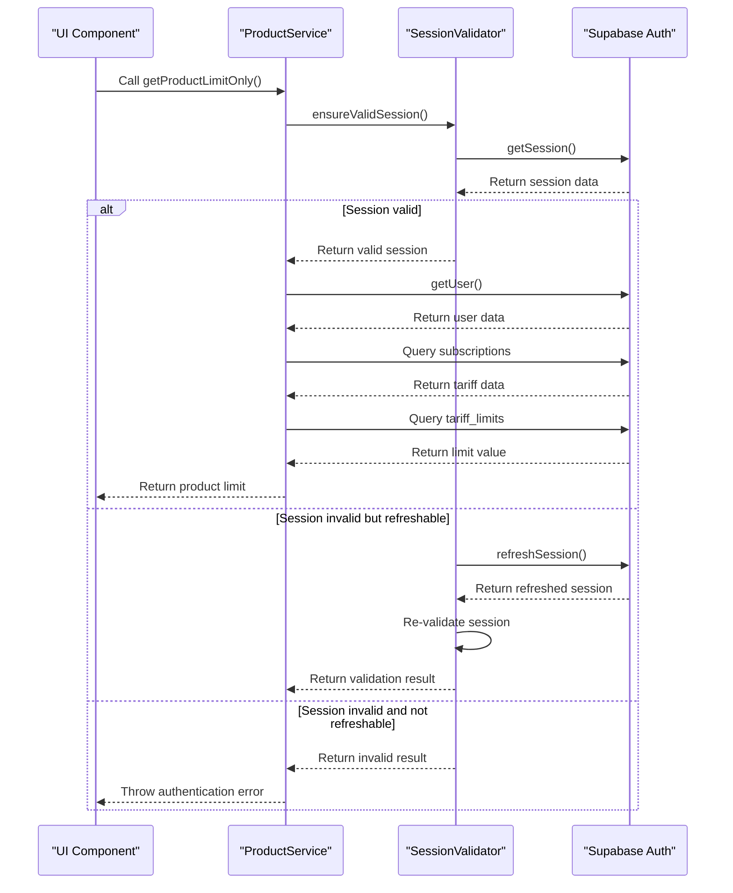
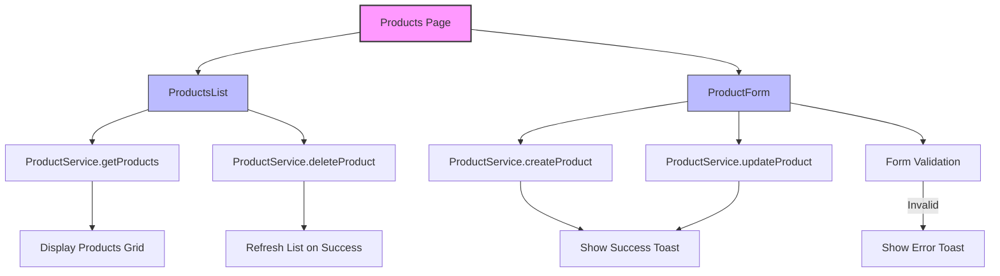

# Product Service

<cite>
**Referenced Files in This Document**   
- [product-service.ts](file://src/lib/product-service.ts)
- [ProductForm.tsx](file://src/components/user/products/ProductForm.tsx)
- [ProductsList.tsx](file://src/components/user/products/ProductsList.tsx)
- [session-validation.ts](file://src/lib/session-validation.ts)
- [client.ts](file://src/integrations/supabase/client.ts)
</cite>

## Table of Contents
1. [Introduction](#introduction)
2. [Core Functionality](#core-functionality)
3. [Session Validation and RLS Integration](#session-validation-and-rls-integration)
4. [Key Methods](#key-methods)
5. [UI Integration](#ui-integration)
6. [Performance and Error Handling](#performance-and-error-handling)
7. [Future Implementation Considerations](#future-implementation-considerations)

## Introduction
The ProductService class in lovable-rise is designed to manage product data operations for end users, providing a structured interface for creating, listing, updating, and removing products. Currently, the implementation is in a preparatory state with all data modification methods temporarily disabled due to the pending creation of the user_products database table. The service is built with Supabase as the backend provider and incorporates Row Level Security (RLS) policies to ensure data isolation between users. The service also integrates with TanStack Query through UI components for optimized data loading and background updates, though this integration is not directly implemented in the service itself.

**Section sources**
- [product-service.ts](file://src/lib/product-service.ts#L3-L162)

## Core Functionality
The ProductService provides a comprehensive interface for product management operations, currently focused on limit calculation and future data operations. The service defines three primary interfaces: Product for the data model, CreateProductData for creation operations, and UpdateProductData for modification operations. The Product interface includes essential fields such as product_name, description, price, sku, and status tracking with is_active, created_at, and updated_at timestamps. The service currently implements limit calculation functionality that determines user entitlements based on their subscription tier, while all actual product data operations return placeholder responses or throw "functionality temporarily unavailable" errors, indicating the service is in a pre-implementation phase awaiting database schema completion.

**Diagram sources**
- [product-service.ts](file://src/lib/product-service.ts#L3-L34)

## Session Validation and RLS Integration
The ProductService integrates with the SessionValidator class to ensure valid authentication state before performing any data operations. The service calls SessionValidator.ensureValidSession() at the beginning of each method that requires database access, which validates the current session and automatically refreshes expired tokens when possible. This integration is critical for enforcing Row Level Security (RLS) policies in Supabase, as RLS relies on the presence of a valid user session to properly scope database queries to the authenticated user's data. The SessionValidator performs comprehensive checks including token expiration validation, refresh token availability, and automatic session refresh when nearing expiration. This ensures that all database operations occur within a valid authentication context, preventing unauthorized access and maintaining data integrity across user accounts.

**Diagram sources**
- [product-service.ts](file://src/lib/product-service.ts#L36-L83)
- [session-validation.ts](file://src/lib/session-validation.ts#L120-L153)

## Key Methods
The ProductService implements several key methods for product management, currently in a preparatory state. The getProductLimitOnly method retrieves the maximum number of products allowed for the current user based on their subscription tier by querying the tariff_limits table with a case-insensitive search for limit names containing "товар" (product). The getProductLimit method builds on this by combining the maximum limit with the current count (currently hardcoded to 0) to return a ProductLimitInfo object that includes the current usage, maximum allowed, and a boolean indicating whether new products can be created. The getProducts method currently returns an empty array, serving as a placeholder for future implementation that will retrieve all products for the authenticated user with proper RLS enforcement. Similarly, createProduct, updateProduct, and deleteProduct methods are currently non-functional, throwing descriptive errors indicating the user_products table has not yet been created.

**Section sources**
- [product-service.ts](file://src/lib/product-service.ts#L36-L162)

## UI Integration
The ProductService is integrated into the application's user interface through two primary components: ProductForm and ProductsList. The ProductsList component uses the service to retrieve product data and handle deletions, calling getProducts to populate the product grid and deleteProduct to remove items. The component displays products in a responsive grid layout with visual indicators for product information and action buttons for editing and deletion. The ProductForm component utilizes createProduct and updateProduct methods to handle product creation and modification, with form validation preventing submission when required fields are empty. Both components are used within the Products page, which manages the overall workflow including navigation between list and form views, handling of product limits, and refresh coordination after data modifications. The integration includes error handling with user-friendly toast notifications for both success and failure scenarios.

**Diagram sources**
- [ProductsList.tsx](file://src/components/user/products/ProductsList.tsx#L49-L49)
- [ProductForm.tsx](file://src/components/user/products/ProductForm.tsx#L38-L71)
- [Products.tsx](file://src/pages/user/Products.tsx#L68-L77)

## Performance and Error Handling
The ProductService incorporates several performance and error handling considerations despite its current placeholder implementation. The service leverages Supabase's efficient query capabilities and integrates with the SessionValidator's proactive session monitoring to minimize authentication-related performance issues. The error handling strategy includes comprehensive validation of session state before database operations, with descriptive error messages that distinguish between authentication failures and other issues. The service also implements proper error propagation to UI components, allowing for appropriate user feedback through toast notifications. For future implementation, performance considerations for handling large product catalogs include the use of Supabase's pagination capabilities, selective field selection, and indexing strategies on the user_products table to ensure responsive performance in the user dashboard even with extensive product inventories.

**Section sources**
- [product-service.ts](file://src/lib/product-service.ts#L36-L162)
- [ProductForm.tsx](file://src/components/user/products/ProductForm.tsx#L38-L71)
- [ProductsList.tsx](file://src/components/user/products/ProductsList.tsx#L49-L49)

## Future Implementation Considerations
When the user_products table is created, the ProductService will require updates to implement the full CRUD functionality. This will involve uncommenting the placeholder code in getProducts, createProduct, updateProduct, and deleteProduct methods and ensuring proper RLS policies are configured in Supabase. The implementation should include comprehensive error handling for database constraints, network issues, and permission violations. Additionally, the service could be enhanced with filtering capabilities to support operations like retrieving products by shop or category, which would require appropriate database schema design and indexing. Integration with TanStack Query should be considered at the component level to provide optimized data loading, background updates, and caching strategies that improve the user experience, particularly when dealing with large product catalogs in the dashboard interface.

**Section sources**
- [product-service.ts](file://src/lib/product-service.ts#L117-L162)
- [ProductsList.tsx](file://src/components/user/products/ProductsList.tsx#L49-L49)