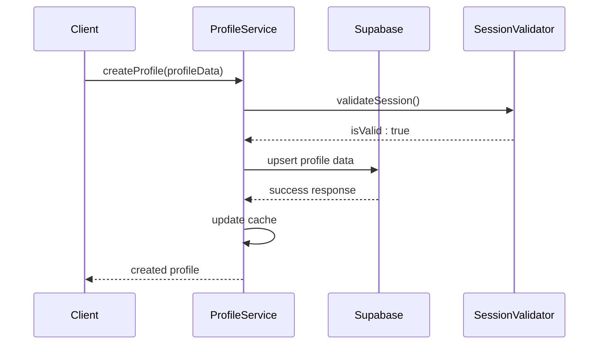
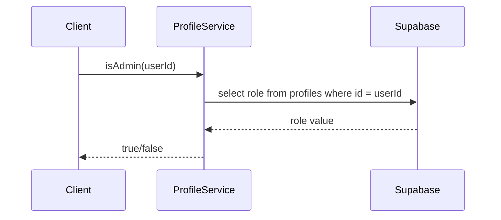
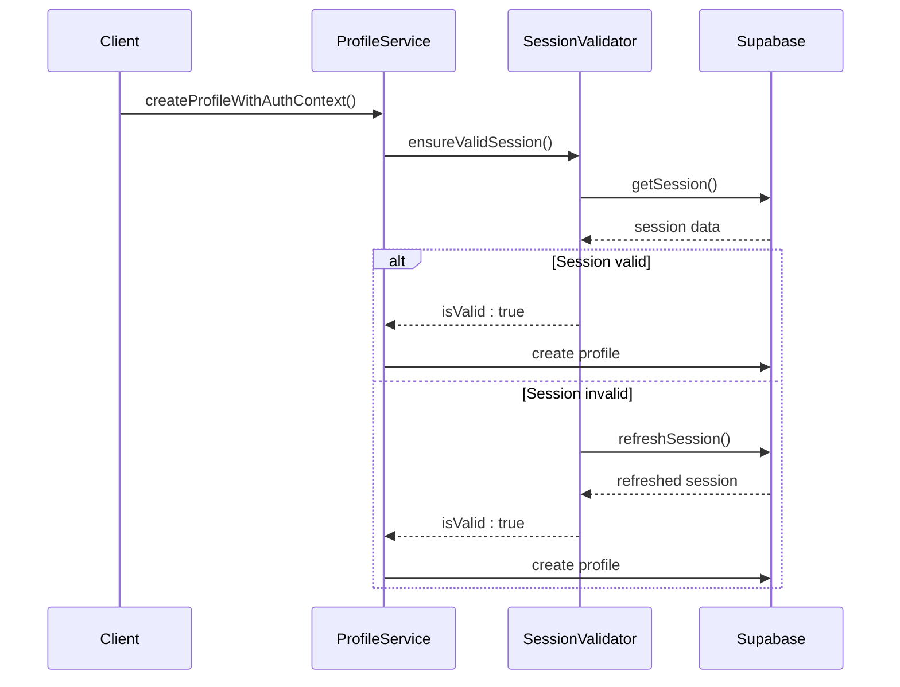
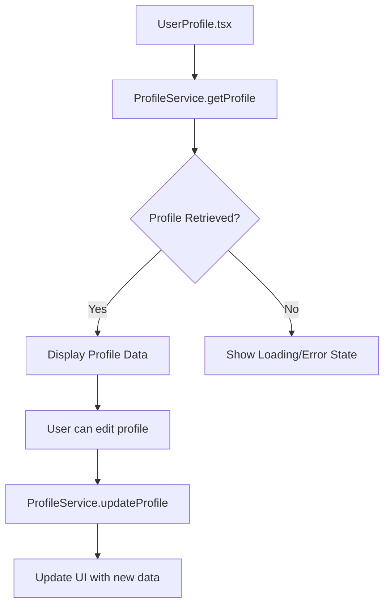
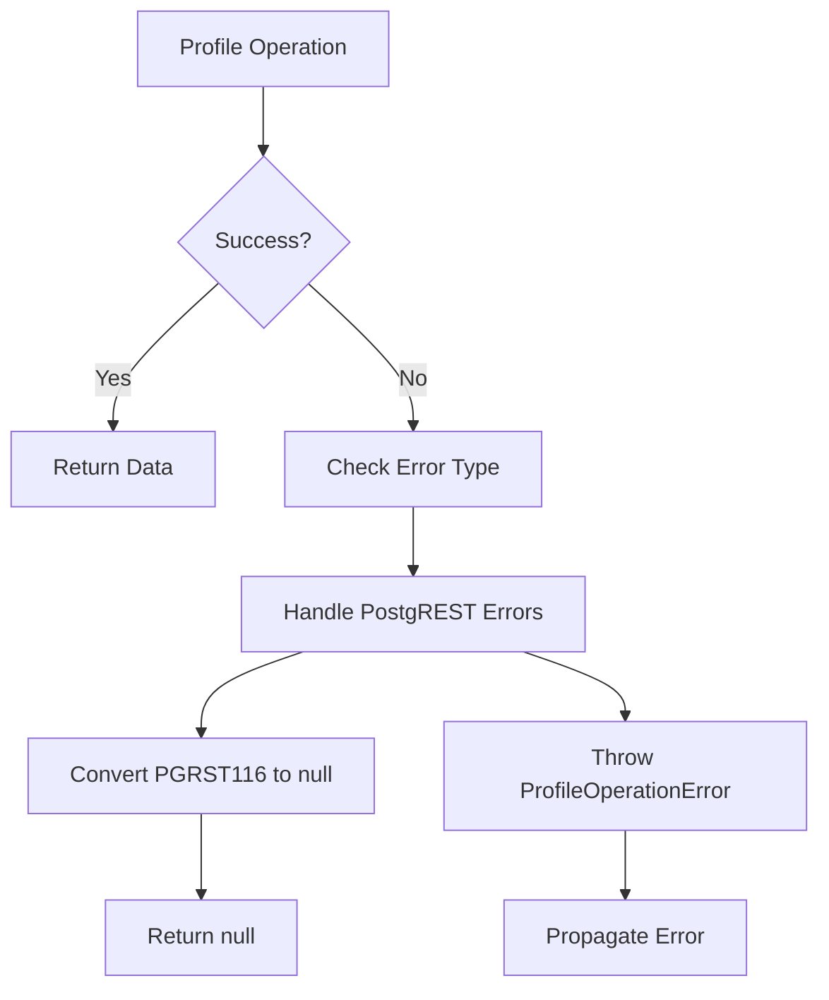
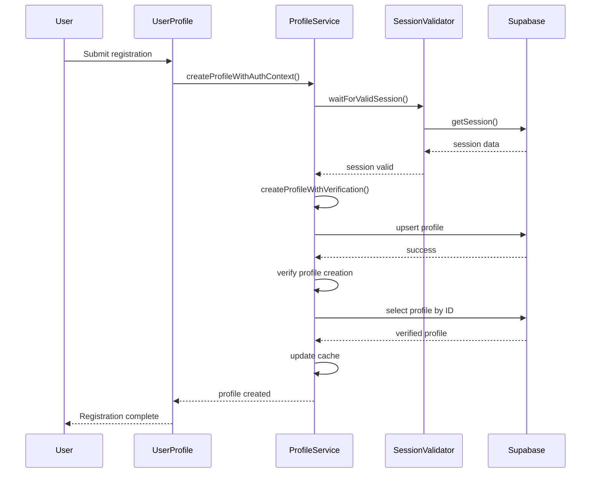
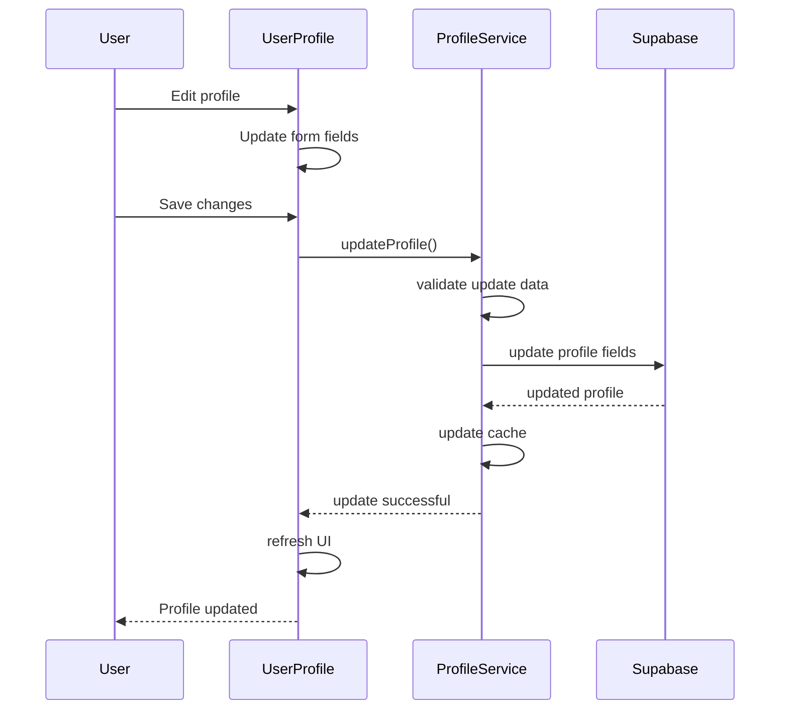

# Profile Service

<cite>
**Referenced Files in This Document**   
- [profile-service.ts](file://src/lib/profile-service.ts)
- [session-validation.ts](file://src/lib/session-validation.ts)
- [error-handler.ts](file://src/lib/error-handler.ts)
- [UserProfile.tsx](file://src/pages/UserProfile.tsx)
- [AdminProtected.tsx](file://src/pages/AdminProtected.tsx)
- [ProtectedRoutes.tsx](file://src/components/ProtectedRoutes.tsx)
- [profile-sheet-content.tsx](file://src/components/ui/profile-sheet-content.tsx)
- [profile-types.ts](file://src/components/ui/profile-types.ts)
- [user-auth-service.ts](file://src/lib/user-auth-service.ts)
</cite>

## Table of Contents
1. [Introduction](#introduction)
2. [Core Responsibilities](#core-responsibilities)
3. [Profile Management Methods](#profile-management-methods)
4. [Role-Based Access Control](#role-based-access-control)
5. [Integration with Supabase and RLS](#integration-with-supabase-and-rls)
6. [Security and Session Validation](#security-and-session-validation)
7. [User Interface Integration](#user-interface-integration)
8. [Error Handling](#error-handling)
9. [Performance and Caching](#performance-and-caching)
10. [Sequence Diagrams](#sequence-diagrams)

## Introduction

The ProfileService class in the lovable-rise application serves as the central component for managing user profile data and implementing role-based access control. This service provides a comprehensive interface for profile creation, retrieval, and role verification, ensuring secure and efficient user management throughout the application. The service integrates with Supabase authentication and Row Level Security (RLS) policies to maintain data integrity and enforce proper access controls.

The ProfileService operates as a static class with multiple methods that handle various aspects of profile management. It works in conjunction with other services like SessionValidator and error handling utilities to provide a robust user management system. The service is designed to handle both user and admin profiles, with specific methods for role verification and access control.

This documentation provides a detailed explanation of the ProfileService's responsibilities, methods, and integration points within the application architecture.

**Section sources**
- [profile-service.ts](file://src/lib/profile-service.ts#L59-L814)

## Core Responsibilities

The ProfileService class has several core responsibilities in the lovable-rise application:

1. **Profile Management**: The service handles the creation, retrieval, and updating of user profiles in the Supabase database. It provides methods for creating new profiles, retrieving existing profiles by ID or email, and updating profile information.

2. **Role-Based Access Control**: The service implements role verification methods that determine user permissions within the application. It checks user roles to enforce access to different parts of the application based on whether a user is an admin, manager, or regular user.

3. **Session and Authentication Integration**: The service integrates with Supabase authentication and session validation to ensure that profile operations occur within a valid security context. It works with the SessionValidator to confirm that operations are performed with proper authentication.

4. **Error Handling and Validation**: The service includes comprehensive error handling for profile operations, converting low-level database errors into meaningful application errors that can be properly handled by the UI.

5. **Caching and Performance Optimization**: The service implements caching mechanisms to reduce database queries and improve performance for frequently accessed profile data.

These responsibilities ensure that user profile data is managed securely and efficiently throughout the application lifecycle.

**Section sources**
- [profile-service.ts](file://src/lib/profile-service.ts#L59-L814)

## Profile Management Methods

The ProfileService provides several methods for managing user profiles, each designed to handle specific aspects of profile lifecycle management.

### createProfile Method

The `createProfile` method handles the creation of new user profiles in the system. This method is responsible for creating a profile with the provided user data, including ID, email, and name. The method validates the input data and ensures all required fields are present before attempting to create the profile.



The method uses Supabase's upsert functionality to either create a new profile or update an existing one if a conflict occurs. This approach ensures idempotency and prevents duplicate profile creation.

**Section sources**
- [profile-service.ts](file://src/lib/profile-service.ts#L593-L601)
- [profile-service.ts](file://src/lib/profile-service.ts#L520-L588)

### getProfile Method

The `getProfile` method retrieves a user profile by ID from the database. This method first checks the local cache for the profile to minimize database queries. If the profile is not found in the cache, it queries the Supabase database using the profiles table.

The method handles the PostgREST PGRST116 error (empty result) by converting it to a null response instead of throwing an error, which allows the application to gracefully handle cases where a profile does not exist. When a profile is successfully retrieved, it is cached for future requests to improve performance.

**Section sources**
- [profile-service.ts](file://src/lib/profile-service.ts#L109-L147)

### updateProfile Method

The `updateProfile` method allows for updating specific fields of an existing user profile. This method accepts a user ID and an object containing the fields to update. It validates the update data before making the database call and uses Supabase's update functionality to modify only the specified fields.

After a successful update, the method updates the local cache with the new profile data to ensure consistency between the database and cached data. This method is used when users modify their profile information through the user interface.

**Section sources**
- [profile-service.ts](file://src/lib/profile-service.ts#L291-L322)

## Role-Based Access Control

The ProfileService implements a comprehensive role-based access control system that determines user permissions within the application. This system is critical for enforcing security policies and ensuring users can only access functionality appropriate to their role.

### Role Verification Methods

The service provides several methods for verifying user roles:

- `isAdmin(userId)`: Checks if a user has the 'admin' role
- `hasAdminAccess(userId)`: Checks if a user has either 'admin' or 'manager' role
- `getUserRole(userId)`: Retrieves the role of a specific user

These methods query the database to retrieve only the role field from the user's profile, minimizing data transfer and improving performance. The methods include error handling to return false or null in cases where the profile cannot be retrieved, preventing unauthorized access due to system errors.



**Section sources**
- [profile-service.ts](file://src/lib/profile-service.ts#L374-L400)

### Integration with Protected Routes

The role verification methods are integrated with the application's routing system to enforce access control. The AdminProtected component and ProtectedRoutes components use these methods to determine whether to allow access to specific routes.

When a user attempts to access an admin-protected route, the system checks their role using the ProfileService methods. If the user does not have the required role, they are redirected to an appropriate page. This integration ensures that role-based access control is consistently enforced throughout the application.

**Section sources**
- [AdminProtected.tsx](file://src/pages/AdminProtected.tsx#L7-L86)
- [ProtectedRoutes.tsx](file://src/components/ProtectedRoutes.tsx#L7-L44)

## Integration with Supabase and RLS

The ProfileService is tightly integrated with Supabase authentication and Row Level Security (RLS) policies to ensure secure profile management.

### Supabase Authentication Integration

The service works with Supabase authentication to ensure that profile operations occur within a valid authentication context. Before creating or updating profiles, the service validates that a valid session exists. This is particularly important during user registration and login flows, where profile creation must be synchronized with authentication.

The service uses the Supabase client to interact with the database, leveraging Supabase's real-time capabilities and authentication integration. When creating profiles, the service ensures that the operation is performed with the appropriate authentication context, preventing unauthorized profile creation.

**Section sources**
- [profile-service.ts](file://src/lib/profile-service.ts#L646-L665)

### RLS Policy Enforcement

Row Level Security policies in Supabase ensure that users can only access their own profile data. The ProfileService respects these policies by always including appropriate filters in database queries. When retrieving or updating profiles, the service ensures that operations are scoped to the authenticated user's data.

The service also includes methods to verify that RLS context is properly established, ensuring that database queries will have the correct user context. This is particularly important during profile creation, where timing issues between authentication and profile creation could potentially bypass security controls.

**Section sources**
- [session-validation.ts](file://src/lib/session-validation.ts#L42-L343)
- [profile-service.ts](file://src/lib/profile-service.ts#L406-L453)

## Security and Session Validation

The ProfileService implements robust security measures to protect user data and prevent unauthorized access.

### Session Validation Process

The service integrates with the SessionValidator class to ensure that all profile operations occur within a valid security context. Before performing sensitive operations like profile creation or updates, the service validates that a valid session exists.

The validation process checks several aspects of the session:
- Whether a session exists
- Whether the access token is valid and not expired
- Whether the refresh token is available if needed
- Whether the session belongs to the expected user

If the session is invalid or expired, the service attempts to refresh it automatically before proceeding with the operation.



**Section sources**
- [session-validation.ts](file://src/lib/session-validation.ts#L42-L343)
- [profile-service.ts](file://src/lib/profile-service.ts#L406-L453)

### Authentication Context Awareness

The service is designed to be aware of the authentication context when performing operations. Methods like `createProfileWithAuthContext` and `createProfileWithAuthRetry` are specifically designed to handle the timing challenges that can occur between authentication and profile creation.

These methods include retry logic with exponential backoff to handle cases where the authentication session is not immediately available after login. This ensures reliable profile creation even in cases where there might be slight delays in session establishment.

**Section sources**
- [profile-service.ts](file://src/lib/profile-service.ts#L406-L507)

## User Interface Integration

The ProfileService is integrated with various user interface components to provide a seamless user experience.

### Profile Display Components

The service provides profile data to UI components like the ProfileSheetContent, which displays user information in a consistent format across the application. The profile data is used to populate user details, including name, email, role, and avatar.



The ProfileSheetContent component uses the profile data to display user information and provide navigation options based on the user's role. Administrators are directed to admin-specific pages, while regular users are directed to user-specific pages.

**Section sources**
- [profile-sheet-content.tsx](file://src/components/ui/profile-sheet-content.tsx#L1-L99)
- [UserProfile.tsx](file://src/pages/UserProfile.tsx#L16-L262)

### Profile Synchronization

After authentication, the service ensures that profile data is synchronized between the authentication state and the profile database. When a user logs in, the system checks if a profile exists and creates one if necessary, using information from the authentication session.

This synchronization ensures that user profile data is always available after login, providing a seamless experience where users can immediately access their profile information and settings.

**Section sources**
- [user-auth-service.ts](file://src/lib/user-auth-service.ts#L350-L390)

## Error Handling

The ProfileService implements comprehensive error handling to provide meaningful feedback and maintain application stability.

### Error Types and Handling

The service defines specific error types for different failure scenarios:

- **ProfileNotFound**: When a requested profile does not exist
- **ProfileCreationFailed**: When profile creation encounters an error
- **ProfileUpdateFailed**: When profile updates fail
- **NetworkError**: When network connectivity issues occur
- **PermissionDenied**: When authorization issues prevent operations

These error types are implemented through the ProfileOperationError class, which wraps underlying database errors and provides application-specific error codes.



The service handles PostgREST errors specifically, converting the PGRST116 "empty result" error to a null response rather than throwing an exception. This allows the application to gracefully handle cases where a profile does not exist without requiring exception handling in calling code.

**Section sources**
- [error-handler.ts](file://src/lib/error-handler.ts#L18-L119)
- [profile-service.ts](file://src/lib/profile-service.ts#L64-L103)

### User-Friendly Error Messages

The error handling system provides user-friendly messages that can be displayed in the UI. These messages are designed to be informative without exposing sensitive system details. The service uses the ERROR_MESSAGES constant to map error codes to user-friendly messages that can be displayed through the toast notification system.

**Section sources**
- [error-handler.ts](file://src/lib/error-handler.ts#L121-L140)

## Performance and Caching

The ProfileService implements caching strategies to improve performance and reduce database load.

### Profile Caching Mechanism

The service uses an in-memory cache to store frequently accessed profile data. The ProfileCache class implements a time-based caching system with different TTL (time-to-live) values for different types of data:

- **Default TTL**: 5 minutes for regular profile data
- **Existence TTL**: 2 minutes for profile existence checks

The cache stores data with keys based on profile ID and email, allowing for efficient retrieval. When a profile is retrieved from the database, it is automatically cached for future requests.

```mermaid
classDiagram
class ProfileCache {
-cache : Map~string, CacheEntry~
-DEFAULT_TTL : number
-EXISTENCE_TTL : number
+get(key : string) : any | null
+set(key : string, data : any, customTtl? : number) : void
+clear() : void
+clearUser(userId : string) : void
+clearPattern(pattern : string) : void
+getStats() : { size : number; keys : string[] }
+cleanup() : void
}
class CacheEntry {
+data : any
+timestamp : number
+ttl : number
}
ProfileCache --> CacheEntry : contains
```

The cache includes methods for clearing specific entries, clearing all entries for a user, and cleaning up expired entries. This ensures that the cache remains efficient and does not grow indefinitely.

**Section sources**
- [error-handler.ts](file://src/lib/error-handler.ts#L341-L414)

### Cache Invalidation

The service implements proper cache invalidation to ensure data consistency. When a profile is updated, the cache is updated with the new data. The service also includes methods to clear cache entries when necessary, such as when a user logs out or when profile data is known to have changed.

The caching system helps reduce database queries, particularly for frequently accessed profile data, improving application performance and reducing load on the database.

**Section sources**
- [error-handler.ts](file://src/lib/error-handler.ts#L341-L414)

## Sequence Diagrams

### Profile Creation Sequence

This sequence diagram illustrates the complete flow for creating a user profile with authentication context:



**Diagram sources**
- [profile-service.ts](file://src/lib/profile-service.ts#L406-L507)
- [session-validation.ts](file://src/lib/session-validation.ts#L42-L343)

### Profile Update Sequence

This sequence diagram shows the flow for updating a user profile:



**Diagram sources**
- [profile-service.ts](file://src/lib/profile-service.ts#L291-L322)
- [UserProfile.tsx](file://src/pages/UserProfile.tsx#L16-L262)