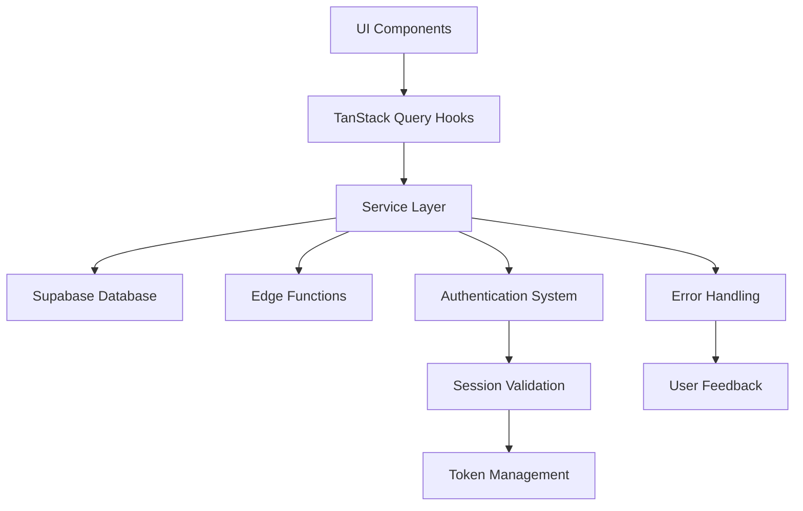
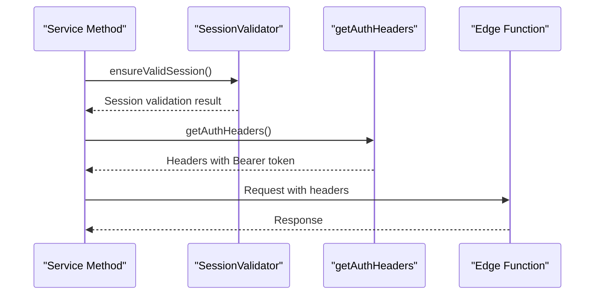
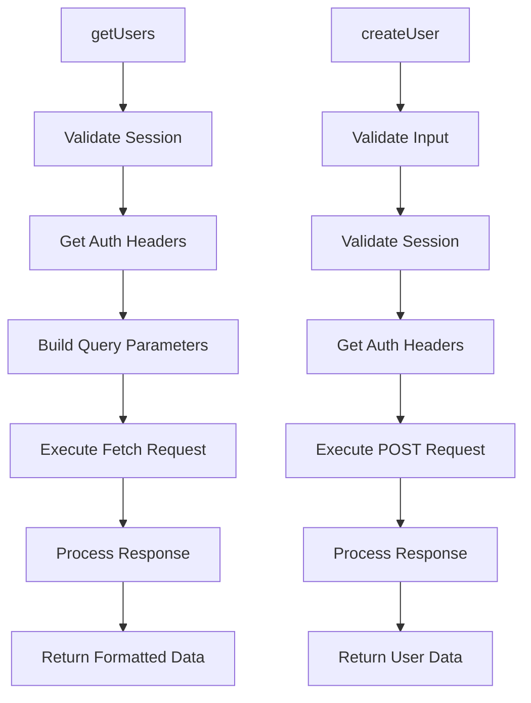
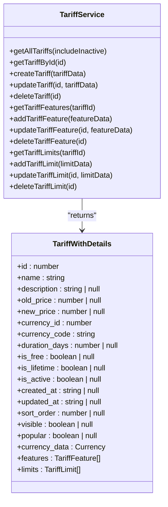
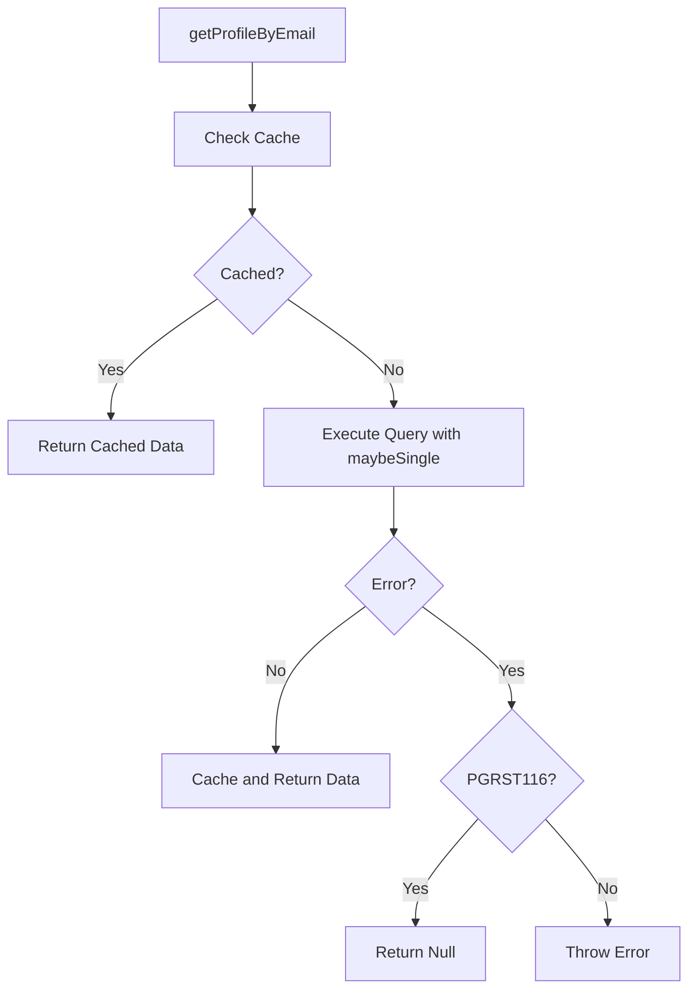
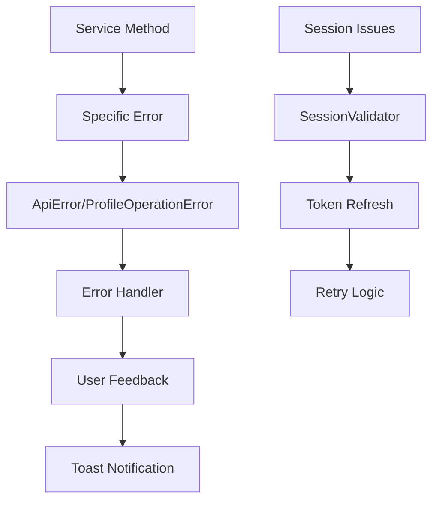
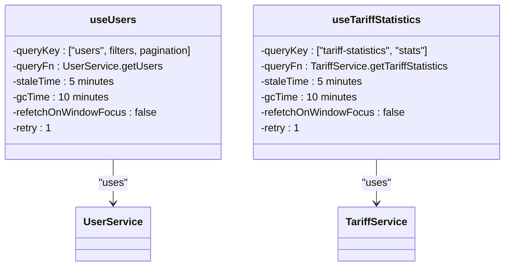

# Service Layer

<cite>
**Referenced Files in This Document**   
- [user-service.ts](file://src/lib/user-service.ts)
- [tariff-service.ts](file://src/lib/tariff-service.ts)
- [profile-service.ts](file://src/lib/profile-service.ts)
- [session-validation.ts](file://src/lib/session-validation.ts)
- [error-handler.ts](file://src/lib/error-handler.ts)
- [useUsers.ts](file://src/hooks/useUsers.ts)
- [useTariffStatistics.ts](file://src/hooks/useTariffStatistics.ts)
</cite>

## Table of Contents
1. [Introduction](#introduction)
2. [Service Architecture Overview](#service-architecture-overview)
3. [Authentication Header Management](#authentication-header-management)
4. [User Service Implementation](#user-service-implementation)
5. [Tariff Service Implementation](#tariff-service-implementation)
6. [Profile Service Implementation](#profile-service-implementation)
7. [Error Handling Strategies](#error-handling-strategies)
8. [Integration with TanStack Query](#integration-with-tanstack-query)
9. [Common Issues and Solutions](#common-issues-and-solutions)
10. [Extending Service Patterns](#extending-service-patterns)

## Introduction

The service layer in lovable-rise provides a robust abstraction between the application's UI components and backend systems, primarily Supabase and Edge Functions. This layer encapsulates business logic, manages API interactions, and ensures consistent data handling across the application. The services follow a standardized pattern of implementation that promotes maintainability, testability, and scalability.

The architecture leverages TypeScript classes with static methods to organize related functionality, providing a clean interface for consuming components. Each service handles specific domain concerns such as user management, tariff configuration, and profile operations, while maintaining consistent patterns for authentication, error handling, and data transformation.

**Section sources**
- [user-service.ts](file://src/lib/user-service.ts#L1-L50)
- [tariff-service.ts](file://src/lib/tariff-service.ts#L1-L50)

## Service Architecture Overview

The service layer follows a consistent architectural pattern across all service implementations. Each service class encapsulates domain-specific business logic and provides a clean API for consumers. The services interact with Supabase through both direct database operations and Edge Functions, depending on the complexity and security requirements of the operation.

**Diagram sources**
- [user-service.ts](file://src/lib/user-service.ts#L81-L311)
- [tariff-service.ts](file://src/lib/tariff-service.ts#L39-L720)
- [profile-service.ts](file://src/lib/profile-service.ts#L59-L814)

**Section sources**
- [user-service.ts](file://src/lib/user-service.ts#L1-L100)
- [tariff-service.ts](file://src/lib/tariff-service.ts#L1-L100)

## Authentication Header Management

The service layer implements a consistent pattern for authentication header formation through the `getAuthHeaders` function. This function ensures that all API requests include the proper authorization tokens while handling edge cases related to session state.

The `getAuthHeaders` implementation follows these key principles:
- Always includes Content-Type header
- Uses Bearer token from Supabase session when available
- Handles cases where no valid session exists
- Logs header information for debugging purposes

This pattern is consistently applied across all services, ensuring uniform authentication handling regardless of the specific service being used.

**Diagram sources**
- [user-service.ts](file://src/lib/user-service.ts#L9-L26)
- [session-validation.ts](file://src/lib/session-validation.ts#L1-L50)

**Section sources**
- [user-service.ts](file://src/lib/user-service.ts#L9-L26)
- [session-validation.ts](file://src/lib/session-validation.ts#L1-L100)

## User Service Implementation

The UserService class provides comprehensive functionality for user management operations. It serves as a primary example of the service pattern implementation in the application.

### Core Operations

The UserService implements RESTful interaction patterns through methods that correspond to standard HTTP operations:

- `getUsers()`: GET request to retrieve user listings with filtering and pagination
- `createUser()`: POST request to create new users
- `updateUser()`: PATCH request to update user information
- `getUser()`: GET request to retrieve a specific user
- `deleteUser()`: DELETE request to remove a user

**Diagram sources**
- [user-service.ts](file://src/lib/user-service.ts#L83-L131)
- [user-service.ts](file://src/lib/user-service.ts#L134-L176)

The service handles request/response transformation by:
- Converting internal data structures to API-compatible formats
- Processing API responses into application domain objects
- Implementing proper error handling for API failures
- Managing loading states and user feedback

**Section sources**
- [user-service.ts](file://src/lib/user-service.ts#L81-L311)

## Tariff Service Implementation

The TariffService class manages tariff-related operations, demonstrating a different pattern of interaction with Supabase compared to the UserService.

### Data Retrieval Patterns

Unlike the UserService which primarily uses Edge Functions, the TariffService interacts directly with Supabase database tables:

**Diagram sources**
- [tariff-service.ts](file://src/lib/tariff-service.ts#L39-L720)

The service implements optimization strategies such as:
- Batched queries to minimize database round trips
- Separate requests for related data (currency, features, limits)
- Caching mechanisms to reduce redundant operations
- Error handling for common database issues

**Section sources**
- [tariff-service.ts](file://src/lib/tariff-service.ts#L39-L720)

## Profile Service Implementation

The ProfileService class handles user profile operations with enhanced error handling for common database issues.

### Error Handling Pattern

The service specifically addresses PostgREST PGRST116 errors (empty result) by converting them to null returns rather than throwing exceptions:

**Diagram sources**
- [profile-service.ts](file://src/lib/profile-service.ts#L59-L814)

The service also implements caching strategies to:
- Reduce redundant database queries
- Improve application performance
- Provide consistent data access patterns
- Handle cache invalidation appropriately

**Section sources**
- [profile-service.ts](file://src/lib/profile-service.ts#L59-L814)

## Error Handling Strategies

The service layer implements comprehensive error handling through multiple mechanisms.

### Centralized Error Management

The application uses a layered approach to error handling:

**Diagram sources**
- [error-handler.ts](file://src/lib/error-handler.ts#L1-L100)
- [session-validation.ts](file://src/lib/session-validation.ts#L1-L100)

Key error handling components include:
- Custom error classes (ApiError, ProfileOperationError)
- Centralized error message management
- User-friendly error presentation
- Retry mechanisms for transient failures
- Session validation and recovery

**Section sources**
- [error-handler.ts](file://src/lib/error-handler.ts#L1-L417)
- [session-validation.ts](file://src/lib/session-validation.ts#L1-L399)

## Integration with TanStack Query

The service layer integrates seamlessly with TanStack Query for state management and data synchronization.

### Query Hook Patterns

The application implements consistent patterns for query hooks:

**Diagram sources**
- [useUsers.ts](file://src/hooks/useUsers.ts#L69-L78)
- [useTariffStatistics.ts](file://src/hooks/useTariffStatistics.ts#L21-L30)

Key configuration parameters:
- `staleTime`: 5 minutes (data considered fresh)
- `gcTime`: 10 minutes (data retention in cache)
- `refetchOnWindowFocus`: false (prevents unnecessary refetching)
- `retry`: 1 (single retry on failure)
- Custom query keys with proper invalidation patterns

**Section sources**
- [useUsers.ts](file://src/hooks/useUsers.ts#L58-L99)
- [useTariffStatistics.ts](file://src/hooks/useTariffStatistics.ts#L1-L30)

## Common Issues and Solutions

The service layer addresses several common issues in web applications.

### Stale Data Management

The application handles stale data through:
- Appropriate staleTime configuration (5 minutes)
- Strategic query invalidation after mutations
- Optimistic updates where appropriate
- Manual refetch mechanisms when needed

### Race Conditions

Race conditions are mitigated by:
- Using TanStack Query's built-in mutation coordination
- Implementing optimistic updates with rollback capability
- Proper query invalidation patterns
- Loading state management to prevent concurrent operations

### Session Expiration

Session expiration is handled through:
- Proactive session validation before operations
- Automatic token refresh when needed
- User-friendly error messages and recovery options
- Retry mechanisms for transient authentication issues

**Section sources**
- [session-validation.ts](file://src/lib/session-validation.ts#L1-L399)
- [useUsers.ts](file://src/hooks/useUsers.ts#L100-L235)

## Extending Service Patterns

New services should follow the established patterns for consistency.

### Creating New Services

When creating new services, follow these guidelines:
- Use static methods for service operations
- Implement consistent error handling patterns
- Use getAuthHeaders for authentication headers
- Follow RESTful naming conventions
- Include proper TypeScript typing
- Implement comprehensive error handling
- Use appropriate logging for debugging

### Best Practices

Recommended practices include:
- Keeping service methods focused and single-purpose
- Using consistent parameter patterns
- Implementing proper input validation
- Providing meaningful error messages
- Using appropriate caching strategies
- Following the same authentication patterns
- Integrating with TanStack Query through standardized hooks

**Section sources**
- [user-service.ts](file://src/lib/user-service.ts#L1-L335)
- [tariff-service.ts](file://src/lib/tariff-service.ts#L1-L740)
- [profile-service.ts](file://src/lib/profile-service.ts#L1-L857)