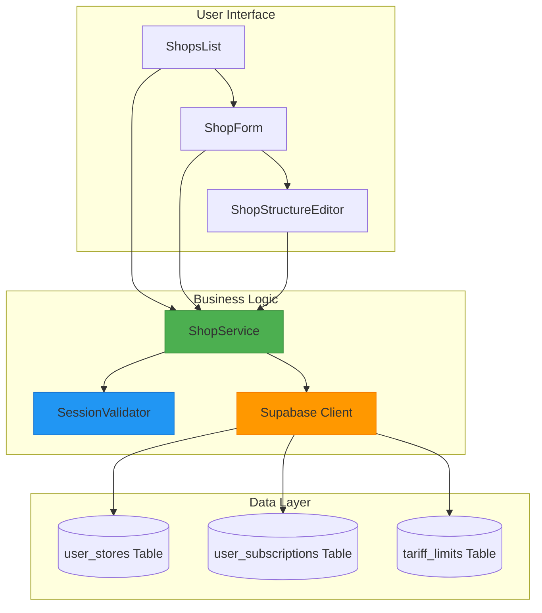
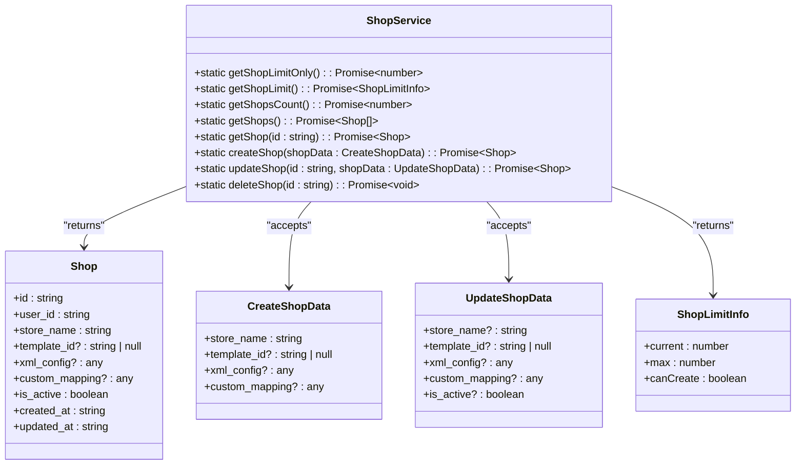
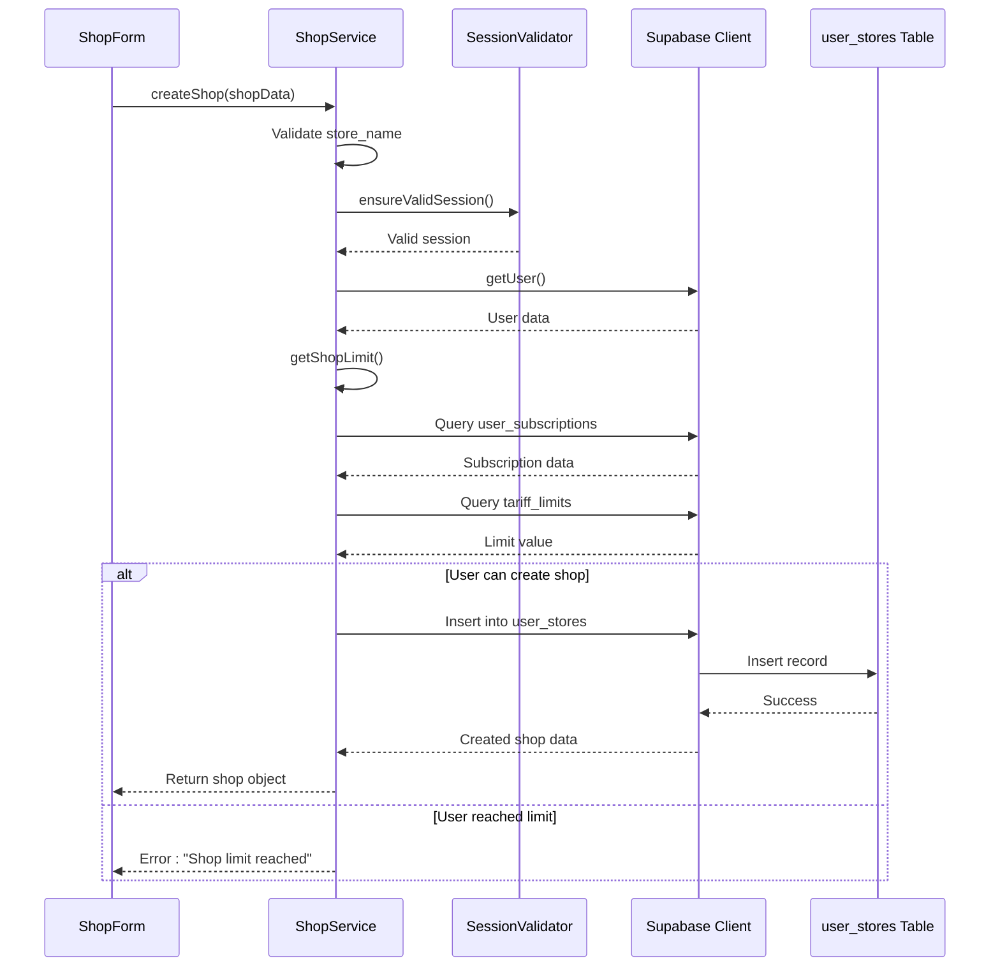
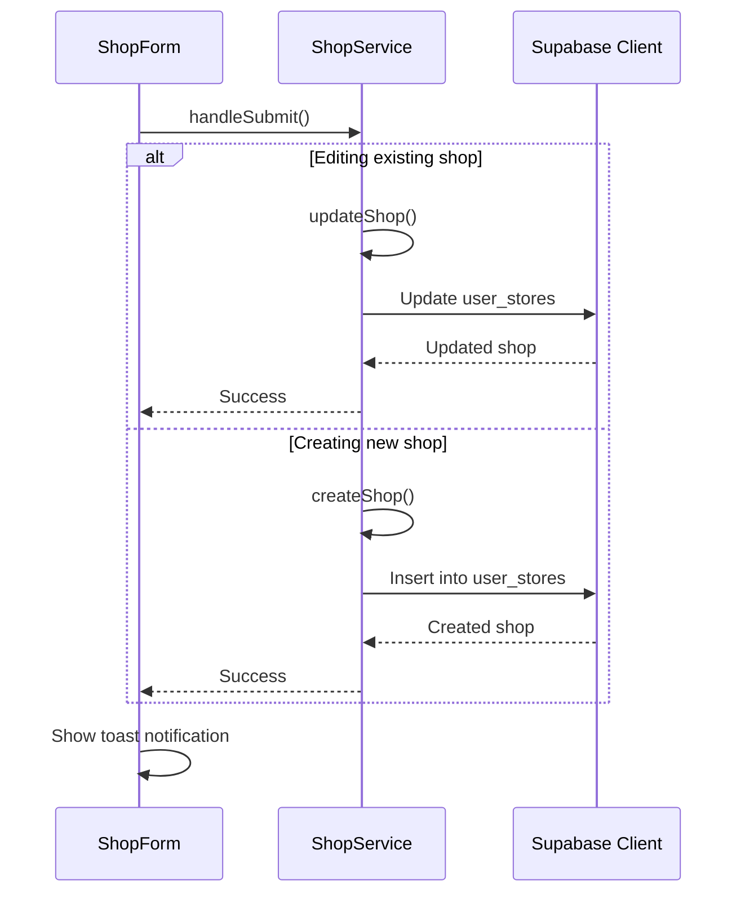
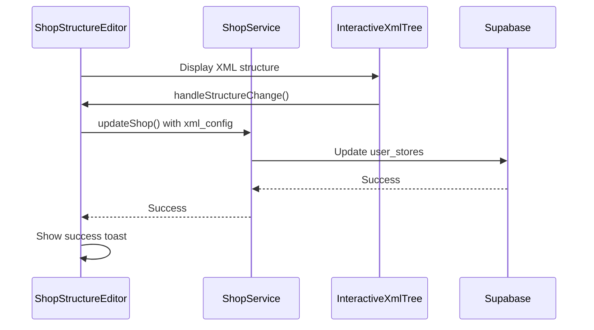
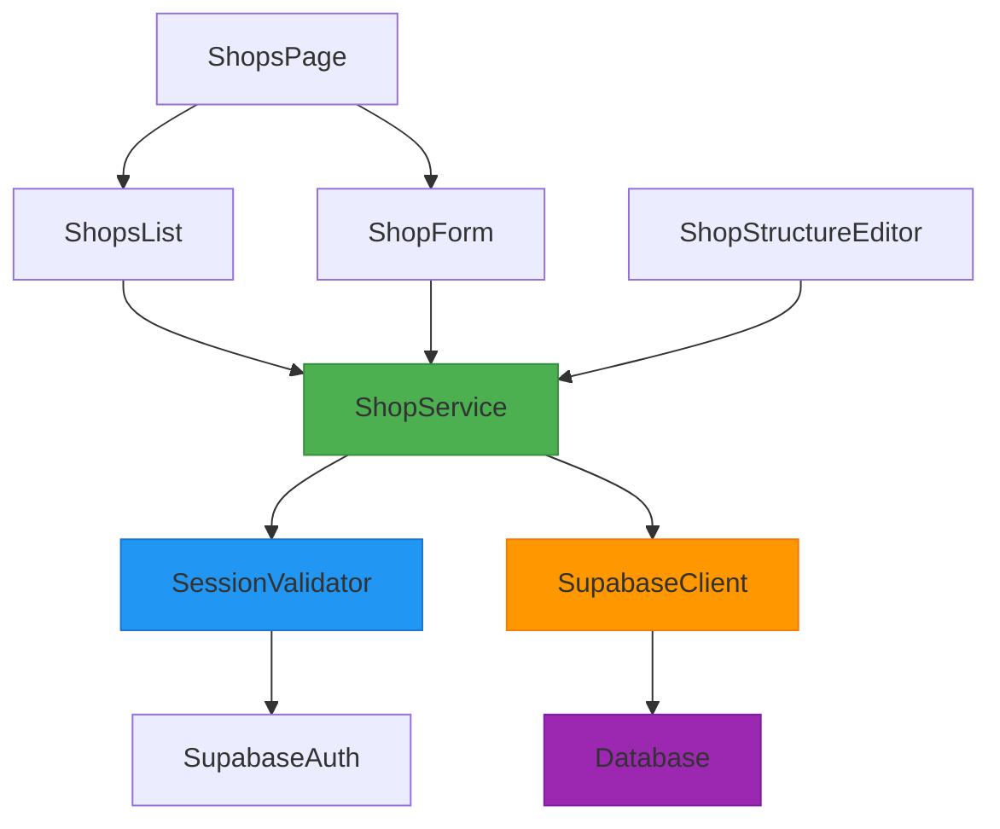

# Shop Service

<cite>
**Referenced Files in This Document**   
- [shop-service.ts](file://src/lib/shop-service.ts)
- [ShopsList.tsx](file://src/components/user/shops/ShopsList.tsx)
- [ShopForm.tsx](file://src/components/user/shops/ShopForm.tsx)
- [ShopStructureEditor.tsx](file://src/components/user/shops/ShopStructureEditor.tsx)
- [Shops.tsx](file://src/pages/user/Shops.tsx)
- [session-validation.ts](file://src/lib/session-validation.ts)
- [client.ts](file://src/integrations/supabase/client.ts)
</cite>

## Table of Contents
1. [Introduction](#introduction)
2. [Core Components](#core-components)
3. [Architecture Overview](#architecture-overview)
4. [Detailed Component Analysis](#detailed-component-analysis)
5. [Dependency Analysis](#dependency-analysis)
6. [Performance Considerations](#performance-considerations)
7. [Troubleshooting Guide](#troubleshooting-guide)
8. [Conclusion](#conclusion)

## Introduction
The ShopService class in lovable-rise provides a comprehensive solution for managing shop-related data operations for end users. It serves as the primary interface between the user interface components and the Supabase database, handling all CRUD operations for shops while enforcing Row Level Security (RLS) policies. The service is designed to support hierarchical shop structure editing, integrate with TanStack Query for efficient data fetching and caching, and ensure proper user context through session validation. This documentation details the implementation, usage, and integration points of the ShopService class.

## Core Components
The ShopService class implements a static class pattern with methods for creating, retrieving, updating, and deleting shops. It works in conjunction with UI components like ShopsList, ShopForm, and ShopStructureEditor to provide a complete user experience for managing shop data. The service leverages Supabase client directly for database operations while ensuring RLS enforcement through proper session validation.

**Section sources**
- [shop-service.ts](file://src/lib/shop-service.ts#L36-L284)
- [ShopsList.tsx](file://src/components/user/shops/ShopsList.tsx#L1-L192)
- [ShopForm.tsx](file://src/components/user/shops/ShopForm.tsx#L1-L206)

## Architecture Overview
The ShopService operates within a layered architecture that separates concerns between data access, business logic, and presentation. It directly interfaces with the Supabase database while coordinating with session validation utilities to ensure proper authentication context. The service is consumed by React components that handle user interaction and presentation.



**Diagram sources**
- [shop-service.ts](file://src/lib/shop-service.ts#L36-L284)
- [ShopsList.tsx](file://src/components/user/shops/ShopsList.tsx#L1-L192)
- [session-validation.ts](file://src/lib/session-validation.ts#L1-L398)

## Detailed Component Analysis

### ShopService Class Analysis
The ShopService class provides a comprehensive API for managing shop data with proper session validation and RLS enforcement.



**Diagram sources**
- [shop-service.ts](file://src/lib/shop-service.ts#L36-L284)

**Section sources**
- [shop-service.ts](file://src/lib/shop-service.ts#L36-L284)

#### Shop Creation and Validation Flow
The process of creating a new shop involves multiple validation steps to ensure data integrity and business rule compliance.



**Diagram sources**
- [shop-service.ts](file://src/lib/shop-service.ts#L150-L184)
- [ShopForm.tsx](file://src/components/user/shops/ShopForm.tsx#L1-L206)

#### Shop Data Retrieval Flow
The process of retrieving shop data follows a consistent pattern of session validation and database querying.

```mermaid
flowchart TD
A[getShops() or getShop(id)] --> B{Validate Session}
B --> |Valid| C[Get User from Supabase Auth]
C --> D[Query user_stores Table]
D --> E{Query Success?}
E --> |Yes| F[Return Shop Data]
E --> |No| G[Log Error]
G --> H[Throw Error Message]
B --> |Invalid| I[Throw Session Error]
style B fill:#f9f,stroke:#333
style E fill:#f9f,stroke:#333
```

**Diagram sources**
- [shop-service.ts](file://src/lib/shop-service.ts#L100-L118)
- [ShopsList.tsx](file://src/components/user/shops/ShopsList.tsx#L1-L192)

### User Interface Integration Analysis
The ShopService is integrated with various UI components to provide a seamless user experience for managing shops.

#### Shops List Component
The ShopsList component displays all shops for the current user and provides actions for editing and deleting shops.

```mermaid
classDiagram
class ShopsList {
+shops : ShopWithMarketplace[]
+loading : boolean
+deleteDialog : {open, shop}
+loadShops() : void
+handleDeleteConfirm() : void
}
ShopsList --> ShopService : "calls getShops()"
ShopsList --> ShopService : "calls deleteShop()"
ShopsList --> ShopForm : "creates"
ShopsList --> ShopStructureEditor : "creates"
```

**Diagram sources**
- [ShopsList.tsx](file://src/components/user/shops/ShopsList.tsx#L1-L192)
- [shop-service.ts](file://src/lib/shop-service.ts#L36-L284)

#### Shop Form Component
The ShopForm component handles both creation and editing of shops, with integration to marketplace templates.



**Diagram sources**
- [ShopForm.tsx](file://src/components/user/shops/ShopForm.tsx#L1-L206)
- [shop-service.ts](file://src/lib/shop-service.ts#L36-L284)

#### Shop Structure Editor
The ShopStructureEditor component allows users to edit the XML structure of their shop configuration.



**Diagram sources**
- [ShopStructureEditor.tsx](file://src/components/user/shops/ShopStructureEditor.tsx#L1-L100)
- [shop-service.ts](file://src/lib/shop-service.ts#L220-L242)

## Dependency Analysis
The ShopService class has well-defined dependencies that enable its functionality while maintaining separation of concerns.



**Diagram sources**
- [shop-service.ts](file://src/lib/shop-service.ts#L36-L284)
- [session-validation.ts](file://src/lib/session-validation.ts#L1-L398)
- [client.ts](file://src/integrations/supabase/client.ts#L1-L30)

## Performance Considerations
The ShopService implementation includes several performance optimizations:

1. **Efficient Querying**: The service uses targeted database queries with appropriate filtering and ordering.
2. **Session Caching**: Session validation results are effectively cached by Supabase's built-in mechanisms.
3. **Minimal Data Transfer**: Only necessary data is retrieved from the database, with proper field selection.
4. **Error Handling**: Comprehensive error handling prevents cascading failures and provides meaningful feedback.

The integration with TanStack Query in the user dashboard components enables additional performance benefits through data caching, background refetching, and optimized rendering.

## Troubleshooting Guide
Common issues with the ShopService typically relate to session validation, RLS policies, or data validation.

**Section sources**
- [shop-service.ts](file://src/lib/shop-service.ts#L36-L284)
- [session-validation.ts](file://src/lib/session-validation.ts#L1-L398)

### Common Error Scenarios
| Error Type | Cause | Resolution |
|-----------|------|------------|
| "Invalid session" | Expired or invalid authentication token | Ensure user is properly authenticated; session will auto-refresh if possible |
| "User not authenticated" | No active session found | User must log in again |
| "Shop limit reached" | User has exceeded their subscription limit | Upgrade subscription plan to increase limit |
| "Shop name required" | Empty or whitespace-only shop name | Provide a valid shop name |
| "Shop not found" | Invalid shop ID provided | Verify the shop ID exists and belongs to the user |

### Debugging Steps
1. Check session validity using SessionValidator utilities
2. Verify the user has proper permissions for the requested operation
3. Confirm the shop ID exists and belongs to the authenticated user
4. Check network requests for proper authentication headers
5. Review Supabase logs for RLS policy violations

## Conclusion
The ShopService class provides a robust and secure solution for managing shop data in the lovable-rise application. By leveraging Supabase's RLS capabilities and implementing proper session validation, it ensures data security while providing a comprehensive API for shop management operations. The service is well-integrated with UI components and supports advanced features like hierarchical structure editing and subscription-based limits. Its design follows best practices for error handling, performance optimization, and maintainability.