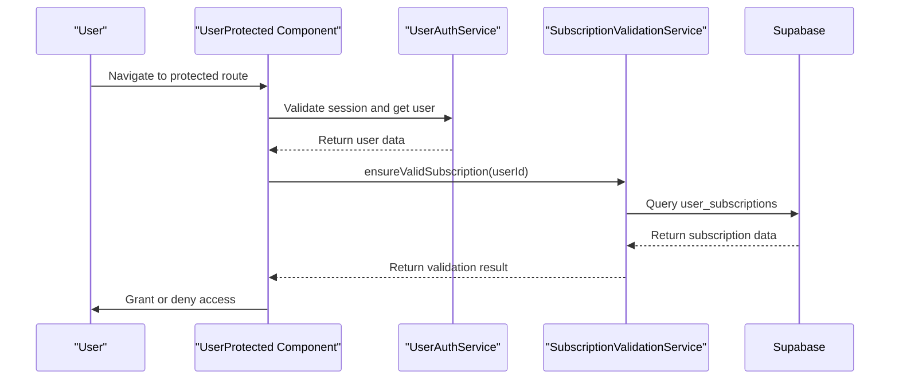
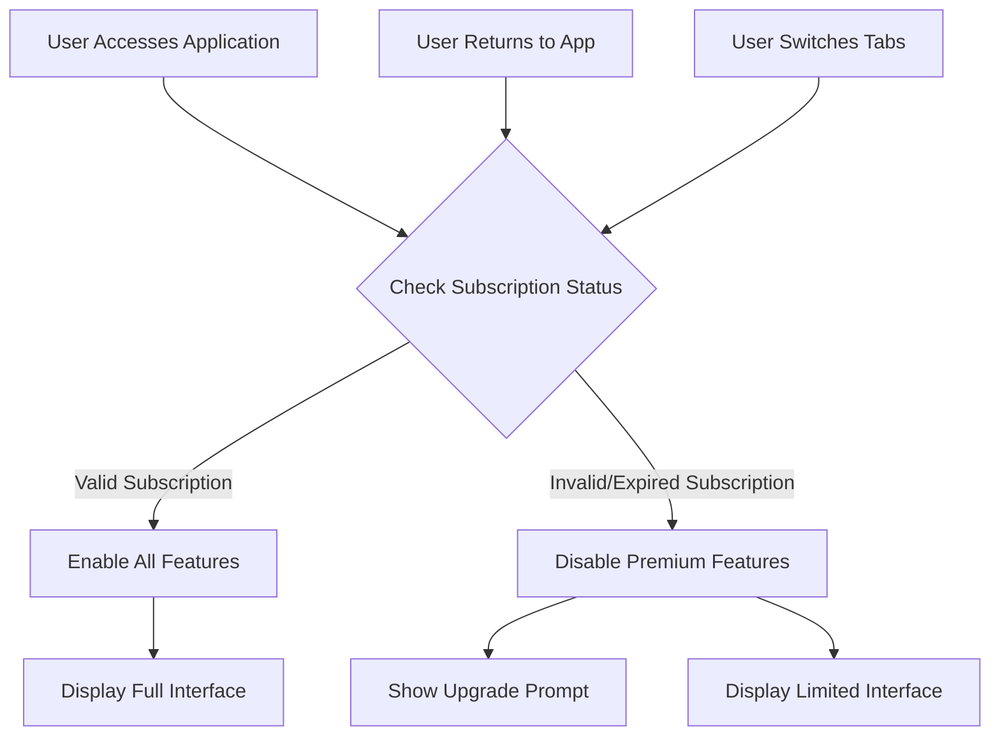
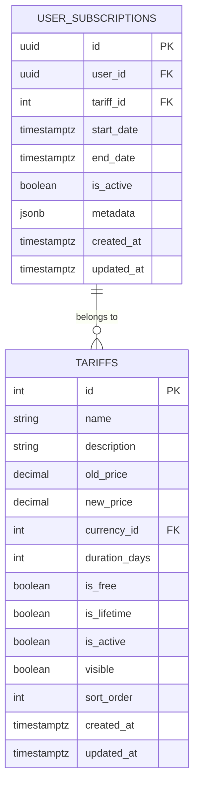
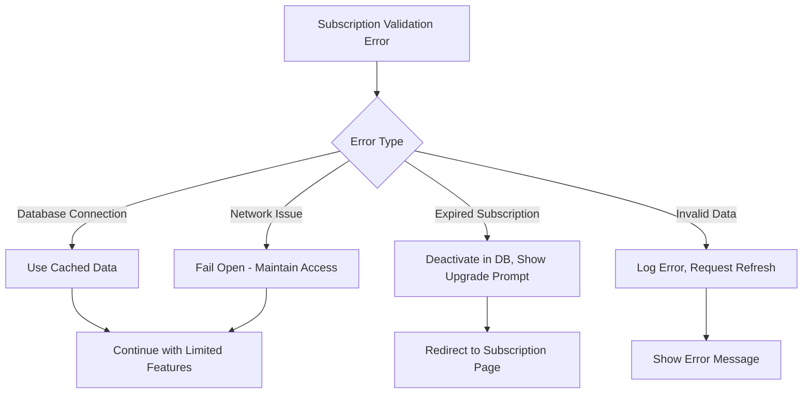
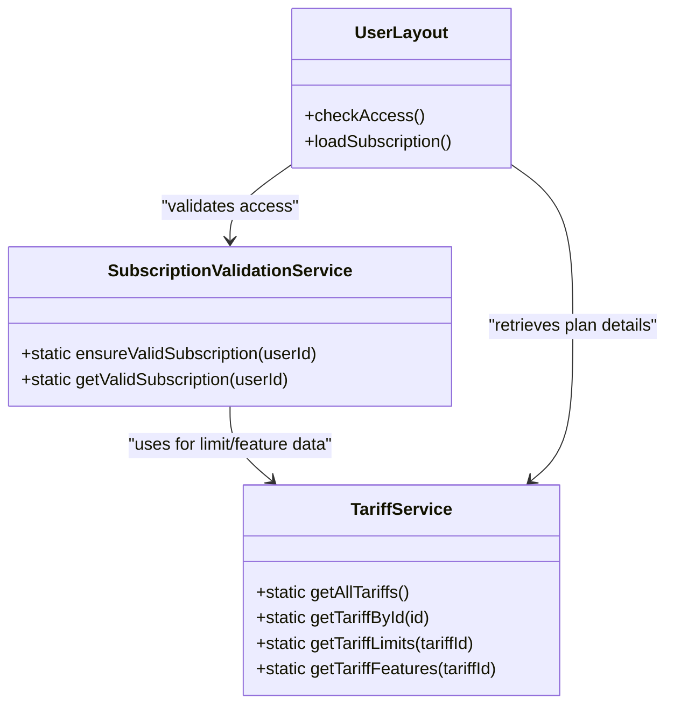
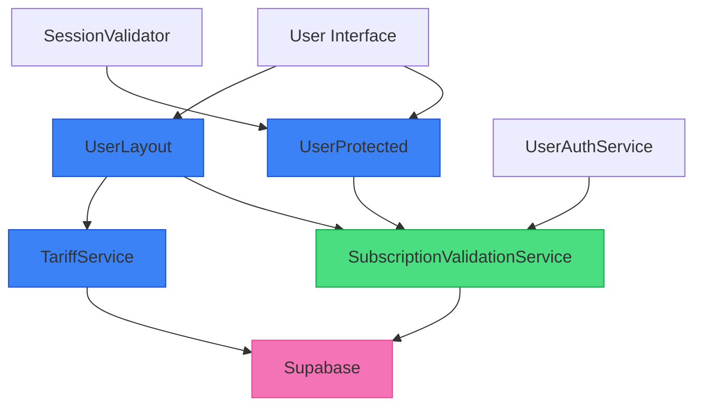

# Subscription Validation Service

<cite>
**Referenced Files in This Document**   
- [subscription-validation-service.ts](file://src/lib/subscription-validation-service.ts)
- [UserProtected.tsx](file://src/pages/UserProtected.tsx)
- [UserLayout.tsx](file://src/components/UserLayout.tsx)
- [tariff-service.ts](file://src/lib/tariff-service.ts)
- [tariff-cache.ts](file://src/lib/tariff-cache.ts)
</cite>

## Table of Contents
1. [Introduction](#introduction)
2. [Core Functionality](#core-functionality)
3. [Subscription Validation Methods](#subscription-validation-methods)
4. [Integration with Protected Routes](#integration-with-protected-routes)
5. [Feature Access Control](#feature-access-control)
6. [Supabase Integration](#supabase-integration)
7. [Error Handling and Graceful Degradation](#error-handling-and-graceful-degradation)
8. [Relationship with Tariff Service](#relationship-with-tariff-service)
9. [Architecture Overview](#architecture-overview)

## Introduction

The SubscriptionValidationService is a critical component in the lovable-rise application responsible for verifying user subscription status and entitlements for feature access control. This service ensures that only users with valid, active subscriptions can access premium features while providing mechanisms for graceful degradation when subscriptions expire or become invalid. The service integrates with Supabase for data persistence and works in conjunction with the tariff-service to enforce comprehensive access control across the application.

**Section sources**
- [subscription-validation-service.ts](file://src/lib/subscription-validation-service.ts#L6-L144)

## Core Functionality

The SubscriptionValidationService provides essential functionality for managing user subscription lifecycle and access control. Its primary responsibility is to validate subscription status by checking expiration dates and automatically deactivating expired subscriptions in the database. The service acts as a gatekeeper for premium features, determining access rights based on tariff limits and subscription status.

The service follows a static class pattern with multiple validation methods that can be called from various parts of the application. It leverages Supabase as the data source for subscription information, querying the `user_subscriptions` table and joining with the `tariffs` table to retrieve complete subscription details including plan features and limitations.

**Section sources**
- [subscription-validation-service.ts](file://src/lib/subscription-validation-service.ts#L6-L144)

## Subscription Validation Methods

The SubscriptionValidationService exposes several key methods for subscription validation and management:

```mermaid
classDiagram
class SubscriptionValidationService {
+static isExpired(endDate : string | null) : boolean
+static validateUserSubscription(userId : string) : Promise<{isValid : boolean, subscription : any | null, wasDeactivated : boolean}>
+static ensureValidSubscription(userId : string) : Promise<{hasValidSubscription : boolean, subscription : any | null, isDemo : boolean}>
+static getValidSubscription(userId : string) : Promise<any | null>
}
```

**Diagram sources**
- [subscription-validation-service.ts](file://src/lib/subscription-validation-service.ts#L6-L144)

### isExpired Method
The private `isExpired` method checks if a subscription has passed its end date by comparing the subscription's end date with the current timestamp. For lifetime subscriptions that don't have an end date, the method returns false, indicating the subscription is still valid.

### validateUserSubscription Method
This method retrieves the user's active subscription and checks its expiration status. If the subscription is expired, it automatically updates the database to deactivate the subscription by setting `is_active` to false. The method returns an object containing validation status, subscription details, and whether the subscription was deactivated.

### ensureValidSubscription Method
This is the primary method used throughout the application to validate subscriptions. It calls `validateUserSubscription` internally and returns a comprehensive result indicating whether the user has a valid subscription, along with subscription details and a flag indicating if the subscription is a demo account.

### getValidSubscription Method
A convenience method that returns the subscription object if valid, or null if the subscription is expired or invalid. This method simplifies access to subscription data when the calling code only needs the subscription details without the additional validation metadata.

**Section sources**
- [subscription-validation-service.ts](file://src/lib/subscription-validation-service.ts#L6-L144)

## Integration with Protected Routes

The SubscriptionValidationService is tightly integrated with the application's routing system to prevent unauthorized access to protected routes. This integration occurs primarily through the UserProtected component, which serves as a route guard for user-facing functionality.



**Diagram sources**
- [UserProtected.tsx](file://src/pages/UserProtected.tsx#L0-L104)
- [subscription-validation-service.ts](file://src/lib/subscription-validation-service.ts#L6-L144)

The integration follows this flow:
1. When a user attempts to access a protected route, the UserProtected component intercepts the request
2. It first validates the user's authentication session
3. Once authenticated, it calls `SubscriptionValidationService.ensureValidSubscription()` with the user's ID
4. If the subscription is valid, access is granted; otherwise, the user may be redirected or shown appropriate messaging

The service is implemented with non-blocking error handling, meaning that subscription validation failures don't prevent the user from accessing the application entirely, but rather limit access to premium features.

**Section sources**
- [UserProtected.tsx](file://src/pages/UserProtected.tsx#L0-L104)
- [subscription-validation-service.ts](file://src/lib/subscription-validation-service.ts#L6-L144)

## Feature Access Control

Beyond route protection, the SubscriptionValidationService enables fine-grained feature access control within the application. The UserLayout component uses the service to determine which features and menu items should be available to the current user based on their subscription status.



**Diagram sources**
- [UserLayout.tsx](file://src/components/UserLayout.tsx#L176-L211)

The access control mechanism includes event listeners for window focus and visibility changes, ensuring that subscription status is revalidated when the user returns to the application after being away. This prevents scenarios where a subscription expires while the user is inactive, but they continue to have access to premium features.

The service also distinguishes between different types of subscriptions, including demo accounts which are identified by having `is_free = true` and `visible = false` in the associated tariff. This allows the application to provide differentiated experiences for trial users versus paying customers.

**Section sources**
- [UserLayout.tsx](file://src/components/UserLayout.tsx#L176-L211)

## Supabase Integration

The SubscriptionValidationService integrates directly with Supabase to retrieve and update subscription data. It queries the `user_subscriptions` table with a join to the `tariffs` table to obtain complete subscription information in a single database call.



**Diagram sources**
- [subscription-validation-service.ts](file://src/lib/subscription-validation-service.ts#L6-L144)

The service performs the following database operations:
- SELECT queries to retrieve active subscriptions for a user
- UPDATE operations to deactivate expired subscriptions by setting `is_active = false`
- JOIN operations to include tariff details with subscription data

All database interactions are wrapped in try-catch blocks to handle potential connection issues or query errors gracefully. The service logs detailed information about each database operation for debugging purposes, including timestamps and query parameters.

**Section sources**
- [subscription-validation-service.ts](file://src/lib/subscription-validation-service.ts#L6-L144)

## Error Handling and Graceful Degradation

The SubscriptionValidationService implements comprehensive error handling strategies to ensure application stability and provide a good user experience even when subscription validation fails.

When errors occur during subscription validation, the service follows a "fail open" approach in certain contexts, particularly in the UserLayout component where `setHasAccess(true)` is the fallback behavior. This prevents the entire application from becoming inaccessible due to temporary issues with the subscription validation service.



**Diagram sources**
- [UserLayout.tsx](file://src/components/UserLayout.tsx#L176-L211)
- [subscription-validation-service.ts](file://src/lib/subscription-validation-service.ts#L6-L144)

The service also implements client-side caching through event listeners that revalidate subscription status when the user returns to the application. This helps catch subscription expirations that might have occurred while the user was away from the application.

In the UserProtected component, subscription validation errors are caught and logged, but they don't prevent the authentication flow from completing. This non-blocking approach ensures that users can still access basic functionality even if there are temporary issues with the subscription validation service.

**Section sources**
- [UserLayout.tsx](file://src/components/UserLayout.tsx#L176-L211)
- [subscription-validation-service.ts](file://src/lib/subscription-validation-service.ts#L6-L144)

## Relationship with Tariff Service

The SubscriptionValidationService works in conjunction with the TariffService to enforce comprehensive access control based on both subscription status and tariff limitations. While the SubscriptionValidationService focuses on subscription validity and expiration, the TariffService provides information about the specific features and limits associated with each tariff plan.



**Diagram sources**
- [subscription-validation-service.ts](file://src/lib/subscription-validation-service.ts#L6-L144)
- [tariff-service.ts](file://src/lib/tariff-service.ts#L1-L740)
- [UserLayout.tsx](file://src/components/UserLayout.tsx#L176-L211)

The integration between these services occurs primarily in the UserDashboard and UserLayout components, where the SubscriptionValidationService first confirms that a user has a valid subscription, and then the TariffService is called to retrieve the specific limits and features associated with that subscription's tariff plan.

The TariffCache service provides an additional layer of optimization by caching tariff data for 5 minutes, reducing the number of database queries needed when multiple components need tariff information. This caching strategy complements the subscription validation process by ensuring that tariff details are available quickly without repeated database calls.

**Section sources**
- [tariff-service.ts](file://src/lib/tariff-service.ts#L1-L740)
- [tariff-cache.ts](file://src/lib/tariff-cache.ts#L1-L47)
- [subscription-validation-service.ts](file://src/lib/subscription-validation-service.ts#L6-L144)

## Architecture Overview

The SubscriptionValidationService is a key component in the application's access control architecture, sitting between the user interface and data layers to enforce subscription-based feature gating.



**Diagram sources**
- [subscription-validation-service.ts](file://src/lib/subscription-validation-service.ts#L6-L144)
- [UserProtected.tsx](file://src/pages/UserProtected.tsx#L0-L104)
- [UserLayout.tsx](file://src/components/UserLayout.tsx#L176-L211)
- [tariff-service.ts](file://src/lib/tariff-service.ts#L1-L740)

The service follows a stateless, static class pattern that allows it to be imported and used anywhere in the application without instantiation. This design choice enables easy integration across different components while maintaining a single source of truth for subscription validation logic.

The architecture emphasizes separation of concerns, with the SubscriptionValidationService focusing exclusively on subscription status validation, while delegating tariff-specific details to the TariffService. This separation allows each service to evolve independently while providing a cohesive access control system.

**Section sources**
- [subscription-validation-service.ts](file://src/lib/subscription-validation-service.ts#L6-L144)
- [UserProtected.tsx](file://src/pages/UserProtected.tsx#L0-L104)
- [UserLayout.tsx](file://src/components/UserLayout.tsx#L176-L211)
- [tariff-service.ts](file://src/lib/tariff-service.ts#L1-L740)