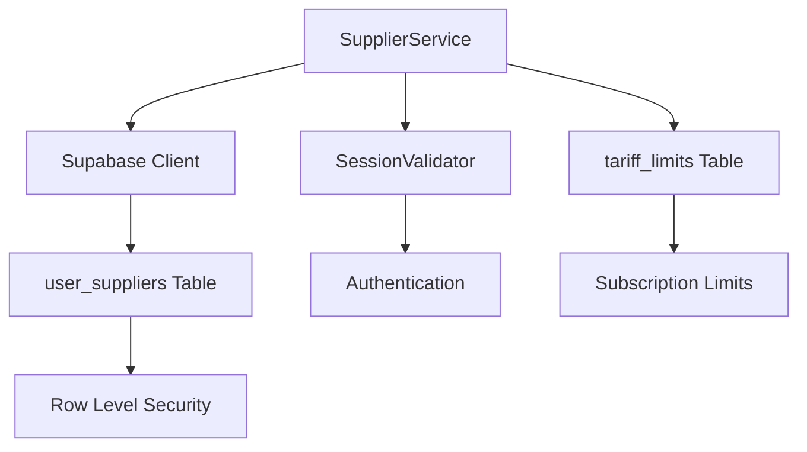
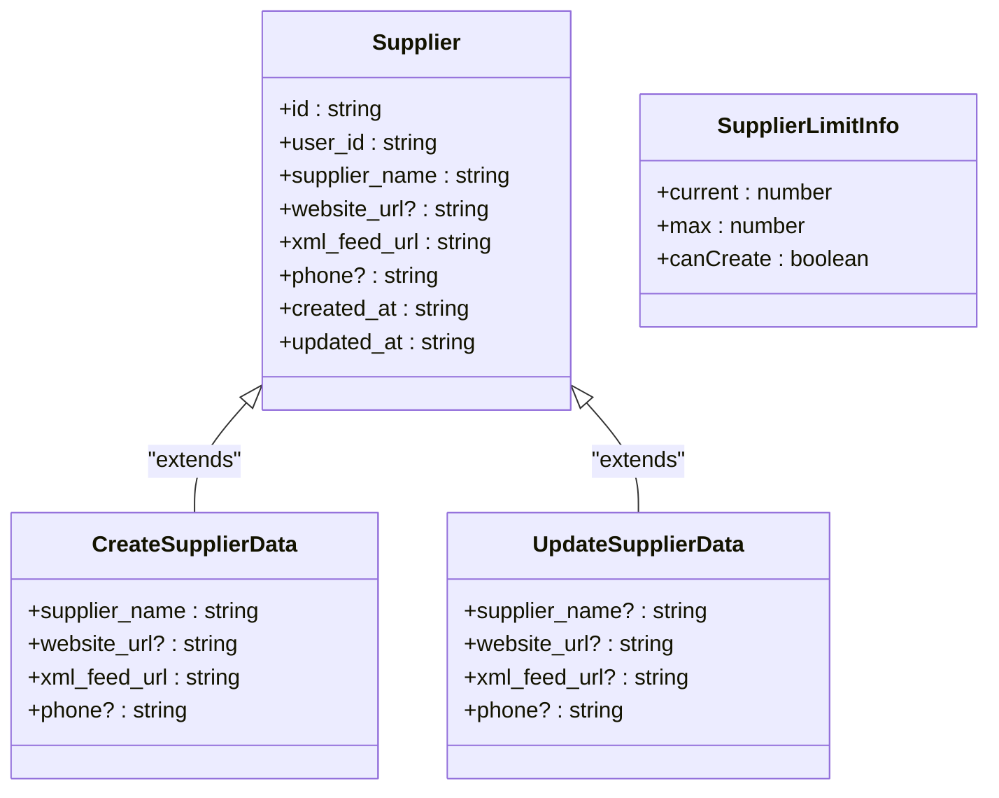
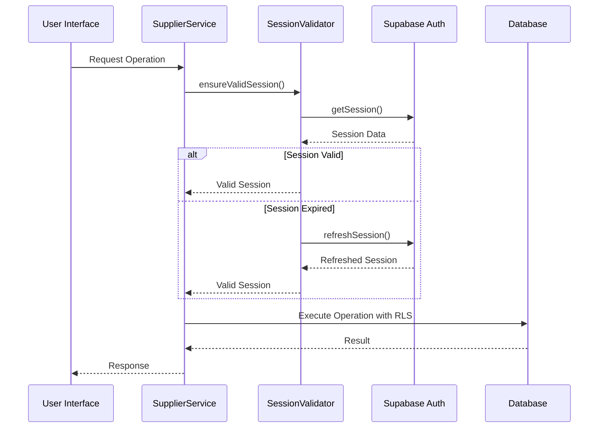
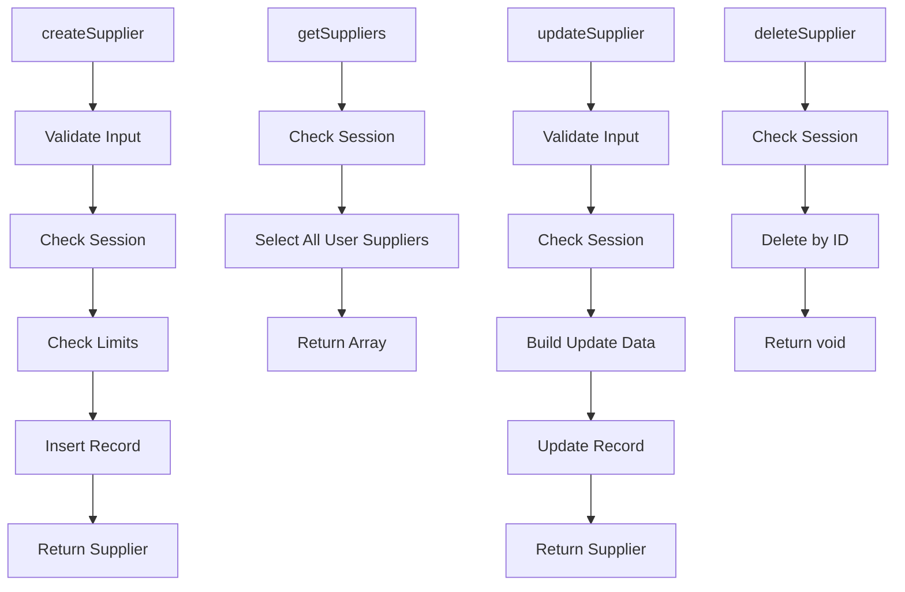
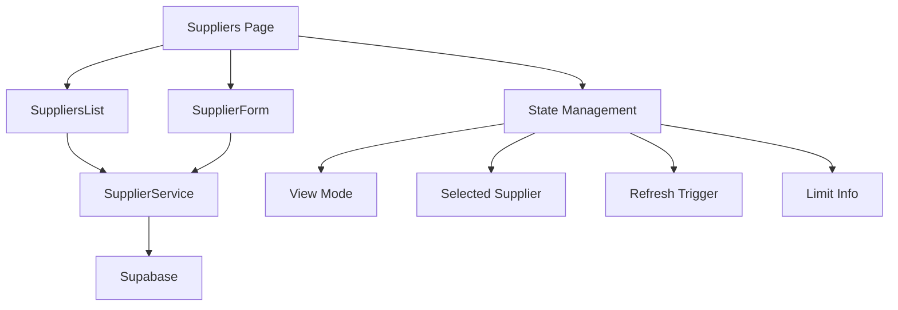

# Supplier Service

<cite>
**Referenced Files in This Document**  
- [supplier-service.ts](file://src/lib/supplier-service.ts)
- [SuppliersList.tsx](file://src/components/user/suppliers/SuppliersList.tsx)
- [SupplierForm.tsx](file://src/components/user/suppliers/SupplierForm.tsx)
- [Suppliers.tsx](file://src/pages/user/Suppliers.tsx)
- [client.ts](file://src/integrations/supabase/client.ts)
- [session-validation.ts](file://src/lib/session-validation.ts)
</cite>

## Table of Contents
1. [Introduction](#introduction)
2. [Core Functionality](#core-functionality)
3. [Data Model](#data-model)
4. [Authentication and Security](#authentication-and-security)
5. [CRUD Operations](#crud-operations)
6. [Integration with UI Components](#integration-with-ui-components)
7. [Error Handling](#error-handling)
8. [Usage Example](#usage-example)

## Introduction

The SupplierService class in the lovable-rise application provides a comprehensive interface for managing supplier data throughout its lifecycle. This service acts as a middleware layer between the user interface components and the Supabase database, implementing business logic for supplier management while enforcing security constraints through Row Level Security (RLS). The service enables users to create, retrieve, update, and delete supplier records within the constraints of their subscription plan limits.

**Section sources**
- [supplier-service.ts](file://src/lib/supplier-service.ts#L34-L284)

## Core Functionality

The SupplierService implements a static class pattern with methods for all supplier-related operations. It interacts directly with the Supabase client to perform database operations on the `user_suppliers` table, which stores supplier information with a one-to-many relationship to users. The service enforces business rules such as subscription-based limits on the number of suppliers a user can create.

The service also implements supplier limit management by checking the user's current subscription tier and retrieving the corresponding limit from the `tariff_limits` table. This ensures that users cannot exceed their plan's capacity for suppliers, providing a mechanism for upselling to higher-tier plans.

**Diagram sources**
- [supplier-service.ts](file://src/lib/supplier-service.ts#L34-L284)
- [client.ts](file://src/integrations/supabase/client.ts#L10-L30)

**Section sources**
- [supplier-service.ts](file://src/lib/supplier-service.ts#L34-L284)

## Data Model

The SupplierService operates on several TypeScript interfaces that define the structure of supplier data and related information. The core `Supplier` interface represents a complete supplier record with all its properties, while `CreateSupplierData` and `UpdateSupplierData` define the data contracts for creation and update operations respectively. The `SupplierLimitInfo` interface provides information about the user's current usage against their plan limits.

**Diagram sources**
- [supplier-service.ts](file://src/lib/supplier-service.ts#L3-L32)

**Section sources**
- [supplier-service.ts](file://src/lib/supplier-service.ts#L3-L32)

## Authentication and Security

The SupplierService integrates with the application's authentication system through the SessionValidator class, which ensures that all operations are performed with a valid user session. Before executing any database operation, the service calls `SessionValidator.ensureValidSession()` to validate the current authentication state and refresh expired tokens if necessary.

This security layer works in conjunction with Supabase's Row Level Security (RLS) policies, which restrict database access to only the records owned by the authenticated user. The service retrieves the current user's ID from the Supabase auth system and uses it to scope all queries to the user's own supplier records, preventing unauthorized access to other users' data.

**Diagram sources**
- [supplier-service.ts](file://src/lib/supplier-service.ts#L34-L284)
- [session-validation.ts](file://src/lib/session-validation.ts#L42-L343)

**Section sources**
- [supplier-service.ts](file://src/lib/supplier-service.ts#L34-L284)
- [session-validation.ts](file://src/lib/session-validation.ts#L42-L343)

## CRUD Operations

The SupplierService provides four primary methods for managing supplier data: `createSupplier`, `getSuppliers`, `updateSupplier`, and `deleteSupplier`. Each method follows a consistent pattern of session validation, business logic enforcement, and database interaction.

The `createSupplier` method validates input data, checks the user's subscription limits, and inserts a new record with the current user's ID. The `getSuppliers` method retrieves all suppliers for the authenticated user, ordered by creation date. The `updateSupplier` method performs partial updates with validation, and the `deleteSupplier` method removes a supplier record by ID.

**Diagram sources**
- [supplier-service.ts](file://src/lib/supplier-service.ts#L34-L284)

**Section sources**
- [supplier-service.ts](file://src/lib/supplier-service.ts#L34-L284)

## Integration with UI Components

The SupplierService is integrated with several UI components to provide a seamless user experience for supplier management. The SuppliersList component displays all suppliers in a grid layout and provides edit and delete functionality. The SupplierForm component handles both creation and editing of supplier records with form validation. These components are orchestrated by the Suppliers page, which manages the application state and workflow.

The integration follows a callback pattern where UI components pass functions to the service methods, allowing for proper state management and user feedback through toast notifications. The page component also handles the supplier limit display, showing the current count against the maximum allowed by the user's subscription.

**Diagram sources**
- [Suppliers.tsx](file://src/pages/user/Suppliers.tsx#L14-L147)
- [SuppliersList.tsx](file://src/components/user/suppliers/SuppliersList.tsx#L27-L185)
- [SupplierForm.tsx](file://src/components/user/suppliers/SupplierForm.tsx#L15-L15)

**Section sources**
- [Suppliers.tsx](file://src/pages/user/Suppliers.tsx#L14-L147)
- [SuppliersList.tsx](file://src/components/user/suppliers/SuppliersList.tsx#L27-L185)
- [SupplierForm.tsx](file://src/components/user/suppliers/SupplierForm.tsx#L15-L15)

## Error Handling

The SupplierService implements comprehensive error handling for various failure scenarios. Input validation errors are thrown with descriptive Ukrainian messages when required fields are missing or invalid. Authentication errors occur when the user session is invalid or expired. Database errors from Supabase are propagated with appropriate error messages.

The service also handles business rule violations, such as attempting to create a supplier when the user has reached their subscription limit. In such cases, a specific error message is thrown to inform the user that they need to upgrade their plan. All errors are logged to the console for debugging purposes and include contextual information to aid in troubleshooting.

**Section sources**
- [supplier-service.ts](file://src/lib/supplier-service.ts#L34-L284)

## Usage Example

The SupplierService is used in the Suppliers page to manage the complete supplier workflow. When a user navigates to the Suppliers page, the component loads the supplier limit information and displays existing suppliers in the SuppliersList component. Users can create new suppliers by clicking the add button, which switches to the SupplierForm in create mode.

When editing an existing supplier, the component passes the supplier data to the SupplierForm, which pre-fills the form fields. After submission, the service methods are called with appropriate callbacks to refresh the data and provide user feedback through toast notifications. The entire workflow is protected by session validation and respects the user's subscription limits.

**Section sources**
- [Suppliers.tsx](file://src/pages/user/Suppliers.tsx#L14-L147)
- [supplier-service.ts](file://src/lib/supplier-service.ts#L34-L284)