# Tariff Service

<cite>
**Referenced Files in This Document**   
- [tariff-service.ts](file://src/lib/tariff-service.ts)
- [tariff-cache.ts](file://src/lib/tariff-cache.ts)
- [AdminTariffManagement.tsx](file://src/pages/admin/AdminTariffManagement.tsx)
- [AdminTariffNew.tsx](file://src/pages/admin/AdminTariffNew.tsx)
- [AdminTariffEdit.tsx](file://src/pages/admin/AdminTariffEdit.tsx)
- [AdminTariffFeatures.tsx](file://src/pages/admin/AdminTariffFeatures.tsx)
- [client.ts](file://src/integrations/supabase/client.ts)
</cite>

## Table of Contents
1. [Introduction](#introduction)
2. [Core Responsibilities](#core-responsibilities)
3. [Key Methods](#key-methods)
4. [Integration with Admin UI Components](#integration-with-admin-ui-components)
5. [Error Handling](#error-handling)
6. [Caching Mechanism](#caching-mechanism)
7. [Usage Examples](#usage-examples)
8. [Currency and Pricing Configuration](#currency-and-pricing-configuration)

## Introduction
The TariffService class in the lovable-rise application is responsible for managing subscription plans and tariff configurations. It provides a comprehensive interface for creating, editing, deleting, and retrieving tariff plans, along with their associated features and limits. The service interacts with Supabase Edge Functions through authenticated HTTP requests and enforces session validation before performing any operations. This documentation details the implementation, functionality, and integration points of the TariffService class.

**Section sources**
- [tariff-service.ts](file://src/lib/tariff-service.ts#L39-L739)

## Core Responsibilities
The TariffService class handles the complete lifecycle of tariff management within the application. Its primary responsibilities include:

- **Tariff Creation**: Creating new subscription plans with specified pricing, duration, and features
- **Tariff Modification**: Updating existing tariff plans with new configurations
- **Tariff Deletion**: Removing tariff plans from the system
- **Feature Management**: Configuring features associated with each tariff plan
- **Limit Configuration**: Setting usage limits for various system resources
- **Currency Management**: Handling multiple currency configurations for pricing
- **Data Retrieval**: Fetching tariff plans with all associated details

The service ensures data consistency by validating operations and maintaining relationships between tariffs, features, and limits. It also implements proper error handling for validation failures and server errors.

**Section sources**
- [tariff-service.ts](file://src/lib/tariff-service.ts#L39-L739)

## Key Methods
The TariffService class exposes several static methods for managing tariff operations:

### createTariff
Creates a new tariff plan with the specified configuration. The method accepts a TariffInsert object containing all necessary tariff details and returns the created tariff with associated currency data.

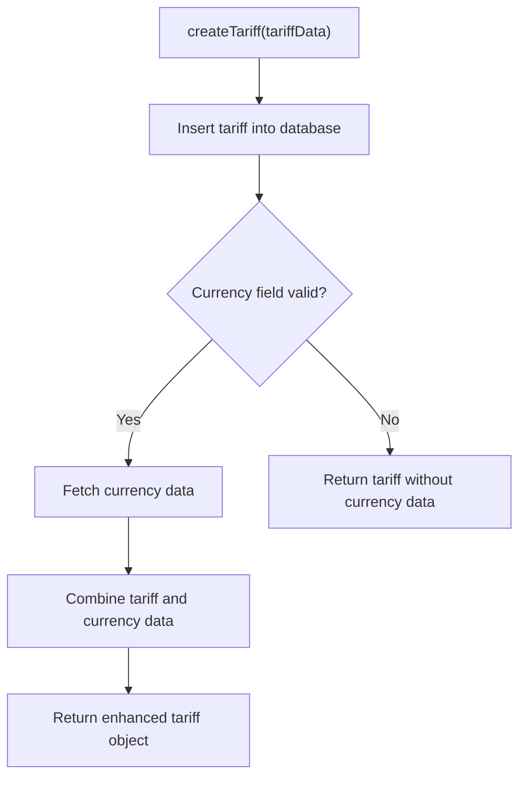

**Diagram sources**
- [tariff-service.ts](file://src/lib/tariff-service.ts#L198-L238)

### updateTariff
Updates an existing tariff plan with new configuration data. The method takes a tariff ID and a TariffUpdate object, performs the update operation, and returns the updated tariff with currency information.

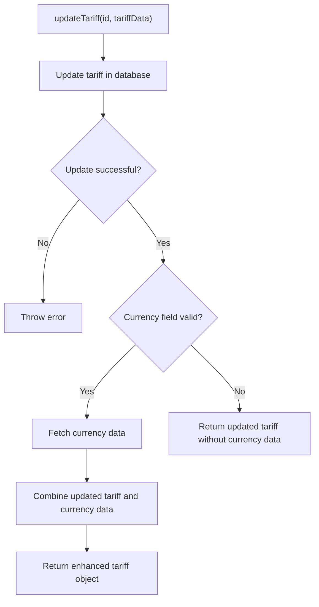

**Diagram sources**
- [tariff-service.ts](file://src/lib/tariff-service.ts#L240-L288)

### deleteTariff
Removes a tariff plan from the system by its ID. This operation is permanent and cannot be undone.

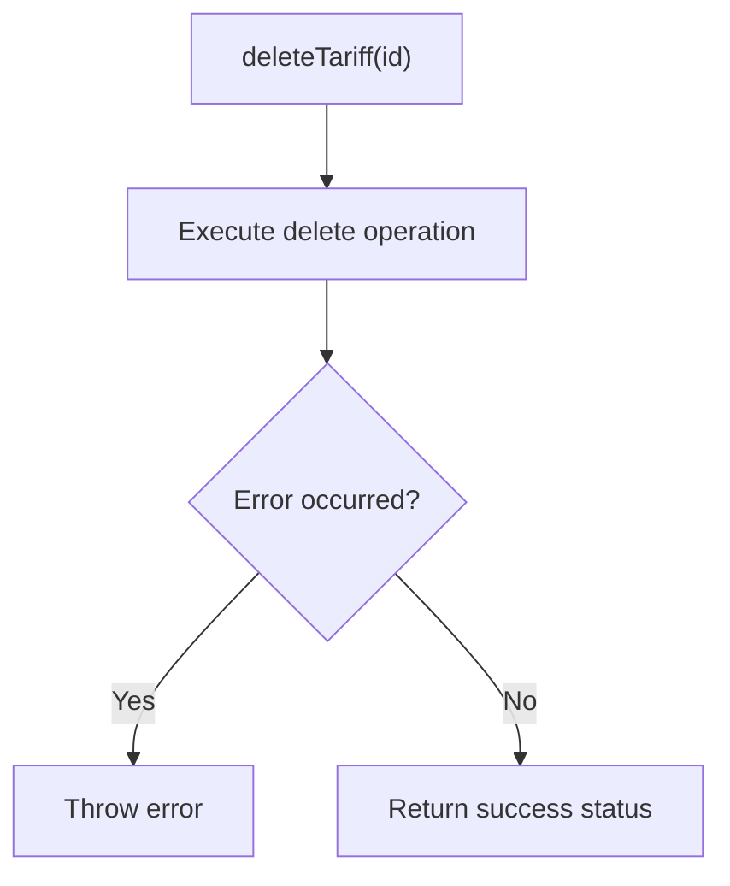

**Diagram sources**
- [tariff-service.ts](file://src/lib/tariff-service.ts#L290-L303)

### fetchTariffPlans
Retrieves all tariff plans from the database, with options to include inactive plans. The method optimizes data loading by making separate queries for tariffs, currencies, features, and limits, then combining them into a comprehensive response.

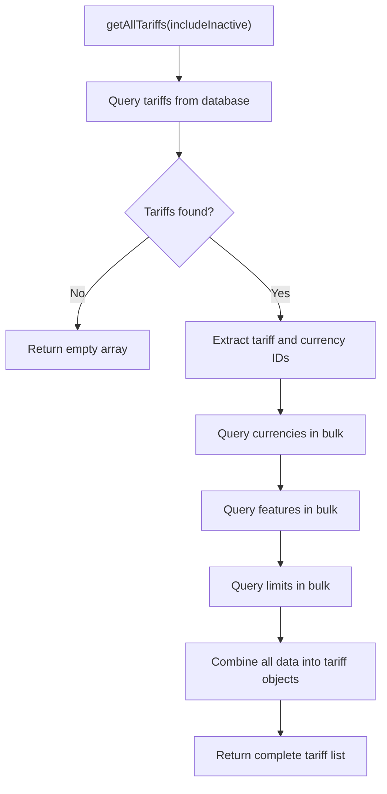

**Diagram sources**
- [tariff-service.ts](file://src/lib/tariff-service.ts#L41-L156)

## Integration with Admin UI Components
The TariffService is tightly integrated with several admin interface components that provide a user-friendly way to manage tariff plans:

### AdminTariffManagement
This component displays a comprehensive list of all tariff plans and provides actions for editing, deleting, and duplicating plans. It uses the TariffService to fetch tariff data and perform operations.

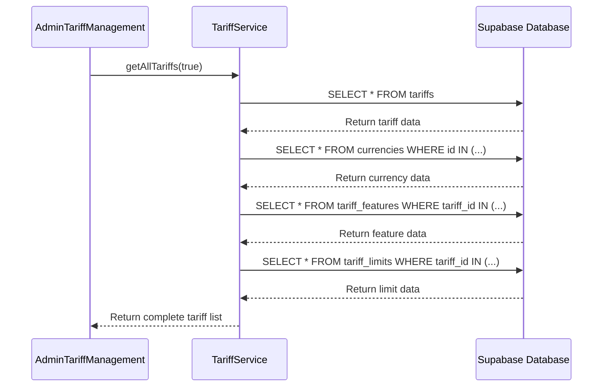

**Diagram sources**
- [AdminTariffManagement.tsx](file://src/pages/admin/AdminTariffManagement.tsx#L99-L110)

### AdminTariffNew
This component provides a form interface for creating new tariff plans. It uses the TariffService.createTariff method to save new plans and related features/limits.

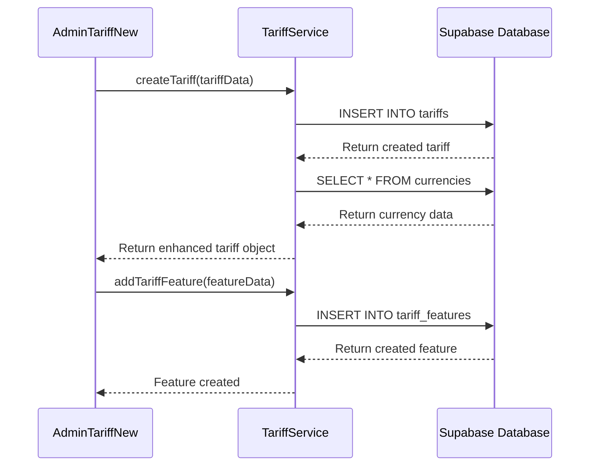

**Diagram sources**
- [AdminTariffNew.tsx](file://src/pages/admin/AdminTariffNew.tsx#L229-L239)

### AdminTariffEdit
This component allows editing existing tariff plans. It uses TariffService.updateTariff to save changes and provides real-time updates to features and limits.

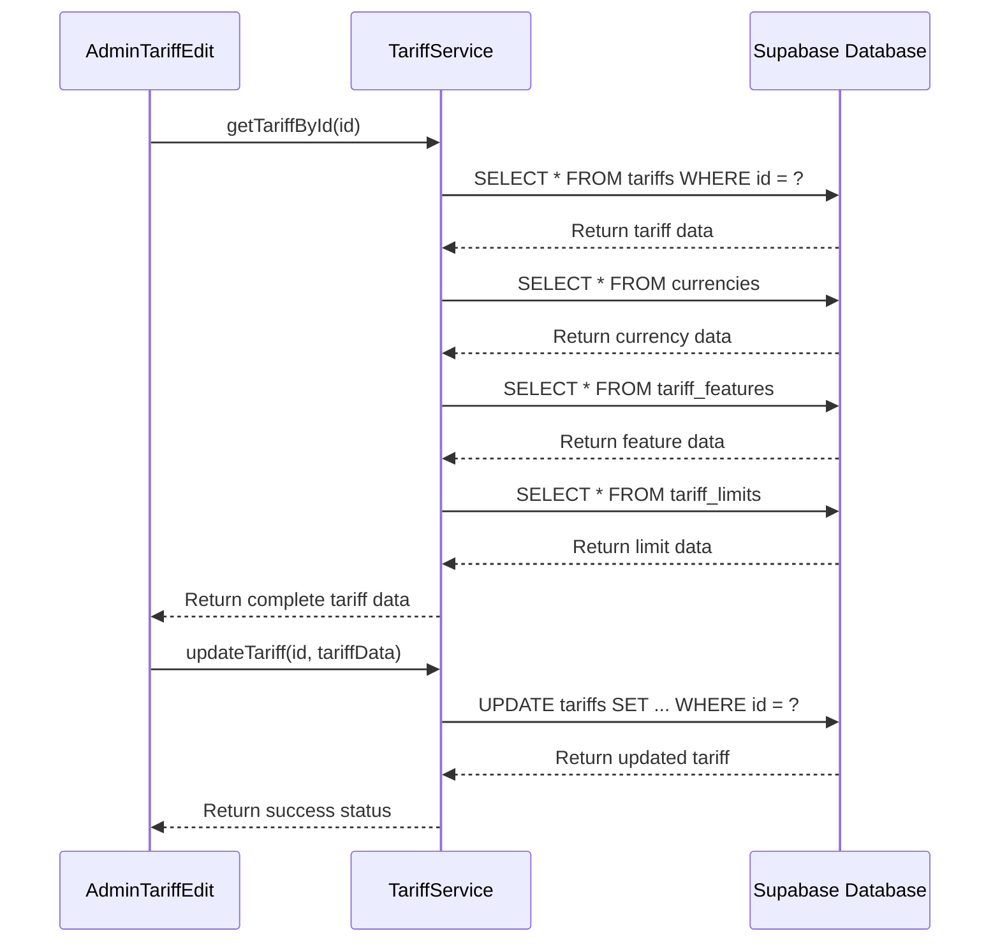

**Diagram sources**
- [AdminTariffEdit.tsx](file://src/pages/admin/AdminTariffEdit.tsx#L202-L202)

### AdminTariffFeatures
This component manages features and limits for tariff plans. It uses various TariffService methods to add, update, and delete features and limits.

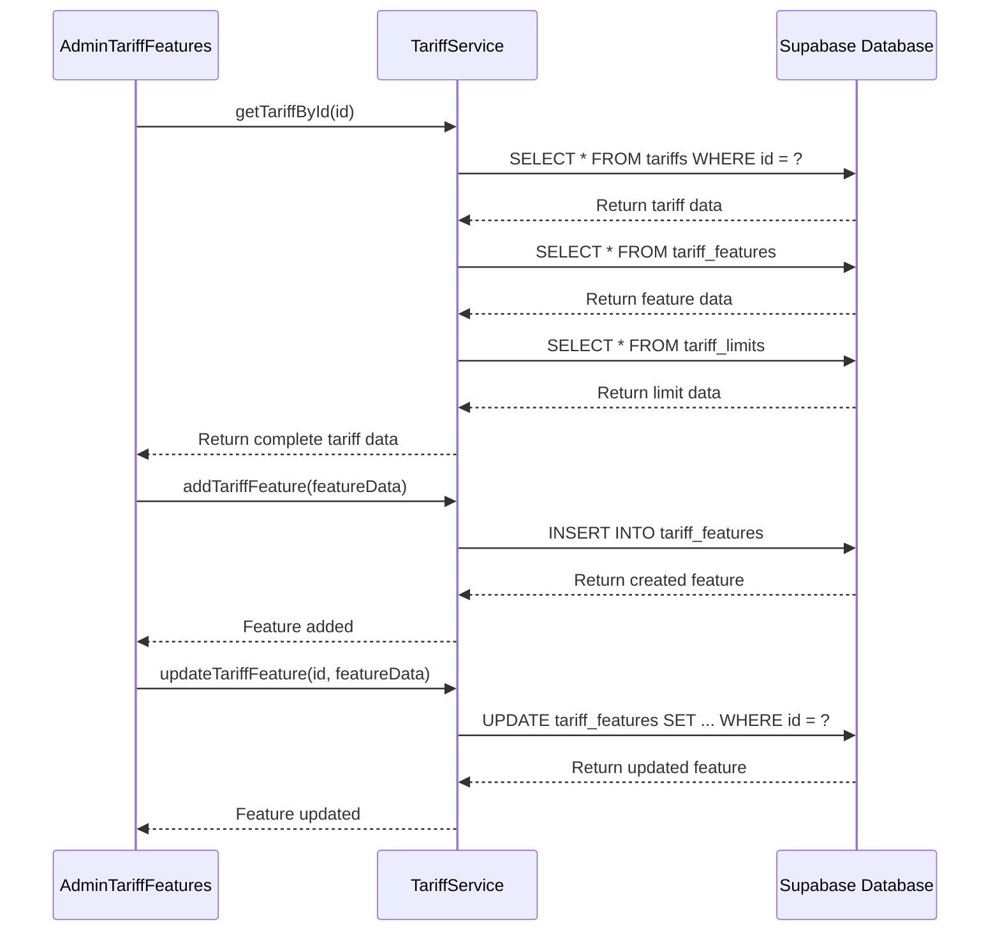

**Diagram sources**
- [AdminTariffFeatures.tsx](file://src/pages/admin/AdminTariffFeatures.tsx#L92-L108)

## Error Handling
The TariffService implements comprehensive error handling for both validation failures and server errors:

### Validation Errors
The service validates input data before performing operations and throws descriptive errors for invalid inputs:

- Missing required fields
- Invalid currency references
- Negative price or duration values
- Non-existent tariff IDs for updates/deletes

### Server Errors
The service handles database-level errors and provides meaningful feedback:

- Database connection issues
- Row Level Security (RLS) violations
- Constraint violations
- Authentication failures

Error handling is implemented consistently across all methods, with detailed logging for debugging purposes and user-friendly error messages for the UI components.

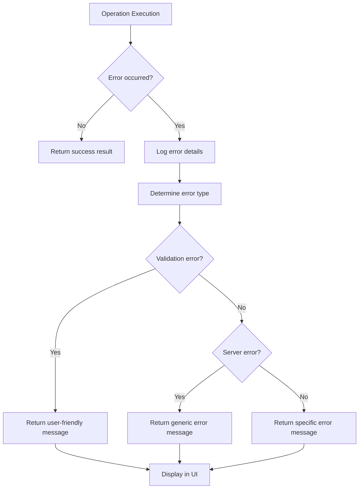

**Diagram sources**
- [tariff-service.ts](file://src/lib/tariff-service.ts#L39-L739)

## Caching Mechanism
The TariffService integrates with a caching system to optimize performance and reduce database load:

### TariffCache Implementation
The caching mechanism is implemented in tariff-cache.ts as a singleton pattern with a 5-minute expiration period.

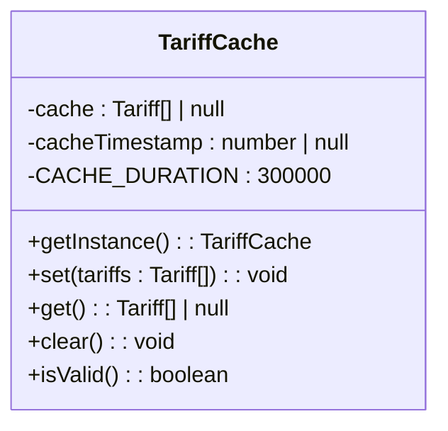

**Diagram sources**
- [tariff-cache.ts](file://src/lib/tariff-cache.ts#L1-L46)

### Cache Usage Pattern
The AdminTariffManagement component implements a sophisticated caching strategy:

1. Check for valid cached data
2. If cache is valid, use it immediately
3. If cache is expired or empty, fetch fresh data
4. Update the cache with new data
5. Implement periodic background refreshes

This approach ensures a responsive user interface while maintaining data freshness.

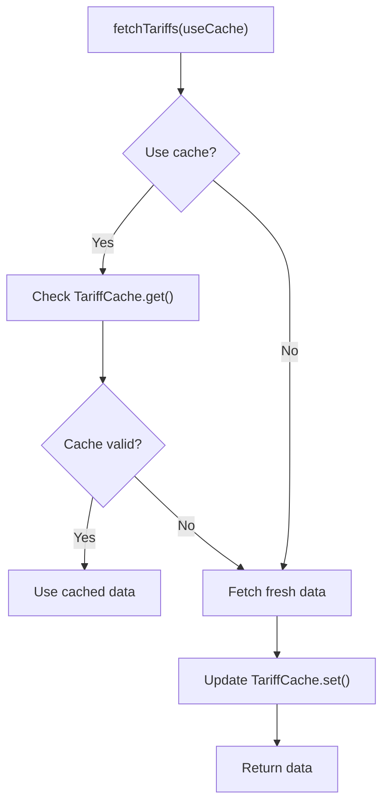

**Diagram sources**
- [AdminTariffManagement.tsx](file://src/pages/admin/AdminTariffManagement.tsx#L100-L110)

## Usage Examples
The TariffService is used throughout the admin interface for various tariff management operations:

### Creating Sample Data
The service includes a createSampleData method that generates test tariff plans with appropriate features and limits:

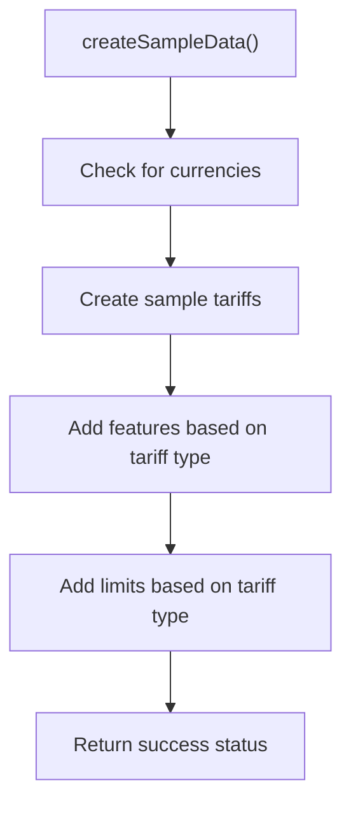

**Diagram sources**
- [tariff-service.ts](file://src/lib/tariff-service.ts#L549-L549)

### Duplicating Tariffs
The duplicateTariff method creates a copy of an existing tariff with all its features and limits:

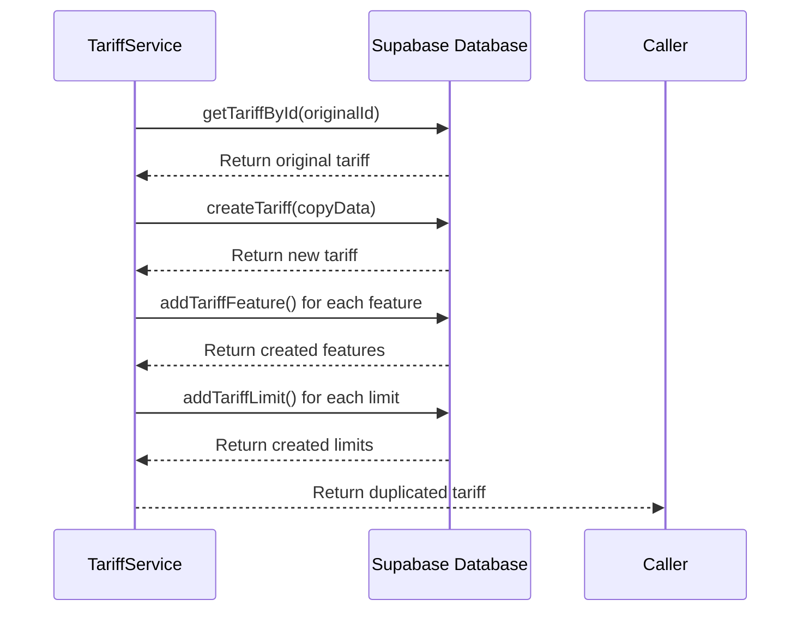

**Diagram sources**
- [tariff-service.ts](file://src/lib/tariff-service.ts#L627-L627)

## Currency and Pricing Configuration
The TariffService provides comprehensive support for currency and pricing configuration in the AdminTariffFeatures component:

### Currency Management
The service retrieves all active currencies and associates them with tariff plans:

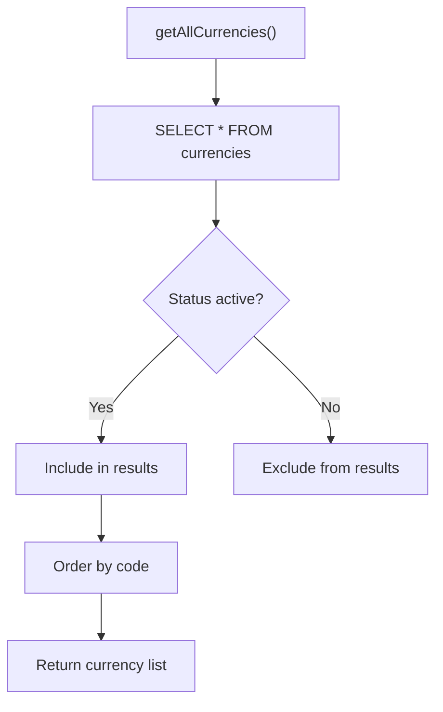

**Diagram sources**
- [tariff-service.ts](file://src/lib/tariff-service.ts#L526-L537)

### Pricing Configuration
The AdminTariffFeatures component allows administrators to configure pricing with proper validation:

- Free plans have null prices
- Paid plans require valid price values
- Currency selection affects price display
- Price formatting follows international standards

The component enforces business rules such as:
- Free tariffs cannot have price values
- Lifetime access tariffs cannot have duration days
- All tariffs must have a name and currency

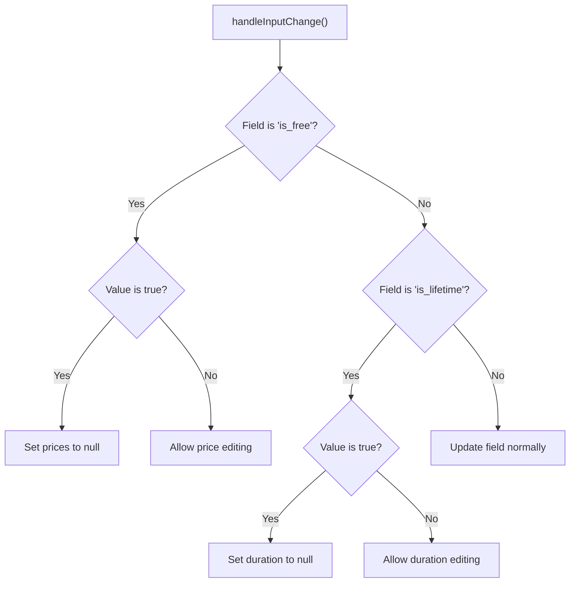

**Diagram sources**
- [AdminTariffNew.tsx](file://src/pages/admin/AdminTariffNew.tsx#L229-L239)