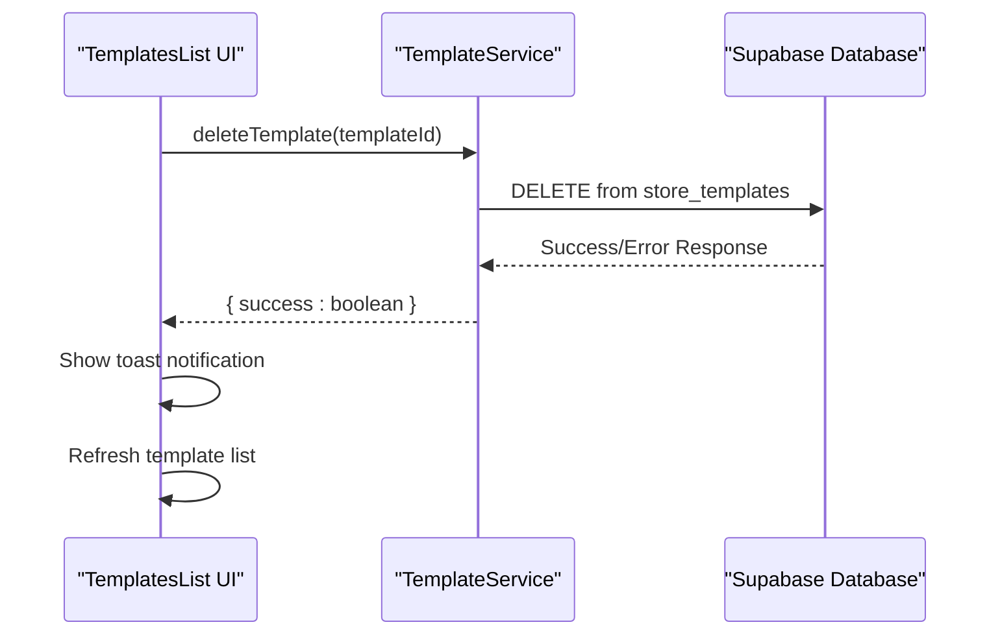
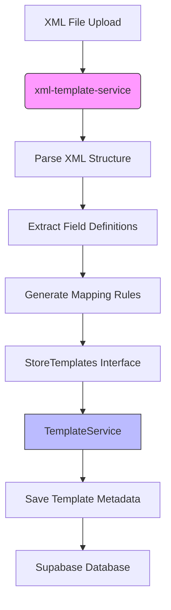
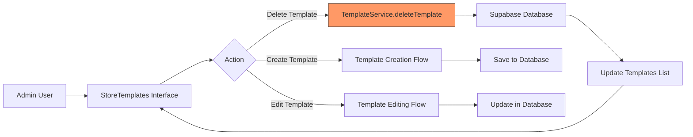

# Template Service

<cite>
**Referenced Files in This Document**   
- [template-service.ts](file://src/lib/template-service.ts)
- [xml-template-service.ts](file://src/lib/xml-template-service.ts)
- [TemplatesList.tsx](file://src/components/store-templates/TemplatesList.tsx)
- [TemplateEditor.tsx](file://src/components/store-templates/TemplateEditor.tsx)
- [StoreTemplates.tsx](file://src/pages/admin/StoreTemplates.tsx)
</cite>

## Table of Contents
1. [Introduction](#introduction)
2. [Core Functionality](#core-functionality)
3. [Integration with Store Template Components](#integration-with-store-template-components)
4. [XML-Based Structure Management](#xml-based-structure-management)
5. [Relationship with xml-template-service](#relationship-with-xml-template-service)
6. [Usage Patterns in Admin Interfaces](#usage-patterns-in-admin-interfaces)
7. [Extensibility and Versioning](#extensibility-and-versioning)

## Introduction
The TemplateService class in lovable-rise serves as a specialized service for managing UI templates and configuration presets within the application's store template system. It provides essential functionality for template lifecycle management, focusing on retrieval, deletion, and metadata operations. The service acts as an interface between the frontend components and the Supabase backend, enabling administrators to efficiently manage XML-based template configurations for various marketplaces. This documentation details its implementation, integration points, and usage patterns within the application's administrative interfaces.

**Section sources**
- [template-service.ts](file://src/lib/template-service.ts#L16-L37)

## Core Functionality
The TemplateService class implements a minimal but focused API for template management, with its primary responsibility being the deletion of templates from the system. The service exposes a static `deleteTemplate` method that performs a hard delete operation directly through Supabase, removing template records from the 'store_templates' database table. This method requires a template ID as input and returns a success indicator upon completion. The implementation includes comprehensive error handling, logging both the operation parameters and any deletion errors that occur during execution. While currently limited to deletion functionality, the service is designed to support additional template operations such as retrieval and metadata management, aligning with its role in managing configuration presets for rapid store setup.

```mermaid
classDiagram
class TemplateService {
+static deleteTemplate(id : string) : Promise<{ success : boolean }>
}
TemplateService --> "1" "Supabase" : "database operations"
TemplateService --> "1..*" "TemplatesList" : "consumes"
TemplateService --> "1..*" "StoreTemplates" : "integrated with"
```

**Diagram sources **
- [template-service.ts](file://src/lib/template-service.ts#L16-L37)
- [TemplatesList.tsx](file://src/components/store-templates/TemplatesList.tsx#L70-L81)

**Section sources**
- [template-service.ts](file://src/lib/template-service.ts#L16-L37)

## Integration with Store Template Components
The TemplateService integrates directly with key store template components, particularly the TemplatesList and TemplateEditor components. The TemplatesList component utilizes the TemplateService's deleteTemplate method when users initiate template deletion through the UI, handling the operation asynchronously and providing appropriate feedback via toast notifications. This integration enables a seamless user experience where template management actions are immediately reflected in the interface after successful operations. The TemplateEditor component, while primarily focused on structure visualization, benefits indirectly from the TemplateService's template management capabilities, as it operates on templates that have been retrieved and potentially modified through the broader template management system.



**Diagram sources **
- [TemplatesList.tsx](file://src/components/store-templates/TemplatesList.tsx#L70-L81)
- [template-service.ts](file://src/lib/template-service.ts#L16-L37)

**Section sources**
- [TemplatesList.tsx](file://src/components/store-templates/TemplatesList.tsx#L70-L81)

## XML-Based Structure Management
The TemplateService supports XML-based structure definitions through its integration with the broader template management system, particularly in conjunction with the xml-template-service. While the TemplateService itself focuses on template metadata and lifecycle operations, it works in tandem with XML structure management components to enable comprehensive template handling. Templates stored in the system contain XML structure data that defines the expected format and fields for marketplace feeds. The service facilitates access to these structures, allowing for rapid configuration through reusable templates that encapsulate predefined layouts and field mappings. This approach enables administrators to quickly deploy standardized configurations across multiple stores, reducing setup time and ensuring consistency in data exchange with various marketplaces.

**Section sources**
- [StoreTemplates.tsx](file://src/pages/admin/StoreTemplates.tsx#L24-L221)
- [xml-template-service.ts](file://src/lib/xml-template-service.ts#L44-L660)

## Relationship with xml-template-service
The TemplateService maintains a complementary relationship with the xml-template-service, where each service handles distinct aspects of template management. While TemplateService focuses on template metadata operations and lifecycle management (such as deletion), the xml-template-service handles advanced template processing, including XML parsing, structure extraction, and format detection. The two services operate in concert within the StoreTemplates interface, with xml-template-service processing XML files to extract structure information that is then saved as template metadata managed by TemplateService. This separation of concerns allows for specialized functionality while maintaining a cohesive template management experience, where structural analysis and template administration are handled by dedicated services with well-defined responsibilities.



**Diagram sources **
- [xml-template-service.ts](file://src/lib/xml-template-service.ts#L44-L660)
- [StoreTemplates.tsx](file://src/pages/admin/StoreTemplates.tsx#L24-L221)

**Section sources**
- [xml-template-service.ts](file://src/lib/xml-template-service.ts#L44-L660)
- [StoreTemplates.tsx](file://src/pages/admin/StoreTemplates.tsx#L24-L221)

## Usage Patterns in Admin Interfaces
The TemplateService is primarily utilized within the StoreTemplates admin interface, where it supports template management workflows for administrators configuring marketplace integrations. The service enables key usage patterns such as template deletion, list refresh operations, and error handling in administrative contexts. When administrators work with templates in the StoreTemplates interface, they can delete unwanted templates through a confirmation dialog that invokes the TemplateService's deleteTemplate method. The service's integration with toast notifications provides immediate feedback on operation success or failure, enhancing the user experience in administrative tasks. This usage pattern reflects the service's role in supporting rapid configuration through reusable templates, as administrators can efficiently manage their template library to maintain an organized collection of approved configurations.



**Diagram sources **
- [StoreTemplates.tsx](file://src/pages/admin/StoreTemplates.tsx#L24-L221)
- [TemplatesList.tsx](file://src/components/store-templates/TemplatesList.tsx#L37-L181)

**Section sources**
- [StoreTemplates.tsx](file://src/pages/admin/StoreTemplates.tsx#L24-L221)

## Extensibility and Versioning
The TemplateService architecture supports future extensibility for adding new template types and implementing versioning strategies. While currently focused on basic template deletion, the service's static method pattern and integration with Supabase provide a foundation for expanding functionality to include template creation, updating, and version management. The design allows for the addition of methods that could handle different template types (such as product templates, pricing templates, or inventory templates) by extending the database schema and corresponding service methods. For versioning, the service could be enhanced to support template versioning by adding version tracking to the database records and implementing methods to retrieve specific template versions or manage version histories, enabling administrators to maintain backward compatibility while evolving their template configurations.

**Section sources**
- [template-service.ts](file://src/lib/template-service.ts#L16-L37)
- [StoreTemplates.tsx](file://src/pages/admin/StoreTemplates.tsx#L24-L221)