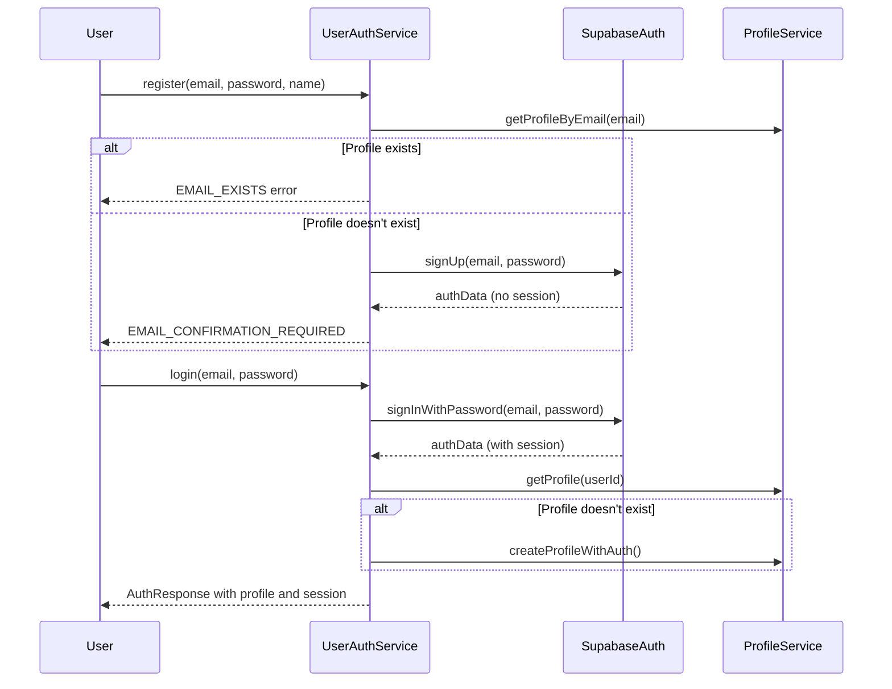
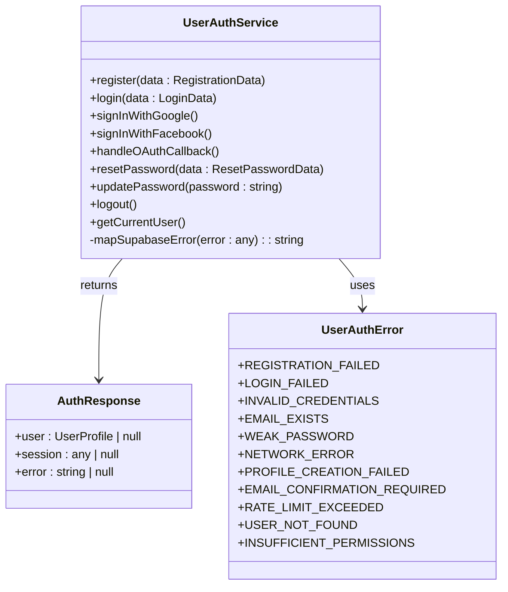
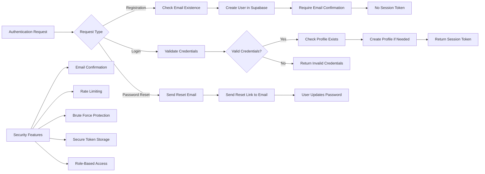
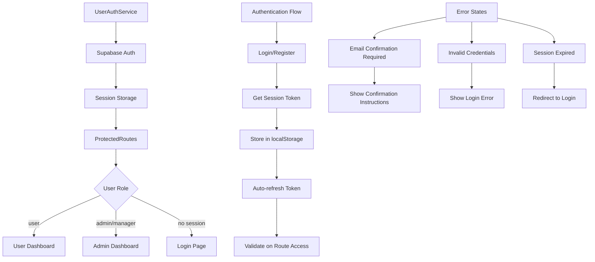

# User Auth Service

<cite>
**Referenced Files in This Document**   
- [user-auth-service.ts](file://src/lib/user-auth-service.ts)
- [user-auth-schemas.ts](file://src/lib/user-auth-schemas.ts)
- [UserAuth.tsx](file://src/pages/UserAuth.tsx)
- [UserRegister.tsx](file://src/pages/UserRegister.tsx)
- [ProtectedRoutes.tsx](file://src/components/ProtectedRoutes.tsx)
- [client.ts](file://src/integrations/supabase/client.ts)
- [profile-service.ts](file://src/lib/profile-service.ts)
</cite>

## Table of Contents
1. [Introduction](#introduction)
2. [Core Authentication Methods](#core-authentication-methods)
3. [Integration with Form Components](#integration-with-form-components)
4. [Error Handling and User Feedback](#error-handling-and-user-feedback)
5. [Profile Creation and Session Management](#profile-creation-and-session-management)
6. [Security Considerations](#security-considerations)
7. [Authentication State Management](#authentication-state-management)
8. [Conclusion](#conclusion)

## Introduction

The UserAuthService class in the lovable-rise application serves as the central authentication handler, managing all aspects of user authentication including email/password login, registration, OAuth integration, password reset, and session management. This service acts as a wrapper around Supabase Auth, providing enhanced error handling, profile management, and role-based access control. The service follows Supabase's email confirmation workflow, where user registration creates an account but requires email confirmation before a session token is issued. This implementation ensures secure user management while providing a seamless user experience across the application.

**Section sources**
- [user-auth-service.ts](file://src/lib/user-auth-service.ts#L173-L986)

## Core Authentication Methods

The UserAuthService provides several static methods for handling different authentication scenarios. The `register` method handles new user registration with email confirmation flow, first checking for existing profiles before creating a new user in Supabase Auth. When a user registers, the system creates the user but does not issue a session token until email confirmation is complete. The `login` method authenticates users with email and password credentials, validating both authentication success and user role. For OAuth integration, the service provides `signInWithGoogle` and `signInWithFacebook` methods that initiate OAuth flows with appropriate redirect configurations. The `handleOAuthCallback` method processes OAuth callbacks, ensuring proper profile creation and role assignment for social login users. Password management is handled through `resetPassword` and `updatePassword` methods, which interface with Supabase's password recovery system. Finally, the `logout` method terminates user sessions securely.



**Diagram sources**
- [user-auth-service.ts](file://src/lib/user-auth-service.ts#L173-L986)
- [profile-service.ts](file://src/lib/profile-service.ts#L59-L814)

**Section sources**
- [user-auth-service.ts](file://src/lib/user-auth-service.ts#L173-L986)

## Integration with Form Components

The UserAuthService integrates directly with form components such as UserAuth and UserRegister through React Hook Form and Zod validation. The UserAuth component implements a login form that uses the `login` method from UserAuthService, handling various error states including invalid credentials, email confirmation requirements, and network errors. Similarly, the UserRegister component utilizes the `register` method, providing real-time feedback through Sonner toast notifications. Both components import validation schemas from user-auth-schemas.ts, ensuring consistent validation rules across the application. The integration follows a pattern where form submission triggers the appropriate UserAuthService method, with loading states managed through React hooks. Error responses from UserAuthService are translated into user-friendly messages based on the current language setting, providing a localized experience.

```mermaid
flowchart TD
A[UserAuth Component] --> B[Form Submission]
B --> C{Validate with Zod}
C --> |Valid| D[Call UserAuthService.login()]
C --> |Invalid| E[Show Validation Errors]
D --> F{Response Success?}
F --> |Yes| G[Navigate to Dashboard]
F --> |No| H[Show Error Toast]
H --> I{Error Type}
I --> |Email Confirmation| J[Show Confirmation Instructions]
I --> |Invalid Credentials| K[Show Login Error]
I --> |Network Error| L[Show Connection Error]
```

**Diagram sources**
- [UserAuth.tsx](file://src/pages/UserAuth.tsx#L0-L338)
- [UserRegister.tsx](file://src/pages/UserRegister.tsx#L0-L397)
- [user-auth-service.ts](file://src/lib/user-auth-service.ts#L173-L986)

**Section sources**
- [UserAuth.tsx](file://src/pages/UserAuth.tsx#L0-L338)
- [UserRegister.tsx](file://src/pages/UserRegister.tsx#L0-L397)

## Error Handling and User Feedback

The UserAuthService implements comprehensive error handling with user-friendly messaging for common scenarios. For registration, the service checks for existing profiles before attempting to create a new user, returning a specific EMAIL_EXISTS error when a user tries to register with an already registered email address. During login, the service maps Supabase errors to user-friendly messages, distinguishing between INVALID_CREDENTIALS, USER_NOT_FOUND, and NETWORK_ERROR conditions. The error mapping system also handles email confirmation requirements, returning EMAIL_CONFIRMATION_REQUIRED when a user attempts to log in before confirming their email. The service includes specific error types for profile creation failures and insufficient permissions, allowing the UI components to provide appropriate feedback. Error messages are translated based on the current language setting, with Ukrainian and English versions available for all common error scenarios.



**Diagram sources**
- [user-auth-schemas.ts](file://src/lib/user-auth-schemas.ts#L0-L127)
- [user-auth-service.ts](file://src/lib/user-auth-service.ts#L173-L986)

**Section sources**
- [user-auth-schemas.ts](file://src/lib/user-auth-schemas.ts#L0-L127)
- [user-auth-service.ts](file://src/lib/user-auth-service.ts#L173-L986)

## Profile Creation and Session Management

The UserAuthService handles profile creation as part of the authentication flow, ensuring users have complete profiles after registration or login. When a user successfully logs in or confirms their email, the service checks for an existing profile using ProfileService.getProfile. If no profile exists, it creates one using the user's authentication data, extracting the name from user_metadata or deriving it from the email address. The profile creation process uses createProfileWithAuth, which ensures proper authentication context and handles potential authorization errors. Session management is handled through Supabase's built-in mechanisms, with the service configuring persistent sessions that are automatically refreshed. The getCurrentUser method retrieves both the current session and associated profile, providing a complete authentication state. The service also implements session validation through SessionValidator, ensuring that authentication tokens are valid before allowing access to protected resources.

**Section sources**
- [user-auth-service.ts](file://src/lib/user-auth-service.ts#L173-L986)
- [profile-service.ts](file://src/lib/profile-service.ts#L59-L814)

## Security Considerations

The UserAuthService implements several security measures to protect user accounts and prevent abuse. The service follows Supabase's email confirmation workflow, requiring email verification before granting full access to prevent unauthorized account creation. Passwords are handled securely through Supabase Auth, with no plaintext passwords stored in the application. The service includes rate limiting protection through Supabase's built-in mechanisms, returning a RATE_LIMIT_EXCEEDED error when too many authentication attempts are made. Brute force protection is implemented at the Supabase level, with the service properly handling related error responses. Token storage is managed by Supabase using localStorage with the configured storage key 'supabase.auth.token', ensuring secure persistence of authentication tokens. The service also implements role-based access control, redirecting non-user roles to the admin interface to prevent privilege escalation. All authentication requests use HTTPS, with Supabase handling secure communication between the client and authentication server.



**Diagram sources**
- [user-auth-service.ts](file://src/lib/user-auth-service.ts#L173-L986)
- [client.ts](file://src/integrations/supabase/client.ts#L10-L30)

**Section sources**
- [user-auth-service.ts](file://src/lib/user-auth-service.ts#L173-L986)
- [client.ts](file://src/integrations/supabase/client.ts#L10-L30)

## Authentication State Management

The UserAuthService works with ProtectedRoutes to manage authentication state throughout the application. The ProtectedRoutes component uses the useUserRole hook to determine the user's role and redirect accordingly, preventing unauthorized access to admin or user routes. When a user authenticates successfully, the service returns both the user profile and session, which are used to determine the appropriate redirect path. The handleOAuthCallback method specifically checks user roles and returns a 'redirect_to_admin' error for non-user roles, triggering redirection to the admin interface. The getCurrentUser method allows components to check authentication status without making additional API calls, improving performance. Session persistence is handled by Supabase with the persistSession option enabled, ensuring users remain authenticated across browser sessions. The service also implements token refresh functionality through Supabase's autoRefreshToken setting, maintaining valid authentication without requiring users to log in repeatedly.



**Diagram sources**
- [user-auth-service.ts](file://src/lib/user-auth-service.ts#L173-L986)
- [ProtectedRoutes.tsx](file://src/components/ProtectedRoutes.tsx#L0-L45)

**Section sources**
- [user-auth-service.ts](file://src/lib/user-auth-service.ts#L173-L986)
- [ProtectedRoutes.tsx](file://src/components/ProtectedRoutes.tsx#L0-L45)

## Conclusion

The UserAuthService provides a comprehensive authentication solution for the lovable-rise application, integrating seamlessly with Supabase Auth while adding valuable enhancements for profile management, error handling, and role-based access control. By following Supabase's email confirmation workflow, the service ensures secure account creation while providing a smooth user experience. The integration with form components through standardized validation schemas and error handling creates a consistent authentication experience across the application. Security measures including email verification, rate limiting, and role-based redirection protect user accounts and prevent abuse. The service's architecture, with clear separation of concerns between authentication, profile management, and session handling, makes it maintainable and extensible for future authentication methods or requirements.