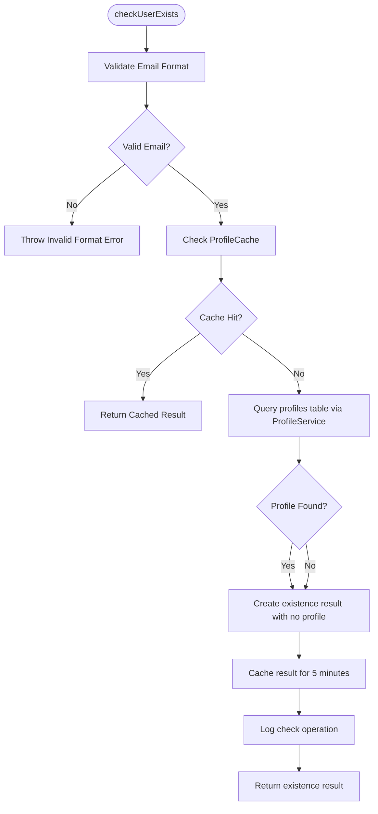
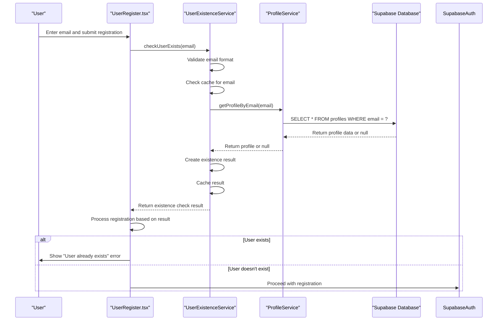
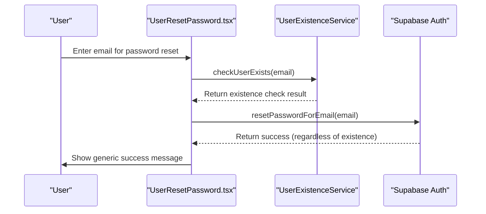
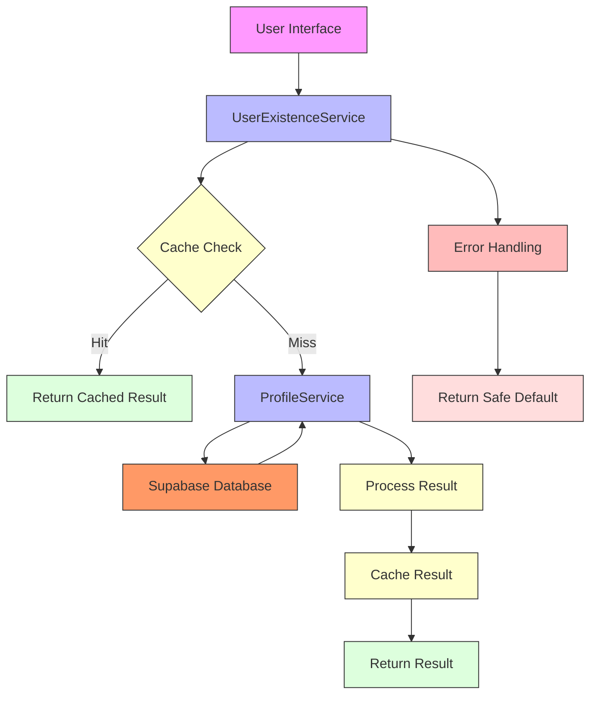

# User Existence Service

<cite>
**Referenced Files in This Document**   
- [user-existence-service.ts](file://src/lib/user-existence-service.ts)
- [profile-service.ts](file://src/lib/profile-service.ts)
- [error-handler.ts](file://src/lib/error-handler.ts)
- [UserRegister.tsx](file://src/pages/UserRegister.tsx)
- [UserResetPassword.tsx](file://src/pages/UserResetPassword.tsx)
- [user-auth-service.ts](file://src/lib/user-auth-service.ts)
</cite>

## Table of Contents
1. [Introduction](#introduction)
2. [Core Functionality](#core-functionality)
3. [Method Analysis](#method-analysis)
4. [Integration with User Flows](#integration-with-user-flows)
5. [Performance and Caching](#performance-and-caching)
6. [Security and Privacy](#security-and-privacy)
7. [Error Handling](#error-handling)
8. [Architecture Diagram](#architecture-diagram)

## Introduction

The UserExistenceService class in the lovable-rise application provides a comprehensive solution for checking user existence and credential availability prior to registration or password reset operations. This service addresses the critical need to prevent unnecessary API calls to Supabase Auth when users already exist, thereby improving registration flow efficiency and reducing database load. The service implements a robust, cache-aware approach to user existence validation that balances usability with privacy considerations.

**Section sources**
- [user-existence-service.ts](file://src/lib/user-existence-service.ts#L1-L271)

## Core Functionality

The UserExistenceService focuses on providing reliable user existence checks through profile-based validation rather than direct authentication checks. This approach offers several advantages:

1. **Reliability**: By checking the profiles table directly, the service avoids the limitations and potential rate-limiting issues associated with authentication-based existence checks.

2. **Performance**: The implementation includes a sophisticated caching mechanism that reduces database queries for frequently checked email addresses.

3. **Comprehensive State Detection**: The service can distinguish between different user states, including users with both authentication and profile records, users with only authentication records, and non-existent users.

4. **Error Resilience**: The service implements safe defaults that assume non-existence on error conditions, preventing false positives that could block legitimate registration attempts.

The service's primary purpose is to enable real-time validation feedback in registration forms and password recovery flows, allowing the application to provide immediate user feedback without compromising system performance or security.

**Section sources**
- [user-existence-service.ts](file://src/lib/user-existence-service.ts#L1-L271)

## Method Analysis

### checkUserExists

The `checkUserExists` method serves as the primary interface for checking if a user exists in the system. This method implements a multi-layered approach to existence checking:



**Diagram sources**
- [user-existence-service.ts](file://src/lib/user-existence-service.ts#L45-L86)
- [profile-service.ts](file://src/lib/profile-service.ts#L62-L85)

**Section sources**
- [user-existence-service.ts](file://src/lib/user-existence-service.ts#L45-L86)

### checkUserExistsById

The `checkUserExistsById` method provides a direct way to check user existence by ID rather than email. This method is optimized for scenarios where the user ID is already known, such as in administrative operations or session validation processes. The implementation directly queries the ProfileService to determine if a profile exists for the given user ID, returning a simple boolean result.

**Section sources**
- [user-existence-service.ts](file://src/lib/user-existence-service.ts#L91-L104)

### validateNewUser

While not explicitly named as `validateNewUser` in the code, the service provides comprehensive validation capabilities through its `checkUserExists` and `comprehensiveUserCheck` methods. These methods validate not only the existence of a user but also the format of the email address and the overall state of the user account. The validation process includes:

1. Email format validation using a regular expression pattern
2. Existence checking against the profiles database
3. State detection to determine if the user has a complete profile
4. Error handling to manage edge cases and database connectivity issues

The service's validation approach ensures that new users can be properly validated before registration, preventing duplicate accounts and ensuring data integrity.

**Section sources**
- [user-existence-service.ts](file://src/lib/user-existence-service.ts#L45-L122)

## Integration with User Flows

### Registration Form Integration

The UserExistenceService is integrated into the user registration flow to provide real-time validation feedback. When a user attempts to register, the system first checks if the email address is already in use before proceeding with the registration process.



**Diagram sources**
- [user-existence-service.ts](file://src/lib/user-existence-service.ts#L45-L86)
- [UserRegister.tsx](file://src/pages/UserRegister.tsx#L78-L106)

**Section sources**
- [UserRegister.tsx](file://src/pages/UserRegister.tsx#L78-L106)
- [user-auth-service.ts](file://src/lib/user-auth-service.ts#L138-L158)

### Password Recovery Flow

The service also supports password recovery operations by verifying the existence of user accounts before initiating password reset procedures. This prevents enumeration attacks by providing consistent feedback regardless of whether an account exists.



**Diagram sources**
- [user-existence-service.ts](file://src/lib/user-existence-service.ts#L45-L86)
- [UserResetPassword.tsx](file://src/pages/UserResetPassword.tsx#L117-L124)

**Section sources**
- [UserResetPassword.tsx](file://src/pages/UserResetPassword.tsx#L117-L124)
- [user-auth-service.ts](file://src/lib/user-auth-service.ts#L357-L365)

## Performance and Caching

The UserExistenceService implements a sophisticated caching strategy to optimize performance and reduce database load for high-frequency existence checks.

### Caching Mechanism

The service uses the ProfileCache class to store existence check results with a TTL (Time To Live) of 5 minutes. This caching approach provides several performance benefits:

1. **Reduced Database Queries**: Subsequent checks for the same email within the cache TTL are served from memory rather than querying the database.

2. **Consistent Response Times**: Cached responses are returned immediately, providing a better user experience.

3. **Database Load Reduction**: By minimizing redundant queries, the service helps maintain database performance during peak usage periods.

```mermaid
classDiagram
class UserExistenceService {
+static CACHE_PREFIX : string
+static CACHE_TTL : number
+static checkUserExists(email) : Promise~UserExistenceCheck~
+static checkUserExistsById(id) : Promise~boolean~
+static comprehensiveUserCheck(email) : Promise~UserExistenceCheck~
+static checkMultipleUsersExist(emails) : Promise~Map~string,boolean~~
+static clearExistenceCache(email) : void
+static clearAllExistenceCache() : void
}
class ProfileCache {
+static cache : Map~string, {data : any, timestamp : number, ttl : number}~
+static get(key : string) : any | null
+static set(key : string, data : any, customTtl? : number) : void
+static clear() : void
+static clearUser(userId : string) : void
+static clearPattern(pattern : string) : void
}
UserExistenceService --> ProfileCache : "uses"
```

**Diagram sources**
- [user-existence-service.ts](file://src/lib/user-existence-service.ts#L37-L271)
- [error-handler.ts](file://src/lib/error-handler.ts#L341-L414)

**Section sources**
- [user-existence-service.ts](file://src/lib/user-existence-service.ts#L37-L271)
- [error-handler.ts](file://src/lib/error-handler.ts#L341-L414)

### Batch Operations

For administrative operations that require checking multiple users at once, the service provides the `checkMultipleUsersExist` method. This method processes emails in batches of 10 to avoid overwhelming the database with large IN queries. The batch processing approach ensures that even bulk existence checks maintain acceptable performance characteristics.

**Section sources**
- [user-existence-service.ts](file://src/lib/user-existence-service.ts#L143-L173)

## Security and Privacy

The UserExistenceService implements several security measures to balance usability with privacy concerns.

### Existence Checking Security

The service follows security best practices for existence checking:

1. **Generic Error Messages**: The service returns consistent error structures regardless of whether a user exists, preventing account enumeration attacks.

2. **Safe Defaults**: On error conditions, the service assumes non-existence, preventing false positives that could block legitimate users.

3. **Input Validation**: All email inputs are validated against a strict format pattern before processing.

4. **Rate Limiting Consideration**: By using profile-based checking rather than authentication-based checking, the service avoids triggering Supabase's authentication rate limits.

### Privacy Considerations

The service is designed to minimize privacy risks:

1. **Limited Information Disclosure**: The service only confirms existence without revealing additional user details.

2. **Consistent Response Patterns**: Whether a user exists or not, the response structure remains the same, making it difficult for attackers to distinguish between existing and non-existing accounts.

3. **Masked Logging**: When logging existence checks, the service masks email addresses to protect user privacy.

**Section sources**
- [user-existence-service.ts](file://src/lib/user-existence-service.ts#L45-L271)

## Error Handling

The UserExistenceService implements comprehensive error handling to ensure reliable operation under various conditions.

### Error Management Strategy

The service follows a defensive programming approach:

1. **Graceful Degradation**: On database errors or connectivity issues, the service returns a safe default (user does not exist) rather than failing the entire operation.

2. **Comprehensive Logging**: All existence checks are logged with source information (cached, profile_found, not_found, error) to aid in monitoring and debugging.

3. **Structured Error Responses**: The service returns consistent error structures that can be easily interpreted by calling components.

4. **Validation Errors**: Email format validation is performed before any database operations, preventing invalid queries.

The error handling approach ensures that the registration and password recovery flows can continue even when the existence check service encounters issues, providing a better user experience while maintaining security.

**Section sources**
- [user-existence-service.ts](file://src/lib/user-existence-service.ts#L45-L86)

## Architecture Diagram



**Diagram sources**
- [user-existence-service.ts](file://src/lib/user-existence-service.ts#L1-L271)
- [profile-service.ts](file://src/lib/profile-service.ts#L1-L857)
- [error-handler.ts](file://src/lib/error-handler.ts#L1-L417)

**Section sources**
- [user-existence-service.ts](file://src/lib/user-existence-service.ts#L1-L271)
- [profile-service.ts](file://src/lib/profile-service.ts#L1-L857)
- [error-handler.ts](file://src/lib/error-handler.ts#L1-L417)