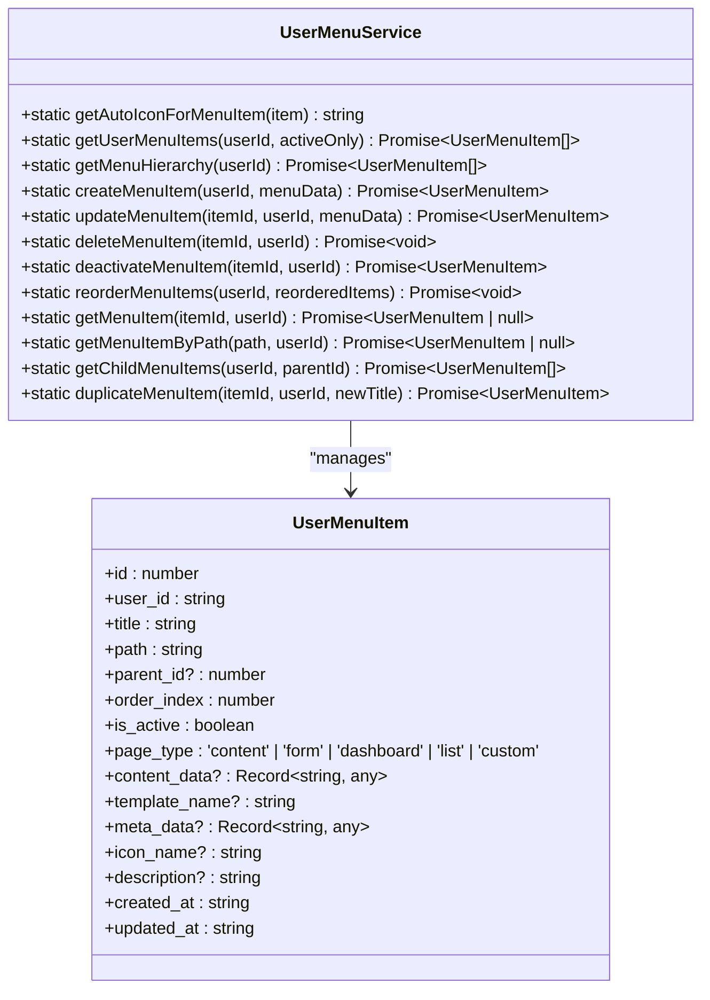
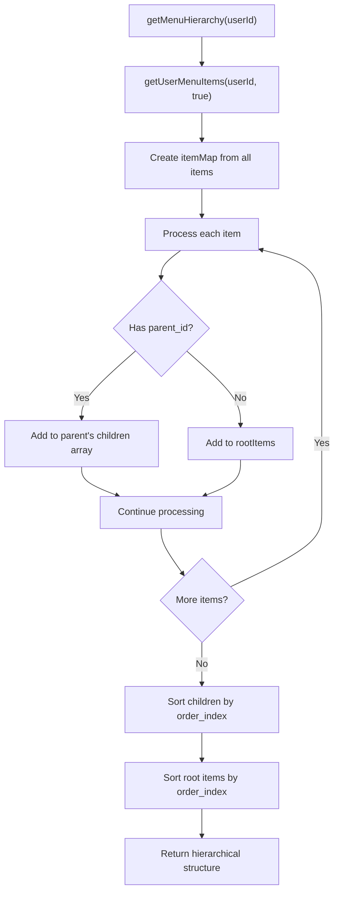
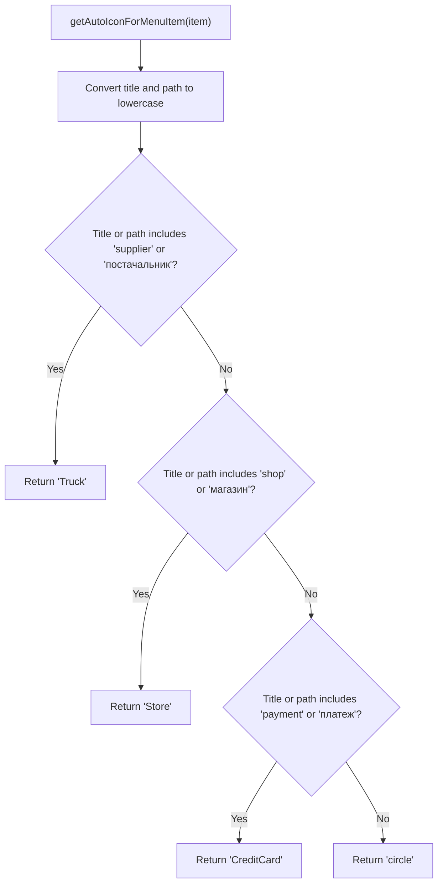
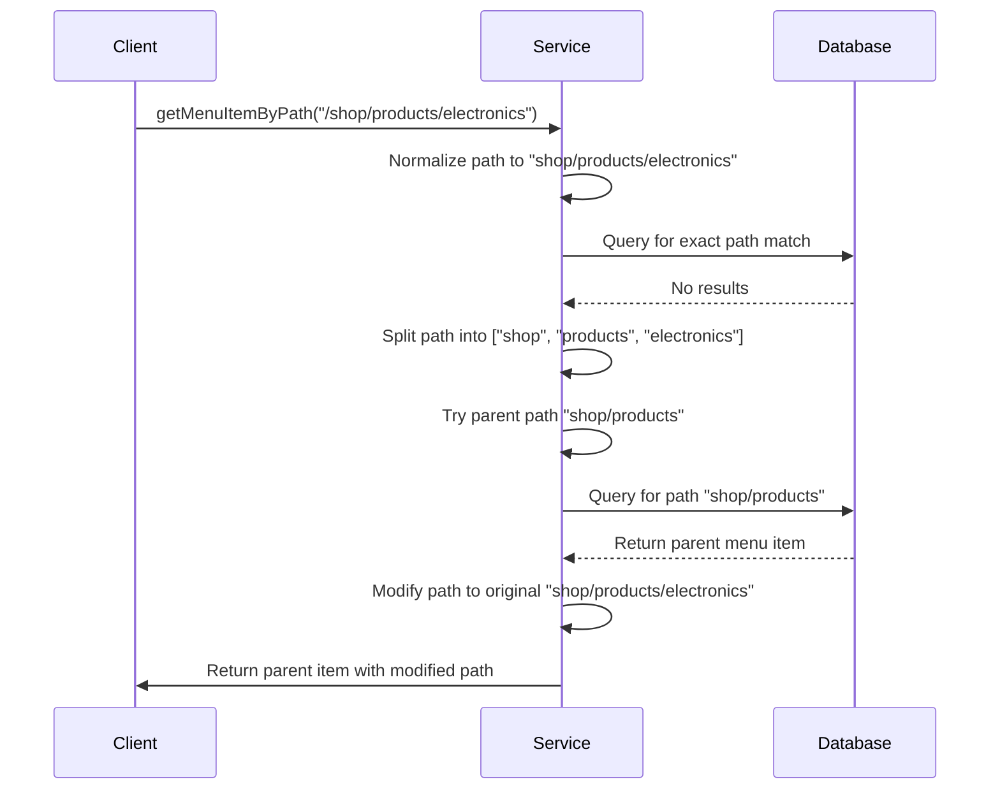
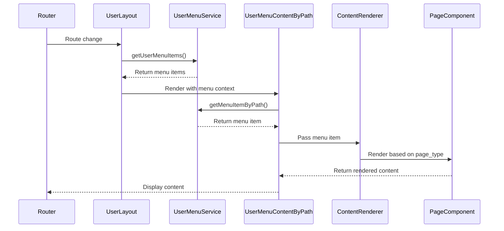
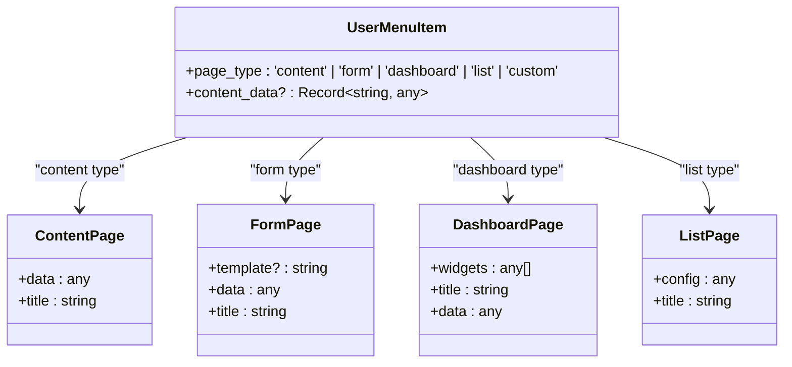

# User Menu Service

<cite>
**Referenced Files in This Document**   
- [user-menu-service.ts](file://src/lib/user-menu-service.ts)
- [UserMenuContentByPath.tsx](file://src/pages/UserMenuContentByPath.tsx)
- [ContentRenderer.tsx](file://src/pages/ContentRenderer.tsx)
- [UserLayout.tsx](file://src/components/UserLayout.tsx)
- [MenuSection.tsx](file://src/components/user/MenuSection.tsx)
- [MenuItemWithIcon.tsx](file://src/components/user/MenuItemWithIcon.tsx)
</cite>

## Table of Contents
1. [Introduction](#introduction)
2. [Core Functionality](#core-functionality)
3. [Hierarchical Menu Structure](#hierarchical-menu-structure)
4. [Auto-Icon Assignment Logic](#auto-icon-assignment-logic)
5. [Path Resolution and Fallback](#path-resolution-and-fallback)
6. [Menu Item Management Methods](#menu-item-management-methods)
7. [Integration with Page Rendering](#integration-with-page-rendering)
8. [Page Type Configuration](#page-type-configuration)
9. [Common Issues and Solutions](#common-issues-and-solutions)
10. [Conclusion](#conclusion)

## Introduction
The UserMenuService class in lovable-rise provides a comprehensive solution for managing dynamic menu systems that enable personalized navigation experiences. This service acts as the central controller for user-specific menu items, handling everything from hierarchical organization and auto-icon assignment to content type routing and path resolution. The service interacts with the user_menu_items table in Supabase to persist menu configurations while providing a rich API for creating, updating, and retrieving menu items. By integrating with various page rendering components, UserMenuService enables a flexible and customizable user interface that adapts to different user roles and preferences.

**Section sources**
- [user-menu-service.ts](file://src/lib/user-menu-service.ts#L1-L50)

## Core Functionality
The UserMenuService class provides a comprehensive API for managing user menu items with a focus on dynamic, personalized navigation. The service enables users to create custom menu structures that reflect their specific workflow needs, with support for hierarchical organization, automatic icon assignment, and intelligent path resolution. At its core, the service manages the lifecycle of menu items stored in the user_menu_items Supabase table, providing methods to create, read, update, and delete entries while enforcing business rules such as path uniqueness and proper ordering. The service also handles the rendering context by integrating with page components to ensure seamless navigation between different sections of the application. This functionality allows users to build personalized dashboards and navigation structures that enhance productivity and user experience.

**Diagram sources **
- [user-menu-service.ts](file://src/lib/user-menu-service.ts#L1-L665)

**Section sources**
- [user-menu-service.ts](file://src/lib/user-menu-service.ts#L1-L665)

## Hierarchical Menu Structure
The UserMenuService implements a robust hierarchical menu structure that supports nested navigation with parent-child relationships between menu items. The service organizes menu items into a tree structure through the getMenuHierarchy method, which retrieves all active menu items for a user and builds a parent-child relationship map. This method first fetches all menu items using getUserMenuItems, then creates a lookup map by item ID for efficient access. It processes each item to determine whether it's a root item (no parent_id) or a child item (has parent_id), building the hierarchy by assigning children to their respective parents. The resulting structure maintains proper ordering at each level, with both root items and their children sorted by order_index in ascending order. This hierarchical approach enables complex navigation patterns with collapsible sections and multi-level menus, providing users with an organized way to access different parts of the application.

**Diagram sources **
- [user-menu-service.ts](file://src/lib/user-menu-service.ts#L153-L202)

**Section sources**
- [user-menu-service.ts](file://src/lib/user-menu-service.ts#L153-L202)

## Auto-Icon Assignment Logic
The UserMenuService implements intelligent auto-icon assignment logic that automatically selects appropriate icons based on menu item properties, enhancing visual recognition and user experience. The getAutoIconForMenuItem static method analyzes both the title and path of a menu item to determine the most appropriate icon, with specific rules for supplier, shop, and payment-related items. For supplier-related items, the service checks for the presence of "supplier" or "постачальник" in either the title or path and assigns the "Truck" icon. Similarly, shop-related items containing "shop" or "магазин" receive the "Store" icon, while payment-related items with "payment" or "платеж" are assigned the "CreditCard" icon. This auto-assignment only occurs when no explicit icon is set (icon_name is null, undefined, or set to 'circle'/'Circle'), ensuring that user-specified icons take precedence. The logic is applied across multiple service methods including getUserMenuItems, createMenuItem, updateMenuItem, and getMenuItemByPath, providing consistent icon assignment throughout the application.

**Diagram sources **
- [user-menu-service.ts](file://src/lib/user-menu-service.ts#L58-L91)

**Section sources**
- [user-menu-service.ts](file://src/lib/user-menu-service.ts#L58-L91)

## Path Resolution and Fallback
The UserMenuService implements sophisticated path resolution and fallback mechanisms to handle both exact matches and hierarchical navigation patterns. The getMenuItemByPath method begins by normalizing the input path, removing any leading slash to ensure consistent format with database storage. It first attempts an exact match against the path field in the user_menu_items table, returning the corresponding menu item if found. When no exact match is found, the service implements a fallback strategy for nested routes by progressively checking parent paths. For hierarchical paths like "shop/products/electronics", the method splits the path into components and checks parent paths in reverse order (e.g., "shop/products", then "shop") to find the closest matching parent menu item. When a parent is found, the service returns the parent item but modifies its path property to the original requested path, enabling proper rendering while maintaining navigation context. This fallback mechanism ensures that deep links and nested routes can be properly resolved even when specific child menu items don't exist, providing a robust navigation experience.

**Diagram sources **
- [user-menu-service.ts](file://src/lib/user-menu-service.ts#L498-L586)

**Section sources**
- [user-menu-service.ts](file://src/lib/user-menu-service.ts#L498-L586)

## Menu Item Management Methods
The UserMenuService provides a comprehensive set of methods for managing menu items throughout their lifecycle, enabling full CRUD (Create, Read, Update, Delete) operations with business logic enforcement. The createMenuItem method validates path uniqueness before insertion, automatically assigns the next order_index within the parent context, and applies auto-icon assignment for relevant item types. The updateMenuItem method similarly validates path uniqueness when paths are modified and handles icon assignment logic. Both methods ensure data integrity by checking for conflicts and applying default values where appropriate. The service also includes specialized methods like reorderMenuItems for bulk updates to order_index and parent_id, allowing drag-and-drop reorganization of the menu structure. Additional utility methods include deactivateMenuItem for soft deletion (setting is_active to false), duplicateMenuItem for creating copies of existing items, and getChildMenuItems for retrieving direct children of a specific parent. These methods work together to provide a complete toolkit for menu management that supports both programmatic and user-driven modifications to the navigation structure.

**Section sources**
- [user-menu-service.ts](file://src/lib/user-menu-service.ts#L207-L324)
- [user-menu-service.ts](file://src/lib/user-menu-service.ts#L329-L391)
- [user-menu-service.ts](file://src/lib/user-menu-service.ts#L396-L415)

## Integration with Page Rendering
The UserMenuService integrates seamlessly with page rendering components to enable dynamic content display based on menu configuration. The primary integration point is the UserMenuContentByPath component, which uses the service to resolve menu items for the current route and render appropriate content. This component first attempts to find the menu item in the context-provided menuItems array, then falls back to querying the database via getMenuItemByPath if not found. When no matching menu item exists, it creates a virtual item using the path segments to generate a title, ensuring that all routes have a corresponding navigation context. The ContentRenderer component then uses the resolved menu item's page_type property to determine which specialized page component to render, such as ContentPage, FormPage, DashboardPage, or ListPage. This integration pattern allows for consistent rendering across the application while supporting both database-driven menu items and static routes. The UserLayout component orchestrates this integration by providing the menu context to all child components through React's context API, ensuring that menu state is available throughout the application hierarchy.

**Diagram sources **
- [UserMenuContentByPath.tsx](file://src/pages/UserMenuContentByPath.tsx#L18-L189)
- [ContentRenderer.tsx](file://src/pages/ContentRenderer.tsx#L41-L103)
- [UserLayout.tsx](file://src/components/UserLayout.tsx#L78-L232)

**Section sources**
- [UserMenuContentByPath.tsx](file://src/pages/UserMenuContentByPath.tsx#L18-L189)
- [ContentRenderer.tsx](file://src/pages/ContentRenderer.tsx#L41-L103)

## Page Type Configuration
The UserMenuService supports multiple page types that define how content is rendered and interacted with, each with specific configuration options and default content structures. The service automatically assigns default content based on the page_type when creating new menu items through the createMenuItem method. For 'content' type pages, the service generates placeholder HTML with a welcome message and getting started guide. 'dashboard' type pages receive a default configuration with stats and analytics widgets. 'form' type pages are initialized with an empty form configuration, while 'list' type pages receive a basic table configuration. These defaults provide a starting point that users can customize through the menu management interface. The page types are rendered by specialized components: ContentPage for 'content' type, FormPage for 'form' type, DashboardPage for 'dashboard' type, and ListPage for 'list' type. This configuration system enables a consistent user experience across different content types while allowing for extensive customization through the content_data property, which can store type-specific configuration options like form fields, table columns, or dashboard widgets.

**Diagram sources **
- [user-menu-service.ts](file://src/lib/user-menu-service.ts#L207-L324)
- [ContentPage.tsx](file://src/pages/page-types/ContentPage.tsx#L1-L23)
- [FormPage.tsx](file://src/pages/page-types/FormPage.tsx#L1-L154)
- [DashboardPage.tsx](file://src/pages/page-types/DashboardPage.tsx#L1-L186)
- [ListPage.tsx](file://src/pages/page-types/ListPage.tsx#L1-L358)

**Section sources**
- [user-menu-service.ts](file://src/lib/user-menu-service.ts#L207-L324)
- [ContentPage.tsx](file://src/pages/page-types/ContentPage.tsx#L1-L23)
- [FormPage.tsx](file://src/pages/page-types/FormPage.tsx#L1-L154)

## Common Issues and Solutions
The UserMenuService addresses several common issues that arise in dynamic menu systems through thoughtful design and implementation. Path conflicts are prevented by validating path uniqueness during both creation and update operations, ensuring that no two active menu items share the same path for a given user. Ordering issues are resolved through the order_index field and the reorderMenuItems method, which allows bulk updates to maintain consistent sorting across the menu hierarchy. The service handles missing menu items through its fallback resolution in getMenuItemByPath, which finds parent items for nested routes rather than failing outright. Icon consistency is maintained through the auto-icon assignment logic that applies only when no explicit icon is set, preventing overwrites of user-specified icons. Performance considerations are addressed by caching menu items in the UserLayout context and only fetching from the database when necessary, reducing redundant API calls. The service also handles edge cases like virtual menu items for unconfigured routes and proper cleanup of child items when parents are deleted or reorganized, ensuring data integrity across the menu structure.

**Section sources**
- [user-menu-service.ts](file://src/lib/user-menu-service.ts#L207-L324)
- [user-menu-service.ts](file://src/lib/user-menu-service.ts#L329-L391)
- [user-menu-service.ts](file://src/lib/user-menu-service.ts#L498-L586)

## Conclusion
The UserMenuService in lovable-rise provides a robust and flexible foundation for personalized navigation, enabling users to create customized menu structures that enhance their workflow and productivity. By combining hierarchical organization, intelligent auto-icon assignment, and sophisticated path resolution, the service delivers a seamless navigation experience that adapts to user needs. The integration with various page rendering components allows for consistent presentation across different content types, from simple content pages to complex dashboards and data lists. The comprehensive API for menu item management supports the full lifecycle of navigation elements, from creation and organization to updating and deletion. Through careful attention to common issues like path conflicts and ordering, the service ensures data integrity and a reliable user experience. Overall, the UserMenuService exemplifies a well-designed component that balances flexibility with consistency, providing users with powerful customization options while maintaining a cohesive and intuitive interface.