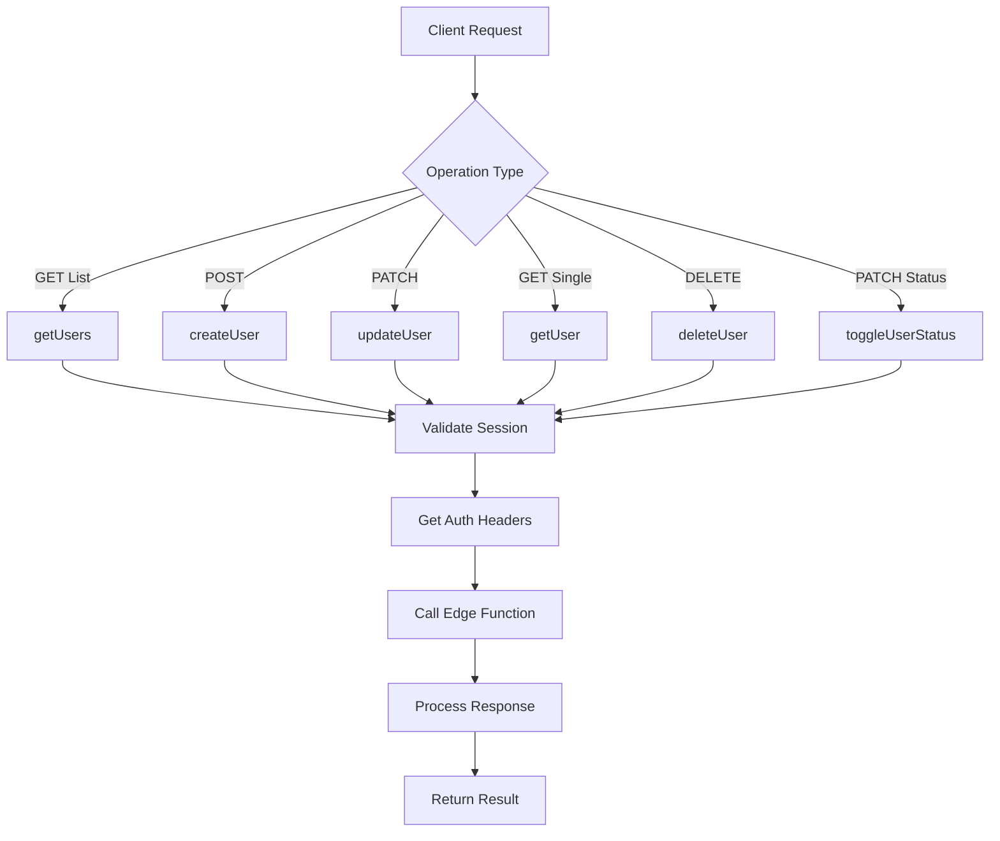
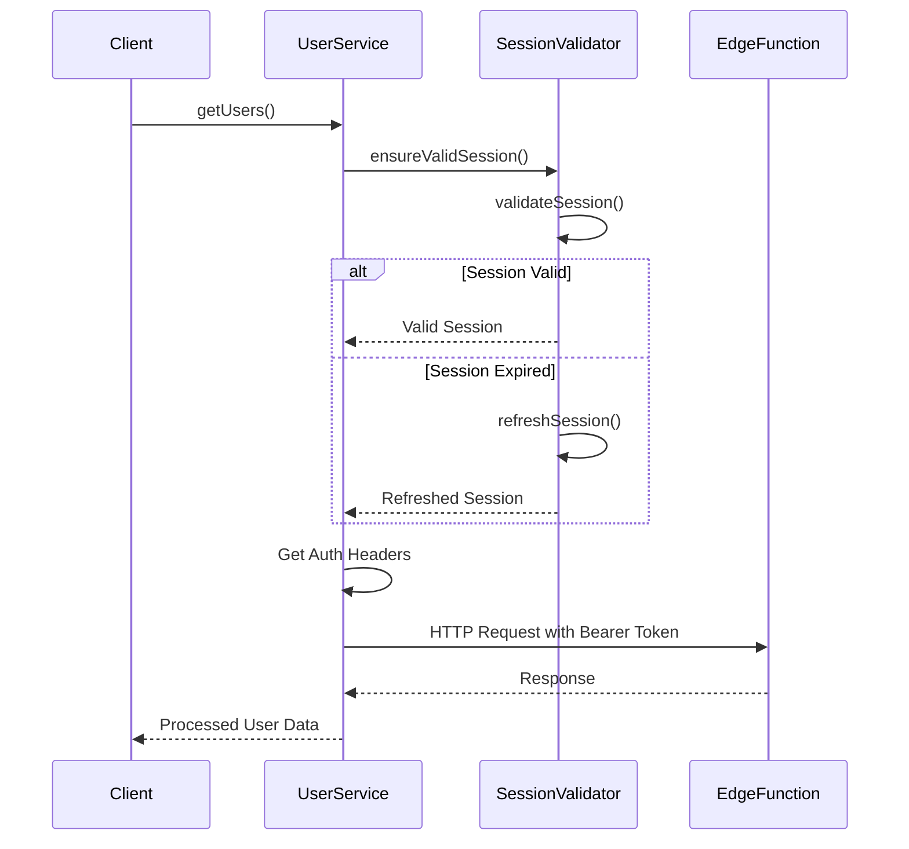
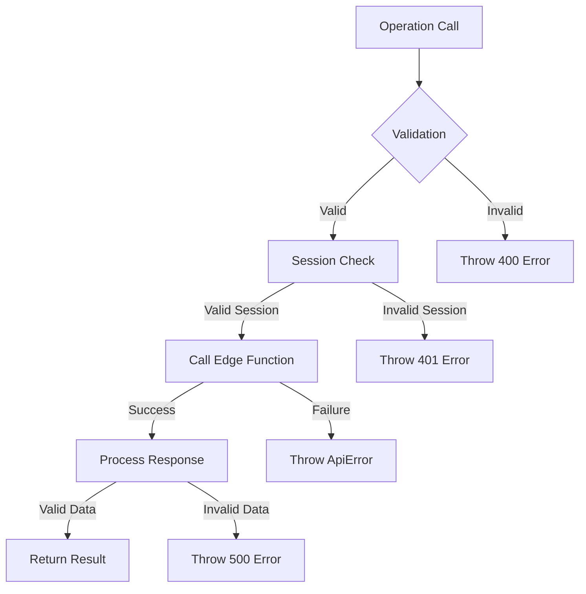
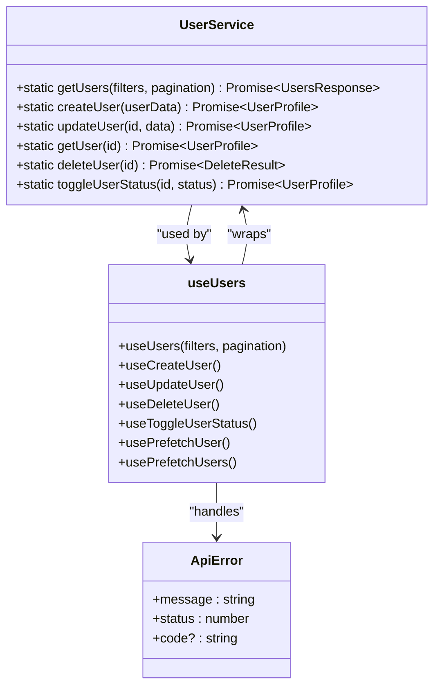

# User Service

<cite>
**Referenced Files in This Document**   
- [user-service.ts](file://src/lib/user-service.ts)
- [session-validation.ts](file://src/lib/session-validation.ts)
- [useUsers.ts](file://src/hooks/useUsers.ts)
- [AdminUsersPage.tsx](file://src/pages/admin/AdminUsersPage.tsx)
- [UsersTable.tsx](file://src/components/admin/UsersTable.tsx)
- [CreateUserDialog.tsx](file://src/components/admin/CreateUserDialog.tsx)
- [EditUserDialog.tsx](file://src/components/admin/EditUserDialog.tsx)
- [DeleteUserDialog.tsx](file://src/components/admin/DeleteUserDialog.tsx)
- [StatusToggle.tsx](file://src/components/admin/StatusToggle.tsx)
</cite>

## Table of Contents
1. [Introduction](#introduction)
2. [Core CRUD Operations](#core-crud-operations)
3. [Session Validation and Security](#session-validation-and-security)
4. [Authentication Headers](#authentication-headers)
5. [Request and Response Transformation](#request-and-response-transformation)
6. [Error Handling Strategies](#error-handling-strategies)
7. [Cache Management and Data Freshness](#cache-management-and-data-freshness)
8. [Integration with TanStack Query](#integration-with-tanstack-query)
9. [Component Integration Examples](#component-integration-examples)
10. [Conclusion](#conclusion)

## Introduction
The UserService class in the lovable-rise application serves as the central interface for managing user data through Supabase Edge Functions. This service provides a comprehensive set of methods for user management, including CRUD operations and status toggling, while ensuring secure access through session validation. The service is designed to work seamlessly with the application's authentication system and provides robust error handling for various failure scenarios. It integrates with TanStack Query for efficient state management in React components, particularly in administrative interfaces like AdminUsersPage and UsersTable.

**Section sources**
- [user-service.ts](file://src/lib/user-service.ts#L81-L311)

## Core CRUD Operations
The UserService class implements a complete set of CRUD operations for user management through static methods that interact with Supabase Edge Functions.

### getUsers Method
The `getUsers` method retrieves a paginated list of users with optional filtering capabilities. It accepts filter parameters for search, status, role, and sorting, along with pagination parameters. The method constructs appropriate query parameters and sends a GET request to the users Edge Function, returning a structured response containing users, total count, current page, and limit.

### createUser Method
The `createUser` method creates a new user by sending a POST request to the users Edge Function. It validates required fields (email, password, name) before proceeding and includes user details in the request body. The method returns the created user profile upon successful creation.

### updateUser Method
The `updateUser` method modifies existing user data through a PATCH request. It validates the user ID and ensures at least one field is provided for update. The method filters out undefined values while preserving null values, allowing for proper field clearing in the database.

### getUser Method
The `getUser` method retrieves a specific user by ID through a GET request to the users Edge Function. It validates the provided ID and returns the complete user profile if found.

### deleteUser Method
The `deleteUser` method removes a user by sending a DELETE request to the users Edge Function. It returns a response indicating the success of the operation and whether authentication and profile data were successfully deleted.

### toggleUserStatus Method
The `toggleUserStatus` method changes a user's status by calling the updateUser method with the specified status. It validates the status parameter to ensure it is either "active" or "inactive" before proceeding.

**Diagram sources**
- [user-service.ts](file://src/lib/user-service.ts#L81-L311)

**Section sources**
- [user-service.ts](file://src/lib/user-service.ts#L81-L311)

## Session Validation and Security
The UserService implements robust security measures through integration with the SessionValidator class to ensure all operations are performed with valid authentication.

### SessionValidator Integration
Each method in UserService calls `SessionValidator.ensureValidSession()` before executing the Edge Function request. This validation ensures that:
- The user has an active session
- The access token is valid and not expired
- The session is properly refreshed if nearing expiration

If the session validation fails, the method throws an ApiError with status 401, preventing unauthorized access to user data.

### Token Management
The SessionValidator class provides comprehensive token management, including:
- Session expiration detection
- Automatic session refresh when needed
- Detailed token debugging information
- RLS (Row Level Security) context validation

The validation process checks both access and refresh tokens, ensuring that database operations have the proper user context through auth.uid().

**Diagram sources**
- [user-service.ts](file://src/lib/user-service.ts#L81-L311)
- [session-validation.ts](file://src/lib/session-validation.ts#L8-L398)

**Section sources**
- [user-service.ts](file://src/lib/user-service.ts#L81-L311)
- [session-validation.ts](file://src/lib/session-validation.ts#L8-L398)

## Authentication Headers
The UserService utilizes the getAuthHeaders function to properly form authentication headers for requests to Supabase Edge Functions.

### Header Formation
The getAuthHeaders function:
- Retrieves the current authentication session
- Includes Content-Type header as application/json
- Adds Authorization header with Bearer token when a valid session exists
- Logs a warning when no valid session is found

The function ensures that only the Bearer token is sent for authenticated operations, avoiding potential conflicts with apikey headers that could cause 500 errors.

### Security Considerations
The authentication header strategy follows best practices:
- Never sends apikey in headers for Edge Function requests
- Uses only Bearer tokens for authenticated operations
- Properly handles unauthenticated requests by omitting authentication headers
- Prevents header conflicts that could lead to server errors

**Section sources**
- [user-service.ts](file://src/lib/user-service.ts#L9-L26)

## Request and Response Transformation
The UserService handles the transformation of data between the client application and the Supabase Edge Functions.

### Request Transformation
For each operation, the service transforms input parameters into the appropriate HTTP request format:
- GET requests include query parameters for filtering and pagination
- POST and PATCH requests serialize data into JSON format
- URL parameters are properly encoded

### Response Transformation
The service processes responses from Edge Functions and transforms them into consistent client-side formats:
- getUsers returns a structured UsersResponse with users array, total count, page, and limit
- createUser, updateUser, and getUser return UserProfile objects
- deleteUser returns a result object with success status and deletion details

The transformation includes error handling, where non-OK responses are converted into ApiError instances with appropriate messages and status codes.

**Section sources**
- [user-service.ts](file://src/lib/user-service.ts#L81-L311)

## Error Handling Strategies
The UserService implements comprehensive error handling to manage various failure scenarios.

### Validation Errors
The service performs client-side validation for:
- Required fields (email, password, name for user creation)
- User ID presence for operations requiring it
- Status value validity for toggle operations
- Presence of fields to update in updateUser

Validation failures result in ApiError instances with status 400 and descriptive messages.

### Session Errors
When session validation fails, the service throws ApiError with status 401 and messages indicating session issues. This prevents unauthorized access to user data.

### Server Errors
For failed HTTP requests, the service:
- Checks response.ok status
- Extracts error messages from response data
- Preserves the original HTTP status code
- Throws ApiError with appropriate message and status

### Response Validation
The service validates response data structure:
- Ensures user objects exist in responses where expected
- Verifies boolean success indicators in deletion responses
- Provides fallback values for optional fields

**Diagram sources**
- [user-service.ts](file://src/lib/user-service.ts#L81-L311)

**Section sources**
- [user-service.ts](file://src/lib/user-service.ts#L81-L311)

## Cache Management and Data Freshness
The UserService works with TanStack Query to manage data caching and ensure data freshness.

### Stale Data Prevention
The integration with TanStack Query addresses stale data issues through:
- Automatic cache invalidation after mutations
- Configurable staleTime (5 minutes) for user data
- Manual refetching options in component interfaces

### Cache Invalidation Patterns
After successful mutations, the service triggers cache invalidation:
- createUser invalidates all user lists
- updateUser invalidates both user lists and specific user details
- deleteUser removes the user from lists and removes specific user queries
- toggleUserStatus optimistically updates the cache before the request

### Prefetching Strategy
The application implements prefetching to improve user experience:
- Prefetching user data when navigating to detail views
- Prefetching user lists to reduce perceived loading times
- Strategic prefetching based on user navigation patterns

**Section sources**
- [useUsers.ts](file://src/hooks/useUsers.ts#L69-L78)

## Integration with TanStack Query
The UserService is tightly integrated with TanStack Query through custom hooks in the useUsers module.

### Query Hooks
The useUsers module provides several hooks that wrap UserService methods:
- useUsers: for fetching paginated user lists
- useCreateUser: for creating new users
- useUpdateUser: for updating existing users
- useDeleteUser: for deleting users
- useToggleUserStatus: for changing user status

### Mutation Handling
The mutation hooks provide:
- Automatic cache invalidation
- Optimistic updates (particularly for status toggling)
- Error handling with user feedback
- Success notifications

### Query Keys
The service uses a structured query key system:
- Base key ["users"] for all user-related queries
- List keys with filters and pagination parameters
- Detail keys with specific user IDs

This structure enables precise cache management and targeted invalidation.

**Diagram sources**
- [user-service.ts](file://src/lib/user-service.ts#L81-L311)
- [useUsers.ts](file://src/hooks/useUsers.ts#L69-L78)

**Section sources**
- [useUsers.ts](file://src/hooks/useUsers.ts#L69-L78)

## Component Integration Examples
The UserService is integrated into various components throughout the administrative interface.

### AdminUsersPage
The AdminUsersPage component uses multiple UserService methods through the custom hooks:
- Displays user lists with filtering and pagination
- Provides interfaces for creating, editing, and deleting users
- Implements status toggling functionality
- Handles user detail navigation

### UsersTable
The UsersTable component renders user data and provides action buttons that trigger UserService operations:
- Edit button opens EditUserDialog
- Delete button opens DeleteUserDialog
- Status toggle uses StatusToggle component
- View details navigates to user-specific pages

### Dialog Components
Several dialog components integrate with UserService:
- CreateUserDialog: Creates new users through useCreateUser
- EditUserDialog: Updates existing users through useUpdateUser
- DeleteUserDialog: Deletes users through useDeleteUser
- StatusToggle: Changes user status through useToggleUserStatus

These components provide user-friendly interfaces while handling loading states and error conditions.

**Section sources**
- [AdminUsersPage.tsx](file://src/pages/admin/AdminUsersPage.tsx#L1-L349)
- [UsersTable.tsx](file://src/components/admin/UsersTable.tsx#L1-L257)
- [CreateUserDialog.tsx](file://src/components/admin/CreateUserDialog.tsx#L1-L257)
- [EditUserDialog.tsx](file://src/components/admin/EditUserDialog.tsx#L1-L202)
- [DeleteUserDialog.tsx](file://src/components/admin/DeleteUserDialog.tsx#L1-L131)
- [StatusToggle.tsx](file://src/components/admin/StatusToggle.tsx#L1-L40)

## Conclusion
The UserService class in lovable-rise provides a robust and secure interface for managing user data through Supabase Edge Functions. By implementing comprehensive CRUD operations with proper session validation and error handling, the service ensures reliable user management functionality. Its integration with TanStack Query enables efficient state management and cache handling, while the component-level integration provides a seamless administrative experience. The service's attention to security, data consistency, and user experience makes it a critical component of the application's administrative functionality.