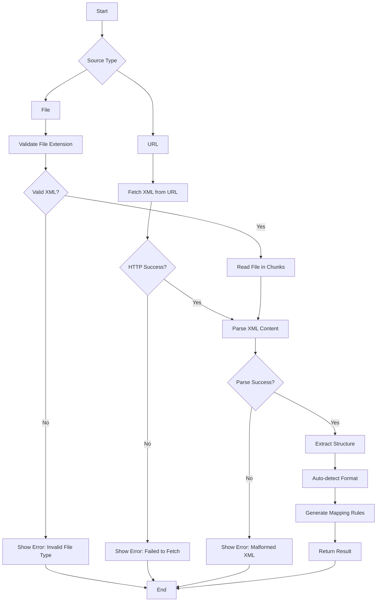

# XML Template Service

<cite>
**Referenced Files in This Document**   
- [xml-template-service.ts](file://src/lib/xml-template-service.ts)
- [XMLUploader.tsx](file://src/components/store-templates/XMLUploader.tsx)
- [VisualMapper.tsx](file://src/components/store-templates/VisualMapper.tsx)
- [MappingTable.tsx](file://src/components/store-templates/MappingTable.tsx)
- [VirtualizedXMLTree.tsx](file://src/components/store-templates/VirtualizedXMLTree.tsx)
- [StoreTemplates.tsx](file://src/pages/admin/StoreTemplates.tsx)
</cite>

## Table of Contents
1. [Introduction](#introduction)
2. [Core Functionality](#core-functionality)
3. [XML Parsing and Validation](#xml-parsing-and-validation)
4. [Template Transformation and Mapping](#template-transformation-and-mapping)
5. [Integration with UI Components](#integration-with-ui-components)
6. [Error Handling and Schema Validation](#error-handling-and-schema-validation)
7. [Performance Optimization](#performance-optimization)
8. [EDI and System Integration Capabilities](#edi-and-system-integration-capabilities)
9. [Conclusion](#conclusion)

## Introduction

The XMLTemplateService class in the lovable-rise platform provides a comprehensive solution for handling XML-based template processing in data integration scenarios. This service enables seamless processing of various XML formats used in e-commerce and marketplace integrations, including YML, RSS, and custom XML structures. The service is designed to support complex data transformations, schema handling, and interactive template editing through a suite of integrated UI components.

The XMLTemplateService plays a critical role in enabling EDI (Electronic Data Interchange) capabilities and system integration within the platform. It provides the foundation for processing product catalogs, inventory data, and pricing information from various sources, transforming them into a standardized format that can be consumed by the platform's internal systems.

**Section sources**
- [xml-template-service.ts](file://src/lib/xml-template-service.ts#L44-L660)

## Core Functionality

The XMLTemplateService class provides specialized functionality for handling XML-based template processing. At its core, the service uses the fast-xml-parser library to parse XML content into JavaScript objects, with a configuration optimized for e-commerce data formats. The parser is configured to handle attributes, text nodes, and nested structures while preserving the original XML hierarchy.

The service automatically detects the XML format type based on content patterns, supporting multiple standard formats including Rozetka, Epicentr, Prom, Price, MMA, and Google Shopping. For each detected format, the service identifies the appropriate paths for products, categories, and parameters, enabling consistent processing regardless of the source format.

The XMLStructure interface defines the output format, containing the root element, an array of XMLField objects, and optional namespaces and original XML content. Each XMLField includes the path, type, required status, sample value, category, and order information, providing comprehensive metadata about each field in the XML structure.

```mermaid
classDiagram
class XMLTemplateService {
-parser : XMLParser
-detectedFormat? : XMLFormat
+parseXML(source : string | File, userMapping? : XMLStructureMapping) : Promise~{structure : XMLStructure, data : any, stats : ParseStats}~
+generateMappingRules(structure : XMLStructure) : MappingRule[]
+getFormatDisplayName(formatType : XMLFormatType) : string
+getDetectedFormat() : XMLFormat | undefined
}
class XMLStructure {
+root : string
+fields : XMLField[]
+namespaces? : Record~string, string~
+originalXml? : string
}
class XMLField {
+path : string
+type : 'string' | 'number' | 'array' | 'object' | 'boolean'
+required : boolean
+sample? : string
+children? : XMLField[]
+category? : string
+order? : number
}
class MappingRule {
+sourceField : string
+targetField : string
+transformation? : {
type : 'direct' | 'concat' | 'split' | 'custom'
params? : Record~string, any~
}
}
XMLTemplateService --> XMLStructure : "produces"
XMLTemplateService --> MappingRule : "generates"
XMLStructure --> XMLField : "contains"
```

**Diagram sources **
- [xml-template-service.ts](file://src/lib/xml-template-service.ts#L2-L42)
- [xml-template-service.ts](file://src/lib/xml-template-service.ts#L44-L660)

**Section sources**
- [xml-template-service.ts](file://src/lib/xml-template-service.ts#L44-L660)

## XML Parsing and Validation

The XMLTemplateService provides robust parsing capabilities for both file and URL sources. The parseXML method accepts either a File object or a URL string, handling large files through chunked reading to prevent memory issues. For File objects, the service reads content in 1MB chunks, processing each chunk sequentially to maintain performance with large XML files.

The service includes automatic format detection by analyzing the XML content for specific patterns associated with different e-commerce platforms. For example, it identifies Google Shopping RSS feeds by the presence of namespace-prefixed elements like g:id and g:price, while Rozetka YML files are detected by the presence of yml_catalog with categories and currencies sections.

During parsing, the service extracts the complete structure of the XML document, including field paths, types, sample values, and categories. The extractStructure method traverses the parsed XML object, creating a flat array of XMLField objects that preserve the hierarchical relationships and order of elements in the original document. Special handling is provided for arrays with language attributes (@lang), processing each language variant as a separate field.


**Diagram sources **
- [xml-template-service.ts](file://src/lib/xml-template-service.ts#L146-L231)
- [xml-template-service.ts](file://src/lib/xml-template-service.ts#L233-L333)

**Section sources**
- [xml-template-service.ts](file://src/lib/xml-template-service.ts#L146-L333)

## Template Transformation and Mapping

The XMLTemplateService facilitates template transformation through its mapping capabilities, enabling the conversion of XML fields to system fields. The generateMappingRules method creates default mapping rules based on common field name patterns, such as mapping 'offer.price' to 'price' and 'offer.name' to 'name'. These rules can be customized and extended through the UI components.

The MappingRule interface defines the transformation rules, specifying the source field path, target system field, and optional transformation type. Supported transformations include direct mapping, concatenation, splitting, and custom transformations, providing flexibility for complex data conversion scenarios.

The service supports user-defined mapping configurations through the optional userMapping parameter in the parseXML method. This allows users to specify custom format types, root tags, product tags, category tags, currency tags, and parameter tags, enabling the service to handle non-standard XML formats.


**Diagram sources **
- [xml-template-service.ts](file://src/lib/xml-template-service.ts#L335-L356)
- [xml-template-service.ts](file://src/lib/xml-template-service.ts#L180-L189)

**Section sources**
- [xml-template-service.ts](file://src/lib/xml-template-service.ts#L335-L356)

## Integration with UI Components

The XMLTemplateService is tightly integrated with several UI components that provide an interactive experience for template editing and configuration. The XMLUploader component allows users to upload XML files or enter URLs, triggering the parsing process and displaying a preview of the XML content.

The VisualMapper component provides a drag-and-drop interface for creating field mappings between XML fields and system fields. It uses React Flow to visualize the mapping process, with source nodes representing XML fields on the left and target nodes representing system fields on the right. Users can create connections between fields to establish mappings.

The MappingTable component offers a tabular interface for managing field mappings, with filters to show only unmapped fields and search functionality to find specific fields. It includes progress tracking for required fields and provides suggestions based on field name patterns.

The VirtualizedXMLTree component displays the XML structure in a virtualized list, optimizing performance for large templates with hundreds or thousands of fields. It shows field paths, sample values, types, and categories, with badges for required fields.


**Diagram sources **
- [XMLUploader.tsx](file://src/components/store-templates/XMLUploader.tsx#L12-L220)
- [VisualMapper.tsx](file://src/components/store-templates/VisualMapper.tsx#L23-L119)
- [MappingTable.tsx](file://src/components/store-templates/MappingTable.tsx#L29-L362)
- [VirtualizedXMLTree.tsx](file://src/components/store-templates/VirtualizedXMLTree.tsx#L10-L60)
- [StoreTemplates.tsx](file://src/pages/admin/StoreTemplates.tsx#L24-L221)

**Section sources**
- [XMLUploader.tsx](file://src/components/store-templates/XMLUploader.tsx#L12-L220)
- [VisualMapper.tsx](file://src/components/store-templates/VisualMapper.tsx#L23-L119)
- [MappingTable.tsx](file://src/components/store-templates/MappingTable.tsx#L29-L362)
- [VirtualizedXMLTree.tsx](file://src/components/store-templates/VirtualizedXMLTree.tsx#L10-L60)

## Error Handling and Schema Validation

The XMLTemplateService includes comprehensive error handling for malformed XML and schema validation failures. When parsing XML from a URL, the service validates the HTTP response status and throws an error with a descriptive message if the fetch operation fails. For file uploads, the service validates the file extension to ensure it is an XML file before processing.

During the parsing process, the service uses try-catch blocks to handle parsing errors, providing meaningful error messages that can be displayed to users through the toast notification system. The service also includes validation for required fields in the mapping process, tracking progress toward completing all required mappings and providing visual feedback in the UI components.

The service handles various edge cases in XML structure, such as arrays with language attributes, nested value elements, and mixed content types. It preserves the order of elements as they appear in the original XML, which is critical for maintaining data integrity in certain e-commerce platforms.



**Diagram sources **
- [xml-template-service.ts](file://src/lib/xml-template-service.ts#L358-L376)
- [XMLUploader.tsx](file://src/components/store-templates/XMLUploader.tsx#L12-L220)

**Section sources**
- [xml-template-service.ts](file://src/lib/xml-template-service.ts#L358-L376)
- [XMLUploader.tsx](file://src/components/store-templates/XMLUploader.tsx#L12-L220)

## Performance Optimization

The XMLTemplateService implements several performance optimizations to handle large template files efficiently. The readFileChunked method reads large files in 1MB chunks, preventing memory issues that could occur when loading multi-megabyte XML files into memory at once. This approach allows the service to process files larger than available RAM by streaming the content.

The service includes performance monitoring through the ParseStats interface, which tracks parse time, file size, and item count. This information can be used to identify performance bottlenecks and optimize the parsing process for specific use cases.

For UI rendering, the VirtualizedXMLTree component uses react-window to virtualize the list of XML fields, rendering only the visible items in the viewport. This optimization is critical for templates with thousands of fields, as it prevents the browser from attempting to render all items at once, which would cause significant performance degradation.

The extractStructure method includes a depth limit of 10 levels to prevent infinite recursion on malformed XML structures, ensuring the service remains responsive even with poorly formatted input.


**Diagram sources **
- [xml-template-service.ts](file://src/lib/xml-template-service.ts#L128-L145)
- [VirtualizedXMLTree.tsx](file://src/components/store-templates/VirtualizedXMLTree.tsx#L10-L60)

**Section sources**
- [xml-template-service.ts](file://src/lib/xml-template-service.ts#L128-L145)
- [VirtualizedXMLTree.tsx](file://src/components/store-templates/VirtualizedXMLTree.tsx#L10-L60)

## EDI and System Integration Capabilities

The XMLTemplateService plays a critical role in enabling EDI and system integration capabilities within the lovable-rise platform. By supporting multiple standard XML formats used in e-commerce, the service facilitates seamless integration with marketplaces like Rozetka, Prom, and Google Shopping. This enables automated product catalog synchronization, price updates, and inventory management across multiple sales channels.

The service's ability to handle custom XML formats through user-defined mappings extends its integration capabilities to proprietary systems and legacy platforms. This flexibility allows businesses to connect their internal systems, such as ERP or inventory management software, with the lovable-rise platform using their existing data exchange formats.

The structured approach to XML processing, with clear separation of parsing, validation, transformation, and mapping, provides a robust foundation for building complex integration workflows. The service can be extended to support additional EDI standards and data formats as needed, making it a scalable solution for evolving integration requirements.

The integration with UI components enables non-technical users to configure and manage XML templates without requiring programming knowledge, democratizing access to integration capabilities and reducing dependency on development resources.

**Section sources**
- [xml-template-service.ts](file://src/lib/xml-template-service.ts#L44-L660)
- [StoreTemplates.tsx](file://src/pages/admin/StoreTemplates.tsx#L24-L221)

## Conclusion

The XMLTemplateService class provides a comprehensive solution for XML-based template processing in the lovable-rise platform. Its robust parsing capabilities, automatic format detection, and flexible mapping system enable efficient handling of various XML formats used in e-commerce and data integration scenarios. The service's integration with interactive UI components like XMLUploader, VisualMapper, MappingTable, and VirtualizedXMLTree creates a user-friendly experience for template configuration and management.

With its performance optimizations for large files, comprehensive error handling, and support for both standard and custom XML formats, the XMLTemplateService serves as a critical component for EDI and system integration capabilities within the platform. It enables seamless data exchange between the platform and external systems, facilitating automated catalog management, price synchronization, and inventory updates across multiple sales channels.

The service's modular design and well-defined interfaces make it extensible and maintainable, providing a solid foundation for future enhancements and additional integration scenarios.