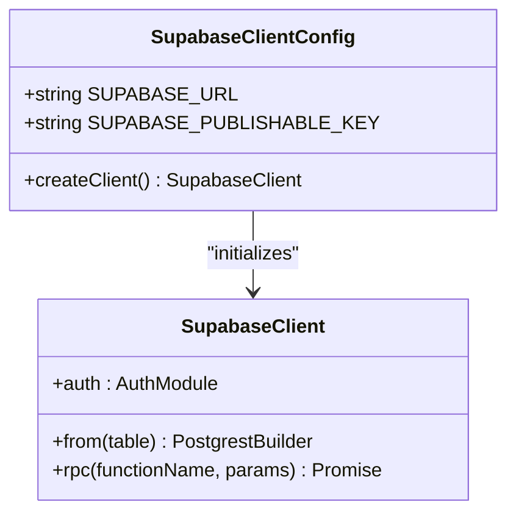
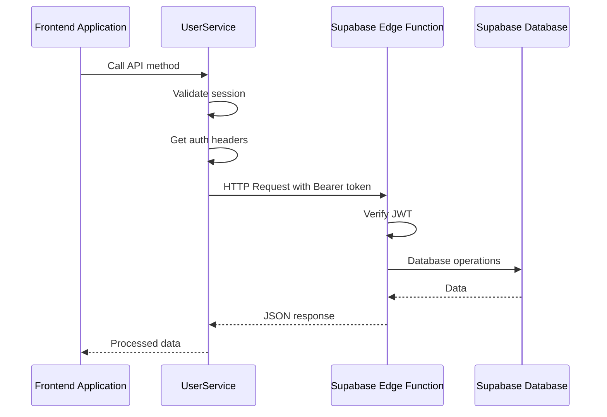
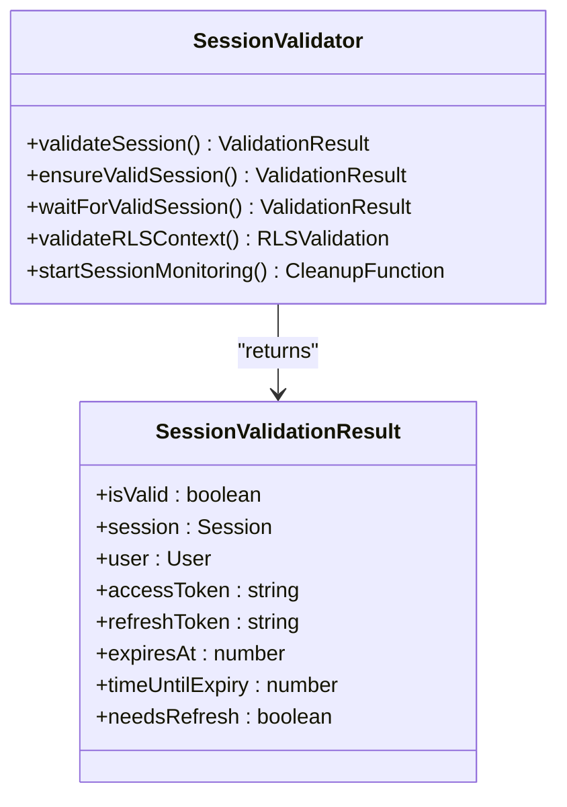
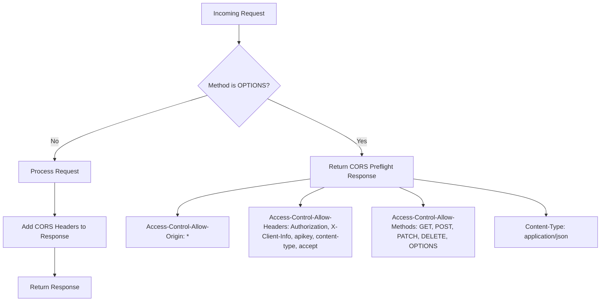
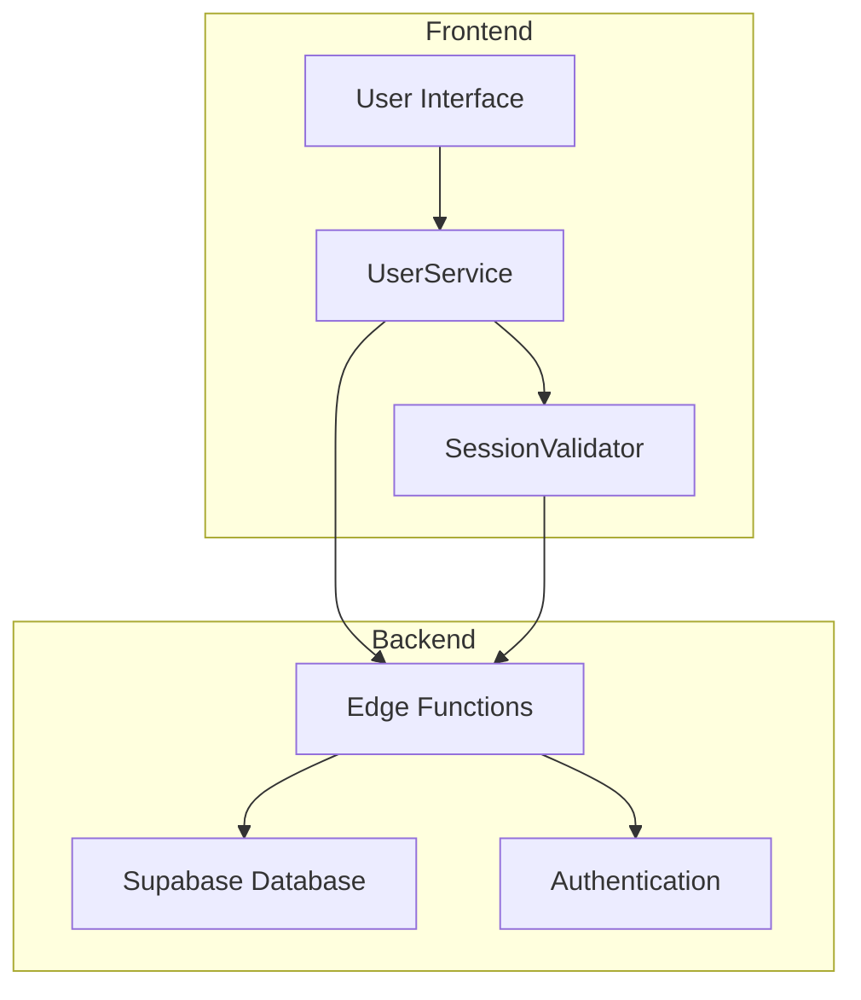
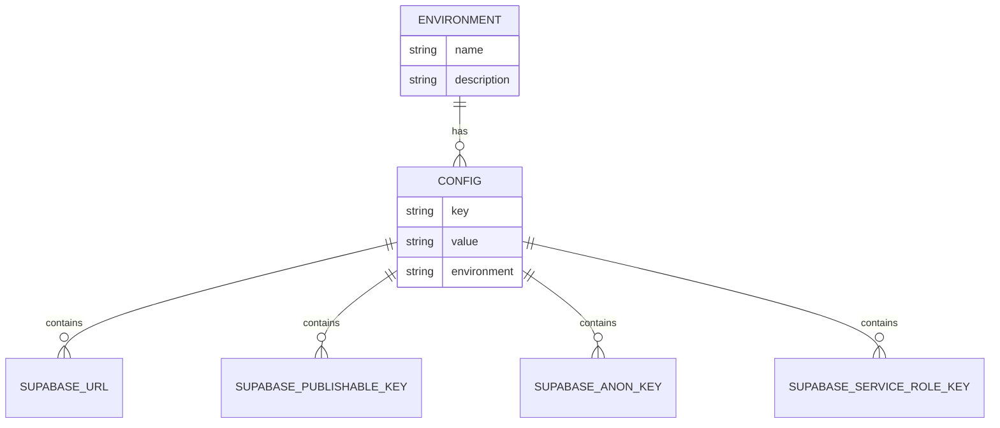
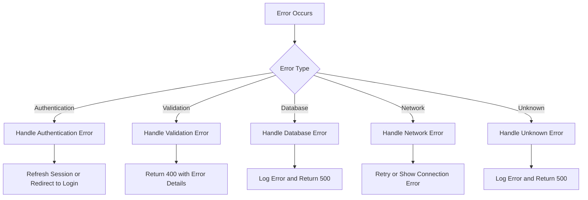

# Supabase Integration

<cite>
**Referenced Files in This Document**   
- [client.ts](file://src/integrations/supabase/client.ts)
- [session-validation.ts](file://src/lib/session-validation.ts)
- [users/index.ts](file://supabase/functions/users/index.ts)
- [auth-me/index.ts](file://supabase/functions/auth-me/index.ts)
- [user-service.ts](file://src/lib/user-service.ts)
- [config.toml](file://supabase/config.toml)
- [.env](file://.env)
</cite>

## Table of Contents
1. [Introduction](#introduction)
2. [Supabase Client Initialization](#supabase-client-initialization)
3. [Edge Function Communication](#edge-function-communication)
4. [Session Handling and Token Propagation](#session-handling-and-token-propagation)
5. [CORS Configuration](#cors-configuration)
6. [Separation of Concerns](#separation-of-concerns)
7. [Environment Isolation](#environment-isolation)
8. [Rate Limiting Considerations](#rate-limiting-considerations)
9. [Error Handling](#error-handling)
10. [Best Practices](#best-practices)

## Introduction
The Supabase integration in the lovable-rise application provides a comprehensive authentication and data access solution. This documentation details the architecture and implementation patterns used to connect the frontend application with Supabase services, including Edge Functions for server-side operations. The integration emphasizes security, proper session management, and separation of concerns between client and server responsibilities.

**Section sources**
- [client.ts](file://src/integrations/supabase/client.ts)
- [session-validation.ts](file://src/lib/session-validation.ts)

## Supabase Client Initialization
The Supabase client is initialized through a dedicated configuration file that establishes the connection parameters and default behaviors for all Supabase interactions in the application.

**Diagram sources**
- [client.ts](file://src/integrations/supabase/client.ts#L1-L30)

The client configuration includes several important settings:

- **URL and Publishable Key**: The client is configured with the Supabase project URL and publishable key, which are loaded from environment variables for security and environment isolation.
- **Authentication Settings**: The auth module is configured with localStorage persistence, automatic token refresh, and session detection from URLs.
- **Global Headers**: Default headers for content type and accept are set, but crucially, no Authorization or apikey headers are included at this level to prevent conflicts with Edge Function calls.
- **Database Schema**: The client is configured to use the 'public' schema by default.

The initialization pattern follows Supabase best practices by creating a single, shared client instance that can be imported throughout the application, ensuring consistent configuration and connection pooling.

**Section sources**
- [client.ts](file://src/integrations/supabase/client.ts#L1-L30)
- [.env](file://.env#L1-L4)

## Edge Function Communication
The application communicates with Supabase Edge Functions through direct HTTP requests, implementing a clear separation between client-side data access and server-side business logic.

**Diagram sources**
- [user-service.ts](file://src/lib/user-service.ts#L0-L335)
- [users/index.ts](file://supabase/functions/users/index.ts#L0-L490)

Key aspects of the Edge Function communication pattern include:

- **Direct HTTP Requests**: Instead of using the Supabase client for Edge Function calls, the application uses the Fetch API to make direct HTTP requests to the Edge Function endpoints.
- **Bearer Token Authentication**: Authentication is handled by including a Bearer token in the Authorization header, which contains the user's access token.
- **No apikey in Headers**: Critically, the apikey is not included in request headers to prevent authentication conflicts, as the Edge Functions are configured to verify JWT tokens.
- **Service Role Key**: On the server side, Edge Functions use the service role key for elevated privileges when needed, while using the anon key for standard operations.

This pattern ensures that authentication is properly handled at the Edge Function level while maintaining security boundaries between different privilege levels.

**Section sources**
- [user-service.ts](file://src/lib/user-service.ts#L0-L335)
- [users/index.ts](file://supabase/functions/users/index.ts#L0-L490)

## Session Handling and Token Propagation
The application implements a robust session management system that ensures proper token handling for Row Level Security (RLS) policies and prevents authentication conflicts.

**Diagram sources**
- [session-validation.ts](file://src/lib/session-validation.ts#L42-L343)

The session handling system includes several key components:

- **SessionValidator Class**: This utility class provides comprehensive session validation, refresh capabilities, and RLS context verification.
- **Token Validation**: The system validates that access tokens are present and not expired, with automatic refresh functionality when tokens are nearing expiration.
- **RLS Context Verification**: A critical feature is the validation of RLS context by testing that auth.uid() returns the expected user ID, ensuring that database queries will have the proper user context.
- **Session Monitoring**: Background monitoring detects and proactively refreshes sessions before they expire, improving user experience.
- **Debug Information**: Detailed logging capabilities help diagnose authentication and RLS issues during development.

The `createAuthenticatedClient` function demonstrates a secure pattern for creating Supabase clients with explicit tokens, using only the Authorization header with a Bearer token and avoiding apikey conflicts.

**Section sources**
- [session-validation.ts](file://src/lib/session-validation.ts#L42-L398)
- [client.ts](file://src/integrations/supabase/client.ts#L1-L30)

## CORS Configuration
The Edge Functions are configured with appropriate CORS headers to enable secure cross-origin requests from the frontend application.

**Diagram sources**
- [users/index.ts](file://supabase/functions/users/index.ts#L4-L12)
- [auth-me/index.ts](file://supabase/functions/auth-me/index.ts#L3-L5)

The CORS configuration includes:

- **Wildcard Origin**: The Access-Control-Allow-Origin header is set to '*' to allow requests from any origin, which is appropriate for public APIs.
- **Allowed Headers**: The configuration explicitly allows Authorization, X-Client-Info, apikey, content-type, and accept headers, covering the authentication and content negotiation needs.
- **Allowed Methods**: All standard HTTP methods (GET, POST, PATCH, DELETE, OPTIONS) are permitted.
- **Preflight Handling**: OPTIONS requests are handled immediately with the appropriate CORS headers, enabling the browser to determine if the actual request is allowed.

This configuration ensures that the Edge Functions can be accessed from the frontend application while maintaining appropriate security boundaries.

**Section sources**
- [users/index.ts](file://supabase/functions/users/index.ts#L4-L12)
- [auth-me/index.ts](file://supabase/functions/auth-me/index.ts#L3-L5)

## Separation of Concerns
The architecture clearly separates client-side data access from server-side business logic, following a clean separation of concerns pattern.

**Diagram sources**
- [user-service.ts](file://src/lib/user-service.ts#L0-L335)
- [users/index.ts](file://supabase/functions/users/index.ts#L0-L490)

The separation is implemented through:

- **Client-Side Services**: The UserService class in the frontend handles API communication, session validation, and response processing.
- **Server-Side Logic**: Edge Functions contain the business logic for user management, including validation, database operations, and error handling.
- **Authentication Delegation**: Authentication is handled by Supabase's built-in auth system, with the application focusing on session management and token propagation.
- **Data Access Control**: Row Level Security policies in the database enforce data access rules, with the application ensuring proper context through session validation.

This separation allows for independent development and testing of frontend and backend components while maintaining a clear contract between them.

**Section sources**
- [user-service.ts](file://src/lib/user-service.ts#L0-L335)
- [users/index.ts](file://supabase/functions/users/index.ts#L0-L490)

## Environment Isolation
The application implements environment isolation through the use of environment variables and Supabase configuration.

**Diagram sources**
- [.env](file://.env#L1-L4)
- [config.toml](file://supabase/config.toml#L1-L12)

Key aspects of environment isolation include:

- **Environment Variables**: Configuration values are stored in environment variables, with frontend variables prefixed with VITE_ to be exposed to the client.
- **Different Key Types**: The application uses different Supabase keys for different purposes:
  - Publishable Key: Used in the frontend client for general operations
  - Anon Key: Used in Edge Functions for unauthenticated operations
  - Service Role Key: Used in Edge Functions for administrative operations
- **Supabase Configuration**: The config.toml file enables JWT verification for all Edge Functions, ensuring that requests are properly authenticated.
- **Key Management**: Sensitive keys (like the service role key) are never exposed to the frontend, maintaining security boundaries.

This approach allows the application to run in different environments (development, staging, production) with appropriate configuration while maintaining security.

**Section sources**
- [.env](file://.env#L1-L4)
- [config.toml](file://supabase/config.toml#L1-L12)
- [users/index.ts](file://supabase/functions/users/index.ts#L50-L51)

## Rate Limiting Considerations
While the current implementation does not include explicit rate limiting, the architecture provides opportunities for implementing rate limiting at multiple levels.

The Edge Function design allows for rate limiting to be implemented either at the Supabase level or within the functions themselves. Potential approaches include:

- **Supabase Rate Limiting**: Configuring rate limits at the Supabase project level for API calls.
- **Edge Function Middleware**: Adding rate limiting logic within the Edge Functions, potentially using Redis or another storage mechanism to track request counts.
- **Client-Side Throttling**: Implementing request throttling in the UserService to prevent excessive calls from the frontend.
- **Authentication-Based Limits**: Applying different rate limits based on user roles or authentication status.

The current implementation focuses on proper authentication and authorization, with rate limiting as a potential future enhancement for production environments.

**Section sources**
- [users/index.ts](file://supabase/functions/users/index.ts)
- [user-service.ts](file://src/lib/user-service.ts)

## Error Handling
The application implements comprehensive error handling across both client and server components.

**Diagram sources**
- [user-service.ts](file://src/lib/user-service.ts#L318-L335)
- [users/index.ts](file://supabase/functions/users/index.ts#L480-L490)

Error handling strategies include:

- **Client-Side Error Handling**: The UserService class wraps API calls in try-catch blocks and converts Supabase errors into standardized ApiError objects.
- **Server-Side Error Handling**: Edge Functions include comprehensive try-catch blocks and return appropriate HTTP status codes and error messages.
- **Authentication Error Detection**: Utility functions identify authentication-related errors to enable appropriate recovery strategies.
- **Detailed Logging**: Both client and server include detailed logging to aid in debugging and monitoring.
- **User-Friendly Messages**: Errors are translated into user-friendly messages while maintaining detailed information for debugging.

This multi-layered approach ensures that errors are properly handled, logged, and communicated to users without exposing sensitive information.

**Section sources**
- [user-service.ts](file://src/lib/user-service.ts#L318-L335)
- [users/index.ts](file://supabase/functions/users/index.ts#L480-L490)

## Best Practices
The Supabase integration follows several best practices for security, performance, and maintainability.

### Secure Client Instantiation
The `createAuthenticatedClient` function in session-validation.ts demonstrates secure client instantiation by:
- Using only the Authorization header with a Bearer token
- Avoiding the inclusion of apikey in headers to prevent authentication conflicts
- Validating the presence of an access token before creating the client
- Using the publishable key rather than sensitive keys

### Environment Isolation
The application properly isolates environments through:
- Using environment variables for configuration
- Prefixing frontend variables with VITE_ for proper exposure
- Keeping sensitive keys (service role key) server-side only
- Using different key types for different purposes and privilege levels

### Rate Limiting Considerations
While not currently implemented, the architecture supports future rate limiting through:
- The modular Edge Function design
- Clear separation between client and server concerns
- Standardized error handling that can be extended to include rate limit errors

### Error Handling
The application implements robust error handling by:
- Providing detailed error information for debugging
- Converting low-level errors into user-friendly messages
- Including appropriate HTTP status codes
- Logging errors for monitoring and troubleshooting

These best practices ensure that the Supabase integration is secure, maintainable, and provides a good user experience.

**Section sources**
- [session-validation.ts](file://src/lib/session-validation.ts#L371-L398)
- [client.ts](file://src/integrations/supabase/client.ts)
- [.env](file://.env)
- [config.toml](file://supabase/config.toml)