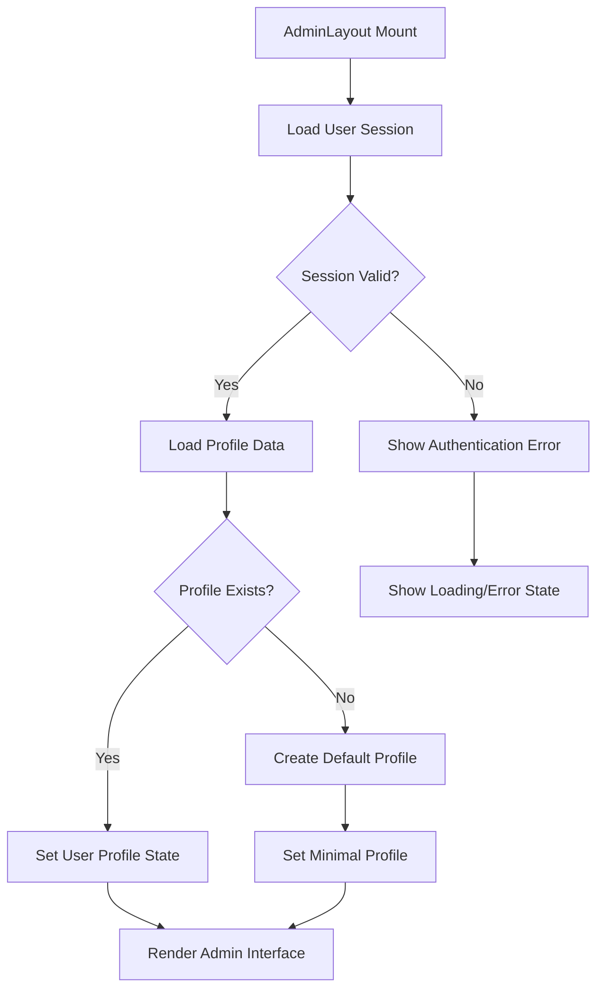
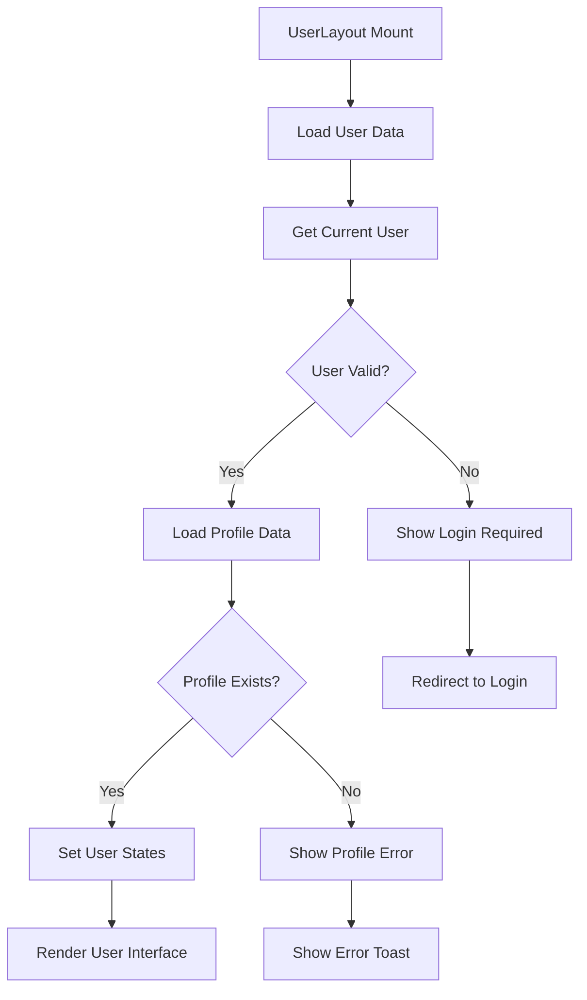
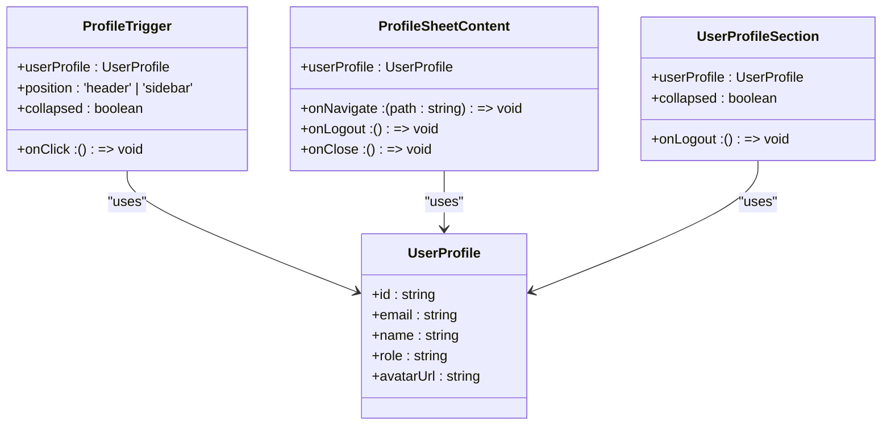

# Component Architecture

<cite>
**Referenced Files in This Document**   
- [AdminLayout.tsx](file://src/components/AdminLayout.tsx)
- [UserLayout.tsx](file://src/components/UserLayout.tsx)
- [AdminSidebar.tsx](file://src/components/AdminSidebar.tsx)
- [UserSidebar.tsx](file://src/components/UserSidebar.tsx)
- [Header.tsx](file://src/components/Header.tsx)
- [UserHeader.tsx](file://src/components/UserHeader.tsx)
- [ui](file://src/components/ui)
- [profile-types.ts](file://src/components/ui/profile-types.ts)
- [profile-trigger.tsx](file://src/components/ui/profile-trigger.tsx)
- [profile-sheet-content.tsx](file://src/components/ui/profile-sheet-content.tsx)
</cite>

## Table of Contents
1. [Introduction](#introduction)
2. [Layout Component Hierarchy](#layout-component-hierarchy)
3. [AdminLayout Implementation](#adminlayout-implementation)
4. [UserLayout Implementation](#userlayout-implementation)
5. [Reusable UI Components](#reusable-ui-components)
6. [Responsive Design and Accessibility](#responsive-design-and-accessibility)
7. [Integration with React Router](#integration-with-react-router)
8. [Creating New Pages](#creating-new-pages)
9. [Conclusion](#conclusion)

## Introduction
The lovable-rise application implements a component-based architecture with two primary layout components: AdminLayout and UserLayout. These layout components serve as wrappers for page content, providing consistent structure, navigation, and user interface elements across different sections of the application. The architecture follows modern React patterns with a focus on reusability, responsiveness, and accessibility. This documentation details the hierarchical component structure, composition patterns, and implementation details of these layout components and their integration with the application's overall design system.

## Layout Component Hierarchy
The application's component architecture is organized around two main layout components that wrap all page content:

- **AdminLayout**: Used for administrative interfaces with enhanced functionality and navigation options
- **UserLayout**: Designed for end-user dashboards with simplified navigation and user-focused features

Both layouts follow a consistent hierarchical structure:
1. Layout wrapper component
2. Sidebar navigation (desktop) or mobile menu
3. Header with user controls and theme toggling
4. Main content area with dynamic routing
5. Reusable UI components from the shared 'ui' directory

The layout components are designed to be responsive, adapting to different screen sizes through collapsible sidebars and mobile-optimized navigation patterns. They also implement consistent state management for user profile data, navigation state, and theme preferences.

**Section sources**
- [AdminLayout.tsx](file://src/components/AdminLayout.tsx#L147-L250)
- [UserLayout.tsx](file://src/components/UserLayout.tsx#L233-L331)

## AdminLayout Implementation
The AdminLayout component provides a comprehensive administrative interface with several key features:

### User Profile Loading and State Management
AdminLayout implements robust user profile loading with error handling and fallback mechanisms. The component uses React's useState and useEffect hooks to manage the user profile state, loading profile data from Supabase authentication and the ProfileService. If no profile exists, it creates a default admin profile with appropriate fallback values.



**Diagram sources **
- [AdminLayout.tsx](file://src/components/AdminLayout.tsx#L147-L250)

### Error Handling and Loading States
The component implements comprehensive error handling with multiple fallback strategies:
- Session validation with appropriate error messages
- Default profile creation when no profile exists
- Error boundaries to prevent UI blocking
- Loading states with animated spinners during profile fetching

The loading state displays a centered spinner with localized "loading_admin_dashboard" text, providing feedback during the asynchronous profile loading process.

### Header and Navigation Integration
The AdminLayout header includes:
- Theme toggle (light/dark mode)
- Language selector (Ukrainian/English)
- User profile trigger with role-based access
- Search functionality (desktop only)
- Responsive sidebar toggle

The navigation system integrates with React Router through the useNavigate hook, enabling programmatic navigation between routes while maintaining consistent state management.

**Section sources**
- [AdminLayout.tsx](file://src/components/AdminLayout.tsx#L147-L250)
- [AdminSidebar.tsx](file://src/components/AdminSidebar.tsx)
- [Header.tsx](file://src/components/Header.tsx)

## UserLayout Implementation
The UserLayout component provides a streamlined interface for end users with focus on simplicity and accessibility.

### Navigation and State Management
UserLayout implements a sophisticated state management system for user navigation with the following features:

- Mobile-responsive sidebar with collapsible states
- User menu provider context for shared state
- Dynamic menu item loading from database
- Static route fallbacks for essential pages
- Subscription validation service integration

The component uses multiple useState hooks to manage various states:
- Sidebar collapsed/expanded state
- Mobile menu open/closed state
- User profile data
- UI user profile data
- Loading state
- Profile sheet open state



**Diagram sources **
- [UserLayout.tsx](file://src/components/UserLayout.tsx#L233-L331)

### User Menu System
The UserLayout implements a dynamic menu system with:
- Database-driven menu items
- Static fallback routes (Dashboard, Profile)
- Hierarchical menu organization
- Access control based on subscription status
- Real-time subscription validation

The menu system uses a context provider (UserMenuProvider) to share menu state across components, enabling consistent navigation behavior throughout the user interface.

### Responsive Design Patterns
The UserLayout implements responsive design patterns including:
- Mobile-first approach with responsive breakpoints
- Collapsible sidebar for desktop views
- Full-screen mobile menu with sheet component
- Adaptive navigation patterns based on screen size
- Touch-friendly interface elements

**Section sources**
- [UserLayout.tsx](file://src/components/UserLayout.tsx#L233-L331)
- [UserSidebar.tsx](file://src/components/UserSidebar.tsx)
- [UserHeader.tsx](file://src/components/UserHeader.tsx)

## Reusable UI Components
The application implements a comprehensive library of reusable UI components in the 'ui' directory, which are utilized across both layout components.

### Component Library Structure
The 'ui' directory contains over 50 reusable components organized by functionality:
- **Navigation**: dropdown-menu, navigation-menu, menubar, tabs
- **Forms**: button, input, form, select, checkbox, radio-group
- **Layout**: card, sheet, dialog, popover, tooltip
- **Data Display**: table, avatar, badge, progress, chart
- **Feedback**: alert, toast, skeleton, spinner

### Key UI Components in Layouts
Several critical UI components are used extensively in the layout components:

#### Profile Components
The profile system consists of three interconnected components:
- **ProfileTrigger**: Displays user avatar and name with click interaction
- **ProfileSheetContent**: Shows detailed user information and navigation options
- **UserProfileSection**: Sidebar-specific user profile display

These components share a common TypeScript interface (UserProfile) defined in profile-types.ts, ensuring type safety and consistency across the application.



**Diagram sources **
- [profile-types.ts](file://src/components/ui/profile-types.ts)
- [profile-trigger.tsx](file://src/components/ui/profile-trigger.tsx)
- [profile-sheet-content.tsx](file://src/components/ui/profile-sheet-content.tsx)

#### Navigation Components
The layout components utilize several navigation-focused UI components:
- **Sheet**: For mobile menu and profile panels
- **DropdownMenu**: For language selection and user actions
- **Button**: For navigation controls and actions
- **Avatar**: For user profile images with fallbacks

These components are styled consistently across both AdminLayout and UserLayout, maintaining a cohesive design system while adapting to the specific needs of each layout.

**Section sources**
- [ui](file://src/components/ui)
- [profile-types.ts](file://src/components/ui/profile-types.ts)

## Responsive Design and Accessibility
The layout components implement comprehensive responsive design and accessibility patterns.

### Responsive Behavior
Both layouts adapt to different screen sizes through:
- Mobile detection using useIsMobile hook
- Conditional rendering of mobile vs. desktop navigation
- Collapsible sidebar states
- Adaptive component sizing and spacing

The AdminLayout uses a ResponsiveAdminSidebar component that switches between a regular sidebar on desktop and a sheet-based mobile menu on smaller screens. The UserLayout implements a similar pattern with a collapsible sidebar that can be toggled between compact and expanded states.

### Accessibility Features
The components implement several accessibility best practices:
- Semantic HTML structure with appropriate ARIA roles
- Keyboard navigation support
- Screen reader-friendly labels and descriptions
- Sufficient color contrast
- Focus management for interactive elements
- Reduced motion preferences

The profile components include screen reader-only text (sr-only class) for improved accessibility, and all interactive elements have appropriate focus states and keyboard event handlers.

### Theme and Language Support
Both layouts support:
- Light/dark theme toggling through document class manipulation
- Multi-language support via i18n provider
- Localized text content
- Cultural considerations in UI design

The theme toggle persists across sessions by modifying the document's class list, while language preferences are managed through the i18n provider's state management system.

**Section sources**
- [AdminLayout.tsx](file://src/components/AdminLayout.tsx#L147-L250)
- [UserLayout.tsx](file://src/components/UserLayout.tsx#L233-L331)
- [use-mobile.tsx](file://src/hooks/use-mobile.tsx)
- [i18n-provider.tsx](file://src/providers/i18n-provider.tsx)

## Integration with React Router
The layout components are tightly integrated with React Router for navigation and routing.

### Route Protection
Both layouts serve as route protectors, ensuring users are authenticated before accessing protected content. They implement this through:
- Authentication state checking on mount
- Redirect to login pages when authentication fails
- Session validation using Supabase auth
- User data loading before rendering content

### Context and Outlet Usage
The layouts use React Router's Outlet component to render child routes, with additional context passed through the outlet:
- User data
- Menu items
- Update callbacks

This pattern enables child components to access user and menu state without prop drilling, promoting cleaner component composition.

### Navigation Patterns
The components implement consistent navigation patterns:
- Programmatic navigation using useNavigate hook
- Active route detection and highlighting
- Route parameter handling
- Navigation guards for protected routes

The UserLayout's menu system dynamically updates the active menu item based on the current route, providing visual feedback to users about their current location within the application.

**Section sources**
- [AdminLayout.tsx](file://src/components/AdminLayout.tsx#L147-L250)
- [UserLayout.tsx](file://src/components/UserLayout.tsx#L233-L331)
- [Outlet](file://src/components/ContentWorkspace.tsx)

## Creating New Pages
Creating new pages using the existing layout templates follows a consistent pattern.

### Page Creation Process
To create a new page:
1. Import the appropriate layout component (AdminLayout or UserLayout)
2. Create a new page component that will serve as the route target
3. Wrap the page content with the layout component
4. Add the route to the appropriate routing configuration
5. Update navigation if necessary

### Template Usage
New pages should follow the composition pattern demonstrated in existing pages:
- Import layout component
- Define page-specific content
- Wrap content with layout
- Pass children to layout component

For example, creating a new admin page:
```typescript
import AdminLayout from '@/components/AdminLayout';

const NewAdminPage = () => {
  return (
    <AdminLayout>
      {/* Page-specific content */}
      <div>New Admin Content</div>
    </AdminLayout>
  );
};
```

### Best Practices
When creating new pages:
- Use existing UI components from the 'ui' directory
- Follow consistent styling patterns
- Implement proper loading and error states
- Ensure responsive behavior
- Maintain accessibility standards
- Use appropriate TypeScript interfaces

The layout components handle most cross-cutting concerns (authentication, navigation, theming), allowing page components to focus on their specific functionality.

**Section sources**
- [AdminLayout.tsx](file://src/components/AdminLayout.tsx#L147-L250)
- [UserLayout.tsx](file://src/components/UserLayout.tsx#L233-L331)
- [ContentWorkspace.tsx](file://src/components/ContentWorkspace.tsx)

## Conclusion
The lovable-rise application implements a robust component architecture centered around two primary layout components: AdminLayout and UserLayout. These layouts provide consistent structure, navigation, and user interface elements across the application while accommodating the different needs of administrative and end-user interfaces.

Key architectural strengths include:
- Comprehensive user profile management with error handling
- Responsive design patterns that adapt to different screen sizes
- Reusable UI components that promote consistency
- Integration with React Router for navigation and routing
- Accessibility features that support diverse user needs
- Theme and language support for internationalization

The component hierarchy and composition patterns enable efficient development of new pages while maintaining a cohesive user experience. By leveraging the existing layout templates and UI component library, developers can create new features with minimal boilerplate code and maximum consistency.

The architecture demonstrates modern React best practices, including proper state management, component composition, and separation of concerns, making it a solid foundation for the application's continued development and expansion.