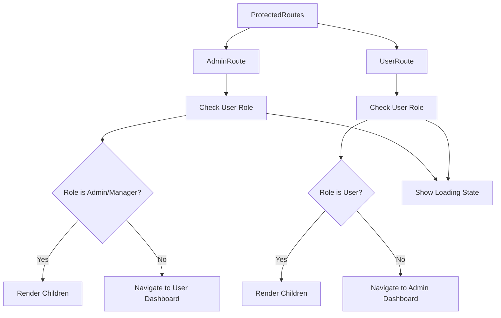
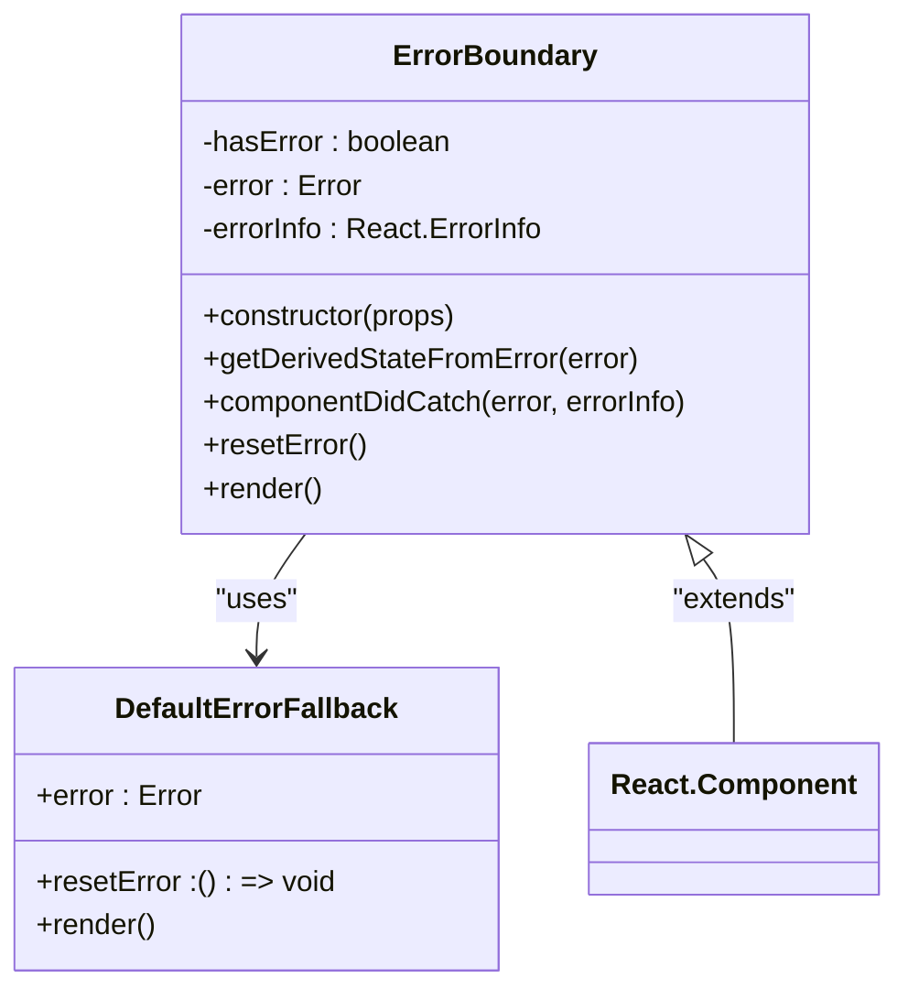
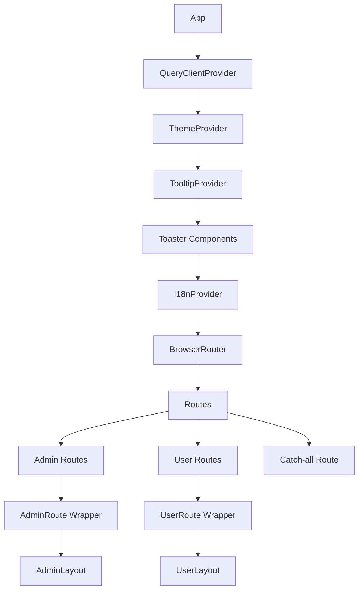
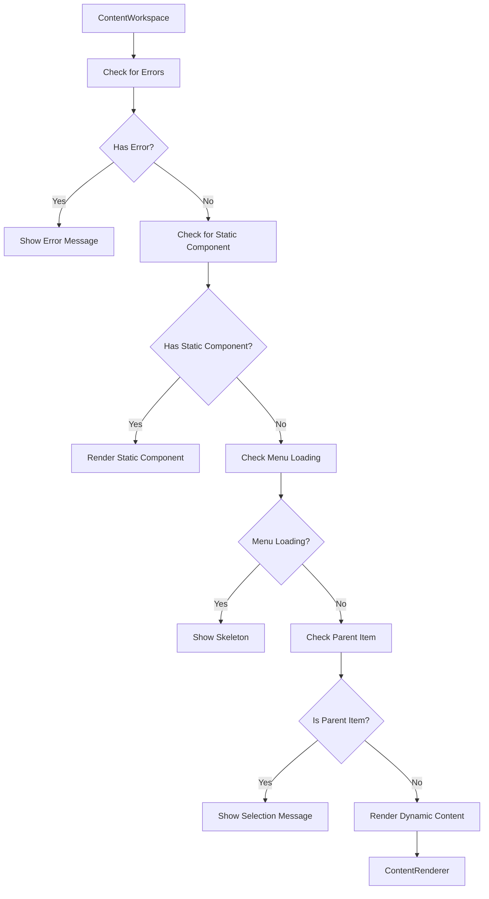
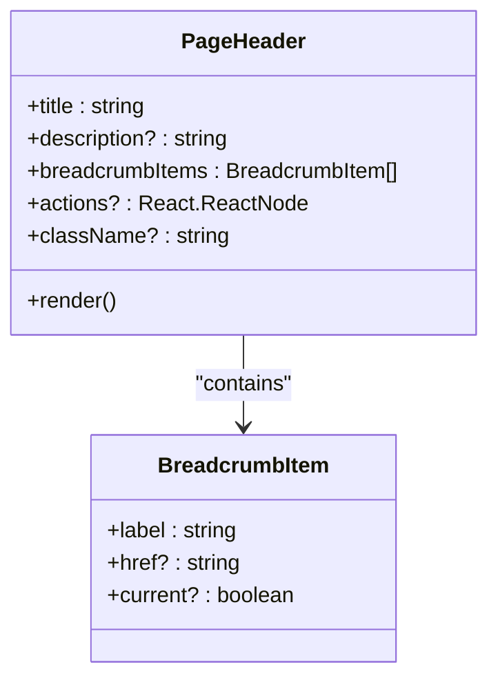
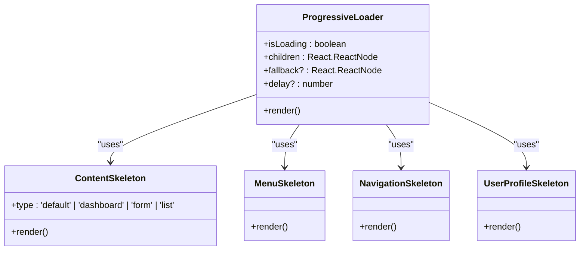
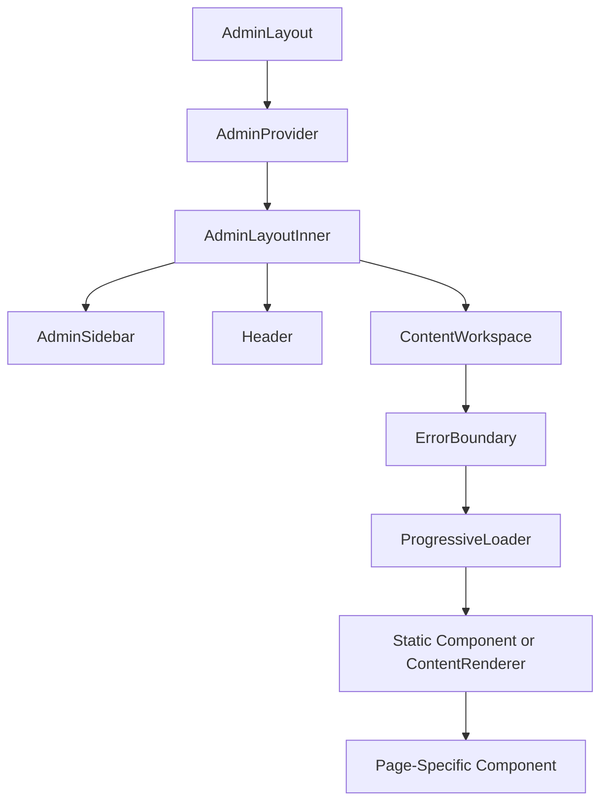
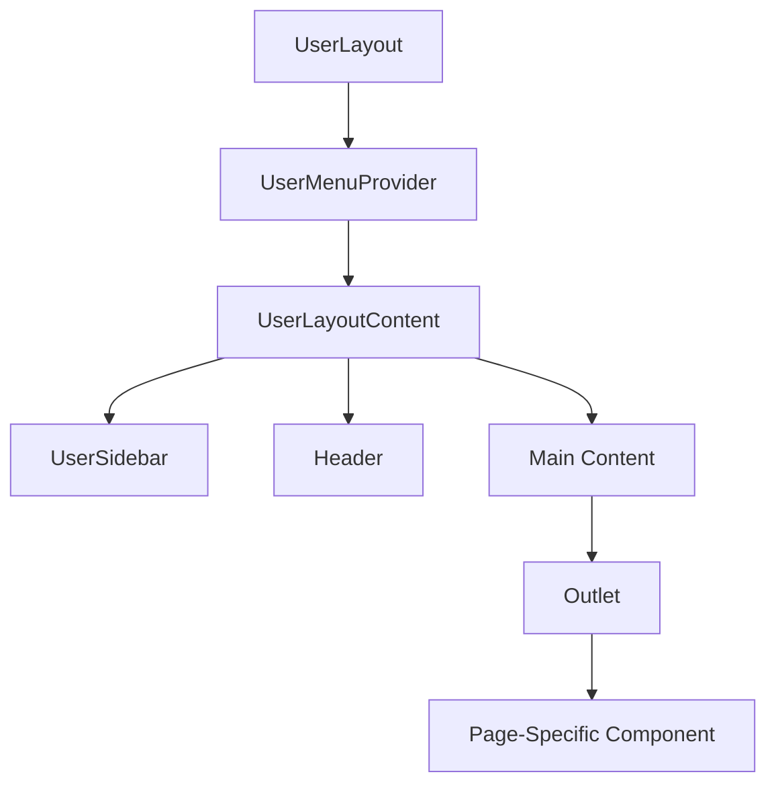
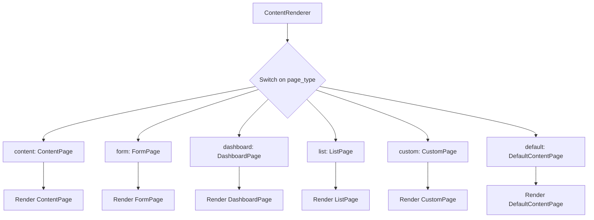

# Component Composition Patterns

<cite>
**Referenced Files in This Document**   
- [App.tsx](file://src/App.tsx)
- [ProtectedRoutes.tsx](file://src/components/ProtectedRoutes.tsx)
- [ErrorBoundary.tsx](file://src/components/ErrorBoundary.tsx)
- [ContentWorkspace.tsx](file://src/components/ContentWorkspace.tsx)
- [PageHeader.tsx](file://src/components/PageHeader.tsx)
- [LoadingSkeletons.tsx](file://src/components/LoadingSkeletons.tsx)
- [AdminLayout.tsx](file://src/components/AdminLayout.tsx)
- [UserLayout.tsx](file://src/components/UserLayout.tsx)
- [admin-provider.tsx](file://src/providers/admin-provider.tsx)
- [i18n-provider.tsx](file://src/providers/i18n-provider.tsx)
- [theme-provider.tsx](file://src/providers/theme-provider.tsx)
</cite>

## Table of Contents
1. [Introduction](#introduction)
2. [Higher-Order Component Composition](#higher-order-component-composition)
3. [Global Composition Strategy in App.tsx](#global-composition-strategy-in-apptsx)
4. [Utility Components for UI Consistency](#utility-components-for-ui-consistency)
5. [Page Composition Patterns](#page-composition-patterns)
6. [Best Practices for Component Composition](#best-practices-for-component-composition)
7. [Conclusion](#conclusion)

## Introduction
The lovable-rise application employs a sophisticated component composition architecture that emphasizes reusability, error resilience, and maintainable UI patterns. This document details the composition patterns used throughout the application, focusing on higher-order components, global providers, utility components, and page-level composition strategies. The architecture leverages React's compositional model to create a flexible and scalable application structure that maintains consistency across different user roles and application sections.

## Higher-Order Component Composition

The application implements several higher-order components that enhance reusability and error resilience across the codebase. These components serve as wrappers that provide additional functionality to their children while maintaining a clean separation of concerns.

### ProtectedRoutes Component
The `ProtectedRoutes` component implements role-based access control through two higher-order components: `AdminRoute` and `UserRoute`. These components wrap protected routes and handle authentication state, loading states, and authorization logic.

**Diagram sources**
- [ProtectedRoutes.tsx](file://src/components/ProtectedRoutes.tsx#L3-L43)

**Section sources**
- [ProtectedRoutes.tsx](file://src/components/ProtectedRoutes.tsx#L3-L43)
- [useUserRole.ts](file://src/hooks/useUserRole.ts#L3-L33)

### ErrorBoundary Component
The `ErrorBoundary` component provides error resilience by catching JavaScript errors anywhere in the child component tree, logging those errors, and displaying a fallback UI instead of crashing the entire application.

**Diagram sources**
- [ErrorBoundary.tsx](file://src/components/ErrorBoundary.tsx#L8-L49)

**Section sources**
- [ErrorBoundary.tsx](file://src/components/ErrorBoundary.tsx#L8-L95)

## Global Composition Strategy in App.tsx

The `App.tsx` file serves as the root component that orchestrates the global composition of providers, routing, and layout structures. It implements a layered composition strategy that ensures all necessary context providers are available to the entire application.

**Diagram sources**
- [App.tsx](file://src/App.tsx#L52-L122)

**Section sources**
- [App.tsx](file://src/App.tsx#L52-L122)
- [theme-provider.tsx](file://src/providers/theme-provider.tsx#L5-L7)
- [i18n-provider.tsx](file://src/providers/i18n-provider.tsx#L945-L980)

The composition strategy follows a specific order:
1. **Data Management**: `QueryClientProvider` is at the top level to manage data fetching and caching
2. **UI Theming**: `ThemeProvider` provides theme context for styling
3. **UI Utilities**: `TooltipProvider` and toaster components enable global UI interactions
4. **Internationalization**: `I18nProvider` handles language and translation
5. **Routing**: `BrowserRouter` and `Routes` manage navigation and URL handling
6. **Authentication**: `AdminRoute` and `UserRoute` wrappers handle role-based access
7. **Layouts**: `AdminLayout` and `UserLayout` provide role-specific UI structures

## Utility Components for UI Consistency

The application utilizes several utility components to maintain consistent UI patterns across pages. These components abstract common UI patterns and provide reusable interfaces for developers.

### ContentWorkspace Component
The `ContentWorkspace` component serves as the primary content area for the admin interface, dynamically rendering content based on the current route and active menu item. It implements progressive loading and error handling to enhance user experience.

**Diagram sources**
- [ContentWorkspace.tsx](file://src/components/ContentWorkspace.tsx#L56-L212)

**Section sources**
- [ContentWorkspace.tsx](file://src/components/ContentWorkspace.tsx#L56-L212)
- [admin-provider.tsx](file://src/providers/admin-provider.tsx#L196-L223)

### PageHeader Component
The `PageHeader` component standardizes the presentation of page titles, descriptions, and actions across the application. It ensures consistent typography, spacing, and layout for all page headers.

**Diagram sources**
- [PageHeader.tsx](file://src/components/PageHeader.tsx#L4-L41)

**Section sources**
- [PageHeader.tsx](file://src/components/PageHeader.tsx#L4-L41)
- [breadcrumb.tsx](file://src/components/ui/breadcrumb.tsx#L16-L16)

### LoadingSkeletons Component
The `LoadingSkeletons` component provides various skeleton screen implementations for different content types, improving perceived performance during data loading. It includes specialized skeletons for dashboards, forms, and lists.

**Diagram sources**
- [LoadingSkeletons.tsx](file://src/components/LoadingSkeletons.tsx#L5-L174)

**Section sources**
- [LoadingSkeletons.tsx](file://src/components/LoadingSkeletons.tsx#L5-L174)

## Page Composition Patterns

The application follows consistent patterns for composing pages by combining layout wrappers, data providers, and feature-specific components. This approach ensures maintainability and reusability across different page types.

### Admin Page Composition
Admin pages are composed through a hierarchical structure that begins with the `AdminLayout` component, which provides the overall admin interface structure, followed by role-based routing and specific page components.

**Diagram sources**
- [AdminLayout.tsx](file://src/components/AdminLayout.tsx#L147-L250)
- [ContentWorkspace.tsx](file://src/components/ContentWorkspace.tsx#L56-L212)

**Section sources**
- [AdminLayout.tsx](file://src/components/AdminLayout.tsx#L147-L250)
- [ContentWorkspace.tsx](file://src/components/ContentWorkspace.tsx#L56-L212)
- [admin-provider.tsx](file://src/providers/admin-provider.tsx#L196-L223)

### User Page Composition
User pages follow a similar composition pattern but with user-specific layouts and providers. The `UserLayout` component manages the user interface structure, while the `UserMenuProvider` handles user-specific menu items and navigation.

**Diagram sources**
- [UserLayout.tsx](file://src/components/UserLayout.tsx#L233-L331)

**Section sources**
- [UserLayout.tsx](file://src/components/UserLayout.tsx#L233-L331)
- [UserMenuProvider](file://src/components/UserLayout.tsx#L78-L232)

### Dynamic Content Rendering
The `ContentRenderer` component enables dynamic rendering of pages based on configuration data from the database. It uses a factory pattern to instantiate different page types based on the `page_type` property.

**Diagram sources**
- [ContentRenderer.tsx](file://src/pages/ContentRenderer.tsx#L23-L103)

**Section sources**
- [ContentRenderer.tsx](file://src/pages/ContentRenderer.tsx#L23-L103)
- [page-types](file://src/pages/page-types)

## Best Practices for Component Composition

The application follows several best practices for component composition that enhance performance, readability, and maintainability.

### Prop Drilling Mitigation
The application uses React Context extensively to avoid prop drilling. Multiple context providers are used to manage different types of global state:

- `AdminProvider` for admin-specific state and menu items
- `UserMenuProvider` for user-specific menu items and navigation
- `I18nProvider` for internationalization and translation
- `ThemeProvider` for theme management
- `QueryClientProvider` for data fetching and caching

This approach ensures that components can access the data they need without requiring props to be passed through multiple levels of the component tree.

### Error Boundary Placement
Error boundaries are strategically placed to catch errors in specific sections of the application without affecting the entire UI. The primary error boundary is placed around dynamic content areas:

- `ErrorBoundary` wraps the `ContentWorkspace` component to protect against rendering errors in admin content
- Individual pages may have additional error boundaries for specific components
- The global error boundary in `App.tsx` serves as a last resort for uncaught errors

This layered approach to error handling ensures that a single component failure does not bring down the entire application.

### Lazy Loading Strategies
The application implements several lazy loading strategies to optimize performance:

- **Route-based code splitting**: Different sections of the application are loaded only when needed
- **Progressive loading**: The `ProgressiveLoader` component delays the display of loading skeletons to avoid flickering
- **Content preloading**: The `preloadContent` function in `admin-provider.tsx` preloads content for menu items when they receive focus
- **Dynamic imports**: Page components are imported dynamically to reduce initial bundle size

These strategies improve the perceived performance of the application and reduce the initial load time.

### Creating New Composite Components
When creating new composite components, the following guidelines should be followed:

1. **Single Responsibility**: Each component should have a single, well-defined purpose
2. **Reusability**: Components should be designed to be reusable across different contexts
3. **Performance**: Use React.memo, useMemo, and useCallback to optimize rendering
4. **Accessibility**: Ensure components are accessible to all users, including those using assistive technologies
5. **Type Safety**: Use TypeScript interfaces to define component props and ensure type safety
6. **Documentation**: Include JSDoc comments to document component purpose, props, and usage

Following these guidelines ensures that new components integrate seamlessly with the existing architecture and maintain the high quality standards of the application.

## Conclusion
The component composition patterns in the lovable-rise application demonstrate a sophisticated approach to building scalable and maintainable React applications. By leveraging higher-order components, context providers, and utility components, the application achieves a high degree of reusability and consistency across different sections. The global composition strategy in `App.tsx` ensures that all necessary providers are available to the entire application, while the use of error boundaries and loading skeletons enhances user experience and error resilience. The documented best practices provide guidance for maintaining performance and readability when creating new components, ensuring the long-term maintainability of the codebase.