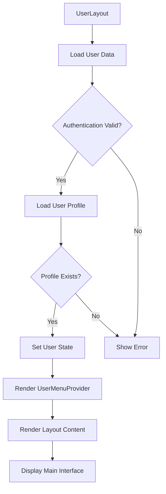
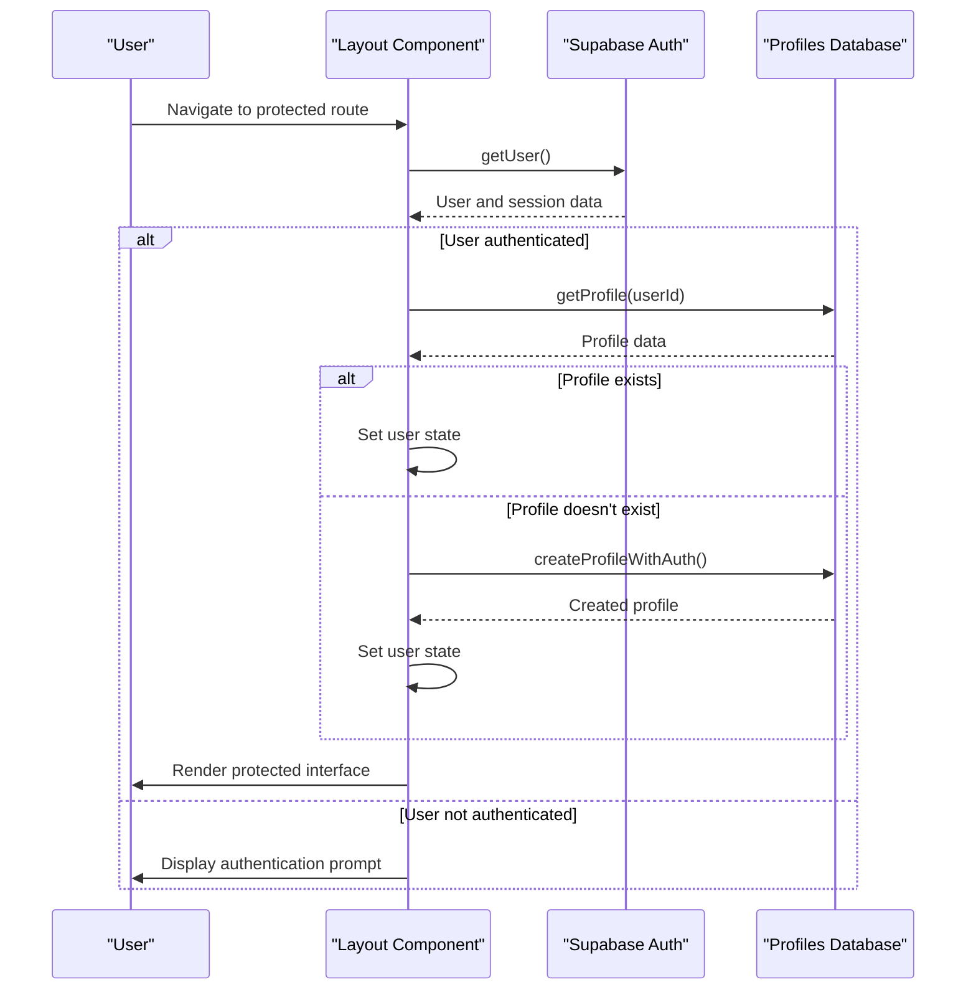
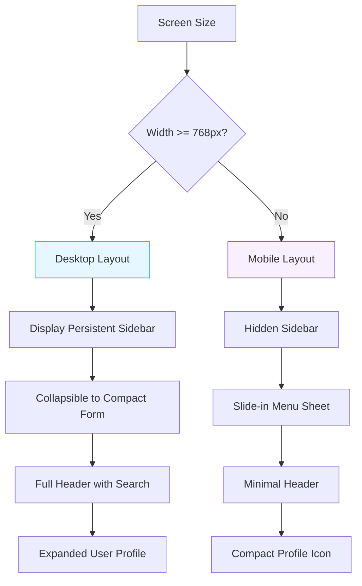
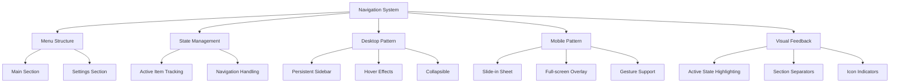
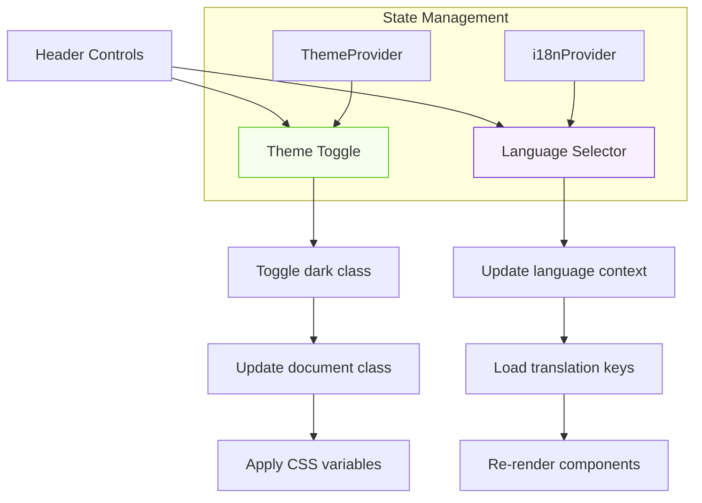
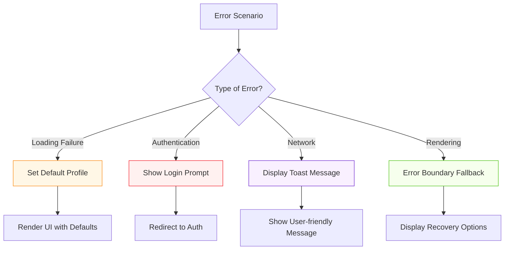
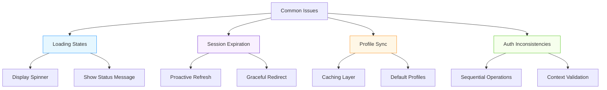

# Layout Components

<cite>
**Referenced Files in This Document**   
- [AdminLayout.tsx](file://src/components/AdminLayout.tsx)
- [UserLayout.tsx](file://src/components/UserLayout.tsx)
- [AdminSidebar.tsx](file://src/components/AdminSidebar.tsx)
- [ResponsiveAdminSidebar.tsx](file://src/components/ResponsiveAdminSidebar.tsx)
- [UserSidebar.tsx](file://src/components/UserSidebar.tsx)
- [Header.tsx](file://src/components/Header.tsx)
- [UserHeader.tsx](file://src/components/UserHeader.tsx)
- [profile-service.ts](file://src/lib/profile-service.ts)
- [user-auth-service.ts](file://src/lib/user-auth-service.ts)
- [admin-provider.tsx](file://src/providers/admin-provider.tsx)
- [i18n-provider.tsx](file://src/providers/i18n-provider.tsx)
- [theme-provider.tsx](file://src/providers/theme-provider.tsx)
</cite>

## Table of Contents
1. [Introduction](#introduction)
2. [AdminLayout Implementation](#adminlayout-implementation)
3. [UserLayout Implementation](#userlayout-implementation)
4. [Authentication State Management](#authentication-state-management)
5. [Responsive Behavior](#responsive-behavior)
6. [Navigation Patterns](#navigation-patterns)
7. [Theme and Language Functionality](#theme-and-language-functionality)
8. [Error Handling and Fallbacks](#error-handling-and-fallbacks)
9. [Common Issues and Solutions](#common-issues-and-solutions)
10. [Extending Layouts](#extending-layouts)

## Introduction
The lovable-rise application implements two primary layout components: AdminLayout and UserLayout. These wrapper components provide role-specific UI structures that adapt to different user types and device sizes. The AdminLayout is designed for administrative users with enhanced permissions and access to system management features, while the UserLayout caters to standard users with access to personal dashboard functionality and user-specific features. Both layouts incorporate robust authentication state management, responsive design principles, and consistent navigation patterns to ensure a seamless user experience across different contexts and devices.

## AdminLayout Implementation

The AdminLayout component serves as the primary wrapper for administrative interfaces in the lovable-rise application. It implements a comprehensive initialization process that handles user profile loading, authentication state verification, and error fallbacks. The component uses the AdminProvider context to manage administrative functionality and state across the application.

The layout initialization begins with a useEffect hook that loads the user profile from Supabase authentication and the profiles database table. It first checks for an active user session using supabase.auth.getUser(), then attempts to retrieve the complete user profile from the profiles table. If no profile exists, the system creates a default admin profile with appropriate role assignments.

The AdminLayout implements a loading state that displays a spinner and localized loading message while the user profile is being fetched. This prevents UI blocking during initialization and provides visual feedback to users. The component handles various error scenarios gracefully, setting default profile values when necessary to ensure the UI can render even if profile data cannot be retrieved.

The layout structure consists of a responsive sidebar and a main content area with a header. The sidebar collapses to a compact form on desktop views and transforms into a mobile sheet on smaller screens. The header includes navigation controls, theme toggling, language selection, and user profile access through a sheet component.

**Section sources**
- [AdminLayout.tsx](file://src/components/AdminLayout.tsx#L147-L250)
- [admin-provider.tsx](file://src/providers/admin-provider.tsx#L173-L986)
- [profile-service.ts](file://src/lib/profile-service.ts#L59-L814)

## UserLayout Implementation

The UserLayout component provides the structural framework for user-facing interfaces in the lovable-rise application. Similar to AdminLayout, it handles user profile loading and authentication state management, but with specific adaptations for standard user roles and permissions.

The UserLayout initialization process begins with a useEffect hook that calls the loadUserData function. This function first retrieves the current user session from Supabase authentication, then fetches the user's profile from the profiles table. The component distinguishes between the authentication user object and the application user profile, combining data from both sources to create a comprehensive user representation.

The UserLayout implements a loading state that displays a spinner while user data is being fetched. If authentication fails or user data cannot be loaded, the component displays an appropriate error message and authentication prompt. The layout uses the UserMenuProvider to manage navigation menu state, which loads menu items from the database and organizes them into sections.

The responsive design includes a mobile menu sheet that slides in from the left on smaller screens, and a collapsible sidebar on desktop views. The header contains navigation controls, theme toggling, language selection, and user profile access. The component also implements subscription validation to ensure users have active subscriptions before accessing certain features.

**Diagram sources **
- [UserLayout.tsx](file://src/components/UserLayout.tsx#L233-L331)
- [user-auth-service.ts](file://src/lib/user-auth-service.ts#L173-L986)
- [profile-service.ts](file://src/lib/profile-service.ts#L59-L814)

**Section sources**
- [UserLayout.tsx](file://src/components/UserLayout.tsx#L233-L331)
- [user-auth-service.ts](file://src/lib/user-auth-service.ts#L173-L986)

## Authentication State Management

Both AdminLayout and UserLayout implement robust authentication state management to ensure secure and reliable user sessions. The components use Supabase authentication in conjunction with application-level profile management to provide a comprehensive user identity system.

The authentication flow begins with checking for an active session using supabase.auth.getUser(). This Supabase method returns the current user object and session information if a valid authentication token exists. Both layouts use this information to determine whether the user is authenticated before proceeding with profile loading.

Profile loading is implemented through the ProfileService, which retrieves user profile data from the profiles database table. The service handles various error scenarios, including cases where profiles don't exist or database queries fail. When a profile is not found, the system creates a default profile with appropriate role assignments to ensure the UI can render.

The UserLayout includes additional subscription validation through the SubscriptionValidationService, which checks if the user's subscription has expired based on the end_date field. This service automatically deactivates expired subscriptions and prevents access to premium features.

Both layouts implement error boundaries and fallback states to handle authentication failures gracefully. When authentication issues occur, the components display appropriate error messages and navigation options rather than crashing or showing blank screens.

**Diagram sources **
- [profile-service.ts](file://src/lib/profile-service.ts#L59-L814)
- [user-auth-service.ts](file://src/lib/user-auth-service.ts#L173-L986)
- [subscription-validation-service.ts](file://src/lib/subscription-validation-service.ts#L1-L145)

**Section sources**
- [profile-service.ts](file://src/lib/profile-service.ts#L59-L814)
- [user-auth-service.ts](file://src/lib/user-auth-service.ts#L173-L986)
- [subscription-validation-service.ts](file://src/lib/subscription-validation-service.ts#L1-L145)

## Responsive Behavior

The layout components in lovable-rise implement responsive behavior to provide an optimal user experience across different device sizes. Both AdminLayout and UserLayout adapt their interface elements based on screen width, transforming navigation patterns and UI density accordingly.

On desktop views (width ≥ 768px), both layouts display a persistent sidebar that can be collapsed to a compact form. The sidebar provides quick access to navigation items and user information. When collapsed, the sidebar reduces its width and displays only icons, maximizing screen real estate for content.

On mobile views (width < 768px), the sidebar transforms into a sheet that slides in from the left when activated. This mobile menu preserves all navigation functionality while minimizing screen space usage. The transition between mobile and desktop behaviors is handled by the ResponsiveAdminSidebar component, which uses a useIsMobile hook to detect screen size.

The header components in both layouts also adapt to different screen sizes. On desktop, the header displays a search input and navigation elements. On mobile, these elements are minimized or hidden, with navigation accessed through a menu button. The user profile section collapses to a compact icon representation on smaller screens.

Both layouts use CSS classes and Tailwind utility classes to manage responsive behavior, including flexbox layouts, overflow handling, and position properties that adapt to different viewports.

**Diagram sources **
- [ResponsiveAdminSidebar.tsx](file://src/components/ResponsiveAdminSidebar.tsx#L17-L49)
- [AdminSidebar.tsx](file://src/components/AdminSidebar.tsx#L1-L180)
- [UserSidebar.tsx](file://src/components/UserSidebar.tsx#L1-L319)

**Section sources**
- [ResponsiveAdminSidebar.tsx](file://src/components/ResponsiveAdminSidebar.tsx#L17-L49)
- [AdminSidebar.tsx](file://src/components/AdminSidebar.tsx#L1-L180)
- [UserSidebar.tsx](file://src/components/UserSidebar.tsx#L1-L319)

## Navigation Patterns

The layout components implement consistent navigation patterns that provide intuitive access to application features. Both AdminLayout and UserLayout use hierarchical menu structures with primary and secondary navigation sections.

The AdminLayout organizes navigation into main and settings sections, with menu items grouped by functionality. The UserLayout follows a similar pattern with main navigation and a dedicated settings section. Both layouts use the MenuSection component to render these groupings with appropriate visual separators.

Navigation state is managed through context providers (AdminProvider and UserMenuProvider) that track the active menu item and handle navigation events. When a user clicks a menu item, the layout updates the active state and navigates to the corresponding route using React Router's navigate function.

The mobile navigation pattern uses a slide-in sheet that contains the complete menu structure. This ensures all navigation options remain accessible on smaller screens without cluttering the main interface. The sheet can be dismissed by clicking outside or using a close button.

Both layouts implement active state highlighting to indicate the current page or section. This visual feedback helps users understand their location within the application. The active state is determined by comparing the current route with menu item paths.

**Diagram sources **
- [AdminSidebar.tsx](file://src/components/AdminSidebar.tsx#L1-L180)
- [UserSidebar.tsx](file://src/components/UserSidebar.tsx#L1-L319)
- [nav-main.tsx](file://src/components/nav-main.tsx)
- [nav-secondary.tsx](file://src/components/nav-secondary.tsx)

**Section sources**
- [AdminSidebar.tsx](file://src/components/AdminSidebar.tsx#L1-L180)
- [UserSidebar.tsx](file://src/components/UserSidebar.tsx#L1-L319)

## Theme and Language Functionality

The layout components incorporate theme toggling and language switching functionality to enhance user customization and accessibility. These features are implemented consistently across both AdminLayout and UserLayout.

Theme toggling is handled through a button in the header that toggles the "dark" class on the document element. When clicked, the button switches between sun and moon icons to indicate the current theme state. The theme state is persisted through the application's theme provider, which uses Next.js themes under the hood.

Language switching is implemented through a dropdown menu in the header that allows users to select between available languages (English and Ukrainian). The selection updates the application's language context through the i18n-provider, which manages translation keys and localized content throughout the interface.

Both features use icons and visual indicators to communicate their current state. The theme toggle displays appropriate icons for light and dark modes, while the language selector shows country flags corresponding to the available language options. These visual cues help users quickly identify and change their preferences.

The implementation uses React context to propagate theme and language settings to all components, ensuring consistent behavior across the application. The context providers handle state management and re-rendering when settings change.

**Diagram sources **
- [Header.tsx](file://src/components/Header.tsx#L1-L96)
- [UserHeader.tsx](file://src/components/UserHeader.tsx#L1-L175)
- [i18n-provider.tsx](file://src/providers/i18n-provider.tsx#L976-L980)
- [theme-provider.tsx](file://src/providers/theme-provider.tsx#L1-L7)

**Section sources**
- [Header.tsx](file://src/components/Header.tsx#L1-L96)
- [UserHeader.tsx](file://src/components/UserHeader.tsx#L1-L175)
- [i18n-provider.tsx](file://src/providers/i18n-provider.tsx#L976-L980)
- [theme-provider.tsx](file://src/providers/theme-provider.tsx#L1-L7)

## Error Handling and Fallbacks

The layout components implement comprehensive error handling and fallback mechanisms to ensure reliability and user-friendly error recovery. Both AdminLayout and UserLayout include multiple layers of error protection to handle various failure scenarios.

During initialization, both layouts implement loading states that display spinners and localized messages while user data is being fetched. This prevents UI blocking and provides visual feedback during potentially slow operations. If profile loading fails, the components set default profile values to ensure the UI can render.

Authentication failures are handled gracefully by displaying appropriate error messages and navigation options rather than crashing. The UserLayout shows a clear "Authentication Required" message with instructions to log in, while the AdminLayout displays a localized loading message that persists until authentication is resolved.

The components use React error boundaries to catch and handle rendering errors that might occur in child components. These boundaries prevent the entire application from crashing due to isolated component failures and provide users with options to recover or navigate elsewhere.

Network errors and API failures are managed through try-catch blocks and error handling in service calls. The components log errors to the console for debugging while displaying user-friendly messages through the toast notification system. This approach separates technical details from user-facing communication.

**Diagram sources **
- [ErrorBoundary.tsx](file://src/components/ErrorBoundary.tsx#L1-L95)
- [NotFoundFallback.tsx](file://src/components/NotFoundFallback.tsx#L1-L80)
- [AdminLayout.tsx](file://src/components/AdminLayout.tsx#L147-L250)
- [UserLayout.tsx](file://src/components/UserLayout.tsx#L233-L331)

**Section sources**
- [ErrorBoundary.tsx](file://src/components/ErrorBoundary.tsx#L1-L95)
- [NotFoundFallback.tsx](file://src/components/NotFoundFallback.tsx#L1-L80)

## Common Issues and Solutions

The layout components address several common issues related to authentication, profile synchronization, and session management. Understanding these issues and their solutions is essential for maintaining a reliable user experience.

Loading states are managed through dedicated loading indicators that display during initialization. Both layouts show spinners and localized messages while user data is being fetched, preventing blank screens and providing feedback on application status. The loading state persists until profile data is successfully retrieved or default values are set.

Session expiration is handled through proactive monitoring and automatic refresh mechanisms. The application checks session validity and refreshes tokens before they expire, minimizing disruptions to the user experience. When sessions do expire, the layouts redirect users to appropriate authentication interfaces with clear messaging.

Profile synchronization issues are addressed through the ProfileService, which implements caching and fallback mechanisms. When profile data cannot be retrieved from the database, the service returns null rather than throwing errors, allowing the application to handle the absence gracefully. The service also creates default profiles when necessary to ensure consistent user representation.

Authentication state inconsistencies are prevented through careful sequencing of authentication and profile loading operations. The layouts first verify the authentication session before attempting to load profile data, ensuring that operations are performed with the correct user context.

**Diagram sources **
- [session-validation.ts](file://src/lib/session-validation.ts#L1-L398)
- [profile-service.ts](file://src/lib/profile-service.ts#L59-L814)
- [user-auth-service.ts](file://src/lib/user-auth-service.ts#L173-L986)

**Section sources**
- [session-validation.ts](file://src/lib/session-validation.ts#L1-L398)
- [profile-service.ts](file://src/lib/profile-service.ts#L59-L814)
- [user-auth-service.ts](file://src/lib/user-auth-service.ts#L173-L986)

## Extending Layouts

The layout components are designed to be extensible, allowing developers to add new navigation items and integrate additional context providers. The modular architecture supports customization while maintaining consistency across the application.

To extend navigation, developers can add new menu items through the database or by modifying the static routes configuration. The AdminLayout and UserLayout components automatically incorporate new items into their navigation structures, with appropriate section grouping and active state management.

Additional context providers can be integrated by wrapping the layout content with new provider components. The existing provider pattern (AdminProvider and UserMenuProvider) serves as a model for implementing custom state management. Providers should follow the same principles of centralized state, clear interfaces, and proper cleanup.

Custom styling can be applied through CSS variables and Tailwind classes, allowing for theme customization without modifying component logic. The layouts use semantic class names and consistent styling patterns to facilitate visual modifications.

New functionality can be added through component composition, where specialized components are inserted into designated areas of the layout. The header, sidebar, and content areas all support extension points for additional UI elements and interactive features.

**Section sources**
- [AdminLayout.tsx](file://src/components/AdminLayout.tsx#L147-L250)
- [UserLayout.tsx](file://src/components/UserLayout.tsx#L233-L331)
- [admin-provider.tsx](file://src/providers/admin-provider.tsx#L173-L986)
- [i18n-provider.tsx](file://src/providers/i18n-provider.tsx#L976-L980)