# UI Components Library

<cite>
**Referenced Files in This Document**   
- [button.tsx](file://src/components/ui/button.tsx)
- [input.tsx](file://src/components/ui/input.tsx)
- [form.tsx](file://src/components/ui/form.tsx)
- [dialog.tsx](file://src/components/ui/dialog.tsx)
- [table.tsx](file://src/components/ui/table.tsx)
- [card.tsx](file://src/components/ui/card.tsx)
- [sheet.tsx](file://src/components/ui/sheet.tsx)
- [dropdown-menu.tsx](file://src/components/ui/dropdown-menu.tsx)
- [navigation-menu.tsx](file://src/components/ui/navigation-menu.tsx)
- [tailwind.config.ts](file://tailwind.config.ts)
- [utils.ts](file://src/lib/utils.ts)
- [FormPage.tsx](file://src/pages/page-types/FormPage.tsx)
</cite>

## Table of Contents
1. [Introduction](#introduction)
2. [Core Components](#core-components)
3. [Component Variants and Props](#component-variants-and-props)
4. [Form System Implementation](#form-system-implementation)
5. [Accessibility and Keyboard Navigation](#accessibility-and-keyboard-navigation)
6. [Styling and Tailwind Integration](#styling-and-tailwind-integration)
7. [Usage Patterns and Examples](#usage-patterns-and-examples)
8. [Component Architecture](#component-architecture)
9. [Guidelines for New Components](#guidelines-for-new-components)

## Introduction
The UI Components Library in the lovable-rise application provides a comprehensive set of reusable, accessible, and styled building blocks based on Radix UI primitives. These components follow a consistent design system and are enhanced with Tailwind CSS for styling. The library ensures accessibility compliance, proper keyboard navigation, and ARIA attribute implementation across all interactive elements. Components are designed to be composable and extensible, allowing for consistent user experiences throughout the application.

## Core Components

This section details the key UI components available in the library, their implementation patterns, and core functionality.

### Button Component
The Button component is a versatile primitive that supports multiple variants and sizes. It uses class-variance-authority (cva) to define variant styles and integrates with the application's design tokens through CSS variables.

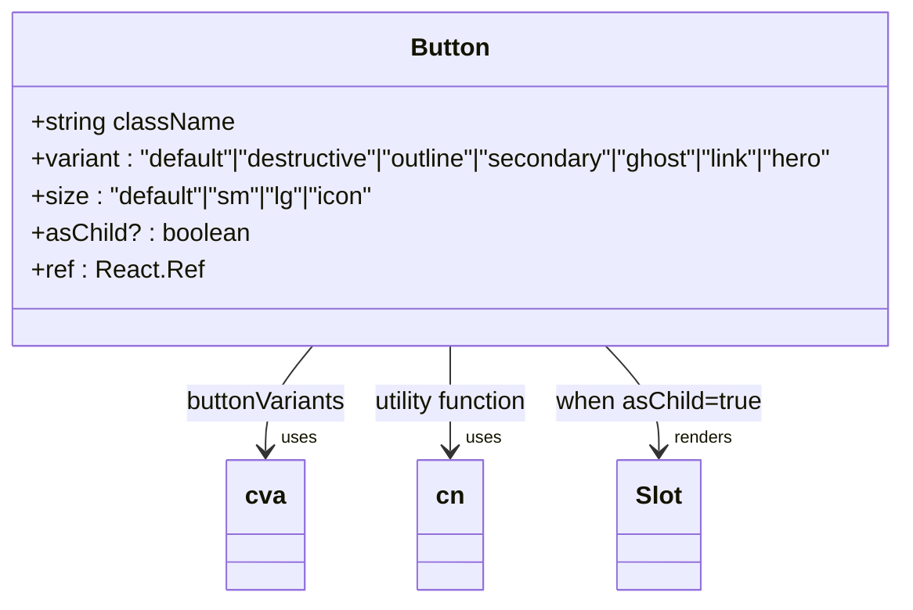

**Diagram sources**
- [button.tsx](file://src/components/ui/button.tsx#L10-L28)

**Section sources**
- [button.tsx](file://src/components/ui/button.tsx#L1-L59)

### Input Component
The Input component provides a styled text input field with consistent styling across the application. It handles basic input attributes and integrates with the form system for validation and error states.

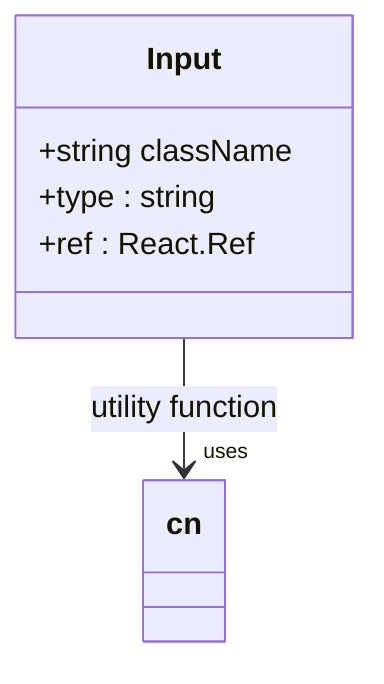

**Diagram sources**
- [input.tsx](file://src/components/ui/input.tsx#L1-L23)

**Section sources**
- [input.tsx](file://src/components/ui/input.tsx#L1-L23)

### Form Components
The form system consists of multiple components that work together to create accessible and validated forms. The implementation leverages react-hook-form for state management and validation.

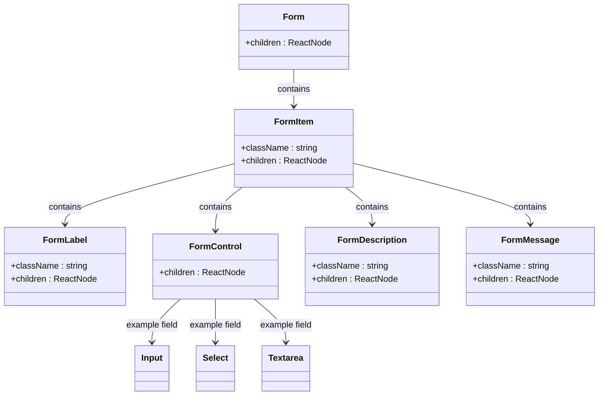

**Diagram sources**
- [form.tsx](file://src/components/ui/form.tsx#L1-L177)

**Section sources**
- [form.tsx](file://src/components/ui/form.tsx#L1-L177)

### Dialog and Sheet Components
The Dialog and Sheet components provide modal interfaces with proper accessibility features. Both components use Radix UI's primitives for state management and focus trapping.

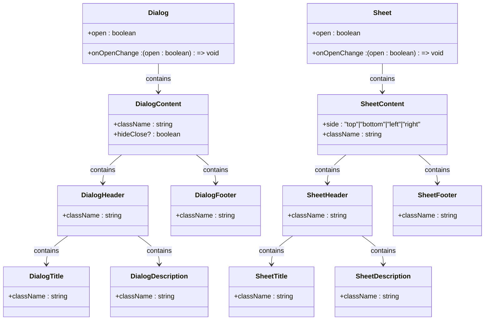

**Diagram sources**
- [dialog.tsx](file://src/components/ui/dialog.tsx#L1-L125)
- [sheet.tsx](file://src/components/ui/sheet.tsx#L1-L140)

**Section sources**
- [dialog.tsx](file://src/components/ui/dialog.tsx#L1-L125)
- [sheet.tsx](file://src/components/ui/sheet.tsx#L1-L140)

### Table Component
The Table component provides a styled data table with consistent formatting and accessibility features. It uses a composable approach with multiple sub-components for different table sections.

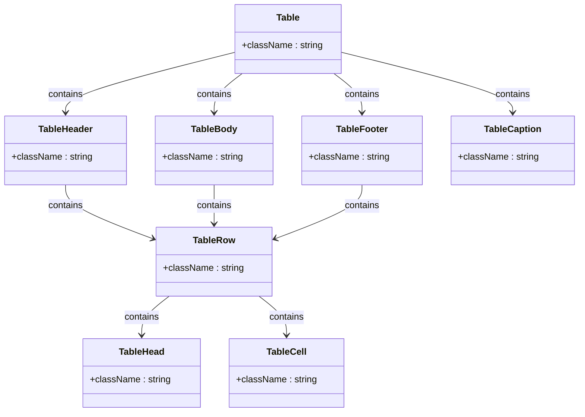

**Diagram sources**
- [table.tsx](file://src/components/ui/table.tsx#L1-L121)

**Section sources**
- [table.tsx](file://src/components/ui/table.tsx#L1-L121)

### Card Component
The Card component provides a container for grouping related content with a consistent visual style. It includes sub-components for structured content layout.

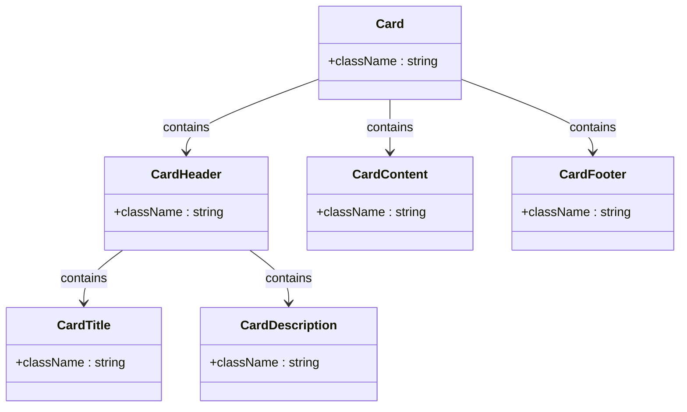

**Diagram sources**
- [card.tsx](file://src/components/ui/card.tsx#L1-L77)

**Section sources**
- [card.tsx](file://src/components/ui/card.tsx#L1-L77)

### DropdownMenu Component
The DropdownMenu component provides a context menu or dropdown interface with nested submenu support. It implements proper keyboard navigation and accessibility patterns.

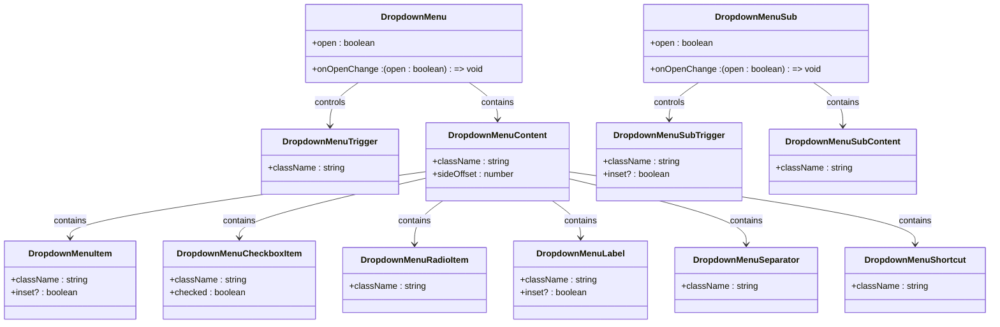

**Diagram sources**
- [dropdown-menu.tsx](file://src/components/ui/dropdown-menu.tsx#L1-L199)

**Section sources**
- [dropdown-menu.tsx](file://src/components/ui/dropdown-menu.tsx#L1-L199)

### NavigationMenu Component
The NavigationMenu component provides a horizontal navigation bar with dropdown support. It implements the WAI-ARIA menubar pattern for accessibility.

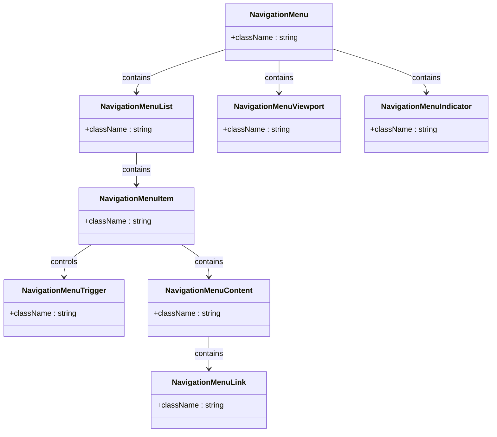

**Diagram sources**
- [navigation-menu.tsx](file://src/components/ui/navigation-menu.tsx#L1-L129)

**Section sources**
- [navigation-menu.tsx](file://src/components/ui/navigation-menu.tsx#L1-L129)

## Component Variants and Props

### Button Variants
The Button component supports multiple visual variants to accommodate different use cases:

- **default**: Primary action with background color
- **destructive**: For actions that delete or remove data
- **outline**: Border-only style for secondary actions
- **secondary**: Alternative primary action style
- **ghost**: Minimal style for tertiary actions
- **link**: Text-only style that resembles a hyperlink
- **hero**: Special style for prominent calls to action

Button sizes include:
- **default**: Standard size
- **sm**: Small size for compact spaces
- **lg**: Large size for emphasis
- **icon**: Square size optimized for icon-only buttons

The `asChild` prop allows the Button to render as a different component (using Radix UI's Slot) while maintaining button styling and behavior.

**Section sources**
- [button.tsx](file://src/components/ui/button.tsx#L10-L28)

## Form System Implementation

The form system implements a structured approach to form creation with proper accessibility and validation. The components work together to provide:

- Automatic association of labels with form controls via generated IDs
- Error state management with visual feedback
- Descriptive text for additional context
- Message display for validation errors or success states
- Proper ARIA attributes for screen readers

The Form component serves as a provider for form state, while FormItem groups related elements. FormControl wraps the actual input component and manages accessibility attributes like aria-invalid and aria-describedby.

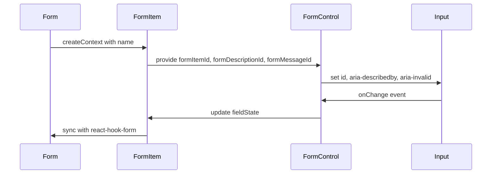

**Diagram sources**
- [form.tsx](file://src/components/ui/form.tsx#L1-L177)

**Section sources**
- [form.tsx](file://src/components/ui/form.tsx#L1-L177)

## Accessibility and Keyboard Navigation

All components in the library implement comprehensive accessibility features:

### Keyboard Navigation Support
- **Button**: Fully keyboard accessible with Enter/Space activation
- **Dialog**: Focus trapping, ESC to close, keyboard navigation between controls
- **DropdownMenu**: Arrow key navigation, ESC to close, keyboard activation
- **NavigationMenu**: Full menubar keyboard navigation pattern
- **Table**: Proper semantic structure with header associations
- **Form**: Logical tab order, label associations, error announcements

### ARIA Attributes Implementation
Components automatically apply appropriate ARIA attributes:
- aria-label and aria-labelledby for labeling
- aria-describedby for additional context
- aria-invalid for error states
- aria-disabled for disabled states
- role attributes for semantic meaning
- aria-expanded for collapsible elements
- aria-haspopup for menus and dialogs

### Screen Reader Support
All interactive elements provide proper announcements and context for screen reader users, including:
- Form validation error messages
- Dialog open/close announcements
- Menu item availability
- Loading states
- Success/error feedback

**Section sources**
- [button.tsx](file://src/components/ui/button.tsx)
- [dialog.tsx](file://src/components/ui/dialog.tsx)
- [dropdown-menu.tsx](file://src/components/ui/dropdown-menu.tsx)
- [navigation-menu.tsx](file://src/components/ui/navigation-menu.tsx)
- [form.tsx](file://src/components/ui/form.tsx)

## Styling and Tailwind Integration

### Design Tokens and CSS Variables
The component library uses CSS variables to define design tokens, allowing for theme customization. These variables are referenced in the Tailwind configuration:

```typescript
// tailwind.config.ts
colors: {
  primary: {
    DEFAULT: 'hsl(var(--primary))',
    foreground: 'hsl(var(--primary-foreground))'
  },
  background: 'hsl(var(--background))',
  foreground: 'hsl(var(--foreground))'
}
```

### Utility-First Approach
Components use Tailwind's utility classes for styling, with the `cn` utility function for conditional class composition:

```typescript
// utils.ts
export function cn(...inputs: ClassValue[]) {
  return twMerge(clsx(inputs))
}
```

This function combines class names from multiple sources, handling conditional classes and preventing duplication.

### Responsive Design
All components support responsive design patterns through Tailwind's breakpoint system. The configuration includes custom breakpoints:

```typescript
screens: {
  xs: '475px',
  ...defaultTheme.screens
}
```

### Animation System
The library implements a consistent animation system using Tailwind's animation utilities:

```typescript
animation: {
  'accordion-down': 'accordion-down 0.2s ease-out',
  'accordion-up': 'accordion-up 0.2s ease-out',
  'fade-slide-up': 'fade-slide-up 0.6s ease-out'
}
```

These animations are applied to components like Dialog, Sheet, and DropdownMenu for smooth transitions.

**Diagram sources**
- [tailwind.config.ts](file://tailwind.config.ts#L1-L148)
- [utils.ts](file://src/lib/utils.ts#L1-L7)

**Section sources**
- [tailwind.config.ts](file://tailwind.config.ts#L1-L148)
- [utils.ts](file://src/lib/utils.ts#L1-L7)

## Usage Patterns and Examples

### Form Implementation Pattern
The library provides a structured approach to form creation, as demonstrated in the FormPage component:

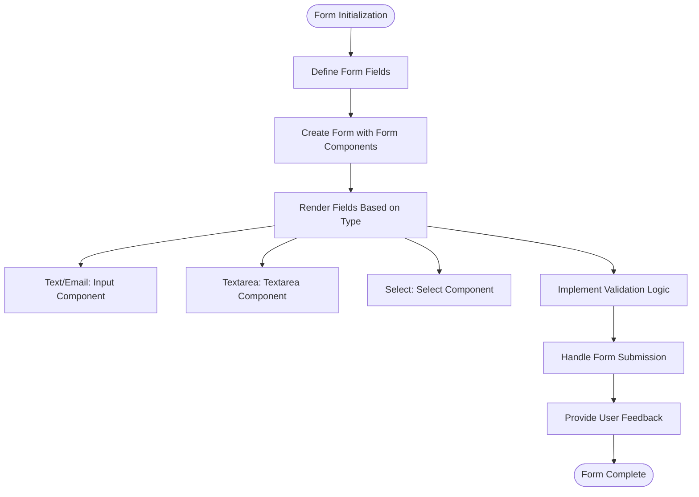

**Section sources**
- [FormPage.tsx](file://src/pages/page-types/FormPage.tsx#L26-L132)

### Data Display Pattern
Components are designed to work together for data display:

- **Card** containers group related information
- **Table** components display structured data
- **Badge** elements highlight status or categories
- **Avatar** components show user or entity images
- **Skeleton** components provide loading states

### Interactive Element Pattern
Interactive components follow consistent patterns:

- **Dialog/Sheet** for modal interfaces
- **DropdownMenu** for context menus and actions
- **NavigationMenu** for primary navigation
- **Button** variants for different action types
- **Form** components for data input

## Component Architecture

The component library follows a consistent architectural pattern:

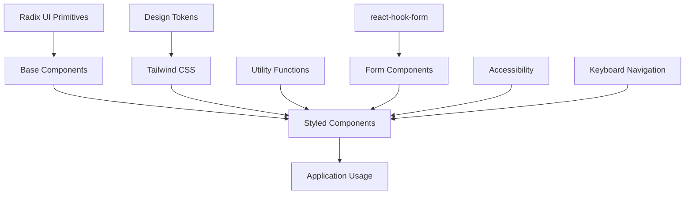

Base components wrap Radix UI primitives with application-specific styling and behavior. Styled components extend base components with variant support and additional features. The architecture ensures consistency while allowing for flexibility.

**Section sources**
- [button.tsx](file://src/components/ui/button.tsx)
- [form.tsx](file://src/components/ui/form.tsx)
- [tailwind.config.ts](file://tailwind.config.ts)

## Guidelines for New Components

When creating new components for the library, follow these guidelines:

### Consistent Structure
New components should follow the established pattern:
- Use React.forwardRef for ref forwarding
- Support className for customization
- Use the cn utility for class composition
- Implement displayName for debugging
- Follow the same file naming convention

### Accessibility Requirements
All components must:
- Support keyboard navigation
- Implement appropriate ARIA attributes
- Provide screen reader support
- Maintain focus management
- Support high contrast modes

### Styling Approach
- Use Tailwind utility classes for styling
- Leverage CSS variables for theme customization
- Use cva for variant definitions when applicable
- Avoid inline styles
- Support responsive design

### Documentation
Each component should include:
- JSDoc comments for props
- Example usage in documentation
- Accessibility notes
- Keyboard interaction details
- Variant descriptions

### Testing
New components should have:
- Unit tests for functionality
- Accessibility audits
- Visual regression tests
- Cross-browser testing
- Responsive behavior verification

**Section sources**
- [button.tsx](file://src/components/ui/button.tsx)
- [input.tsx](file://src/components/ui/input.tsx)
- [form.tsx](file://src/components/ui/form.tsx)
- [tailwind.config.ts](file://tailwind.config.ts)
- [utils.ts](file://src/lib/utils.ts)