# Frontend Architecture

<cite>
**Referenced Files in This Document**   
- [App.tsx](file://src/App.tsx)
- [AdminLayout.tsx](file://src/components/AdminLayout.tsx)
- [UserLayout.tsx](file://src/components/UserLayout.tsx)
- [ProtectedRoutes.tsx](file://src/components/ProtectedRoutes.tsx)
- [admin-provider.tsx](file://src/providers/admin-provider.tsx)
- [i18n-provider.tsx](file://src/providers/i18n-provider.tsx)
- [theme-provider.tsx](file://src/providers/theme-provider.tsx)
- [useUserRole.ts](file://src/hooks/useUserRole.ts)
</cite>

## Table of Contents
1. [Introduction](#introduction)
2. [Component-Based Architecture](#component-based-architecture)
3. [Layout Components](#layout-components)
4. [State Management](#state-management)
5. [Routing Structure](#routing-structure)
6. [Data Flow](#data-flow)
7. [Cross-Cutting Concerns](#cross-cutting-concerns)
8. [System Context Diagram](#system-context-diagram)

## Introduction
The lovable-rise application implements a modern React frontend architecture with a component-based design and service layer pattern. The architecture is built around two primary layout components (AdminLayout and UserLayout) that wrap page content and provide consistent user interface elements. State management is handled through React context providers and custom hooks, while routing is implemented using React Router. The application integrates with Supabase for data persistence and authentication, with a clear data flow from components through hooks to service classes and the Supabase backend.

**Section sources**
- [App.tsx](file://src/App.tsx#L1-L124)

## Component-Based Architecture
The application follows a component-based architecture with a clear separation of concerns. Components are organized in the src/components directory with subdirectories for different component types. The architecture includes UI components in the ui subdirectory, which contain reusable elements like buttons, forms, and navigation elements. Domain-specific components are organized in directories like admin, user, and store-templates, grouping related functionality together.

The component tree structure is hierarchical, with layout components wrapping page content and providing consistent navigation and header elements. Pages are organized in the src/pages directory with subdirectories for admin and user routes, maintaining a clear separation between administrative and user-facing functionality.

**Section sources**
- [App.tsx](file://src/App.tsx#L1-L124)
- [AdminLayout.tsx](file://src/components/AdminLayout.tsx#L1-L250)
- [UserLayout.tsx](file://src/components/UserLayout.tsx#L1-L643)

## Layout Components
The application utilizes two primary layout components: AdminLayout and UserLayout. These components wrap page content and provide consistent navigation, headers, and structural elements across different sections of the application.

### AdminLayout
The AdminLayout component provides the structural framework for administrative pages. It includes a responsive sidebar, header with navigation controls, and content workspace. The layout handles user profile loading and authentication state, ensuring that administrative functionality is only accessible to authorized users.

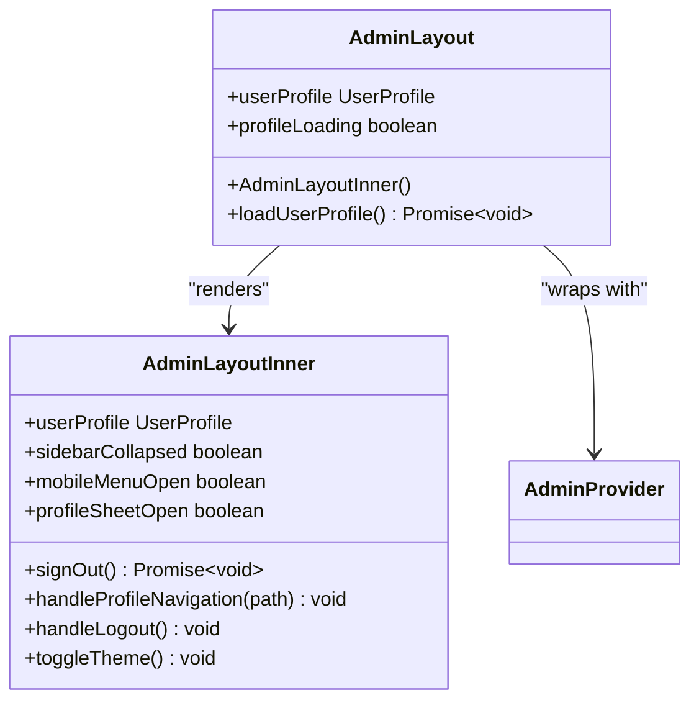

**Diagram sources**
- [AdminLayout.tsx](file://src/components/AdminLayout.tsx#L147-L250)

### UserLayout
The UserLayout component provides the structural framework for user-facing pages. It includes a responsive sidebar, header with navigation controls, and content area. The layout handles user authentication and profile loading, ensuring that user functionality is properly secured.

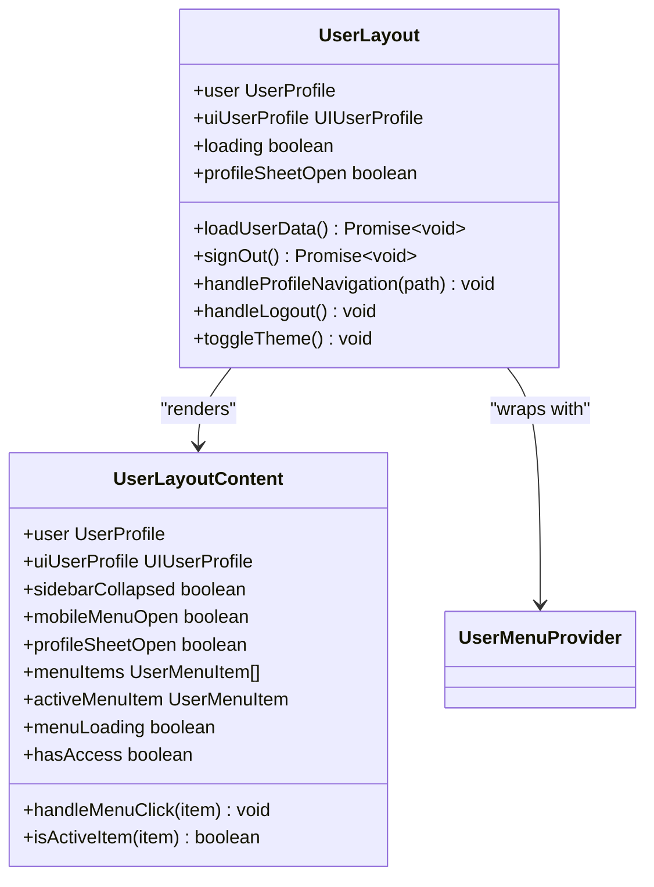

**Diagram sources**
- [UserLayout.tsx](file://src/components/UserLayout.tsx#L233-L331)

## State Management
The application implements state management using React context providers and custom hooks. This approach provides a clean separation between state logic and UI components, making the codebase more maintainable and testable.

### Admin Context
The AdminProvider component manages state for the administrative interface, including menu items, active menu selection, and content loading states. It uses React context to make this state available to all components within the admin section.

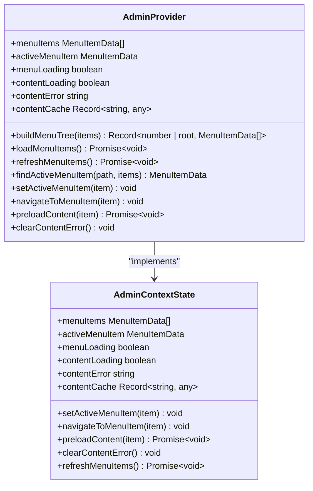

**Diagram sources**
- [admin-provider.tsx](file://src/providers/admin-provider.tsx#L215-L256)

### Custom Hooks
Custom hooks provide a way to encapsulate and reuse stateful logic across components. The useUserRole hook is a key example, retrieving the current user's role from Supabase and managing loading states.

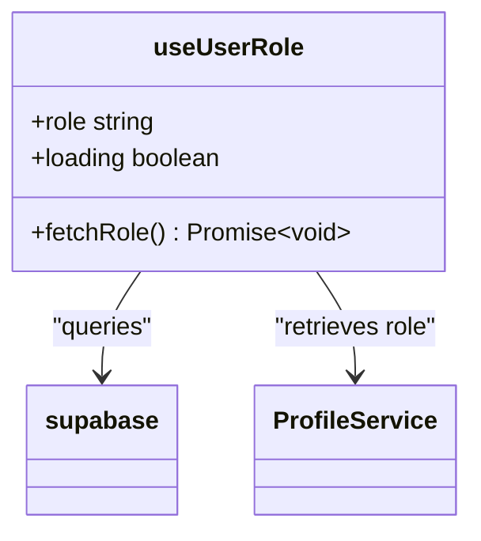

**Diagram sources**
- [useUserRole.ts](file://src/hooks/useUserRole.ts#L1-L34)

## Routing Structure
The application implements routing using React Router, with a clear structure that separates administrative and user-facing functionality. The routing configuration is defined in the App component, which sets up the main routes and their associated layouts.

### Route Configuration
The application defines several types of routes:
- Public routes accessible to all users (e.g., login, registration)
- Admin routes protected by the AdminRoute component
- User routes protected by the UserRoute component
- Catch-all route for handling invalid paths

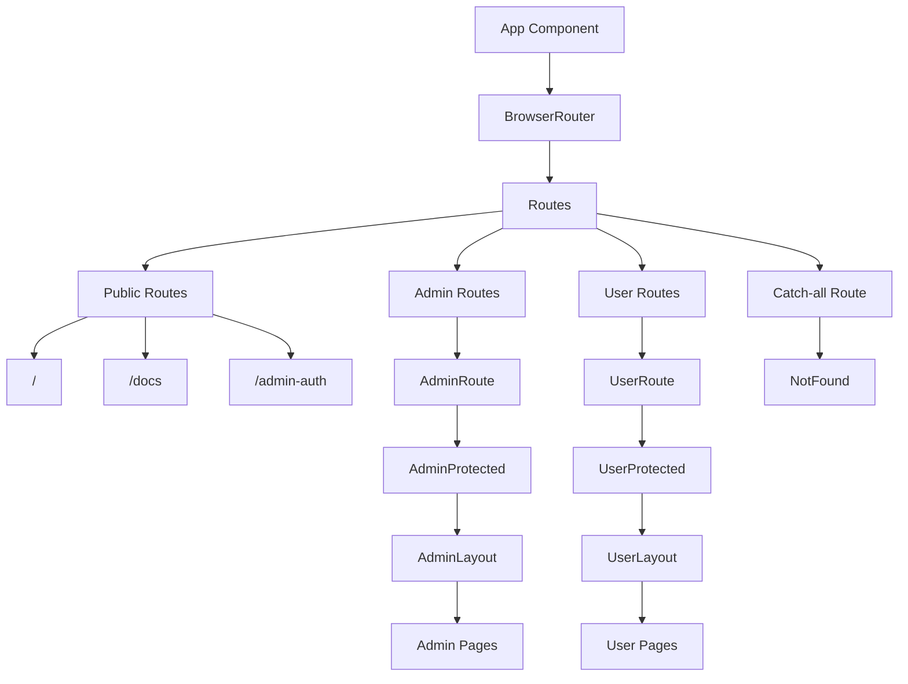

**Diagram sources**
- [App.tsx](file://src/App.tsx#L1-L124)

### Protected Routes
The application implements role-based access control through ProtectedRoutes components. The AdminRoute and UserRoute components check the user's role and redirect unauthorized users to appropriate sections.

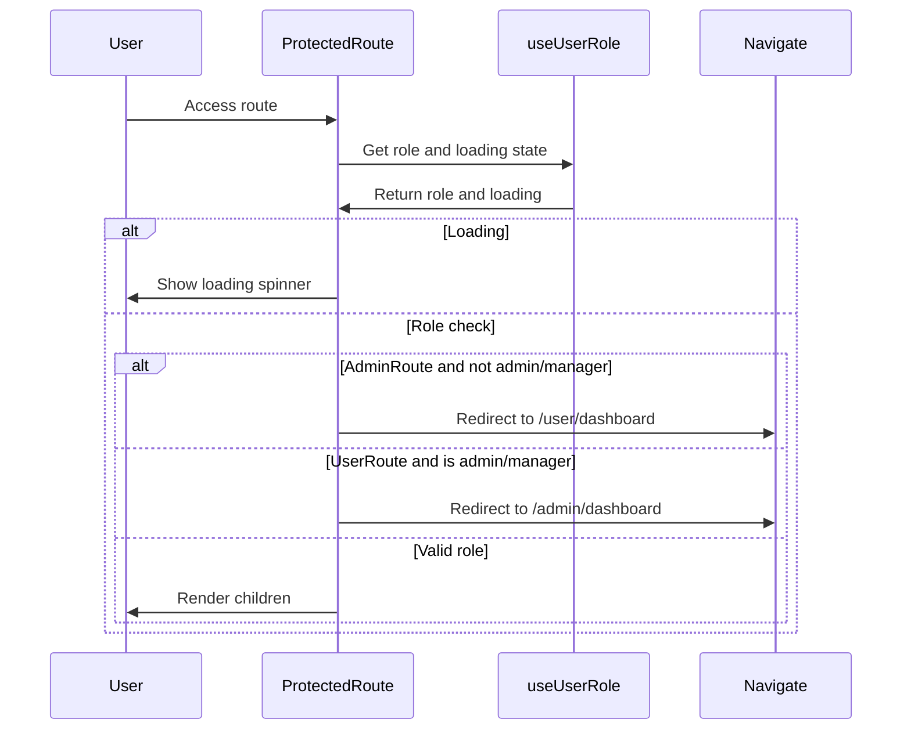

**Diagram sources**
- [ProtectedRoutes.tsx](file://src/components/ProtectedRoutes.tsx#L1-L44)

## Data Flow
The application follows a clear data flow pattern from components through hooks to service classes and Supabase. This unidirectional data flow ensures predictability and makes debugging easier.

### Service Layer Pattern
Service classes encapsulate business logic and data access, providing a clean interface between React components and the Supabase backend. These services handle data retrieval, transformation, and error handling.

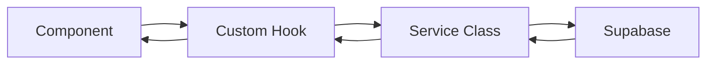

### Data Flow Example
The user profile loading process demonstrates the data flow pattern. When a user accesses the admin dashboard, the AdminLayout component calls the ProfileService to retrieve the user's profile data from Supabase.

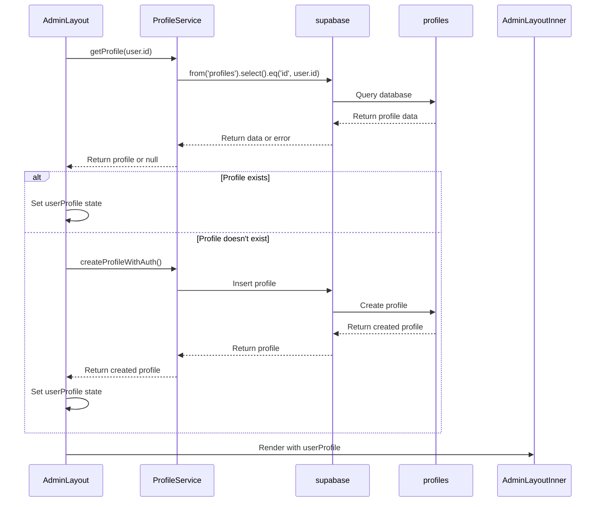

**Diagram sources**
- [AdminLayout.tsx](file://src/components/AdminLayout.tsx#L147-L250)
- [profile-service.ts](file://src/lib/profile-service.ts#L1-L799)

## Cross-Cutting Concerns
The application addresses several cross-cutting concerns through dedicated providers and components.

### Theming
Theming is implemented using the ThemeProvider component, which wraps the application and provides theme context to all components. This allows for easy theme switching between light and dark modes.

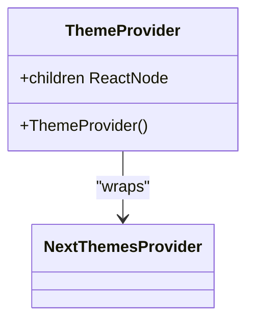

**Diagram sources**
- [theme-provider.tsx](file://src/providers/theme-provider.tsx#L5-L7)

### Internationalization
Internationalization is handled by the I18nProvider component, which provides translation functions and language state to all components. The provider includes a dictionary of translations for different languages.

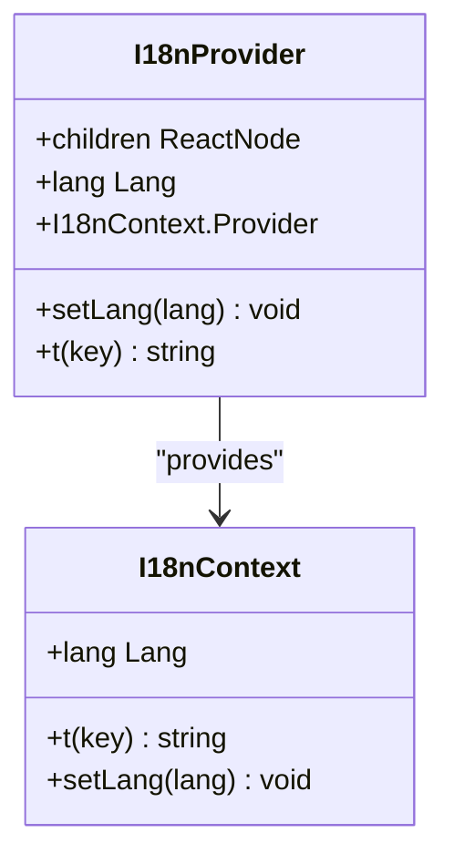

**Diagram sources**
- [i18n-provider.tsx](file://src/providers/i18n-provider.tsx#L953-L974)

## System Context Diagram
The following diagram illustrates the overall system context, showing the relationships between major components and external services.

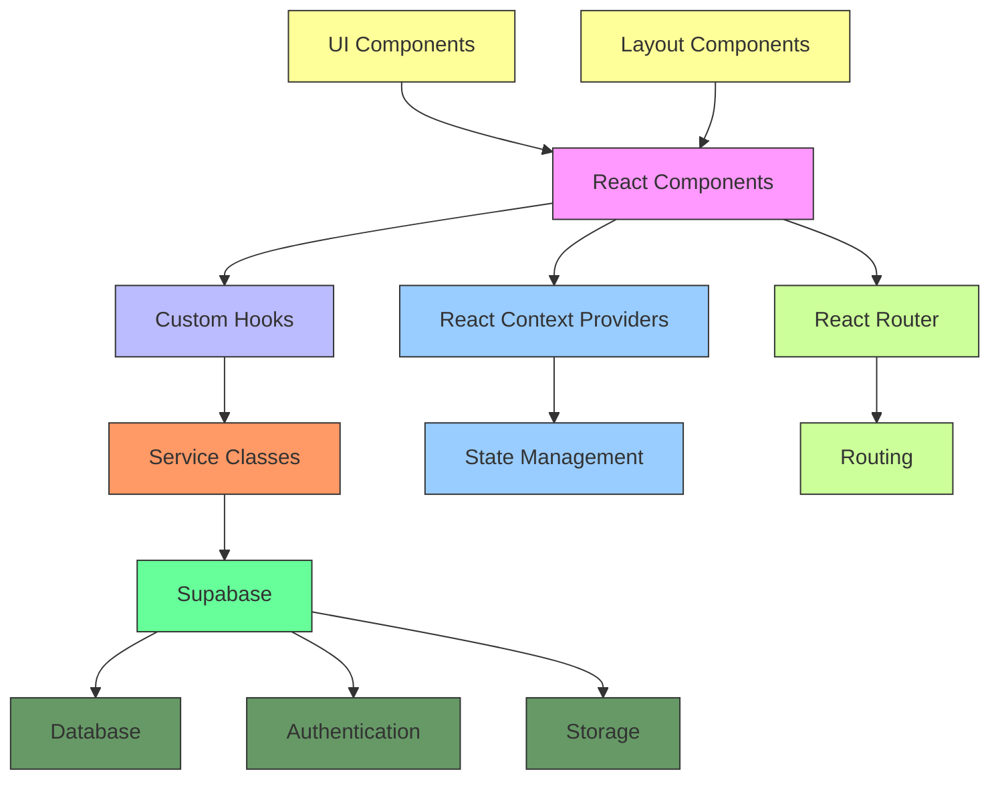

**Diagram sources**
- [App.tsx](file://src/App.tsx#L1-L124)
- [AdminLayout.tsx](file://src/components/AdminLayout.tsx#L1-L250)
- [UserLayout.tsx](file://src/components/UserLayout.tsx#L1-L643)
- [admin-provider.tsx](file://src/providers/admin-provider.tsx#L1-L422)
- [i18n-provider.tsx](file://src/providers/i18n-provider.tsx#L1-L799)
- [theme-provider.tsx](file://src/providers/theme-provider.tsx#L1-L7)
- [useUserRole.ts](file://src/hooks/useUserRole.ts#L1-L34)