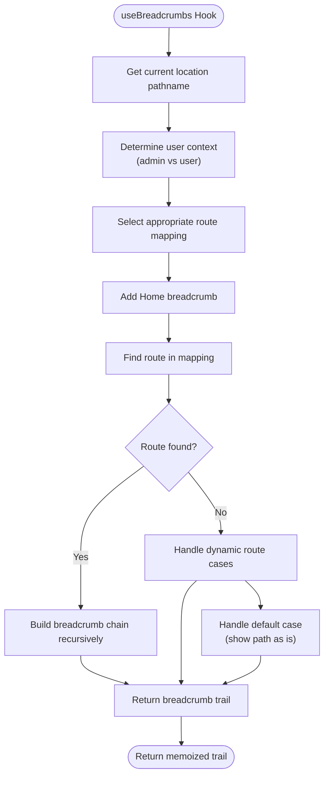
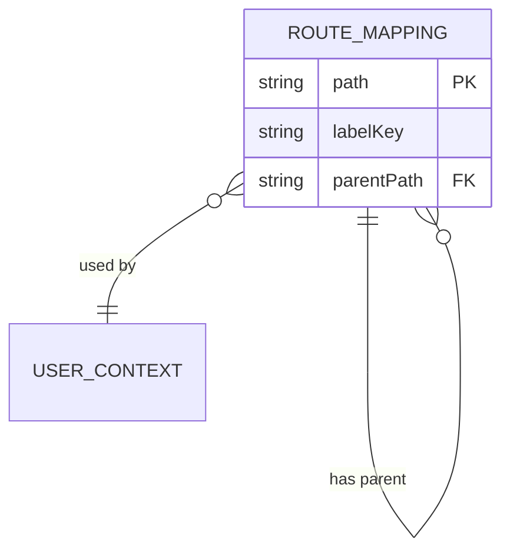
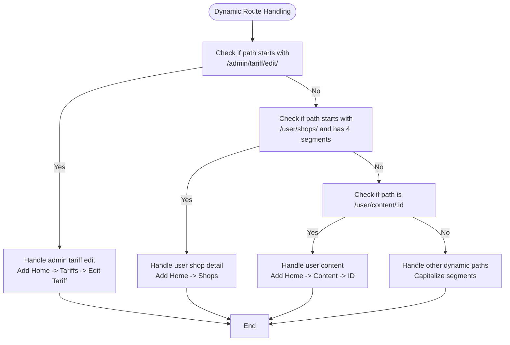
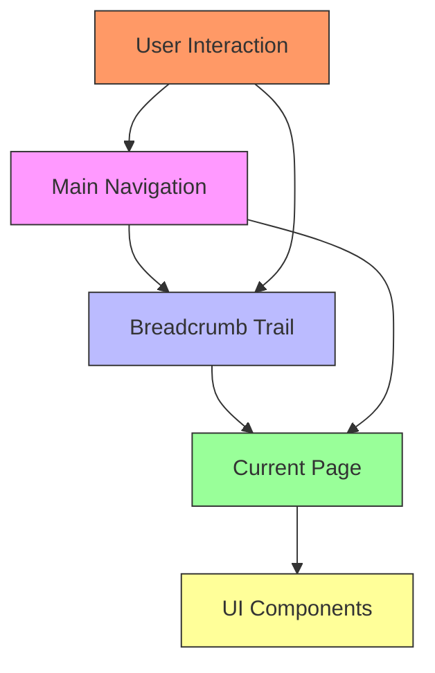

# Navigation Patterns

<cite>
**Referenced Files in This Document**   
- [useBreadcrumbs.ts](file://src/hooks/useBreadcrumbs.ts)
- [breadcrumb.tsx](file://src/components/ui/breadcrumb.tsx)
- [nav-main.tsx](file://src/components/nav-main.tsx)
- [nav-user.tsx](file://src/components/nav-user.tsx)
- [i18n-provider.tsx](file://src/providers/i18n-provider.tsx)
</cite>

## Table of Contents
1. [Introduction](#introduction)
2. [Breadcrumb System Overview](#breadcrumb-system-overview)
3. [Hook Implementation and Route Parsing](#hook-implementation-and-route-parsing)
4. [User Context Determination](#user-context-determination)
5. [Route Mapping Structure](#route-mapping-structure)
6. [Dynamic Route Handling](#dynamic-route-handling)
7. [Internationalization in Breadcrumbs](#internationalization-in-breadcrumbs)
8. [Integration with Navigation Menus](#integration-with-navigation-menus)
9. [Extending the Breadcrumb System](#extending-the-breadcrumb-system)
10. [Troubleshooting Display Issues](#troubleshooting-display-issues)
11. [Performance Considerations](#performance-considerations)

## Introduction
The lovable-rise application implements a sophisticated navigation system centered around a breadcrumb trail that provides users with clear context about their current location within the application hierarchy. This documentation details the implementation of the `useBreadcrumbs` hook, which dynamically generates breadcrumb trails based on the current route, user context, and predefined route mappings. The system integrates seamlessly with the main navigation menus and supports internationalization, dynamic routes, and performance optimization through memoization.

## Breadcrumb System Overview
The breadcrumb system in lovable-rise provides a hierarchical navigation trail that helps users understand their current location and navigate back to previous sections. The system is implemented through the `useBreadcrumbs` hook, which analyzes the current route and constructs an appropriate breadcrumb trail. The breadcrumbs are displayed using the `Breadcrumb` component from the UI library, which renders the trail as a series of linked items separated by chevron indicators.

The breadcrumb trail always begins with a "Home" link that points to the appropriate dashboard based on the user context (admin or user). Subsequent items in the trail represent the hierarchical path to the current page, with the current page marked as the active item. The system supports both static routes defined in route mappings and dynamic routes that are handled with special logic.

**Section sources**
- [useBreadcrumbs.ts](file://src/hooks/useBreadcrumbs.ts#L42-L169)
- [breadcrumb.tsx](file://src/components/ui/breadcrumb.tsx#L6-L10)

## Hook Implementation and Route Parsing
The `useBreadcrumbs` hook is implemented using React's `useMemo` hook to ensure that the breadcrumb trail is only recalculated when necessary. The hook uses `useLocation` from react-router-dom to access the current pathname and `useI18n` to access the translation function.

The hook begins by determining whether the current path is a user path (starting with "/user") or an admin path. Based on this determination, it selects the appropriate route mapping (USER_ROUTE_MAPPING or ADMIN_ROUTE_MAPPING). The hook then initializes the breadcrumb trail with the "Home" item, which links to the appropriate dashboard.



**Diagram sources**
- [useBreadcrumbs.ts](file://src/hooks/useBreadcrumbs.ts#L42-L169)

**Section sources**
- [useBreadcrumbs.ts](file://src/hooks/useBreadcrumbs.ts#L42-L169)

## User Context Determination
The `useBreadcrumbs` hook determines the user context by checking if the current pathname starts with "/user". This simple but effective approach allows the system to distinguish between user and admin interfaces, which have different route structures and navigation requirements.

When a user path is detected, the hook uses the USER_ROUTE_MAPPING to determine breadcrumb labels and parent paths. For admin paths, it uses the ADMIN_ROUTE_MAPPING. This context determination also affects the destination of the "Home" breadcrumb, which links to "/user/dashboard" for user paths and "/admin/dashboard" for admin paths.

The context determination is performed at the beginning of the hook's execution and influences all subsequent processing, including route mapping selection, breadcrumb construction, and internationalization key selection.

**Section sources**
- [useBreadcrumbs.ts](file://src/hooks/useBreadcrumbs.ts#L45-L46)

## Route Mapping Structure
The breadcrumb system uses two predefined route mappings: USER_ROUTE_MAPPING and ADMIN_ROUTE_MAPPING. These mappings are objects that define the breadcrumb label key and parent path for each route. The label key is used to retrieve the appropriate translated label through the i18n system.

The route mappings are structured hierarchically, with each route potentially having a parentPath that defines its position in the navigation hierarchy. For example, the "/admin/tariff/new" route has a parentPath of "/admin/tariff", indicating that it is a child of the tariff management page.



The route mappings include entries for all major sections of the application, including dashboard, personal, users, tariff, store templates, settings, and forms. Each entry specifies the i18n key for the breadcrumb label and the parent path to establish the hierarchical relationship.

**Section sources**
- [useBreadcrumbs.ts](file://src/hooks/useBreadcrumbs.ts#L0-L57)

## Dynamic Route Handling
The breadcrumb system includes special handling for dynamic routes that cannot be fully defined in the static route mappings. Two primary types of dynamic routes are supported: admin tariff edit routes (e.g., "/admin/tariff/edit/:id") and user shop detail routes (e.g., "/user/shops/:id").

For admin tariff edit routes, the system detects paths that start with "/admin/tariff/edit/" and constructs a breadcrumb trail that includes "Home", "Tariffs", and the current page labeled as "Edit Tariff". The tariff ID is extracted from the URL but not displayed in the breadcrumb.

For user shop detail routes, the system detects paths that start with "/user/shops/" and have exactly four segments (indicating a specific shop ID). In this case, the breadcrumb trail includes "Home" and "Shops", with the shop name to be added by the ShopDetail component itself.

The system also handles other dynamic user paths by parsing the URL segments and constructing appropriate breadcrumbs. For example, a path like "/user/content/123" results in a breadcrumb trail with "Home", "Content", and the specific content ID as the current page.



**Diagram sources**
- [useBreadcrumbs.ts](file://src/hooks/useBreadcrumbs.ts#L65-L125)

**Section sources**
- [useBreadcrumbs.ts](file://src/hooks/useBreadcrumbs.ts#L65-L125)

## Internationalization in Breadcrumbs
The breadcrumb system integrates with the application's internationalization (i18n) system to provide translated labels in multiple languages. The `useI18n` hook provides access to the translation function `t`, which is used to retrieve the appropriate label for each breadcrumb item.

Each route in the route mappings specifies a labelKey that corresponds to a key in the translation dictionary. For example, the key "breadcrumb_home" is used for the Home breadcrumb, and "menu_pricing" is used for the tariff management page. These keys are defined in the i18n provider with translations for both Ukrainian ("uk") and English ("en") languages.

When a breadcrumb item is created, the hook calls `t(labelKey)` to retrieve the translated label. This ensures that the breadcrumb trail is displayed in the user's preferred language, which can be switched through the application's language toggle feature.

The internationalization system also supports dynamic content in breadcrumbs. For example, when displaying a content ID in a dynamic route, the ID itself is used as the label, while the surrounding context (e.g., "Content") is translated using the i18n system.

**Section sources**
- [useBreadcrumbs.ts](file://src/hooks/useBreadcrumbs.ts#L44-L45)
- [i18n-provider.tsx](file://src/providers/i18n-provider.tsx#L976-L980)

## Integration with Navigation Menus
The breadcrumb system is closely integrated with the main navigation menus (nav-main and nav-user) to provide a consistent navigation experience. The menu items in these components use the same translation keys as the breadcrumbs, ensuring that labels are consistent across different navigation elements.

The nav-main component displays the primary navigation menu for the admin interface, with items for dashboard, forms, users, tariff, store templates, and settings. The nav-user component displays the user profile menu with options for account, billing, notifications, and logout.

When a user navigates through the application, the breadcrumb trail complements the main navigation by showing the hierarchical path to the current page. For example, when viewing the tariff features page, the main navigation highlights the "Pricing Plans" item, while the breadcrumbs show the full path: "Home > Pricing Plans > Tariff Features and Limits".

This integration ensures that users can navigate both through the main menu and through the breadcrumb trail, with both systems using consistent labeling and routing.



**Diagram sources**
- [nav-main.tsx](file://src/components/nav-main.tsx)
- [nav-user.tsx](file://src/components/nav-user.tsx)
- [useBreadcrumbs.ts](file://src/hooks/useBreadcrumbs.ts)

**Section sources**
- [nav-main.tsx](file://src/components/nav-main.tsx)
- [nav-user.tsx](file://src/components/nav-user.tsx)

## Extending the Breadcrumb System
To extend the breadcrumb system for new route types, developers should follow these steps:

1. Add the new route to the appropriate route mapping (USER_ROUTE_MAPPING or ADMIN_ROUTE_MAPPING) with the corresponding labelKey and parentPath.
2. Ensure that the labelKey has a corresponding translation in the i18n dictionary.
3. If the route is dynamic and cannot be fully defined in the static mapping, add special handling logic in the `useBreadcrumbs` hook.

For example, to add a new admin route for managing payment systems, a developer would add an entry to ADMIN_ROUTE_MAPPING:
```typescript
"/admin/payment": { labelKey: "menu_payment", parentPath: "/admin" }
```

And ensure the translation exists in the i18n dictionary:
```typescript
menu_payment: { uk: "Платіжні системи", en: "Payment Systems" }
```

For complex dynamic routes that don't fit the existing patterns, additional conditional logic can be added to the hook's dynamic route handling section. This might include checking for specific path patterns, extracting parameters, and constructing appropriate breadcrumb trails.

**Section sources**
- [useBreadcrumbs.ts](file://src/hooks/useBreadcrumbs.ts#L22-L57)

## Troubleshooting Display Issues
Common issues with breadcrumb display and their solutions include:

1. **Missing breadcrumbs**: Ensure the route is defined in the appropriate route mapping (USER_ROUTE_MAPPING or ADMIN_ROUTE_MAPPING) with the correct path and labelKey.

2. **Incorrect hierarchy**: Verify that the parentPath is correctly set in the route mapping to establish the proper hierarchical relationship.

3. **Translation not appearing**: Check that the labelKey exists in the i18n dictionary with translations for all supported languages.

4. **Dynamic routes not handled**: For dynamic routes, ensure that the special handling logic in the hook covers the new route pattern.

5. **Breadcrumb not updating**: Verify that the component using the hook is re-rendering when the route changes. The use of useMemo should ensure updates, but parent components might need to be checked.

6. **Incorrect home link**: Confirm that the user context detection (path.startsWith("/user")) is working correctly and that the appropriate dashboard URLs are set.

When troubleshooting, developers can use console.log statements within the hook to trace the execution flow and verify that the correct route mapping is being used and that the breadcrumb construction logic is functioning as expected.

**Section sources**
- [useBreadcrumbs.ts](file://src/hooks/useBreadcrumbs.ts#L42-L169)

## Performance Considerations
The breadcrumb system is optimized for performance through the use of React's useMemo hook. The entire breadcrumb trail is memoized based on the dependencies [location.pathname, t], ensuring that the trail is only recalculated when the current pathname changes or when the translation function changes (which typically only happens when the language is switched).

This memoization prevents unnecessary recalculations during re-renders that don't affect the route or language, improving application performance. The hook's logic is designed to be efficient, with early returns for special cases and minimal processing for standard routes.

The use of static route mappings allows for O(1) lookups, making the breadcrumb construction process fast even as the number of routes grows. For dynamic routes, the system uses simple string operations (startsWith, split) that are computationally inexpensive.

Developers should be cautious when adding complex logic to the hook, as it executes on every render where the dependencies have changed. Any expensive operations should be optimized or memoized to maintain good performance.

**Section sources**
- [useBreadcrumbs.ts](file://src/hooks/useBreadcrumbs.ts#L42-L169)