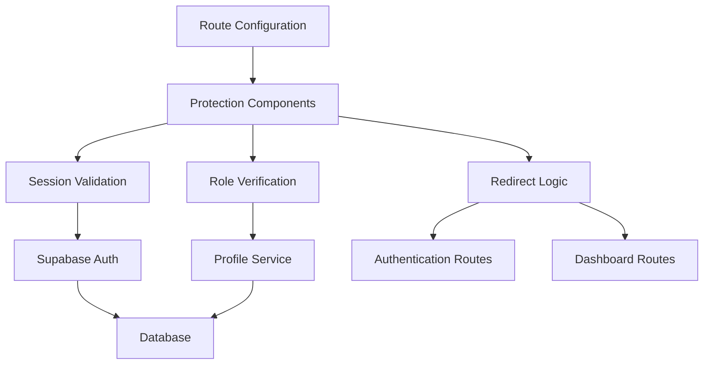
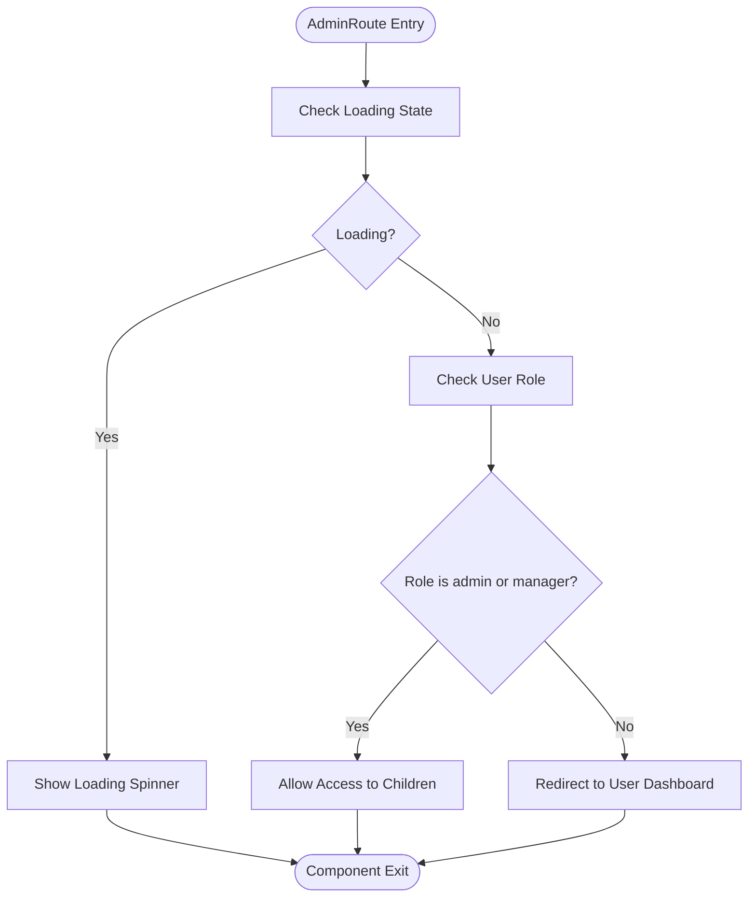
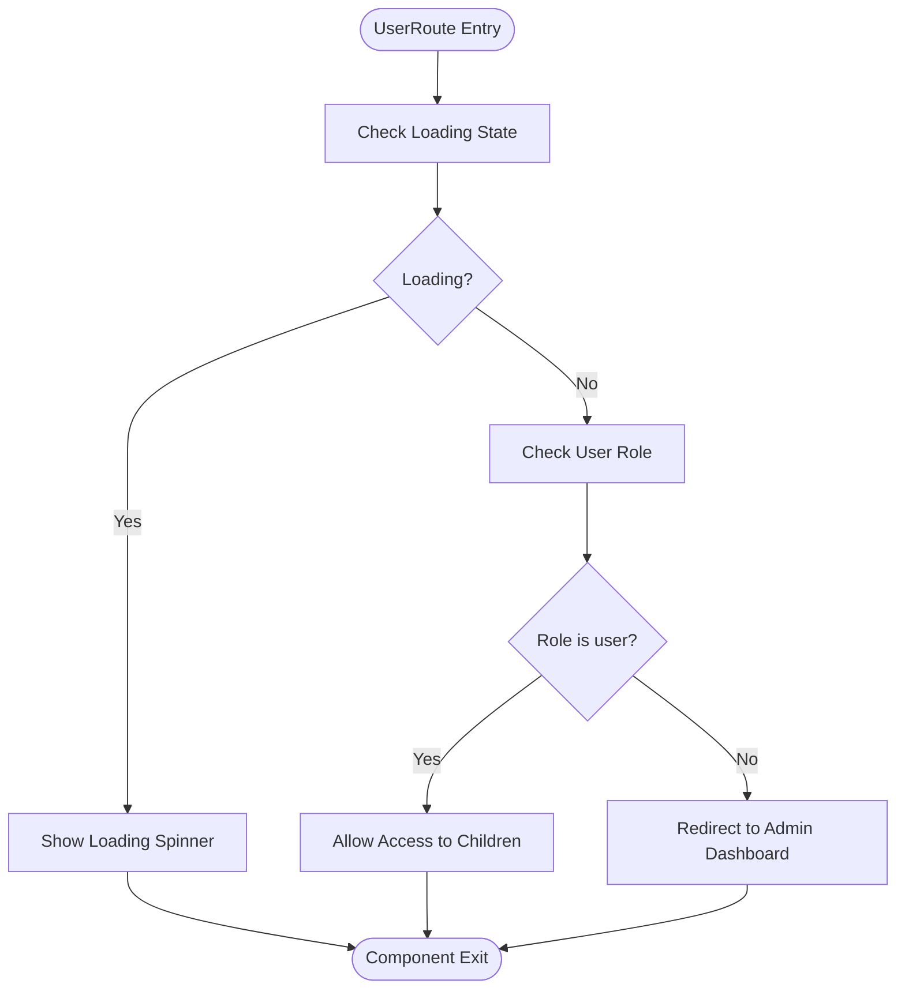
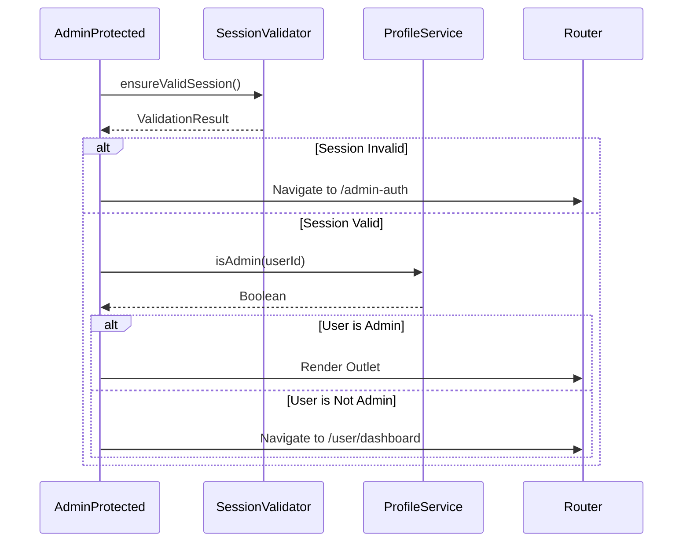
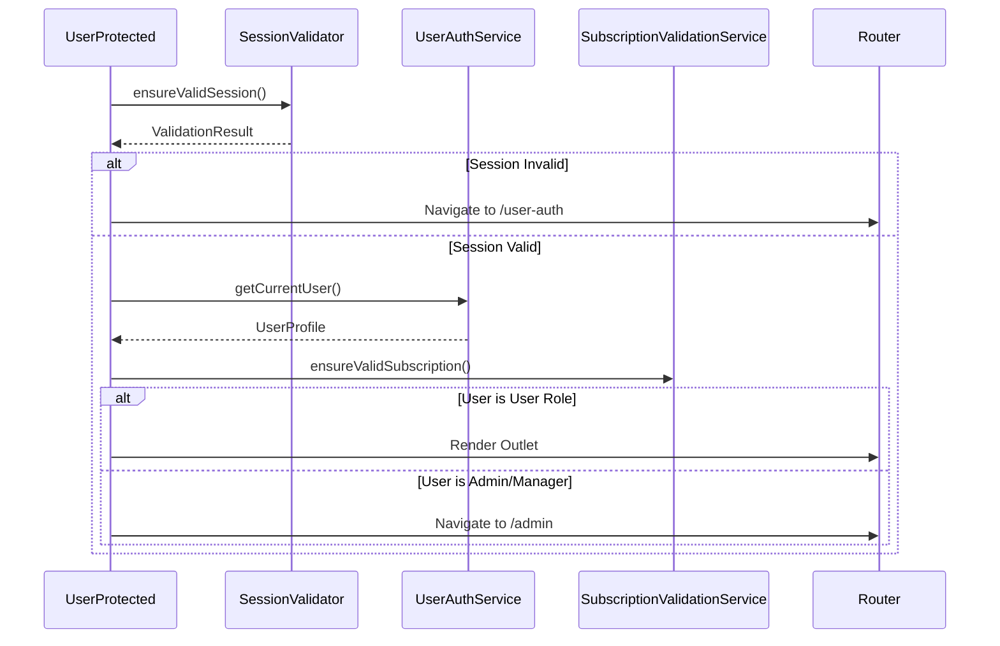
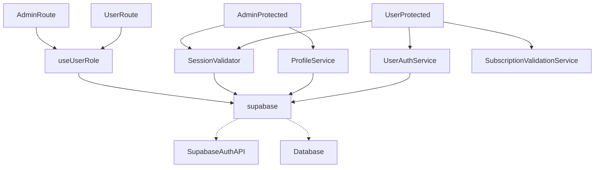

# Protected Routing

<cite>
**Referenced Files in This Document**   
- [ProtectedRoutes.tsx](file://src/components/ProtectedRoutes.tsx)
- [AdminProtected.tsx](file://src/pages/AdminProtected.tsx)
- [UserProtected.tsx](file://src/pages/UserProtected.tsx)
- [session-validation.ts](file://src/lib/session-validation.ts)
- [client.ts](file://src/integrations/supabase/client.ts)
- [useUserRole.ts](file://src/hooks/useUserRole.ts)
- [profile-service.ts](file://src/lib/profile-service.ts)
- [user-auth-service.ts](file://src/lib/user-auth-service.ts)
</cite>

## Table of Contents
1. [Introduction](#introduction)
2. [Core Components](#core-components)
3. [Architecture Overview](#architecture-overview)
4. [Detailed Component Analysis](#detailed-component-analysis)
5. [Dependency Analysis](#dependency-analysis)
6. [Performance Considerations](#performance-considerations)
7. [Troubleshooting Guide](#troubleshooting-guide)
8. [Conclusion](#conclusion)

## Introduction
The lovable-rise application implements a robust role-based access control system at the routing level through its protected routing mechanism. This system ensures that only authenticated users with appropriate roles can access specific application sections, maintaining security and proper user experience separation between administrative and standard user interfaces. The implementation leverages Supabase authentication, enhanced session validation, and role-based routing guards to create a secure and reliable access control layer.

## Core Components

The protected routing system in lovable-rise consists of several key components working together to enforce role-based access control. The primary elements include the `AdminRoute` and `UserRoute` higher-order components, the `AdminProtected` and `UserProtected` route wrappers, and supporting services for session validation and role checking. These components work in concert to verify authentication status and user roles before allowing access to restricted routes, redirecting users appropriately when access requirements are not met.

**Section sources**
- [ProtectedRoutes.tsx](file://src/components/ProtectedRoutes.tsx#L3-L43)
- [AdminProtected.tsx](file://src/pages/AdminProtected.tsx#L6-L84)
- [UserProtected.tsx](file://src/pages/UserProtected.tsx#L7-L102)

## Architecture Overview

The protected routing architecture follows a layered approach where route protection is implemented at multiple levels. At the highest level, React Router's route configuration defines protected route trees that wrap specific application sections. Within these route trees, dedicated protection components handle authentication and authorization checks, while lower-level utilities manage session validation and role verification.

**Diagram sources**
- [AdminProtected.tsx](file://src/pages/AdminProtected.tsx#L6-L84)
- [UserProtected.tsx](file://src/pages/UserProtected.tsx#L7-L102)
- [ProtectedRoutes.tsx](file://src/components/ProtectedRoutes.tsx#L3-L43)

## Detailed Component Analysis

### AdminRoute and UserRoute Analysis
The `AdminRoute` and `UserRoute` components are higher-order components that serve as role-based gatekeepers for their respective route trees. These components use the `useUserRole` hook to determine the current user's role and make access decisions based on that information.

**Diagram sources**
- [ProtectedRoutes.tsx](file://src/components/ProtectedRoutes.tsx#L3-L22)

**Diagram sources**
- [ProtectedRoutes.tsx](file://src/components/ProtectedRoutes.tsx#L24-L43)

**Section sources**
- [ProtectedRoutes.tsx](file://src/components/ProtectedRoutes.tsx#L3-L43)
- [useUserRole.ts](file://src/hooks/useUserRole.ts#L1-L34)

### AdminProtected Analysis
The `AdminProtected` component provides comprehensive protection for the administrative interface, implementing multiple layers of security checks beyond simple role verification. This component handles session validation, admin role confirmation, and includes special handling for development environments.

**Diagram sources**
- [AdminProtected.tsx](file://src/pages/AdminProtected.tsx#L6-L84)
- [session-validation.ts](file://src/lib/session-validation.ts#L1-L398)
- [profile-service.ts](file://src/lib/profile-service.ts#L1-L799)

### UserProtected Analysis
The `UserProtected` component safeguards the user interface routes, ensuring that only authenticated users with the 'user' role can access them. This component performs thorough authentication checks and includes subscription validation as part of the protection mechanism.

**Diagram sources**
- [UserProtected.tsx](file://src/pages/UserProtected.tsx#L7-L102)
- [session-validation.ts](file://src/lib/session-validation.ts#L1-L398)
- [user-auth-service.ts](file://src/lib/user-auth-service.ts#L1-L799)

## Dependency Analysis

The protected routing system has a well-defined dependency structure that ensures separation of concerns while maintaining security integrity. The components depend on Supabase for authentication, custom services for role verification, and React Router for navigation.

**Diagram sources**
- [ProtectedRoutes.tsx](file://src/components/ProtectedRoutes.tsx#L3-L43)
- [AdminProtected.tsx](file://src/pages/AdminProtected.tsx#L6-L84)
- [UserProtected.tsx](file://src/pages/UserProtected.tsx#L7-L102)
- [client.ts](file://src/integrations/supabase/client.ts#L1-L30)

**Section sources**
- [ProtectedRoutes.tsx](file://src/components/ProtectedRoutes.tsx#L3-L43)
- [AdminProtected.tsx](file://src/pages/AdminProtected.tsx#L6-L84)
- [UserProtected.tsx](file://src/pages/UserProtected.tsx#L7-L102)
- [session-validation.ts](file://src/lib/session-validation.ts#L1-L398)

## Performance Considerations

The protected routing implementation balances security requirements with performance considerations. The system uses loading states to provide feedback during authentication checks, and implements caching in the profile service to reduce database queries. The session validation process is optimized to minimize network requests while maintaining security integrity. For development environments, a bypass mechanism is implemented to improve developer experience without compromising production security.

## Troubleshooting Guide

Common issues with the protected routing system typically involve authentication state inconsistencies, role assignment problems, or session validation failures. When users experience unexpected redirects, verify that their profile role is correctly set in the database. For infinite redirect loops, check that the authentication state is properly synchronized between the client and Supabase. Stale session states can often be resolved by clearing local storage and re-authenticating. When implementing new protected routes, ensure that the route hierarchy correctly nests the protection components and that redirect targets exist and are accessible.

**Section sources**
- [AdminProtected.tsx](file://src/pages/AdminProtected.tsx#L6-L84)
- [UserProtected.tsx](file://src/pages/UserProtected.tsx#L7-L102)
- [session-validation.ts](file://src/lib/session-validation.ts#L1-L398)

## Conclusion

The protected routing mechanism in lovable-rise provides a comprehensive solution for role-based access control at the routing level. By combining higher-order components for role checking with dedicated protection pages for comprehensive authentication validation, the system creates multiple layers of security. The integration with Supabase authentication and custom validation services ensures that only authorized users can access protected routes, while providing appropriate feedback and redirection for unauthorized access attempts. This implementation serves as a robust foundation for maintaining security and proper user experience separation in the application.