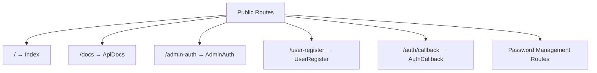
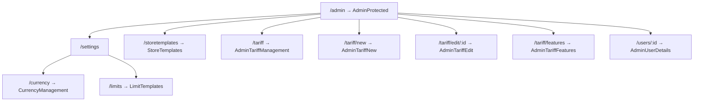
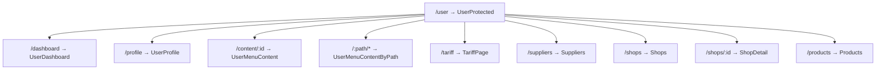
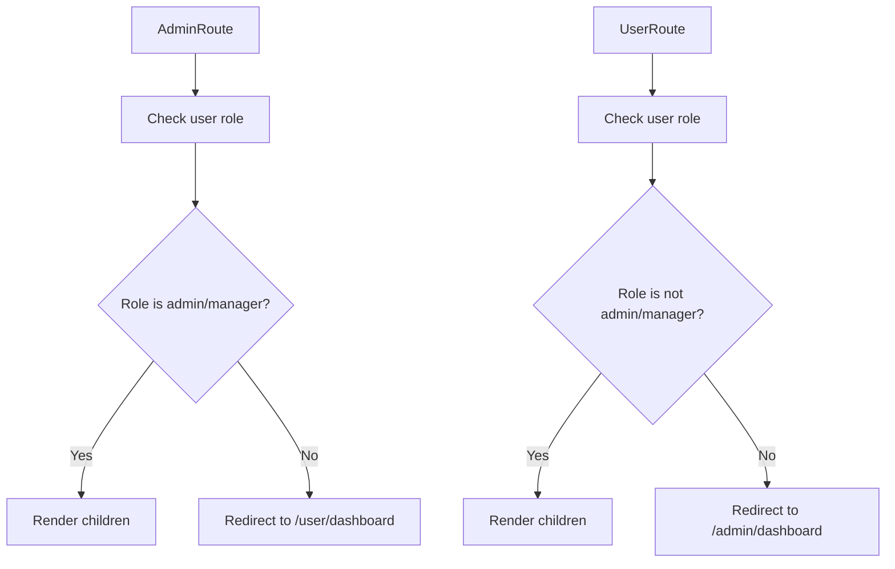
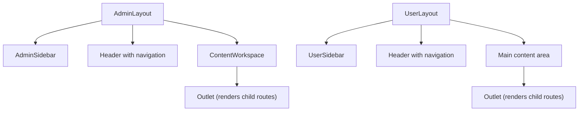
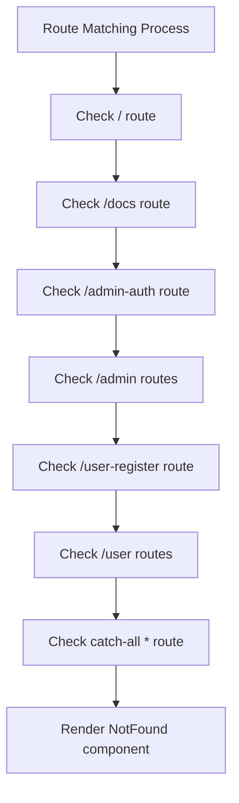

# Route Configuration

<cite>
**Referenced Files in This Document**   
- [App.tsx](file://src/App.tsx)
- [AdminLayout.tsx](file://src/components/AdminLayout.tsx)
- [UserLayout.tsx](file://src/components/UserLayout.tsx)
- [ProtectedRoutes.tsx](file://src/components/ProtectedRoutes.tsx)
- [NotFound.tsx](file://src/pages/NotFound.tsx)
</cite>

## Table of Contents
1. [Introduction](#introduction)
2. [Public Routes](#public-routes)
3. [Admin Protected Routes](#admin-protected-routes)
4. [User Protected Routes](#user-protected-routes)
5. [Route Protection Mechanism](#route-protection-mechanism)
6. [Layout Wrappers and Nested Routing](#layout-wrappers-and-nested-routing)
7. [Route Types and Patterns](#route-types-and-patterns)
8. [Route Order and Matching Behavior](#route-order-and-matching-behavior)
9. [Common Configuration Issues](#common-configuration-issues)

## Introduction
The lovable-rise application implements a comprehensive routing system using React Router to manage navigation between different sections of the application. The route configuration in App.tsx defines three main categories of routes: public routes accessible to all users, admin protected routes requiring administrative privileges, and user protected routes for authenticated users. The system utilizes nested routing with layout wrappers such as AdminLayout and UserLayout to maintain consistent UI structures across different sections of the application. This documentation provides a detailed analysis of the route configuration, explaining how different route types are structured, protected, and rendered within their respective layout contexts.

**Section sources**
- [App.tsx](file://src/App.tsx#L1-L124)

## Public Routes
The application defines several public routes that are accessible to all users without authentication requirements. These routes include the home page, API documentation, authentication pages, and user registration. The root path (/) renders the Index component, providing the main landing page for the application. The /docs path displays API documentation through the ApiDocs component. Authentication-related routes include /admin-auth for administrator login, /user-register for user registration, and various password management routes such as /user-forgot-password and /user-reset-password. Additionally, the /auth/callback route handles authentication callbacks from external providers. These public routes are defined at the top level of the Routes component and are accessible regardless of the user's authentication status or role.

**Diagram sources**
- [App.tsx](file://src/App.tsx#L1-L124)

**Section sources**
- [App.tsx](file://src/App.tsx#L1-L124)

## Admin Protected Routes
Admin protected routes are organized under the /admin path and require administrative privileges to access. These routes are wrapped with the AdminRoute component, which checks the user's role before allowing access. The admin routes include various management interfaces such as tariff management (/admin/tariff), user details (/admin/users/:id), currency management (/admin/settings/currency), and template management (/admin/storetemplates). The route configuration uses nested routing, where the parent /admin route renders the AdminProtected component within the AdminRoute wrapper, and child routes are rendered within the AdminLayout component. This structure ensures that all admin routes maintain a consistent layout with the admin sidebar, header, and workspace components while enforcing role-based access control.

**Diagram sources**
- [App.tsx](file://src/App.tsx#L1-L124)

**Section sources**
- [App.tsx](file://src/App.tsx#L1-L124)

## User Protected Routes
User protected routes are organized under the /user path and are accessible to authenticated users who are not administrators. These routes are wrapped with the UserRoute component, which redirects administrators and managers to the admin dashboard while allowing regular users to access their dashboard. The user routes include the dashboard (/user/dashboard), profile management (/user/profile), and various functional pages such as suppliers (/user/suppliers), shops (/user/shops), shop details (/user/shops/:id), and products (/user/products). The route configuration uses nested routing with the UserLayout component as a wrapper, ensuring that all user routes maintain a consistent layout with the user sidebar, header, and navigation components. The configuration also includes dynamic routes for content pages (/user/content/:id) and path-based navigation (/user/:path/*).

**Diagram sources**
- [App.tsx](file://src/App.tsx#L1-L124)

**Section sources**
- [App.tsx](file://src/App.tsx#L1-L124)

## Route Protection Mechanism
The application implements role-based route protection through custom wrapper components: AdminRoute and UserRoute. These components, defined in ProtectedRoutes.tsx, use the useUserRole hook to determine the user's role and authentication status. The AdminRoute component allows access only to users with 'admin' or 'manager' roles, redirecting others to the user dashboard. Conversely, the UserRoute component prevents access to users with 'admin' or 'manager' roles, redirecting them to the admin dashboard. Both components display a loading state while the user role is being determined, ensuring a smooth user experience during authentication checks. This protection mechanism is applied at the route level, wrapping the protected components and enforcing access control before rendering the target page.

**Diagram sources**
- [ProtectedRoutes.tsx](file://src/components/ProtectedRoutes.tsx#L3-L43)

**Section sources**
- [ProtectedRoutes.tsx](file://src/components/ProtectedRoutes.tsx#L3-L43)

## Layout Wrappers and Nested Routing
The application utilizes layout wrappers and nested routing to maintain consistent UI structures across different sections. The AdminLayout component serves as a wrapper for all admin routes, providing a consistent interface with the admin sidebar, header, and content workspace. Similarly, the UserLayout component provides a consistent interface for user routes with the user sidebar, header, and navigation components. These layout components are implemented using React Router's Outlet component, which renders child routes within the layout structure. The nested routing configuration ensures that common UI elements are preserved while allowing specific content to be rendered in the designated content area. This approach promotes code reuse and maintains a consistent user experience across different sections of the application.

**Diagram sources**
- [AdminLayout.tsx](file://src/components/AdminLayout.tsx#L147-L250)
- [UserLayout.tsx](file://src/components/UserLayout.tsx#L233-L331)

**Section sources**
- [AdminLayout.tsx](file://src/components/AdminLayout.tsx#L147-L250)
- [UserLayout.tsx](file://src/components/UserLayout.tsx#L233-L331)

## Route Types and Patterns
The application implements various route types and patterns to accommodate different navigation requirements. Static routes such as /, /docs, and /admin-auth map directly to specific components without parameters. Dynamic routes with parameters, such as /admin/tariff/edit/:id and /user/shops/:id, allow for parameterized navigation where the :id segment captures variable values from the URL. Catch-all routes like /user/:path/* enable flexible navigation by capturing any path segments after /user/ and passing them as parameters to the UserMenuContentByPath component. These route patterns provide flexibility in handling different navigation scenarios while maintaining a clean and organized route structure. The use of parameterized routes enables the application to render content based on dynamic data, such as editing a specific tariff or viewing details for a specific shop.

**Section sources**
- [App.tsx](file://src/App.tsx#L1-L124)

## Route Order and Matching Behavior
The order of routes in the configuration is crucial for proper matching behavior. Routes are evaluated in the order they are defined, with the first matching route being rendered. This means that more specific routes should be defined before more general ones to prevent unintended matches. For example, the /admin/tariff/edit/:id route is defined before the catch-all pattern for the admin section, ensuring that edit requests are properly handled rather than being captured by a more general route. The NotFound route is placed at the end of the configuration as a catch-all for any unmatched paths, ensuring that users receive appropriate feedback when attempting to access non-existent routes. This ordering principle applies to both the top-level routes and nested routes within each section, maintaining predictable and reliable routing behavior throughout the application.

**Diagram sources**
- [App.tsx](file://src/App.tsx#L1-L124)
- [NotFound.tsx](file://src/pages/NotFound.tsx#L1-L27)

**Section sources**
- [App.tsx](file://src/App.tsx#L1-L124)
- [NotFound.tsx](file://src/pages/NotFound.tsx#L1-L27)

## Common Configuration Issues
Several common configuration issues can arise when implementing the route structure in the lovable-rise application. Incorrect nesting of routes can lead to layout inconsistencies or broken navigation, such as failing to properly wrap child routes within their respective layout components. Missing layout wrappers can result in pages being rendered without the expected UI structure, such as the admin sidebar or user navigation. Improper redirect handling in the protection components can create infinite redirect loops or allow unauthorized access to protected routes. Additionally, incorrect route ordering can cause unintended route matches, where more general routes capture requests intended for more specific routes. These issues can be mitigated by carefully following the established routing patterns, ensuring proper nesting and wrapping of routes, and maintaining the correct order of route definitions.

**Section sources**
- [App.tsx](file://src/App.tsx#L1-L124)
- [ProtectedRoutes.tsx](file://src/components/ProtectedRoutes.tsx#L3-L43)
- [AdminLayout.tsx](file://src/components/AdminLayout.tsx#L147-L250)
- [UserLayout.tsx](file://src/components/UserLayout.tsx#L233-L331)