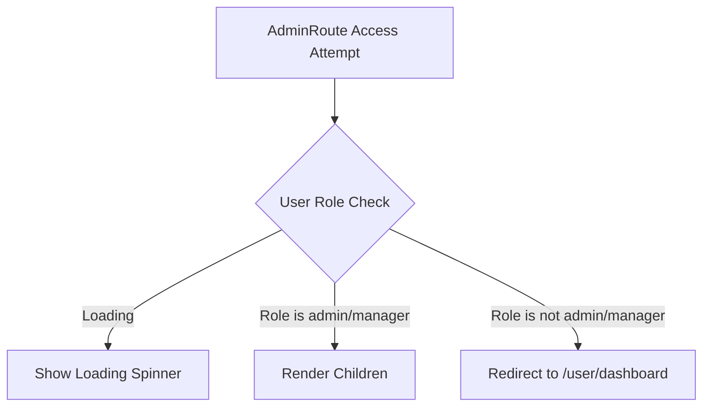
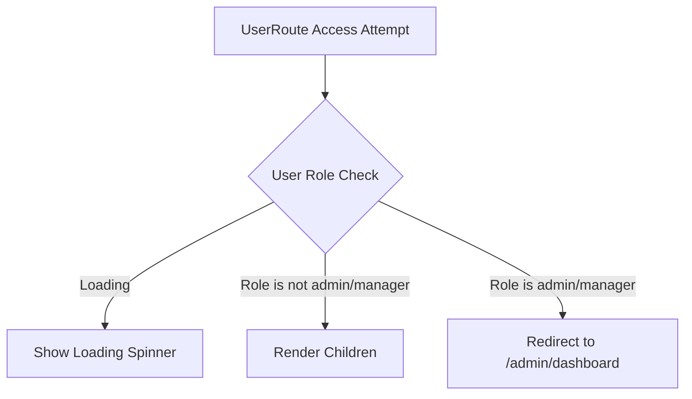
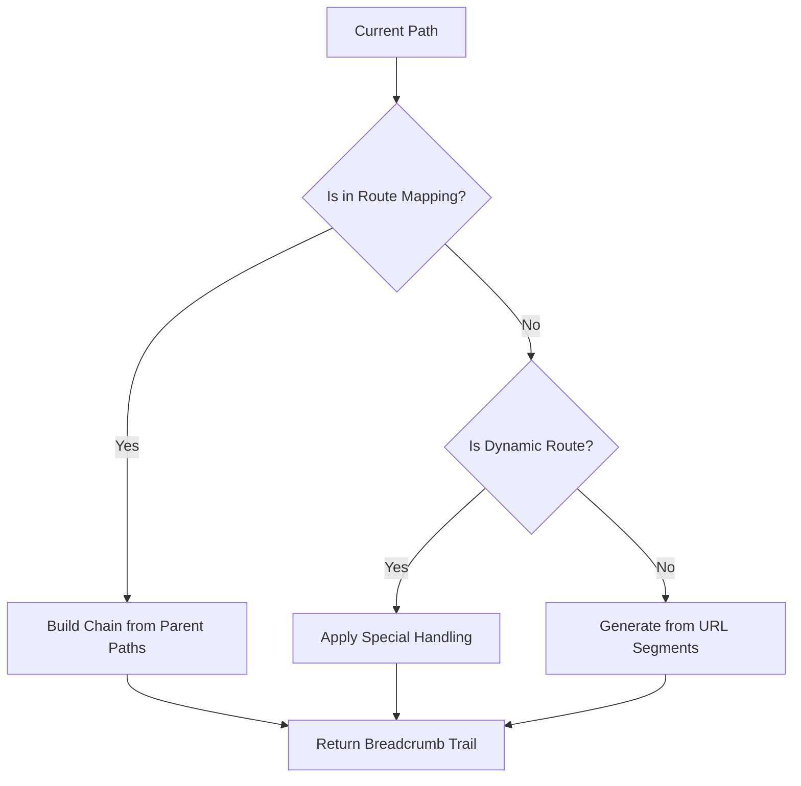

# Routing Structure

<cite>
**Referenced Files in This Document**   
- [App.tsx](file://src/App.tsx)
- [ProtectedRoutes.tsx](file://src/components/ProtectedRoutes.tsx)
- [useBreadcrumbs.ts](file://src/hooks/useBreadcrumbs.ts)
- [UserLayout.tsx](file://src/components/UserLayout.tsx)
- [AdminLayout.tsx](file://src/components/AdminLayout.tsx)
</cite>

## Table of Contents
1. [Introduction](#introduction)
2. [Route Configuration](#route-configuration)
3. [Protected Routes](#protected-routes)
4. [Dynamic Route Patterns](#dynamic-route-patterns)
5. [Breadcrumb Navigation](#breadcrumb-navigation)
6. [Adding New Routes](#adding-new-routes)
7. [Common Routing Issues](#common-routing-issues)

## Introduction

The lovable-rise application implements a comprehensive routing structure using React Router to manage navigation between different sections of the application. The routing system is designed with role-based access control, nested route hierarchies, and dynamic route patterns to provide a secure and intuitive user experience for both admin and user roles. This documentation details the implementation of the routing system, focusing on the configuration in App.tsx, the role-based protection mechanisms, and the integration with breadcrumb navigation.

## Route Configuration

The application's route configuration is centralized in App.tsx, which defines the complete routing structure using React Router's Routes and Route components. The routing system is organized into three main categories: public routes, admin protected routes, and user protected routes.

```mermaid
graph TD
A[Root] --> B[Public Routes]
A --> C[Admin Protected Routes]
A --> D[User Protected Routes]
B --> B1[/]
B --> B2[/docs]
B --> B3[/admin-auth]
B --> B4[/user-register]
B --> B5[/user-auth]
B --> B6[/user-forgot-password]
B --> B7[/user-reset-password]
B --> B8[/auth/callback]
C --> C1[/admin]
C1 --> C1a[/admin/settings/currency]
C1 --> C1b[/admin/settings/limits]
C1 --> C1c[/admin/storetemplates]
C1 --> C1d[/admin/tariff]
C1 --> C1e[/admin/tariff/new]
C1 --> C1f[/admin/tariff/edit/:id]
C1 --> C1g[/admin/users/:id]
C1 --> C1h[/admin/*]
D --> D1[/user]
D1 --> D1a[/user/dashboard]
D1 --> D1b[/user/profile]
D1 --> D1c[/user/content/:id]
D1 --> D1d[/user/:path/*]
D1 --> D1e[/user/tariff]
D1 --> D1f[/user/suppliers]
D1 --> D1g[/user/shops]
D1 --> D1h[/user/shops/:id]
D1 --> D1i[/user/products]
A --> E[/* Catch-all]
```

**Diagram sources**
- [App.tsx](file://src/App.tsx#L52-L122)

**Section sources**
- [App.tsx](file://src/App.tsx#L52-L122)

## Protected Routes

The application implements role-based access control at the routing level through the ProtectedRoutes.tsx component, which exports two higher-order components: AdminRoute and UserRoute. These components wrap protected route segments and enforce role-based access by redirecting users who don't have the appropriate permissions.

### AdminRoute Component

The AdminRoute component protects admin-specific functionality by ensuring only users with 'admin' or 'manager' roles can access admin routes. When a non-admin user attempts to access an admin route, they are redirected to the user dashboard.



### UserRoute Component

The UserRoute component prevents admin and manager users from accessing user-specific routes. This ensures that administrative users are directed to the appropriate admin interface rather than the user interface.



**Diagram sources**
- [ProtectedRoutes.tsx](file://src/components/ProtectedRoutes.tsx#L3-L43)

**Section sources**
- [ProtectedRoutes.tsx](file://src/components/ProtectedRoutes.tsx#L3-L43)

## Dynamic Route Patterns

The routing system supports various dynamic route patterns to handle parameterized URLs and catch-all routes for flexible navigation.

### Dynamic Shop Detail Pages

The application implements dynamic shop detail pages using the route pattern `/user/shops/:id`, which allows displaying specific shop information based on the provided ID parameter. This route is specifically handled in the useBreadcrumbs hook to ensure proper breadcrumb navigation.

```mermaid
graph TD
A[/user/shops/:id] --> B{Path Validation}
B --> |Starts with /user/shops/| C{Path has 4 segments}
C --> |Yes| D[Add Home -> Shops to breadcrumbs]
C --> |No| E[Handle as regular route]
D --> F[Render ShopDetail component]
```

### Catch-all Routes

The application uses catch-all routes to handle dynamic user menu paths. The pattern `/:path/*` in the user routes allows for flexible navigation to various user content pages based on the path parameter.

**Section sources**
- [App.tsx](file://src/App.tsx#L108-L110)
- [useBreadcrumbs.ts](file://src/hooks/useBreadcrumbs.ts#L93-L133)

## Breadcrumb Navigation

The application integrates breadcrumb navigation through the useBreadcrumbs hook, which dynamically generates breadcrumb trails based on the current route. This provides users with clear navigation context and the ability to navigate back to parent sections.

### Breadcrumb Generation Logic

The useBreadcrumbs hook implements a comprehensive logic for generating breadcrumb trails:

1. **Static Route Mapping**: Predefined mappings for common routes with internationalized labels
2. **Dynamic Route Handling**: Special handling for parameterized routes like `/admin/tariff/edit/:id`
3. **Fallback Mechanism**: Automatic generation of breadcrumbs for unrecognized routes based on URL segments



**Diagram sources**
- [useBreadcrumbs.ts](file://src/hooks/useBreadcrumbs.ts#L42-L169)

**Section sources**
- [useBreadcrumbs.ts](file://src/hooks/useBreadcrumbs.ts#L42-L169)

## Adding New Routes

When adding new routes to the application, several considerations must be taken into account to maintain security and proper layout integration.

### Security Considerations

1. **Route Protection**: Ensure new routes are wrapped with the appropriate ProtectedRoute component based on the intended user role
2. **Redirect Logic**: Verify that the redirect behavior in AdminRoute and UserRoute components accommodates the new route
3. **Access Control**: Confirm that the route is only accessible to users with the appropriate permissions

### Layout Integration

1. **Layout Wrappers**: New routes should be wrapped with the appropriate layout component (AdminLayout or UserLayout)
2. **Breadcrumb Configuration**: Add the new route to the appropriate route mapping in useBreadcrumbs.ts to ensure proper breadcrumb display
3. **Menu Integration**: Ensure the route is accessible through the appropriate navigation menu

### Example: Adding a New User Route

To add a new user route, follow these steps:

1. Add the route to the user protected routes section in App.tsx
2. Wrap the route with the UserRoute component
3. Apply the UserLayout wrapper
4. Add the route to the USER_ROUTE_MAPPING in useBreadcrumbs.ts
5. Ensure the route is accessible through the user navigation menu

**Section sources**
- [App.tsx](file://src/App.tsx#L100-L118)
- [useBreadcrumbs.ts](file://src/hooks/useBreadcrumbs.ts#L29-L40)

## Common Routing Issues

### Redirect Loops

Redirect loops can occur when the redirect logic in ProtectedRoute components creates a circular redirection pattern. This typically happens when:

1. A user's role is not properly detected
2. The redirect target itself requires a different role
3. There are conflicting route protection rules

To resolve redirect loops:
- Verify the useUserRole hook is correctly retrieving the user's role
- Ensure redirect targets are accessible to the user's role
- Check for conflicting route protection configurations

### Unauthorized Access Attempts

When users attempt to access routes they don't have permission for, the application should handle this gracefully:

1. **Visual Feedback**: Show appropriate loading states during role verification
2. **Clear Redirects**: Redirect to the appropriate dashboard based on the user's role
3. **Error Logging**: Log unauthorized access attempts for security monitoring

The ProtectedRoute components handle unauthorized access by redirecting users to the appropriate dashboard, preventing them from accessing restricted content while maintaining application security.

**Section sources**
- [ProtectedRoutes.tsx](file://src/components/ProtectedRoutes.tsx#L3-L43)
- [useBreadcrumbs.ts](file://src/hooks/useBreadcrumbs.ts#L42-L169)