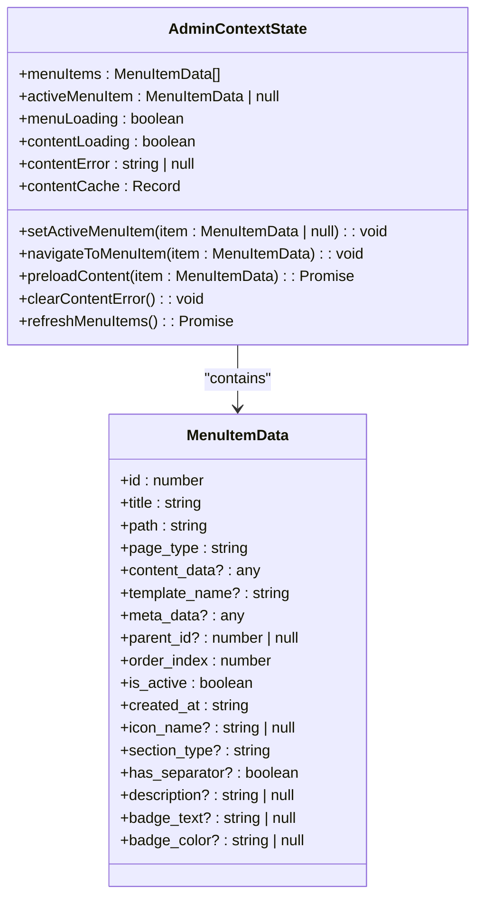
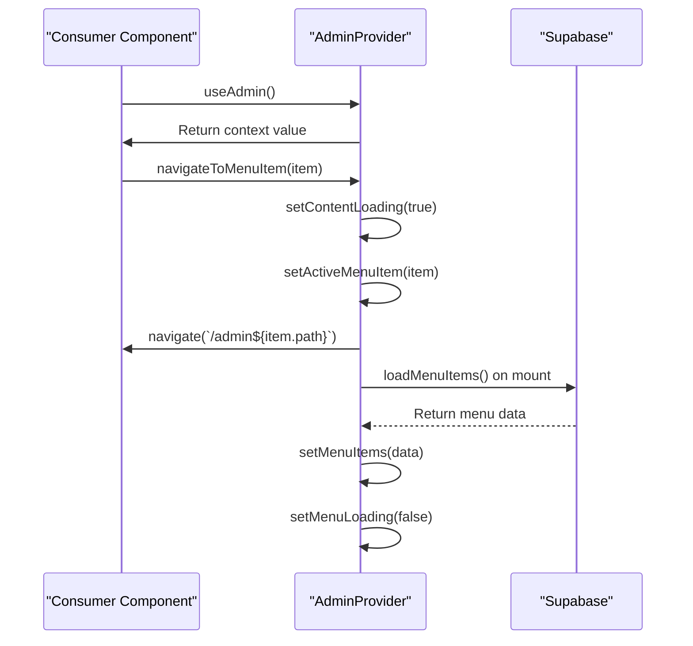
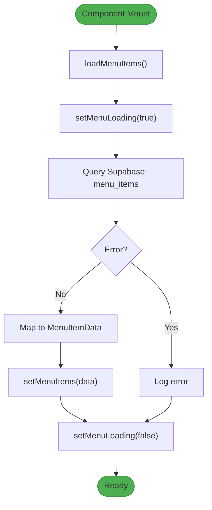
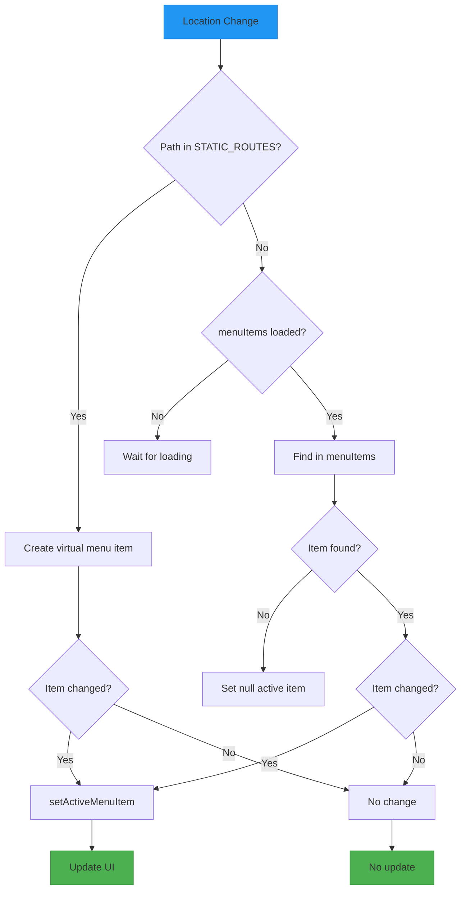
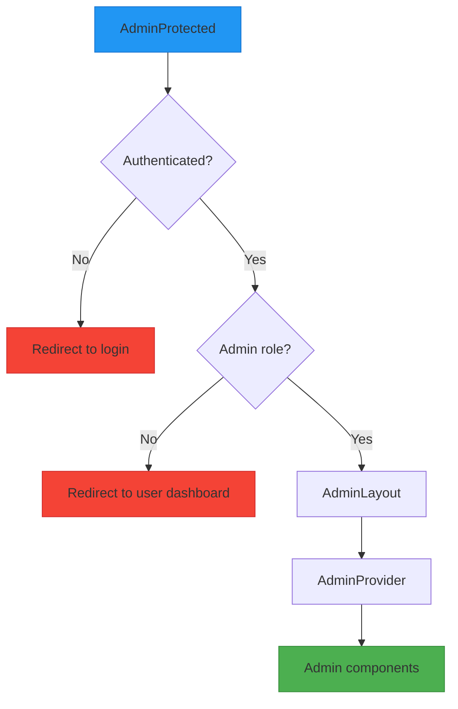

# Context Providers

<cite>
**Referenced Files in This Document**   
- [admin-provider.tsx](file://src/providers/admin-provider.tsx)
- [AdminLayout.tsx](file://src/components/AdminLayout.tsx)
- [ContentWorkspace.tsx](file://src/components/ContentWorkspace.tsx)
- [user-menu-service.ts](file://src/lib/user-menu-service.ts)
- [menu/index.ts](file://supabase/functions/menu/index.ts)
</cite>

## Table of Contents
1. [Introduction](#introduction)
2. [AdminContextState Structure](#admincontextstate-structure)
3. [AdminProvider Implementation](#adminprovider-implementation)
4. [Menu Management and Dynamic Loading](#menu-management-and-dynamic-loading)
5. [Navigation and Route Synchronization](#navigation-and-route-synchronization)
6. [Content Loading and Caching](#content-loading-and-caching)
7. [Error Handling and Resilience](#error-handling-and-resilience)
8. [Integration with Protected Routes](#integration-with-protected-routes)
9. [Performance Optimization](#performance-optimization)
10. [Common Issues and Solutions](#common-issues-and-solutions)

## Introduction
The AdminProvider is a React Context API implementation that manages the state for the administrative interface in the lovable-rise application. It handles menu items, navigation state, content loading, error states, and caching mechanisms. The provider integrates with Supabase to dynamically load menu configurations and synchronizes with the current route to maintain consistent navigation state. This documentation provides a comprehensive analysis of the AdminProvider implementation, its integration points, and usage patterns.

**Section sources**
- [admin-provider.tsx](file://src/providers/admin-provider.tsx#L1-L50)

## AdminContextState Structure
The AdminContextState interface defines the complete state structure exposed by the AdminProvider. It includes properties for menu management, content state, and caching, along with action methods for state manipulation.

The state structure consists of:
- **Menu state**: `menuItems` (array of MenuItemData), `activeMenuItem` (currently selected item), and `menuLoading` (loading indicator)
- **Content state**: `contentLoading` (content loading indicator), `contentError` (error message), and `contentCache` (data cache)
- **Action methods**: Functions for navigation, state updates, and data refresh operations

The MenuItemData interface extends beyond basic navigation properties to include metadata such as icon_name, section_type, and display properties, enabling rich menu rendering.



**Diagram sources**
- [admin-provider.tsx](file://src/providers/admin-provider.tsx#L162-L213)

**Section sources**
- [admin-provider.tsx](file://src/providers/admin-provider.tsx#L162-L213)

## AdminProvider Implementation
The AdminProvider component implements the context provider pattern using React's useState and useContext hooks. It manages multiple state variables through useState hooks, including menuItems, activeMenuItem, loading states, and contentCache.

Key implementation patterns include:
- **State initialization**: Multiple useState hooks initialize the various state properties with appropriate default values
- **Dependency injection**: useNavigate and useLocation hooks from react-router-dom provide navigation and routing capabilities
- **Method memoization**: useCallback is extensively used to memoize action methods, preventing unnecessary re-renders
- **Context creation**: createContext creates the AdminContext with a null default value, requiring proper provider wrapping

The provider follows the singleton pattern within the application hierarchy, typically wrapped around the entire admin interface to ensure consistent state management across all admin components.



**Diagram sources**
- [admin-provider.tsx](file://src/providers/admin-provider.tsx#L229-L422)

**Section sources**
- [admin-provider.tsx](file://src/providers/admin-provider.tsx#L229-L422)

## Menu Management and Dynamic Loading
The AdminProvider implements a sophisticated menu management system that combines static routes with dynamically loaded database entries. The STATIC_ROUTES constant defines core administrative routes that are always available, while dynamic menu items are loaded from Supabase.

The menu loading process follows these steps:
1. **Initialization**: useEffect triggers loadMenuItems on component mount
2. **Data fetching**: Supabase client queries the menu_items table for active items
3. **Data transformation**: Database rows are mapped to MenuItemData format with default values
4. **State update**: Retrieved menu items are stored in the menuItems state

The provider also implements a refresh mechanism through the refreshMenuItems method, allowing components to reload menu data when changes occur. This is particularly useful after administrative operations that modify menu structure.



**Diagram sources**
- [admin-provider.tsx](file://src/providers/admin-provider.tsx#L258-L298)
- [menu/index.ts](file://supabase/functions/menu/index.ts#L88-L129)

**Section sources**
- [admin-provider.tsx](file://src/providers/admin-provider.tsx#L258-L298)
- [menu/index.ts](file://supabase/functions/menu/index.ts#L88-L129)

## Navigation and Route Synchronization
The AdminProvider implements robust navigation synchronization between the URL route and the active menu state. This ensures that the UI reflects the current page regardless of how navigation occurs (via sidebar, direct URL access, or programmatic navigation).

Key synchronization mechanisms include:
- **Route-based active item detection**: The findActiveMenuItem function matches the current path to menu items, with fallback to STATIC_ROUTES
- **Location change monitoring**: useEffect listens to location.pathname changes to update the active menu item
- **Static route handling**: Special handling for static routes ensures immediate activation even during menu loading
- **Navigation method**: navigateToMenuItem combines state updates with programmatic navigation

The synchronization logic handles edge cases such as direct URL access, browser back/forward navigation, and concurrent state updates, ensuring consistent behavior across different navigation scenarios.



**Diagram sources**
- [admin-provider.tsx](file://src/providers/admin-provider.tsx#L295-L372)

**Section sources**
- [admin-provider.tsx](file://src/providers/admin-provider.tsx#L295-L372)

## Content Loading and Caching
The AdminProvider implements a content loading and caching system to optimize performance and user experience. The system manages loading states and implements a simple caching mechanism for content data.

Key features include:
- **Loading state management**: contentLoading state indicates when content is being loaded, typically set during navigation
- **Content caching**: contentCache stores preloaded content data to avoid redundant operations
- **Preloading mechanism**: preloadContent method allows components to prefetch content before it's needed
- **Loading completion**: useEffect automatically sets contentLoading to false when an active menu item is established

The caching system uses a simple key-value store with cache keys generated from menu item IDs. This prevents redundant data fetching and improves perceived performance when users navigate between recently visited pages.

```mermaid
flowchart TD
A[Navigate to Item] --> B[setActiveMenuItem]
B --> C[setContentLoading(true)]
C --> D{In cache?}
D --> |Yes| E[Use cached data]
D --> |No| F[Fetch data]
F --> G[Store in cache]
G --> H[Render content]
E --> H
H --> I[setContentLoading(false)]
style A fill:#2196F3,stroke:#1976D2
style I fill:#4CAF50,stroke:#388E3C
```

**Diagram sources**
- [admin-provider.tsx](file://src/providers/admin-provider.tsx#L334-L368)
- [ContentWorkspace.tsx](file://src/components/ContentWorkspace.tsx#L78-L116)

**Section sources**
- [admin-provider.tsx](file://src/providers/admin-provider.tsx#L334-L368)
- [ContentWorkspace.tsx](file://src/components/ContentWorkspace.tsx#L78-L116)

## Error Handling and Resilience
The AdminProvider implements comprehensive error handling to ensure application stability and provide meaningful feedback to users. The error handling system includes both menu loading errors and content-related errors.

Key error handling features:
- **Menu loading errors**: Errors during menu data retrieval are logged to console but do not block application functionality
- **Content errors**: contentError state stores error messages that can be displayed to users
- **Error clearing**: clearContentError method allows components to reset error state
- **Graceful degradation**: The application continues to function with static routes even if menu loading fails

The provider prioritizes user experience by ensuring that critical administrative functions remain accessible even when certain data cannot be loaded, implementing a resilient design that maintains core functionality.

**Section sources**
- [admin-provider.tsx](file://src/providers/admin-provider.tsx#L258-L298)
- [ContentWorkspace.tsx](file://src/components/ContentWorkspace.tsx#L118-L161)

## Integration with Protected Routes
The AdminProvider is integrated into the application's routing system through the AdminLayout component, which wraps protected administrative routes. This integration ensures that only authenticated users with appropriate permissions can access the administrative interface.

The integration flow:
1. **Route protection**: AdminProtected component verifies authentication and admin role
2. **Layout rendering**: AdminLayout provides the AdminProvider to all child components
3. **Profile loading**: User profile is loaded and passed to the layout
4. **Provider initialization**: AdminProvider initializes and begins loading menu items

This layered approach separates authentication concerns from state management, creating a clean separation of responsibilities while ensuring that the AdminProvider is only available in authenticated contexts.



**Diagram sources**
- [AdminLayout.tsx](file://src/components/AdminLayout.tsx#L147-L250)
- [AdminProtected.tsx](file://src/pages/AdminProtected.tsx#L1-L86)

**Section sources**
- [AdminLayout.tsx](file://src/components/AdminLayout.tsx#L147-L250)
- [AdminProtected.tsx](file://src/pages/AdminProtected.tsx#L1-L86)

## Performance Optimization
The AdminProvider implements several performance optimization techniques to minimize re-renders and improve application responsiveness:

- **Method memoization**: Extensive use of useCallback ensures that action methods maintain stable references
- **State co-location**: Related state variables are managed together to minimize context updates
- **Selective re-renders**: Consumer components only re-render when specific state values they depend on change
- **Efficient effect dependencies**: useEffect hooks include only necessary dependencies to prevent unnecessary executions

The provider also implements loading state optimizations, such as immediate activation of static routes during menu loading, which improves perceived performance by reducing wait times for core functionality.

**Section sources**
- [admin-provider.tsx](file://src/providers/admin-provider.tsx#L229-L422)

## Common Issues and Solutions
Several common issues may arise when working with the AdminProvider, along with their solutions:

**Issue 1: Context not updating on navigation**
- **Cause**: Missing dependencies in useEffect or improper state updates
- **Solution**: Ensure all necessary dependencies are included in effect dependency arrays and use proper state update patterns

**Issue 2: Menu items not loading**
- **Cause**: Supabase connection issues or permission problems
- **Solution**: Verify Supabase configuration and ensure the user has appropriate permissions to read menu_items table

**Issue 3: Active menu state desynchronization**
- **Cause**: Direct URL manipulation or concurrent state updates
- **Solution**: Ensure the route synchronization effect properly handles all navigation scenarios and edge cases

**Issue 4: Memory leaks in development**
- **Cause**: useEffect cleanup issues in development mode
- **Solution**: Implement proper cleanup functions and verify that effects don't create infinite loops

These issues are mitigated in the current implementation through careful dependency management, robust error handling, and comprehensive synchronization logic.

**Section sources**
- [admin-provider.tsx](file://src/providers/admin-provider.tsx#L369-L422)
- [ContentWorkspace.tsx](file://src/components/ContentWorkspace.tsx#L78-L116)