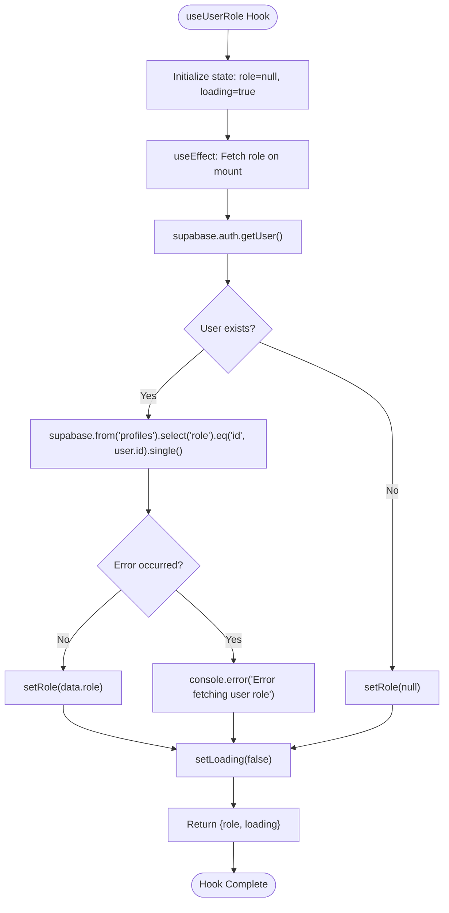
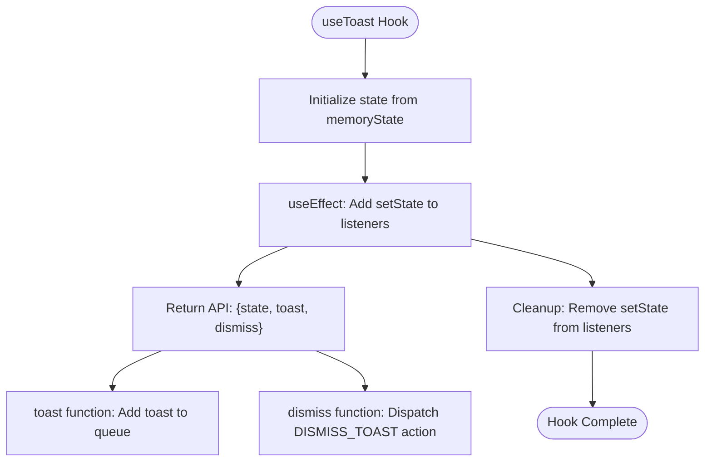
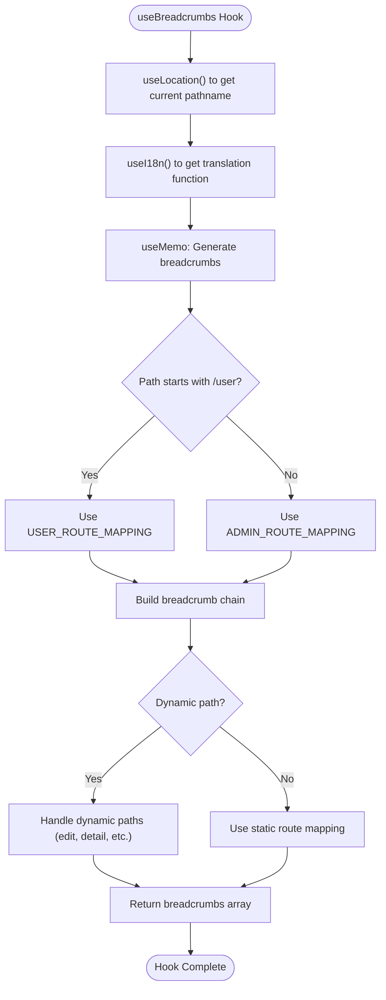
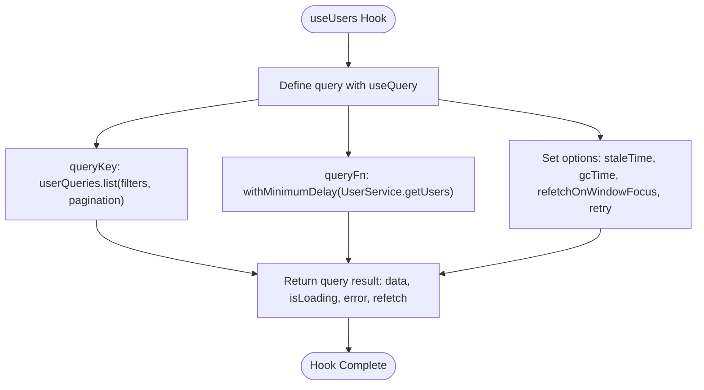

# Custom Hooks

<cite>
**Referenced Files in This Document**   
- [useUserRole.ts](file://src/hooks/useUserRole.ts)
- [use-toast.ts](file://src/hooks/use-toast.ts)
- [useBreadcrumbs.ts](file://src/hooks/useBreadcrumbs.ts)
- [useUsers.ts](file://src/hooks/useUsers.ts)
- [user-service.ts](file://src/lib/user-service.ts)
- [profile-service.ts](file://src/lib/profile-service.ts)
</cite>

## Table of Contents
1. [Introduction](#introduction)
2. [useUserRole Hook](#userole-hook)
3. [useToast Hook](#usetoast-hook)
4. [useBreadcrumbs Hook](#usebreadcrumbs-hook)
5. [useUsers Hook](#useusers-hook)
6. [Service Layer Integration](#service-layer-integration)
7. [Common Issues and Best Practices](#common-issues-and-best-practices)
8. [Conclusion](#conclusion)

## Introduction
This document provides comprehensive documentation for the custom React hooks used for state management in the lovable-rise application. These hooks encapsulate complex data fetching logic, manage side effects, and provide clean APIs to components. The hooks leverage React's built-in hooks like useState and useEffect, along with external libraries like TanStack Query for advanced data fetching and caching capabilities. The documentation covers the implementation details, usage patterns, and integration with the underlying service layer for key hooks including useUserRole, useToast, useBreadcrumbs, and useUsers.

## useUserRole Hook

The useUserRole hook is responsible for fetching and caching user role information from the Supabase profiles table. It manages the complete lifecycle of role data retrieval, including loading states and error handling.



**Diagram sources**
- [useUserRole.ts](file://src/hooks/useUserRole.ts#L3-L33)

**Section sources**
- [useUserRole.ts](file://src/hooks/useUserRole.ts#L3-L33)

## useToast Hook

The useToast hook provides integration with the notification system, allowing components to display toast messages throughout the application. It leverages the Sonner library for toast management and provides a clean API for showing different types of notifications.



**Diagram sources**
- [use-toast.ts](file://src/hooks/use-toast.ts#L170-L188)

**Section sources**
- [use-toast.ts](file://src/hooks/use-toast.ts#L170-L188)

## useBreadcrumbs Hook

The useBreadcrumbs hook manages navigation context by generating breadcrumb trails based on the current route. It uses react-router-dom's useLocation hook to track the current pathname and provides internationalized labels through the i18n provider.



**Diagram sources**
- [useBreadcrumbs.ts](file://src/hooks/useBreadcrumbs.ts#L42-L169)

**Section sources**
- [useBreadcrumbs.ts](file://src/hooks/useBreadcrumbs.ts#L42-L169)

## useUsers Hook

The useUsers hook provides access to user data with comprehensive filtering, pagination, and caching capabilities. It leverages TanStack Query for data fetching and caching, with built-in support for loading states, error handling, and automatic refetching.



**Diagram sources**
- [useUsers.ts](file://src/hooks/useUsers.ts#L69-L78)
- [user-service.ts](file://src/lib/user-service.ts#L81-L311)

**Section sources**
- [useUsers.ts](file://src/hooks/useUsers.ts#L69-L78)
- [user-service.ts](file://src/lib/user-service.ts#L81-L311)

## Service Layer Integration

The custom hooks integrate with the underlying service layer to encapsulate data access logic. The UserService class provides methods for CRUD operations on user data, with proper error handling and authentication.

```mermaid
classDiagram
class useUsers {
+useUsers(filters, pagination)
+useCreateUser()
+useUpdateUser()
+useDeleteUser()
+useToggleUserStatus()
}
class UserService {
+getUsers(filters, pagination)
+createUser(userData)
+updateUser(id, data)
+getUser(id)
+deleteUser(id)
+toggleUserStatus(id, status)
}
class useUserRole {
+useUserRole()
}
class ProfileService {
+getProfile(userId)
+getProfileByEmail(email)
+upsertProfile(profileData)
+updateProfile(userId, updates)
+isAdmin(userId)
+hasAdminAccess(userId)
}
useUsers --> UserService : "uses"
useUserRole --> ProfileService : "uses"
UserService --> "Supabase Client" : "uses"
ProfileService --> "Supabase Client" : "uses"
```

**Diagram sources**
- [useUsers.ts](file://src/hooks/useUsers.ts#L69-L78)
- [user-service.ts](file://src/lib/user-service.ts#L81-L311)
- [profile-service.ts](file://src/lib/profile-service.ts#L81-L311)

**Section sources**
- [user-service.ts](file://src/lib/user-service.ts#L81-L311)
- [profile-service.ts](file://src/lib/profile-service.ts#L81-L311)

## Common Issues and Best Practices

### Stale Closures
Stale closures can occur when hooks capture outdated state or props. The useUsers hook avoids this by using the queryKey pattern with TanStack Query, which automatically handles stale data and re-fetches when dependencies change.

### Unnecessary Re-renders
To prevent unnecessary re-renders, the useBreadcrumbs hook uses useMemo to memoize the generated breadcrumbs array, only recalculating when the location pathname or translation function changes.

### Race Conditions
The useUserRole hook handles potential race conditions by using the useEffect cleanup pattern and ensuring that state updates only occur if the component is still mounted. The withMinimumDelay utility function in useUsers prevents loading flicker for fast requests by ensuring a minimum delay.

### Performance Optimization
Performance is optimized through memoization techniques:
- useBreadcrumbs uses useMemo to cache breadcrumb calculations
- useUsers leverages TanStack Query's built-in caching with staleTime and gcTime settings
- The ProfileService implements its own caching layer to reduce database queries

## Conclusion
The custom hooks in the lovable-rise application provide a robust foundation for state management, encapsulating complex data fetching logic and providing clean, reusable APIs to components. By leveraging React's built-in hooks and external libraries like TanStack Query, these hooks handle loading states, error management, and data caching effectively. The integration with the service layer ensures separation of concerns, with hooks focusing on UI state management while services handle data access and business logic. Following best practices for avoiding common issues like stale closures and race conditions ensures a reliable and performant user experience.