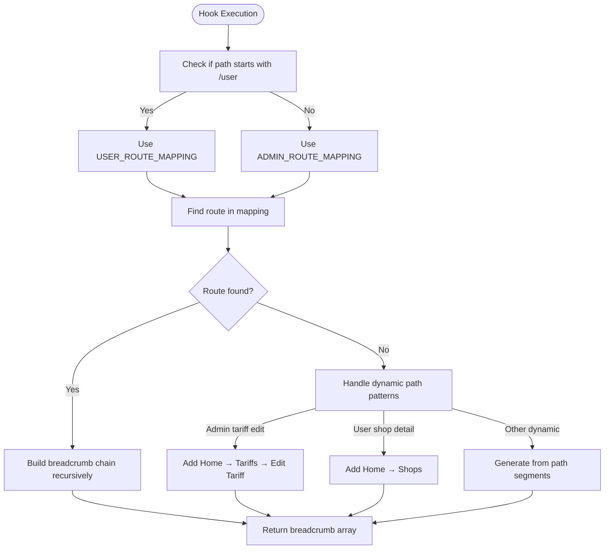
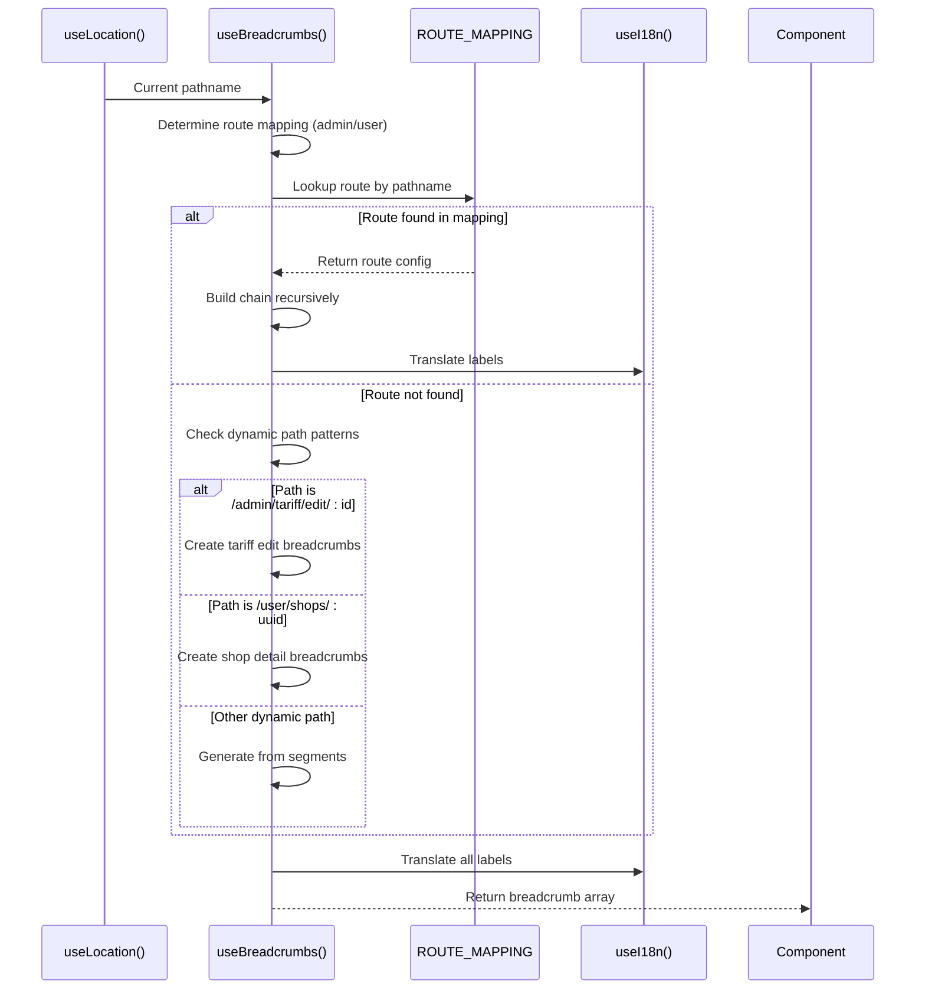
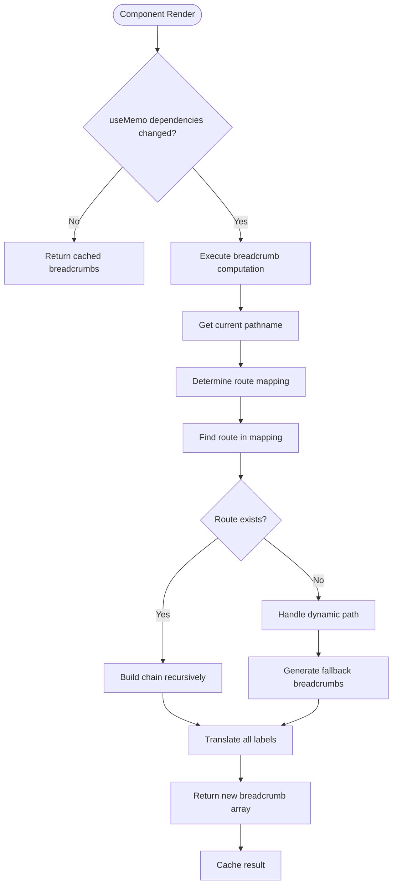
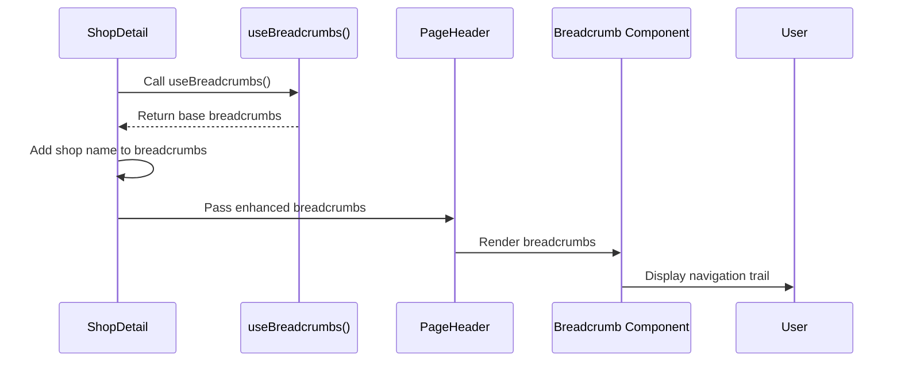

# useBreadcrumbs Hook

<cite>
**Referenced Files in This Document**   
- [useBreadcrumbs.ts](file://src/hooks/useBreadcrumbs.ts)
- [PageHeader.tsx](file://src/components/PageHeader.tsx)
- [breadcrumb.tsx](file://src/components/ui/breadcrumb.tsx)
- [AdminTariffEdit.tsx](file://src/pages/admin/AdminTariffEdit.tsx)
- [ShopDetail.tsx](file://src/pages/user/ShopDetail.tsx)
</cite>

## Table of Contents
1. [Introduction](#introduction)
2. [Core Implementation](#core-implementation)
3. [Route Mapping Configuration](#route-mapping-configuration)
4. [Dynamic Path Handling](#dynamic-path-handling)
5. [Performance Optimization](#performance-optimization)
6. [Integration with PageHeader](#integration-with-pageheader)
7. [Error Handling and Edge Cases](#error-handling-and-edge-cases)
8. [Extension Guidelines](#extension-guidelines)
9. [Accessibility Considerations](#accessibility-considerations)

## Introduction
The `useBreadcrumbs` custom hook provides dynamic breadcrumb navigation for the lovable-rise application, generating hierarchical navigation paths based on the current route. It integrates React Router's `useLocation` hook with the application's i18n translation system to create localized breadcrumb trails that enhance user orientation within the application's complex admin and user interfaces. The hook supports both static route mappings and dynamic path patterns, automatically resolving parent-child relationships in the navigation hierarchy.

**Section sources**
- [useBreadcrumbs.ts](file://src/hooks/useBreadcrumbs.ts#L42-L169)

## Core Implementation
The hook leverages React's `useMemo` hook to optimize performance by memoizing the breadcrumb computation, recalculating only when the pathname or translation function changes. It determines the appropriate route mapping based on whether the current path belongs to the admin or user context by checking if the path starts with "/user". The implementation follows a structured approach:

1. Always includes a home breadcrumb as the first item
2. Attempts to find the current route in the appropriate mapping
3. Handles special cases for dynamic paths
4. Builds the complete breadcrumb chain by recursively resolving parent paths

The hook returns an array of `BreadcrumbItem` objects that conform to the application's breadcrumb component interface, with each item containing a label, optional href, and current page indicator.



**Diagram sources**
- [useBreadcrumbs.ts](file://src/hooks/useBreadcrumbs.ts#L42-L169)

**Section sources**
- [useBreadcrumbs.ts](file://src/hooks/useBreadcrumbs.ts#L42-L169)

## Route Mapping Configuration
The hook utilizes two primary route mapping objects: `ADMIN_ROUTE_MAPPING` and `USER_ROUTE_MAPPING`. These static mappings define the breadcrumb structure for the application's admin and user interfaces respectively. Each mapping entry associates a route path with a configuration object containing:

- `labelKey`: The i18n translation key for the breadcrumb label
- `parentPath`: The parent route path for hierarchical relationships

The mappings support both exact route matches and parameterized routes (e.g., `/admin/tariff/edit/:id`). For routes with a `parentPath`, the hook recursively builds the breadcrumb chain to ensure proper hierarchical representation in the navigation trail.

```mermaid
classDiagram
class ADMIN_ROUTE_MAPPING {
+"/admin" : {labelKey : "breadcrumb_dashboard"}
+"/admin/dashboard" : {labelKey : "breadcrumb_dashboard", parentPath : "/admin"}
+"/admin/users" : {labelKey : "breadcrumb_users", parentPath : "/admin"}
+"/admin/tariff" : {labelKey : "menu_pricing", parentPath : "/admin"}
+"/admin/tariff/new" : {labelKey : "create_new_tariff", parentPath : "/admin/tariff"}
+"/admin/tariff/edit/ : id" : {labelKey : "edit_tariff", parentPath : "/admin/tariff"}
}
class USER_ROUTE_MAPPING {
+"/user" : {labelKey : "breadcrumb_dashboard"}
+"/user/dashboard" : {labelKey : "breadcrumb_dashboard", parentPath : "/user"}
+"/user/profile" : {labelKey : "breadcrumb_personal", parentPath : "/user"}
+"/user/shops" : {labelKey : "shops_title", parentPath : "/user"}
+"/user/products" : {labelKey : "products_title", parentPath : "/user"}
}
class useBreadcrumbs {
+useLocation()
+useI18n()
+useMemo()
+buildChain()
}
useBreadcrumbs --> ADMIN_ROUTE_MAPPING : "uses when path.startsWith('/admin')"
useBreadcrumbs --> USER_ROUTE_MAPPING : "uses when path.startsWith('/user')"
```

**Diagram sources**
- [useBreadcrumbs.ts](file://src/hooks/useBreadcrumbs.ts#L6-L40)

**Section sources**
- [useBreadcrumbs.ts](file://src/hooks/useBreadcrumbs.ts#L6-L40)

## Dynamic Path Handling
The hook implements specialized logic for handling dynamic paths that cannot be fully represented in the static route mappings. This includes:

- **Admin tariff editing**: Paths matching `/admin/tariff/edit/:id` are handled by creating a breadcrumb chain with "Home → Tariffs → Edit Tariff"
- **User shop details**: Paths matching `/user/shops/:uuid` are handled by creating a chain with "Home → Shops" with the specific shop name added by the component
- **Generic dynamic paths**: For other dynamic user paths, the hook parses the URL segments and generates breadcrumb items by capitalizing the first letter of each segment

For dynamic routes, the hook extracts parameters from the URL path and uses them to create meaningful breadcrumb labels, falling back to path segment names when specific handling is not implemented.



**Diagram sources**
- [useBreadcrumbs.ts](file://src/hooks/useBreadcrumbs.ts#L59-L95)

**Section sources**
- [useBreadcrumbs.ts](file://src/hooks/useBreadcrumbs.ts#L59-L133)

## Performance Optimization
The hook employs `useMemo` to ensure that the breadcrumb computation runs only when necessary, specifically when the location pathname or translation function changes. This prevents unnecessary recalculations during component re-renders that don't affect the breadcrumb trail. The recursive `buildChain` function efficiently constructs the breadcrumb hierarchy by traversing parent paths only once per render cycle.

The implementation minimizes expensive operations by:
- Caching the route mapping lookup
- Using direct path comparisons rather than regular expressions where possible
- Limiting the number of translation function calls
- Avoiding unnecessary array operations



**Diagram sources**
- [useBreadcrumbs.ts](file://src/hooks/useBreadcrumbs.ts#L42-L169)

**Section sources**
- [useBreadcrumbs.ts](file://src/hooks/useBreadcrumbs.ts#L42-L169)

## Integration with PageHeader
The `useBreadcrumbs` hook is consumed by the `PageHeader` component to render navigation context. The `PageHeader` component accepts the breadcrumb items as a prop and renders them using the application's breadcrumb UI component. In some cases, components enhance the breadcrumb trail by adding dynamic information not available to the hook.

For example, the `ShopDetail` component uses `useBreadcrumbs` to get the base breadcrumb trail and then appends the specific shop name as the current page:



**Diagram sources**
- [ShopDetail.tsx](file://src/pages/user/ShopDetail.tsx#L42-L48)
- [PageHeader.tsx](file://src/components/PageHeader.tsx#L12-L41)

**Section sources**
- [ShopDetail.tsx](file://src/pages/user/ShopDetail.tsx#L42-L48)
- [PageHeader.tsx](file://src/components/PageHeader.tsx#L12-L41)

## Error Handling and Edge Cases
The hook includes comprehensive error handling for various edge cases:

- **Missing route mappings**: When a route is not found in the mapping, the hook attempts to handle it as a dynamic path or falls back to generating breadcrumbs from the URL path segments
- **Case sensitivity**: The implementation handles both uppercase and lowercase variations of route segments (e.g., "/user/Shops" vs "/user/shops")
- **Invalid paths**: For paths that don't match any known patterns, the hook generates a fallback breadcrumb using the last path segment
- **Translation failures**: The hook gracefully handles missing translation keys by falling back to the raw path segment

Common issues that may arise include:
- Incorrect parent hierarchy resolution when parentPath references are missing or incorrect
- Untranslated labels when translation keys are missing from the i18n dictionary
- Broken breadcrumb chains when dynamic path patterns change

**Section sources**
- [useBreadcrumbs.ts](file://src/hooks/useBreadcrumbs.ts#L59-L133)

## Extension Guidelines
To extend the route mapping for new pages, follow these steps:

1. Identify whether the new page belongs to the admin or user interface
2. Add an entry to the appropriate route mapping object (`ADMIN_ROUTE_MAPPING` or `USER_ROUTE_MAPPING`)
3. Specify the full path as the key
4. Provide a configuration object with:
   - `labelKey`: The i18n translation key for the breadcrumb label
   - `parentPath`: The path of the parent page in the hierarchy

For example, to add a new admin settings page:
```typescript
"/admin/settings/integrations": { 
  labelKey: "integrations_settings", 
  parentPath: "/admin/settings" 
}
```

Ensure that all translation keys are added to the application's i18n dictionary files and that the parentPath references existing routes to maintain proper hierarchy.

**Section sources**
- [useBreadcrumbs.ts](file://src/hooks/useBreadcrumbs.ts#L6-L40)

## Accessibility Considerations
The breadcrumb implementation follows accessibility best practices:

- Uses semantic HTML with proper ARIA attributes
- Includes `aria-label="breadcrumb"` on the navigation element
- Marks the current page with `aria-current="page"`
- Provides proper keyboard navigation support
- Ensures sufficient color contrast for text and interactive elements

The `BreadcrumbPage` component renders the current page as a span with `role="link"` and `aria-disabled="true"` to indicate it's not clickable, while other breadcrumb items are rendered as links. This ensures screen readers can properly interpret the navigation structure and users can understand their current location within the application.

**Section sources**
- [breadcrumb.tsx](file://src/components/ui/breadcrumb.tsx#L1-L146)